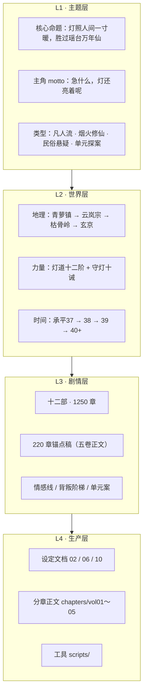
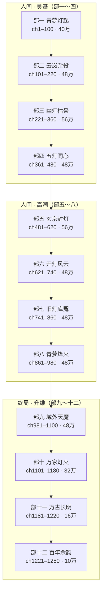
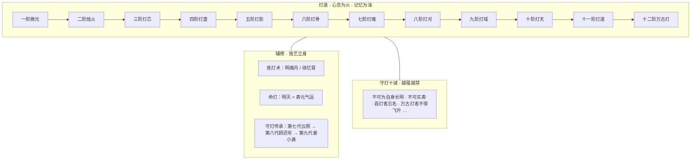
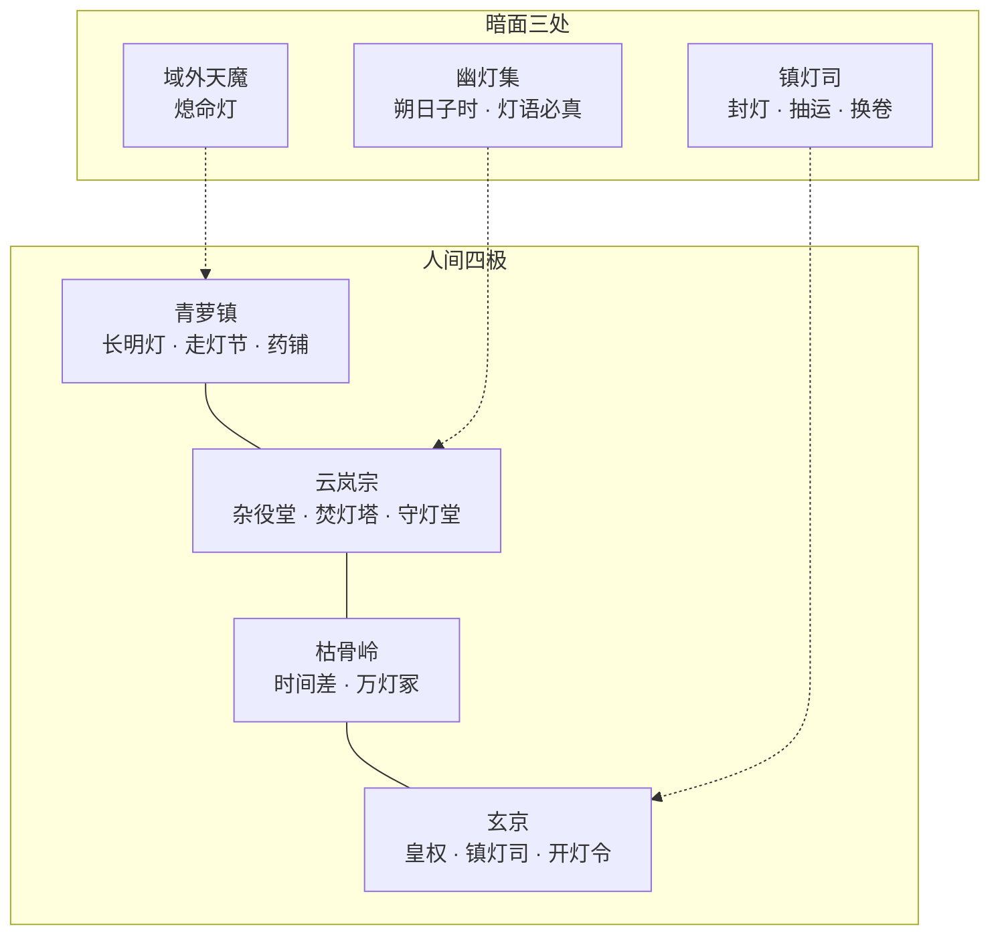
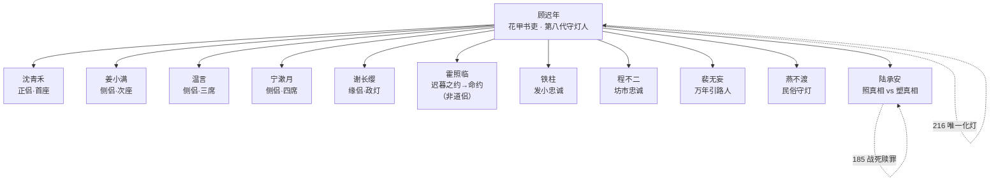
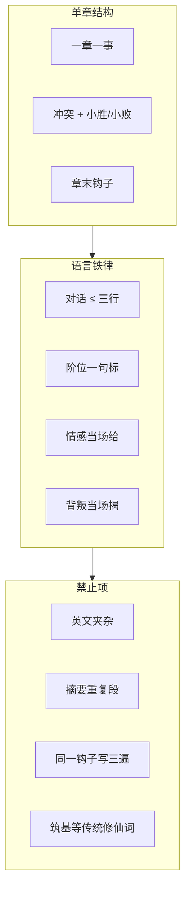

# 《万古守灯人》整体层次结构图

> **用途**：一图总览世界观、剧情、文档、生产管线四层设计。  
> **目标**：1250 章 · 约 500 万字 · 220 章锚点不可删  
> **更新**：2026-07-11

---

## 一、四层总览



| 层次 | 回答的问题 | 主文档 |
|------|------------|--------|
| **主题层** | 这本书讲什么、什么调性 | [`02-原创小说剧情`](./02-原创小说剧情.md) |
| **世界层** | 力量、规则、地图怎么运转 | [`02`](./02-原创小说剧情.md) · [`06`](./06-衔接检查与修订说明.md) |
| **剧情层** | 章怎么排、弧怎么走 | [`03-全书大纲总览`](./03-全书大纲总览.md) · [`10`](./10-五百万字全书架构.md) · [`chapters/README`](./chapters/README.md) |
| **生产层** | 怎么写、怎么扩、怎么查 | [`07`](./07-百万字扩充方案.md) · [`08`](./08-新增章节细纲-第一卷.md) · [`09`](./09-全书修订报告-第二轮.md) |

---

## 二、文档体系树

```
docs/万古守灯人/
├── README.md                       ← 目录入口
├── 00-整体层次结构图.md            ← 本文（总览）
├── 03-全书大纲总览.md              ← **220章全表 · 十二部 · 大纲索引**
├── 02-原创小说剧情.md              ← 世界观 · 人物 · 五卷大纲
├── 06-衔接检查与修订说明.md        ← 阶位表 · 卷界 · 铁律
├── 10-五百万字全书架构.md          ← 1250 章 · 十二部 · 500 万路线
├── 14-五大系统与500万剧情设计.md   ← 道侣/道具/因果/施恩报恩
├── 28-道侣后宫·灯后谱体系.md      ← 灯后谱五席 · 多盏盟
├── 29-道侣家族线·五席全书细纲.md  ← 10 篇家族插章索引
├── chapters/插章-道侣家族线.md      ← 家族插·壹～拾正文
├── 17-馈灯八步与扩展系统.md        ← 赠礼链·灯资·灵宠·洞府
├── 21-灯符册系统与品阶设计.md        ← 灯符册品阶
├── 31-灯阵体系与合阵设计.md          ← 五灯同心 · 域阵
├── 32-丹道体系与炼灯术设计.md        ← 炼灯术 · 灯丹
├── 19-七教合流与正邪宗门设计.md    ← 七教正邪
├── 34-评分迭代优化报告.md          ← Pass11–15 十分制拉升
├── 35-起点策划文案包-9.6.md        ← **v10 投稿方案 · 策划 9.9**
├── 36-起点十分化迭代报告-Pass14.md ← 十分制对标
├── 37-起点投稿落地清单.md          ← **投稿勾选 · 落地执行**
├── chapters/
│   ├── README.md                   ← 五卷索引
│   ├── vol01-青萝灯起.md           ← ch1–40
│   ├── vol02-云岚杂役.md           ← ch41–90
│   ├── vol03-幽灯枯骨.md           ← ch91–140
│   ├── vol04-玄京封灯.md           ← ch141–190
│   └── vol05-万古长明.md           ← ch191–220
├── scripts/                        ← 扩写/去重工具
└── backup/                         ← 早期备份
```

---

## 三、篇幅与阶段结构


| 阶段 | 章数 | 字数 | 动作 |
|------|------|------|------|
| 锚点 | 220 | ~51 万 | ✅ 已有，不可删节 |
| 一 | 220→550 | 150 万 | 🔄 每章 3500–4500 字加厚 |
| 二 | 550→900 | 300 万 | 插章：情感 / 单元案 / 副本 |
| 三 | 900→1250 | 500 万 | 域外线 + 百年番外 + 终稿删冗 |

**均章字数**：日常 3800–4200 · 高潮 5000–8000

---

## 四、十二部 · 剧情层次

> 220 章锚点映射至十二部；中间章节为**加厚 + 插章**目标，非当前正文章号。



### 锚点五卷 → 十二部映射

| 原五卷 | 锚点章 | 十二部落点 | 正文文件 |
|--------|--------|------------|----------|
| 第一卷 | 1–40 | 部一 1–40 + 部二插章 | `05-第一卷.md` |
| 第二卷 | 41–90 | 部二 101–150 核心 | `05-第二卷.md` |
| 第三卷 | 91–140 | 部三 + 部四 开篇 | `05-第三卷.md` |
| 第四卷 | 141–190 | 部五 + 部六～八 压缩 | `05-第四卷.md` |
| 第五卷 | 191–220 | 部九～十二 终局锚点 | `05-第五卷.md` |

### 卷间一句话链

```
40 灯还亮着 → 41 承平38春 → 90 记名/陆囚
→ 91 越狱 → 140 三相/名回 → 141 封灯诏
→ 185 陆战死 → 191 天魔 → 216 化灯 → 1250 百年尾声
```

---

## 五、力量体系层次



### 锚点阶位时间轴（不可破）

| 章次约 | 阶位 | 锚点事件 |
|--------|------|----------|
| 1–3 | 一阶微光 | 得守岁灯 |
| 18 | 二阶烛火 | 赵案 · 失明一炷香 |
| 30 / 39 | 三阶灯芯 | 强开 · 对外示二阶 |
| 52 | 三阶灯影 | 第一次枯骨岭 |
| 65–68 | 四阶盏→五阶影 | 焚灯塔 · 万灯大会 |
| 74 | 六阶灯骨 | 天煞门 · 失嗅 |
| 100 | 七阶灯魂 | 万灯冢 |
| 163 | 八阶灯河门槛 | 旧灯库夺架 |
| 178 | 八阶灯河初展 | 青萝灯会赈灾 |
| 185/186 | 九阶灯域 | 玄京终战 |
| 216 | 化灯 | **全书仅此一次** |
| 220 | 万古灯选择 | 百年闪烁 |

> 禁用「筑基」；改用「灯影稳了」「灯盏成」等灯道用语。详见 [`06`](./06-衔接检查与修订说明.md)。

---

## 六、势力与地理层次



---

## 七、人物关系层次



### 情感五拍 · 灯后谱五席（锚点 → 扩写加厚）

> 体系：[`28-道侣后宫·灯后谱`](./28-道侣后宫·灯后谱体系.md) · 家族：[`29`](./29-道侣家族线·五席全书细纲.md)

| 席 | 关系 | 锚点章 | 写法 |
|----|------|--------|------|
| 正侣 | 顾迟年 × 沈青禾 | 18 → 57 → 94 → 180 → 216 | 克制亲密 · 雨夜盟 |
| 侧侣·次 | 顾迟年 × 姜小满 | 90 → 177 → 180 → 216 | 备位 · 昭雪 · 接灯 |
| 侧侣·三 | 顾迟年 × 温言 | 26 → 153 → 216 | 侧契 · 铁面匾下 |
| 侧侣·四 | 顾迟年 × 宁漱月 | 88/89 → 113 → 216 | 丹堂 · 药位前移 |
| 缘侣 | 顾迟年 × 谢长缨 | 145 → 151 → 183 → 216 | 汤恩 · 开灯令 · 护谱 |
| 命约 | 顾迟年 × 霍照临 | 9 → 86 → 184 → 190 | 测定 → 认输 → 护陆堂 |
| 忠叛 | 顾迟年 × 陆承安 | 36 → 116 → 140 → 185 | 吞灯忘名 → 名回 → 战死 |
| 忠诚 | 顾迟年 × 铁柱 | 8 → 29 → 184 → 204 | 挡灯 · 万家火 |

---

## 八、背叛与担当阶梯


| 阶段 | 冲突 | 顾迟年应对 | 锚点章 |
|------|------|------------|--------|
| 乡土 | 豪强换卷 | 烛火照账 | 18–28 |
| 宗门 | 陆承安邪路 | 留灯三策 · 拒杀 | 116–140 |
| 朝堂 | 封灯诏 | 开灯令 · 九阶灯域 | 141–183 |
| 域外 | 天魔 | 拒飞升 · **化灯一次** | 191–216 |

---

## 九、参照映射层次（原创化）

> 只借**公共套路**，不沿用任何作品专有名称与情节。

| 参照源 | 公共套路 | 本作落点 | 十二部 |
|--------|----------|----------|--------|
| 斗破 | 迟暮之约 · 闯塔 · 大会 | 焚灯塔七层 · 万灯大会 | 部二 |
| 斗破 | 炼药/炼器 | 炼灯术 · 明魂丹 | 部一～二 |
| 凡人 | 坊市 · 谨慎 | 程不二 · 留灯三策 | 部一～二 |
| 凡人 | 秘境时间差 | 枯骨岭 · 万灯冢 | 部三 |
| 凡人 | 宗门政治 | 杂役堂 · 镇灯司 | 部二～五 |
| 斗罗 | 测定 · 战队 · 大赛 | 走灯节 · 五灯队 | 部一 · 部四 |
| 2025 | 单元探案 | 一盏灯一案 × 40 | 插章 |
| 2025 | 规则铁律 | 守灯十诫 | 全书 |

---

## 十、写法与质量层次



---

## 十一、系统铁律（500 万不可破）

| # | 铁律 | 锚点 |
|---|------|------|
| 1 | **化灯仅一次** | ch216 · 部十一 |
| 2 | **陆承安仅 ch185 战死**，不复活、不化灯 | 第四卷 |
| 3 | **程不二 ch161–162 殉后不再出场** | 第四卷 ch161–162 |
| 4 | **承平年号** 37→38→39→40+ | 卷界 |
| 5 | **阶位递进** 以 `06` 表为准 | 全书 |
| 6 | **守灯十诫** 触犯必写反噬现场 | 规则戏 |
| 7 | **220 锚点章不可删**，只加厚不替换骨架 | 生产 |

---

## 十二、当前生产进度（锚点加厚）

| 部/卷 | 锚点章 | 目标 | 状态 |
|-------|--------|------|------|
| 部一·青萝灯起 | 1–40 | 2500–4500/章 | ✅ **ch1–3 ≥3000**（Pass16）；4–14 偏薄 |
| 部二·云岚杂役 | 41–90 | 同上 | 🔄 41–65、79–90 ✅；66–78 补扩中 |
| 部三·幽灯枯骨 | 91–140 | 116–140 加厚 3500+ | ✅ |
| 部五·玄京封灯 | 141–190 | 2500–4500/章 | ✅ |
| 部十一·万古长明 | 191–220 | 2500–4500/章 | ✅ |
| **合计** | **220** | **→ 150 万（阶段一）** | **~51 万 → 进行中** |

---

## 十三、执行优先级（P0→P3）


| 优先级 | 任务 | 产出 |
|--------|------|------|
| **P0** | 锚点加厚 · 去重 · 衔接修复 | 150 万 + 质量基线 |
| **P1** | 部一～二插章（`08` 细纲） | +50 万 |
| **P1** | 部三～四枯骨岭 + 五灯队加厚 | +80 万 |
| **P2** | 部五～八玄京线 + 情感高潮 | +100 万 |
| **P2** | 部九～十二域外 + 化灯 + 百年 | +88 万 |
| **P3** | 40 单元案插章 | +80 万 |
| **P3** | 终稿删冗余 | 压至 500 万 ±5% |

---

## 十四、快速导航

| 我想… | 打开 |
|-------|------|
| **查 220 章锚点/插章/节点** | [`03-全书大纲总览`](./03-全书大纲总览.md) |
| 看全书怎么扩到 500 万 | [`10-五百万字全书架构`](./10-五百万字全书架构.md) |
| 查阶位 / 卷界 / 衔接 | [`06-衔接检查`](./06-衔接检查与修订说明.md) |
| 读正文 | [`05-分章正文-目录`](./chapters/README.md) |
| 查人物 / 世界观 / 十诫 | [`02-原创小说剧情`](./02-原创小说剧情.md) |
| 查扩充阶段方案 | [`07-百万字扩充方案`](./07-百万字扩充方案.md) |
| **起点投稿 / 简介 / 标签** | [`37-投稿落地清单`](./37-起点投稿落地清单.md) → [`35-v10`](./35-起点策划文案包-9.6.md) |
| 看十分制评分与 Pass 队列 | [`36-Pass14`](./36-起点十分化迭代报告-Pass14.md) · [`34`](./34-评分迭代优化报告.md) |
| 看五大系统与 500 万施恩线 | [`14-五大系统与500万剧情设计`](./14-五大系统与500万剧情设计.md) |
| 查第三轮审计/待修清单 | [`16-第三轮审计`](./16-全书审计报告-第三轮.md) |

---

*层次结构图 v1.0 · 与 `10` / `06` / `05-目录` 同步 · 2026-07-11*
