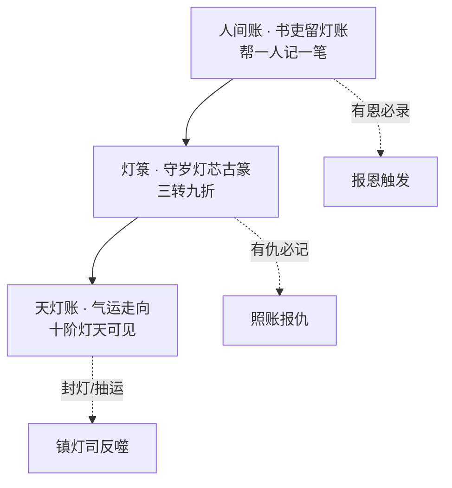

# 《万古守灯人》五大系统 · 低谷施恩 · 500 万剧情设计

> **主参考**：《万古守灯人》灯道世界观（非传统修仙换皮）  
> **辅参考**：《斗破苍穹》迟暮之约/闯塔/大会 · 《凡人修仙传》坊市谨慎/秘境/宗门政治 · 《斗罗大陆》测定/战队/师徒传承  
> **原则**：系统服务于「人间烟火、有恩报恩、迟暮守灯」，不做数值面板爽文  
> **更新**：2026-07-11

---

## 一、设计总纲：低谷蓄恩，高潮报恩

```mermaid
flowchart LR
    subgraph 前期低谷["前期 · 低谷（部一～二）"]
        D1["落第 · 花甲 · 驳杂灯根"]
        D2["赵家逼债 · 杂役丹渣"]
        D3["被辱测定 · 陆承安碾压"]
    end

    subgraph 施恩["施恩 · 不计回报"]
        S1["微光照借据 · 姜汤三尺"]
        S2["灯影救十二杂役"]
        S3["拒婚符 · 五滴油换青禾自主"]
        S4["明魂丹 · 半块饼 · 留灯三策传铁柱"]
    end

    subgraph 后期报恩["后期 · 报恩 · 当场爆"]
        R1["铁柱挡灯 · 万家火"]
        R2["霍照临护塔基 · 185挡剑"]
        R3["程不二遗图 · 161–162拉垫背殉"]
        R4["沈青禾烽火吻 · 216雨夜盟"]
        R5["百姓命灯 · 化灯长明"]
    end

    前期低谷 --> 施恩 --> 后期报恩
```



| 阶段 | 篇幅占比 | 读者感受 | 写法 |
|------|----------|----------|------|
| **低谷** | 部一～二前 60% | 压、辱、穷、老 | 围观哗然，阶位碾压，顾迟年只记「留灯账」 |
| **施恩** | 贯穿前中期 | 暖、稳、不张扬 | 半块饼、一滴油、一条路——**不邀功，只入账** |
| **报恩** | 部二末～部十二 | 燃、泪、当场还 | 忠诚一句证，背叛当场揭，**有仇报仇在「照账」** |

### 施恩→报恩对照表（锚点 + 500 万插章）

| 施恩（前期） | 锚点章 | 报恩（后期） | 锚点章 | 插章加厚方向 |
|--------------|--------|--------------|--------|--------------|
| 守夜林指路猎户 | 10 | 猎户子孙送岭图 | +插 ch28 | 部一 +3 章 |
| 孙福母咳减半滴油 | 41 | 孙福带十二杂役齐念「灯还亮」 | 65 | 部二塔外群像 +2 章 |
| 铁柱引路上山 | 8 | 铁柱挡灯/万家火旗 | 29/184/204 | 部二天煞 +5 章 |
| 沈青禾姜汤·三尺 | 18 | 烽火吻·雨夜盟 | 180/216 | 部四～十一情感 +20 章 |
| 程不二三块灵石规矩 | 22 | **161–162** 拉垫背留旧灯库图 | 161–163 | 部五旧灯库 +8 章 |
| 霍照临迟暮之约 | 9 | 86 认输·185 护诏 | 86/185 | 部二大会 +10 章 |
| 救十二杂役投路 | 52 | 140 五灯再阵·名回 | 135/140 | 部三守灯堂 +15 章 |
| 谢长缨青萝一碗汤 | 145 | 152 开灯令·183 护幼帝 | 152/183 | 部五玄京 +12 章 |
| 姜小满半块饼 | 38 | 216 接守岁灯虚影 | 216–218 | 部十一传承 +8 章 |

---

## 二、道侣系统 · 「灯后谱 · 众星拱月」

> **后宫收集、主次有序**；多位自愿道侣入**灯后谱**，各有家族线、有情有义。详见 [`28-道侣后宫·灯后谱体系`](./28-道侣后宫·灯后谱体系.md)。  
> 霍照临为迟暮命约，**非道侣**；五灯队为战阵名册，**≠** 道侣名分。

### 规则

| 项 | 内容 |
|----|------|
| **名称** | 同心灯契（多盏盟）· 灯后谱（众星拱月） |
| **位阶** | 正侣·首座 1 人 + 侧侣 ≤4 + 缘侣 ≤2 |
| **条件** | 双方自愿，各滴油入**各自铜盟灯**，录名入谱 |
| **能力** | 谱内任侣灯危，主感温；传油**总池 ≤九滴/月**，首座优先 ≤三滴 |
| **限制** | 诫一：传油必为对方活路；侧侣传油不得越过首座急危 |
| **代价** | 契断失共渡记忆；谱位空须再经馈灯八步 |
| **与情感** | 首座尽吻 ch216；侧侣以额触/执手/共照；写**心口烫、灯芯跳** |

### 灯后谱五席（锚点）

| 位阶 | 人物 | 锚点章 | 家族线 |
|------|------|--------|--------|
| 正侣·首座 | 沈青禾 | 57/94/180/216 | 沈氏药铺、豪强案 |
| 侧侣·次座 | 姜小满 | 90备/180契/216接灯 | 姜氏冤案 |
| 侧侣·三席 | 温言 | 153 | 温氏捕门 |
| 侧侣·四席 | 宁漱月 | 88/89/113 | 宁氏丹堂 · **丹道正系**见 `32` |
| 缘侣·政灯 | 谢长缨 | 145/183 | 谢氏朝堂 |

### 收集叙事（馈灯八步 × 每位）

赠礼 → 灯缘 → **主动倒贴** → 报恩 → **纳灯绶入谱** → 照路余恩 → 家族情义；**一位一位收**，不争宠雌竞。

### 参照映射

| 参照 | 公共套路 | 本作灯后谱 |
|------|----------|------------|
| 斗破 | 红颜多条线 | 每位有家族与报恩，非花瓶 |
| 凡人 | 道侣谨慎 | 传油月限、谱位先后 |
| 斗罗 | 战队羁绊 | 五灯队战阵 ≠ 灯后谱名分 |

---

## 三、道具系统 · 「灯器九品」

> 凡人与修士共用「灯器」——以**照路、储油、承苦、镇气**为用，不以杀伐为主。

### 品阶总表

| 品阶 | 名称 | 典型用途 | 获取 | 参照感 |
|------|------|----------|------|--------|
| **凡品** | 柴灯、纸灯、河灯 | 民俗、走灯节 | 民间 | 凡人烟火 |
| **九品** | 铜灯、铁灯 | 杂役照明 | 坊市 | 底层装备 |
| **八品** | 灵灯 | 低阶储油 | 丹堂/炼灯 | 凡人捡漏 |
| **七品** | 魂灯 | 明魂、定神 | 炼灯术 | 斗破丹药映射 |
| **六品** | 影灯 | 照路、投影 | 焚灯塔奖励 | 闯塔收获 |
| **五品** | 盏器 | 照人心、缓时 | 万灯大会 | 大会奖品 |
| **四品** | 骨灯 | 承伤、架油 | 枯骨岭 | 秘境掉落 |
| **三品** | 古灯 | 千年灯芯容器 | 焚灯塔七层 | 核心装备 |
| **二品** | 命灯器 | 触命灯、窥因果 | 万灯冢/旧灯库 | BOSS级 |
| **一品** | 守岁灯（碎片） | 三相归一 | 主线 | 唯一成长线 |
| **超品** | 万古灯 | 人间长明 | 216 化灯 | 终局选择 |

### 关键道具时间线（与阶位锁死）

| 章约 | 道具 | 事件 |
|------|------|------|
| 1–3 | 守岁灯（初） | 得经、凝油 |
| 18 | 铜烛台（凡→九） | 赵案照账 |
| 22–47 | 明魂丹、续忆膏 | 坊市/幽灯集 |
| 65–68 | 千年灯芯（三品古灯） | 焚灯塔 |
| 100 | 守岁灯第二相 | 万灯冢 |
| **161–162** | 旧灯库地图（命灯器线索） | 程不二殉 · 遗图 |
| 185 | 开灯令诏书（制度之器） | 陆承安血染 |
| 216 | 万古灯成 | 化灯 |

### 写法铁律

- 出阶**一句标**：「六品影灯起，照见左路。」
- 不堆装备名，**一件道具一事**
- 炼灯术 = 凡人「以技补根骨」（参照凡人炼丹）；**丹道全文**见 [`32`](./32-丹道体系与炼灯术设计.md)
- **合阵/域阵**见 [`31`](./31-灯阵体系与合阵设计.md)（五灯同心 ch113–114、九阶灯域 ch186、柴灯阵 ch204）

---

## 四、一人得道 · 「照路余恩」

> 原名「鸡犬升天」映射为灯道逻辑：**守灯人升阶，不封妻荫子，而照路人命灯各亮一线**。

### 规则

| 项 | 内容 |
|----|------|
| **触发** | 守灯人破境时，若「留灯账」上记有恩人名，其命灯自动**亮一线**（非升阶，是气运护佑） |
| **范围** | 十步内追随者、账册记名者、同心灯契方 |
| **上限** | 每人每境仅受益一次；**不可传阶** |
| **反噬** | 若受益者用此线作恶，守灯人灯箓减一转 |
| **终局** | 216 化灯后，青萝全镇「照路余恩」永续——**万家灯火** |

### 锚点实例

| 破境 | 章 | 受益者 | 表现 |
|------|-----|--------|------|
| 二阶烛火 | 18 | 沈青禾药铺 | 长明稳一线 |
| 三阶灯芯 | 30 | 青萝全镇 | 神迹幻影 |
| 四阶盏 | 68 | 铁柱、十二杂役 | 命灯由暗转明 |
| 七阶魂 | 100 | 五灯队全员 | 同心阵成 |
| 九阶域 | **185/186** | 玄京百姓 | 命灯齐亮 |
| 化灯 | 216 | 姜小满芯灯 | 守岁虚影入体 |

### 参照

- **斗罗**：魂师吸收魂环，团队增益 → 本作「照路余恩」不增攻击力，增**命灯稳定性**
- **斗破**：炼药惠及萧家 → 顾迟年惠及**记名在留灯账上的人**

---

## 五、因果系统 · 「灯箓账」

> 正文已埋 **灯箓三转**（守岁灯芯古篆）；本表将其系统化为可写、可查、可爆的叙事引擎。

### 三层结构



| 层级 | 名称 | 谁记 | 怎么用 |
|------|------|------|--------|
| **人间账** | 留灯账 | 顾迟年自记 | 施恩伏笔；读者可见「半滴油、一条路」 |
| **灯箓** | 灯箓三转 | 守岁灯自动 | 破境/化灯钥匙；**三转齐则万古灯可择** |
| **天灯账** | 气运账 | 九阶灯域照见 | 玄京线、封灯诏、百姓命灯 |

### 因果四律（写作检查用）

1. **施恩必入账**——前章帮谁，后章要有回响（可隔 50 章以上）
2. **背叛必照见**——烛火/灯影当场揭，不隔夜
3. **有仇必报**——赵家→照账；陆承安→185 战死；镇灯司→开灯令
4. **灯箓不滥写**——每卷「灯箓三转」闪动 **≤3 次**（当前第二卷偏多，需删减）

### 与守灯十诫关系

- 诫三「不可买寿」→ 因果反噬：买寿者灯箓折半
- 诫八「吞灯忘名」→ 陆承安线
- 诫九「万家灯火不可掠」→ 终战机制

---

## 六、500 万字 · 十二部章节设计（含系统植入）

### 篇幅公式

```
500 万 ≈ 1250 章 × 4000 字
= 220 锚点 × 5.5 倍加厚 + 1030 插章
```

### 各部新增重点（在 `10` 架构上细化）

| 部 | 章号 | 万字 | 低谷/施恩 | 系统重点 | 参照加厚 |
|----|------|------|-----------|----------|----------|
| **一** | 1–100 | 40 | 落第·赵案·测定受辱 | 凡品→九品；留灯账开篇 | 斗罗测定+凡人底层 |
| **二** | 101–220 | 48 | 杂役·幽灯集·被陆碾压 | 炼灯术；灯箓初转；同心灯契萌芽 | 斗破塔+大会 |
| **三** | 221–360 | 56 | 岭中时间差·忘名 | 骨灯/命灯器；七阶承苦 | 凡人秘境 |
| **四** | 361–480 | 48 | 五灯队成军·名回 | 照路余恩；五灯同心阵 | 斗罗战队 |
| **五** | 481–620 | 56 | 封灯·旧灯库 | 命灯器；天灯账 | 朝堂+夺宝 |
| **六** | 621–740 | 48 | 开灯风云 | 制度之灯；因果报 | 斗破势力战 |
| **七** | 741–860 | 48 | 冤案·地下 | 单元案×12；诫二 | 探案 |
| **八** | 861–980 | 48 | 青萝围·烽火 | 同心灯契高潮；情感 | 城战 |
| **九** | 981–1100 | 48 | 天魔初降 | 九阶域；灯箓二转 | Boss阶梯 |
| **十** | 1101–1180 | 32 | 万家灯火 | 照路余恩全开 | 群像 |
| **十一** | 1181–1220 | 16 | 拒飞升·化灯 | 万古灯；灯箓三转齐 | 终局 |
| **十二** | 1221–1250 | 10 | 百年·传承 | 姜小满接灯 | 尾声 |

### 情感/因果高潮章（不可挪动）

| 章 | 事件 | 系统 |
|----|------|------|
| 18 | 二阶烛火·姜汤 | 人间账+道侣定心 |
| 57 | 塔前吻 | 同心灯契温变 |
| 94 | 岭前盟 | 道侣 |
| 116 | 陆吞灯忘名 | 诫八·因果 |
| 140 | 名回 | 天灯账 |
| **161–162** | 程不二死 | 施恩报恩 |
| 180 | 烽火吻 | 道侣 |
| 185 | 陆战死 | 有仇有报·非化灯 |
| 216 | 雨夜化灯 | 万古灯·唯一 |
| 220 | 百岁闪 | 照路余恩永续 |

---

## 七、参照三部 · 公共套路映射（原创化）

| 套路 | 斗破 | 凡人 | 斗罗 | 万古守灯人落点 |
|------|------|------|------|----------------|
| 受辱测定 | 斗气测试 | 灵根 | 魂力觉醒 | **灯根测定** ch9 |
| 三年之约 | ✓ | — | — | **迟暮之约** ch9→86 |
| 闯塔 | 焚塔 | — | — | **焚灯塔七层** ch61–68 |
| 大会 | 迦南 | — | 大赛 | **万灯大会** ch71–78 |
| 坊市捡漏 | — | ✓ | — | **不二斋** ch22 |
| 秘境 | — | ✓ | — | **枯骨岭** ch91–100 |
| 战队 | — | — | ✓ | **五灯队** ch113+ |
| 师徒传承 | 药老 | — | 大师 | **云照→顾→姜** |
| 谨慎流 | — | ✓ | — | **留灯三策** |
| 情感克制 | — | — | — | **迟暮之恋** 五拍 |

**禁止**：萧炎、唐三、韩立、筑基、斗气、魂环等专有名词。

---

## 八、写法与系统联动（简洁爽快）

1. **系统不出面板**——用「古篆闪」「账册一行」「灯芯温变」暗示
2. **施恩一句**——「帮孙福母，耗油半滴。」
3. **报恩当场**——「迟年哥，俺替你死！」→ 后文铁柱挡灯
4. **道具一句阶**——「六品影灯起。」
5. **因果当场揭**——烛火照账，围观哗然
6. **情感当场给**——吻在冲突后三页内，不拖十章

---

## 九、与现有文档关系

| 文档 | 关系 |
|------|------|
| [`02-原创小说剧情`](./02-原创小说剧情.md) | 人物/世界观；待并入五大系统节 |
| [`06-衔接检查`](./06-衔接检查与修订说明.md) | 阶位/卷界；因果不可破 |
| [`10-五百万字架构`](./10-五百万字全书架构.md) | 十二部总图 |
| [`13-层次结构图`](./00-整体层次结构图.md) | 总览入口 |
| [`16-第三轮审计`](./16-全书审计报告-第三轮.md) | 正文问题清单 |
| [`17-馈灯八步与扩展系统`](./17-馈灯八步与扩展系统.md) | 赠礼链·灯资·灵宠·洞府 |

---

## 十、馈灯八步 · 道具 · 灵宠 · 洞府（摘要）

> 完整规则见 [`17`](./17-馈灯八步与扩展系统.md)

**主线穿插链**：赠礼 → 灯缘↑（羁绊/亲密/忠诚/馈缘）→ 主动靠近（敬服/迟暮之恋）→ 报恩感恩 → 纳绶（同心契/记名/五灯队）→ 照路余恩（鸡犬升天）→ 纳府聚队 → 升阶共照。

**灯资四部**：灯丹（微光丹→万古灯油）· 灯器（铜灯→骨灯）· 宝灯（守岁灯→万古灯）· 灯籍（拒婚符、五灯阵盘）。

**灵宠/坐骑**：槐下萤、驮灯駮、云岚灯鹤等；顾迟年花甲多步行，反套路。

**洞府**：柴房 → 暗炉室 → 照心斋 → 守灯静室 → 镇口长明。

---

*五大系统设计 v1.0 · 2026-07-11*
