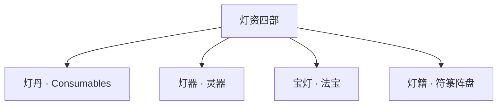

# 《万古守灯人》馈灯八步 · 道具 · 灵宠 · 洞府系统

> **定位**：穿插主线的「赠礼→羁绊→报恩→纳绶→照路余恩」链；道具/灵宠/洞府均**灯道原创命名**  
> **原则**：无数值面板；「倒贴」写**主动靠近的感恩与迟暮之恋**，经馈灯八步**纳灯绶入灯后谱**（后宫收集、主次有序）；非低俗、非系统刷好感。详见 [`28`](./28-道侣后宫·灯后谱体系.md)  
> **主文档**：[`14-五大系统与500万剧情设计`](./14-五大系统与500万剧情设计.md)

---

## 一、主线穿插链 · 「馈灯八步」

| 步 | 名称 | 写什么 | 不写什么 |
|----|------|--------|----------|
| **① 赠礼** | 馈灯 | 半块饼、一滴油、一张符、一枚丹 | 砸资源炫富 |
| **② 灯缘↑** | 命灯温变 | 灯芯跳、袖温、命灯亮一线 | 好感度数字 |
| **③ 主动靠近** | 敬服/之恋 | 青禾送姜汤、宁漱月送方、温言证契 | 低俗倒贴、砸礼换好感 |
| **④ 报恩感恩** | 当场还 | 挡灯、遗图、齐念「灯还亮」 | 拖 fifty 章才还 |
| **⑤ 纳绶** | 纳灯绶 | 灯后谱入席、记名弟子、五灯队名册 | 无铺垫收齐、争宠宫斗 |
| **⑥ 照路余恩** | 破境共照 | 追随者命灯齐亮一线 | 直接传功升阶 |
| **⑦ 纳府聚队** | 洞府/队 | 守灯静室、五灯同心 | 独占秘境挂机 |
| **⑧ 升阶共照** | 主线 | 塔/岭/京/化灯 | 脱离人间 |

### 灯缘四维（不写数值，写体征）

| 维度 | 体征 | 谁适用 | 锚点示例 |
|------|------|--------|----------|
| **羁绊** | 盟灯温、共渡记忆 | 霍、铁柱、姜小满 | 86 霍认输 |
| **亲密** | 吻、抵额、心口传油 | **仅沈青禾**（道侣） | 57/180/216 |
| **忠诚** | 专属台词、以命续令 | 铁柱、程不二、孙福 | 184/161–162 |
| **馈缘** | 灯箓古篆闪、留灯账入账 | 全员恩人 | ch41 起 |

> **「美女倒贴」本作解法**：不写刷礼物换好感，写**被照见真相后的主动**——沈青禾拒内门、宁漱月送战方、温言证契、姜小满备位侧契、谢长缨政灯记名；敬服后经馈灯八步**纳灯绶入灯后谱**（正侣首座 + 侧侣/缘侣），**主次有序、家族有情有义**。详见 [`28-道侣后宫·灯后谱体系`](./28-道侣后宫·灯后谱体系.md)。

---

## 二、馈灯八步 × 500 万篇幅建议比

| 步骤 | 建议占比 | 主要落部 | 加厚章量级 |
|------|----------|----------|------------|
| ① 赠礼 | 8% | 部一～二 | +40 章 |
| ② 灯缘↑ | 10% | 部一～四 | 嵌入每章 |
| ③ 主动靠近 | 6% | 部一～二、部八 | +15 章（情感） |
| ④ 报恩感恩 | 12% | 部二末～部十 | +50 章 |
| ⑤ 纳绶 | 5% | 部二90、部三113、部四 | 锚点已有 |
| ⑥ 照路余恩 | 7% | 部二～十一 | 破境章 |
| ⑦ 纳府聚队 | 6% | 部二～五 | +25 章 |
| ⑧ 升阶共照 | 46% | 全书 | 主线塔/岭/京/魔 |

---

## 三、馈灯八步 × 锚点章路线图

| 步 | 章 | 人物 | 情节 |
|----|-----|------|------|
| ① | 8 | 铁柱 | 引路上山 |
| ① | 18 | 沈青禾 | 姜汤三尺 |
| ① | 38 | 姜小满 | 半块饼 |
| ① | 41 | 孙福 | 半滴油治咳 |
| ② | 18 | 青禾 | 药铺长明稳一线 |
| ③ | 55–57 | 青禾 | 拒内门·塔前吻 |
| ④ | 29 | 铁柱 | 挡灯 |
| ④ | 52 | 十二杂役 | 投路自救 |
| ⑤ | 90 | 顾迟年 | 照心斋立灯后谱；小满备位 |
| ⑤ | 113 | 宁漱月 | 侧侣·四席纳绶 |
| ⑤ | 153 | 温言 | 侧侣·三席纳绶 |
| ⑤ | 180 | 姜小满 | 侧侣·次座纳绶 |
| ⑤ | 183 | 谢长缨 | 缘侣·政灯纳绶 |
| ⑤ | 216 | 灯后谱 | 众星拱月·雨夜盟 |
| ⑥ | 30/68/100 | 全镇/杂役/五灯 | 照路余恩 |
| ⑦ | 121 | 守灯堂 | 纳府成 |
| ⑧ | 61–68/91–100/141–216 | — | 主线升阶 |

---

## 四、道具系统 · 「灯资四部」

> 统称**灯资**（以灯为纲，不另起修仙背包 UI）。

### 4.1 总分类

| 大部 | 通俗对照 | 本作定位 | 品阶 |
|------|----------|----------|------|
| **灯丹** | 丹药 | 明魂、续忆、疏脉、定神 | 九品～一品 |
| **灯器** | 灵器 | 铜灯、魂灯、影灯、骨灯 | 九品～三品 |
| **宝灯** | 法宝 | 守岁灯、千年灯芯、开灯令 | 二品～超品 |
| **灯籍** | 符/阵 | 拒婚符、避时符、五灯阵盘 | 按用计费；**灯符册**见 [`21`](./21-灯符册系统与品阶设计.md)；**合阵**见 [`31`](./31-灯阵体系与合阵设计.md) |

### 4.2 灯丹（丹药）明细

| 品阶 | 名称 | 功效 | 代价/限制 | 首现章约 |
|------|------|------|-----------|----------|
| 九品 | **微光丹** | 稳一阶微光半日 | 燃一份暖忆 | 20 |
| 八品 | **明魂丹** | 抗迷障、定神 | 炼一炉失一段忆 | 41–61 |
| 七品 | **疏脉丹** | 疏驳杂灵脉 | 需续灯诀配 | 47 |
| 六品 | **续忆膏** | 补遗失记忆（不全） | 不可补「初恋」级 | 47/116 |
| 五品 | **定神灯丸** | 破幻、稳灯影 | 失明一炷香 | 61 |
| 四品 | **还阳灯丹** | 续命一线（非买寿） | 诫三：折寿双倍反噬 | 109 |
| 三品 | **凝芯丹** | 助凝灯芯 | 须发白一缕 | 68 |
| 二品 | **承苦丹** | 七阶承苦缓冲 | 替人承痛一炷香 | 117 |
| 一品 | **万古灯油** | 化灯前备油 | 仅216前可炼 | 215 |

**炼制**：炼灯术 + 杂役堂暗炉；顾迟年以**算料**补灵根不足（凡人流）。**丹道体系**见 [`32`](./32-丹道体系与炼灯术设计.md)。

### 4.3 灯器（灵器）明细

| 品阶 | 名称 | 用途 | 代表持有者 |
|------|------|------|------------|
| 九品 | 铜烛台、铁灯盏 | 照明、照物 | 杂役 |
| 八品 | 灵灯、储油囊 | 储油三滴 | 程不二 |
| 七品 | 魂灯 | 明魂、照隐匿 | 丹堂 |
| 六品 | 影灯 | 照路、投影 | 顾迟年 ch52+ |
| 五品 | 盏器 | 缓时、照人心 | 沈青禾 ch180+ |
| 四品 | 骨灯 | 承伤架油 | 霍照临 |
| 三品 | 古灯器 | 容千年芯 | 焚灯塔 |

### 4.4 宝灯（法宝）明细

| 名称 | 阶 | 能力 | 章 |
|------|-----|------|-----|
| **守岁灯** | 一品·成长 | 三相归一、灯箓 | 1–216 |
| **千年灯芯** | 三品 | 破塔、续塔顶残灯 | 68 |
| **拒婚符** | 灯籍宝 | 保自主抉择 | 57 |
| **开灯令诏** | 制度宝 | 民灯可修 | 152 |
| **万家火旗** | 群像宝 | 凡火聚阵 | 204 |
| **万古灯** | 超品 | 人间长明 | 216 |

### 4.5 赠礼→道具联动

| 赠礼 | 道具 | 灯缘 | 后文报恩 |
|------|------|------|----------|
| 三枚微光丹 | 灯丹 | 杂役感恩 | 65 齐念 |
| 明魂丹一袋 | 灯丹 | 铁柱 | 84 挡阵 |
| 拒婚符 | 灯籍宝 | 青禾自主 | 180/216 |
| 旧灯库图 | 宝灯线索 | 程不二 | 163 遗赠 |

---

## 五、灵宠 · 「守灯灵禽」

> 本作灵宠**不战斗刷级**，主功能：**载灯、嗅缘、守静室、传信**。

### 5.1 品类总表

| 类型 | 名称 | 参照感 | 功能 | 首现建议 |
|------|------|--------|------|----------|
| **灵禽** | 云岚灯鹤 | 仙鹤 | 载灯飞行、传信 | 部二 ch45 |
| **灵禽** | 墓灯鸦 | 乌鸦灵化 | 引路枯骨岭 | 部三 ch91 |
| **灵兽** | 驮灯駮 | 駮/灵马 | 驮货、驮 injured | 部二 ch42 |
| **灵兽** | 泥灯龟 | 灵龟 | 储油、稳心 | 部一 走灯节 |
| **灵虫** | 槐下萤 | 萤火虫 | 照十步、探迷障 | 部一 ch24 |
| **灵鱼** | 河灯鲤 | 灵鲤 | 走灯节示冤 | 部一 ch23 |
| **异种** | 骨萤 | 骨灵 | 万灯冢引魂 | 部三 ch100 |

### 5.2 主角线灵宠（单宠深写，不宠物栏）

| 宠 | 归属 | 得宠方式 | 弧线 |
|----|------|----------|------|
| **槐下萤「点点」** | 姜小满→顾迟年 | 走灯节姜小满所捉，赠顾「照路」 | 部一赠礼→部三传信→部五守静室 |
| **驮灯駮「老灰」** | 杂役堂共有 | 顾迟年喂明魂丹渣痊愈 | 部二驮塔伤员→部四驮青禾入京 |

> 不对标「噬金虫/火蟒」等专有灵宠；**一只禽、一只兽、一只虫**足够 500 万。

---

## 六、坐骑 · 「行灯」

| 阶 | 名称 | 速度 | 谁骑 | 章 |
|----|------|------|------|-----|
| 凡 | 瘦马、骡、船 | 慢 | 顾迟年（花甲 realistic） | 1–40 |
| 灵 | 驮灯駮 | 中 | 铁柱、杂役 | 42+ |
| 灵 | 云岚灯鹤 | 快 | 内门、霍照临 | 45+ |
| 宝 | 灯骨狮（霍照临暂借） | 战阵冲阵 | 霍 | 185 前 |
| 阵 | 五灯同心·灯影渡 | 短距挪移 | 五灯队 | 113+ |

**顾迟年**：花甲多**步行、雇船、拒骑鹤**（「急什么，灯还亮着呢，走也能到」）——反套路。

---

## 七、洞府系统 · 「照心斋 / 守灯静室」

> 不叫「洞府」，称**照心斋**（静修）、**留灯居**（日常）、**守灯堂**（宗门）。

### 7.1 阶位与功能

| 阶 | 名称 | 条件 | 功能 | 锚点 |
|----|------|------|------|------|
| 凡 | 柴房、顾宅 | 无 | 藏油、记账 | 1–40 |
| 九品 | **经室** | 杂役 | 读《守灯经》 | 36 |
| 八品 | **暗炉室** | 炼灯术成 | 炼灯丹、避查 | 20–41 |
| 七品 | **照心斋** | 记名弟子 | 储油十滴、避时半日 | 90 |
| 六品 | **守灯静室** | 守灯堂成 | 五灯阵眼、疗伤 | 121 |
| 五品 | **岭中石室** | 枯骨岭闭关 | 时间差修炼 | 92 |
| 四品 | **旧灯库侧室** | 夺库后 | 藏命灯器 | 163–170 |
| 三品 | **玄京照心斋** | 开灯令后 | 照刑司联动 | 153 |
| 超品 | **镇口长明** | 216 化灯 | 万古灯身 | 216 |

### 7.2 洞府升级 = 馈灯八步⑦

- 每次升级需：**灯阶达标 + 恩人馈缘 + 资源（灯丹/器）**
- 不写「挖洞府副本」，写**换一处能安心点灯的地方**

### 7.3 洞府 × 主线穿插

| 部 | 洞府事件 | 馈灯链 |
|----|----------|--------|
| 部一 | 顾宅→经室 | 赠礼半块饼→姜小满扫屋 |
| 部二 | 暗炉→照心斋 | 赠明魂丹→记名弟子 |
| 部三 | 岭中石室 | 闭关三年（外三日） |
| 部五 | 旧灯库侧室 | 程不二遗图→夺库 |
| 部十一 | 镇口长明 | 化灯→万古洞府 |

---

## 八、与已有系统对接

| 已有 | 本模块 | 关系 |
|------|--------|------|
| 留灯账 | 馈灯① | 赠礼必入账 |
| 同心灯契 | 纳绶⑤ | 道侣终局 |
| 照路余恩 | 鸡犬升天⑥ | 同义 |
| 灯器九品 | 灯资四部 | 器+宝扩展 |
| 灯箓账 | 馈缘维 | 灯缘↑触发古篆 |
| 炼灯术 | 灯丹 | 丹药来源 | [`32`](./32-丹道体系与炼灯术设计.md) |
| 五灯同心 | 灯籍/阵 | 合阵分工 | [`31`](./31-灯阵体系与合阵设计.md) |

---

## 九、写法铁律（穿插主线）

1. **每 3–5 章至少一步馈灯链**：赠礼 / 灯缘 / 报恩之一
2. **道具到手必用过**——不用不写
3. **灵宠出场≤3 主宠**——功能明确，不打架刷级
4. **洞府升级伴随人情**——谁帮改门、谁送匾
5. **情感「倒贴」= 主动感恩**——灯后谱五席各五拍，主次有序，见 [`28`](./28-道侣后宫·灯后谱体系.md)
6. **简洁**：「馈灯一滴，留灯账一行，命灯温变。」

---

## 十、500 万插章建议（本模块）

| 类型 | 新增章 | 万字约 |
|------|--------|--------|
| 赠礼小剧场（一人一礼） | 30 | 12 |
| 灯丹炼制失败/成功 | 15 | 6 |
| 灵宠得宠/救主 | 8 | 3 |
| 照心斋升级 | 12 | 5 |
| 报恩回环（50章隔） | 40 | 16 |
| **合计** | **105** | **~42** |

---

*扩展系统 v1.0 · 2026-07-11 · 并入 [`14`](./14-五大系统与500万剧情设计.md)*
