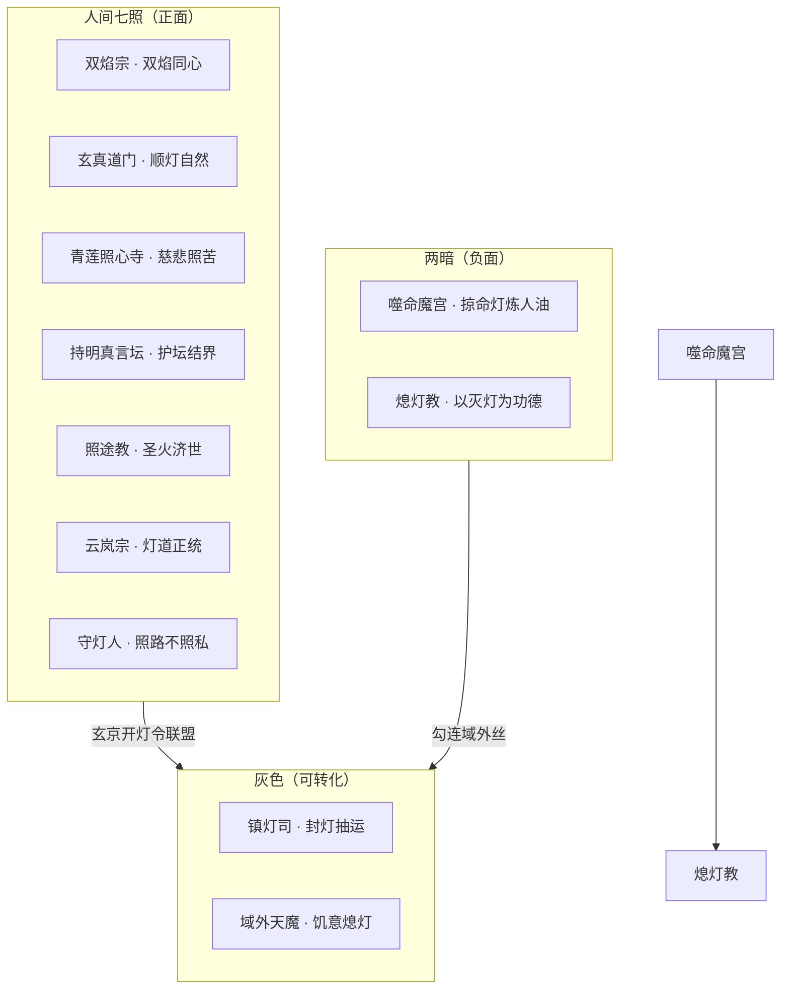

# 《万古守灯人》七教合流 · 正邪宗门设计

> **用途**：双焰宗、道门、佛门、密宗、西方教派（正面）与魔教、邪教（负面）之世界观、人物、章位与写法铁律。  
> **原则**：全部原创命名与灯道逻辑绑定；**正面教派不灭他人命灯**，**邪派以熄灯/噬灯为功**；双焰宗写「两心同照」不写低俗。  
> **更新**：2026-07-11

---

## 一、总纲：人间七照 vs 两暗

| 阵营 | 核心信条 | 与守灯十诫 |
|------|----------|------------|
| **七照联盟** | 照他人前路，护他人命灯 | 契合诫一、六、九 |
| **噬命魔宫** | 吞他人命灯、炼灯油自用 | 破诫一、四、八 |
| **熄灯教** | 人间太苦，熄灯即解脱 | 破诫六、九；与黑灯同频 |

**叙事功能**：拓宽人间烟火面——百姓不只拜云岚，也拜道观、佛寺、圣堂；终战「万家灯火」需**七教并燃**，非云岚一家独亮。

---

## 二、正面教派（详细）

### 1. 双焰宗（合心双焰 · 情感正道）

| 项 | 内容 |
|----|------|
| **山门** | 南疆「双焰谷」，近枯骨岭外缘 |
| **功法** | **合心双焰诀**：两盏命灯同频互渡，稳心防走火，**非采补** |
| **与灯道** | 同心灯契之「友宗」——双焰可助契者渡油劫，但须两心自愿 |
| **宗训** | 「合不在欲，在于同照；焰不在身，在于守人。」 |
| **正面定位** | 天下最懂「两心守灯」的宗门；被世俗误解为邪，实则守情守诺 |

**关键人物**

| 人物 | 身份 | 剧情功能 |
|------|------|----------|
| **温绛云** | 双焰宗长老，四旬，灯盏境 | 玄京论灯，为沈青禾辩「守铺亦是守灯」；与顾迟年互敬不暧昧 |
| **棠照绫** | 内门弟子，廿五 | 枯骨岭救队，双焰护阵；后赴青萝助走灯节 |
| **花执律** | 宗主 | 开灯令联盟签字人之一 |

**情感写法（有血有骨、简洁爽快）**

- 双焰宗弟子谈情：**三句定性格**——「我合的是心，不是命」「你守你的长明，我守我的双焰」「灯在，约在，人不强求。」
- 与沈青禾线：温绛云点破「迟暮之恋亦是灯契一种」→ 不抢戏，助青禾在 ch180 前定心。
- **禁止**：采补、鼎炉、强迫双修；亲密限于**额贴、掌心传焰、同频守夜**。

**锚点/插章**

| 阶段 | 章位（锚点→插章） | 事件 |
|------|-------------------|------|
| 部三 | ch100 附近 +插 | 枯骨岭外，棠照绫双焰护五灯队过瘴 |
| 部四 | ch130 附近 +插 | 温绛云赴青萝，论走灯节「双焰不违诫二」 |
| 部五 | ch155 附近 +插 | 玄京朝堂诬合欢「淫邪」，顾迟年当众照账辩白 |
| 部五 | ch176 后 +插 | 青禾破四阶，温绛云助稳「同心灯契」半线 |
| 部八 | ch860 附近 +插 | 烽火青萝，双焰宗双焰列阵护镇口 |

---

### 2. 玄真道门（顺灯自然）

| 项 | 内容 |
|----|------|
| **祖庭** | 蜀南「松云观」；青萝镇外有**顺灯观**分院 |
| **功法** | **顺灯吐纳**：借自然灯息修行，不夺命灯 |
| **标志** | 道袍袖绣小灯，斋日不熄「心灯」 |
| **正面定位** | 云岚宗世俗盟友；走灯节常派道士「镇河灯位」 |

**关键人物**

| 人物 | 功能 |
|------|------|
| **松云子** | 顺灯观观主，六阶灯骨，云照旧识 |
| **李玄章** | 年轻道士，跟顾迟年学「留灯账」记善 |

**章位**：部一 ch23 走灯节（道士镇河）；部五 ch148 灯影预演（道门助阵）；部九 ch980 前「七教聚焰」道门持剑护坛。

---

### 3. 青莲照心寺（佛门 · 慈悲照苦）

| 项 | 内容 |
|----|------|
| **祖刹** | 江北「燃灯古刹」；玄京有「照心禅院」 |
| **功法** | **照苦明灯禅**：以愿力稳他人命灯一线，不增己寿 |
| **标志** | 僧众行脚提「照心灯」，不化缘只化「油」 |
| **正面定位** | 赈灾、医伤、超度走灯节落水冤魂 |

**关键人物**

| 人物 | 功能 |
|------|------|
| **慧灯法师** | 照心禅院首座，无阶却愿力可借万家火 |
| **净缘小沙弥** | 姜小满同龄，走灯节结伴提灯 |

**章位**：部一 ch35 赈灾僧；部四 ch145 谢长缨「一碗汤」与慧灯并论民生；部五 ch159 封灯执行（僧众护民灯）；部十 ch1100 万家灯火（梵音与更梆同响）。

---

### 4. 持明真言坛（密宗 · 护坛结界）

| 项 | 内容 |
|----|------|
| **祖坛** | 西陲「持明峰」；玄京地下有密坛（与旧灯库相邻） |
| **功法** | **真言护灯印**：以印诀封域外丝、稳灯域边界 |
| **标志** | 坛主结印时袖中藏灯油，口诵「灯在界在」 |
| **正面定位** | 专克**熄灯教**黑咒；与云岚无宗门从属，只认「护灯契」 |

**关键人物**

| 人物 | 功能 |
|------|------|
| **坛主巴图·明光** | 七阶灯魂，寡言，与裴无妄有过旧账 |
| **卓玛** | 女坛师，四阶，枯骨岭以印封时瘴 |

**章位**：部三 ch108 万灯冢前封外钩；部五 ch165 旧灯库地图之谜（密坛指路）；部六 ch620 开灯风云（真言破黑旗）；部九 ch981 域外天魔（护界印与九阶灯域叠合）。

---

### 5. 照途教（西方教派 · 圣火济世）

| 项 | 内容 |
|----|------|
| **起源** | 西陆「辉光之国」，传教士东渡大玄 |
| **圣物** | **永恒圣火盏**——实为上古守灯人遗物，非神迹 |
| **教义** | 「光不属一人，属赶夜路者」；与顾迟年「为赶夜路的人」同调 |
| **正面定位** | 玄京设「照途堂」，赈济、译经、护幼；**不排灯道** |

**关键人物**

| 人物 | 功能 |
|------|------|
| **艾德里安·圣火** | 东渡主教，花甲，无灵根，凭圣火盏借万家火 |
| **玛格丽** | 修女，医灯，与沈青禾交流草药 |
| **托马斯** | 年轻执事，照刑司温言之友，以律证圣火非妖 |

**章位**：部五 ch151 女相谢长缨（西教献圣火助议开灯令）；部五 ch174 顾迟年震怒（照途堂护落第卷）；部八 ch860 烽火（圣火与长明并燃）；部九 ch1000 天魔线（圣火盏与守岁灯共鸣）。

**写法**：不写传教冲突狗血；写**制度对话**——开灯令与圣火誓并立，各照一路。

---

## 三、负面教派（详细）

### 6. 噬命魔宫（魔教）

| 项 | 内容 |
|----|------|
| **总坛** | 北海「噬灯岛」；中原有「魔宫外舵」 |
| **功法** | **噬命炼油术**：吞他人命灯碎片，短进长损 |
| **与陆承安** | 陆曾误用魔宫「换卷秘术」思路 → 对照邪路 |
| **负面定位** | 制造「忘名」「失忆」；天煞门背后有魔宫外舵影子 |

**关键人物**

| 人物 | 功能 |
|------|------|
| **魔宫主·吞名** | 八阶，已忘本姓，终被顾迟年灯域照出真名 |
| **血灯使** | 部二天煞门线幕后；ch85 附近插章揭露 |

**章位**：部二 ch85 天煞+插；部五 ch166 镇灯司先至（魔修混余孽）；部六 ch700 势力战；部九 ch981 域外前奏（魔宫献祭喂天魔）。

**下场**：不洗白；**有仇报仇**——顾迟年照账，霍照临剑斩，温言入刑司正库。

---

### 7. 熄灯教（邪教）

| 项 | 内容 |
|----|------|
| **性质** | 非宗门，是**民间黑教**；信「黑灯真主」，以熄长明为功德 |
| **手段** | 煽动封灯、投毒灯油、走灯节推人落水 |
| **与镇灯司** | 余孽勾结熄灯教；黑灯一点与诏云同频 |
| **负面定位** | 破守灯十诫第六、九条；百姓中被蛊惑者众 |

**关键人物**

| 人物 | 功能 |
|------|------|
| **黑灯婆** | 走灯节单元案 BOSS（部一插章） |
| **熄灯使** | 玄京线，ch159 封灯执行内应 |
| **「真主」** | 无实体，乃域外饥意低语 |

**章位**：部一 走灯节+插 ch25；部三 ch128 诏云黑灯；部五 ch159–160；部九 ch981 与天魔合一。

**下场**：慧灯超度、真言封咒、顾迟年照破；**区分被蛊惑百姓与教主**——救民诛首。

---

## 四、七教联盟 · 玄京开灯令（部五～六主轴）

**事件名**：**七照盟**（承平三十九年夏）

| 次序 | 事件 | 参与 | 锚点/插章 |
|------|------|------|-----------|
| 1 | 封灯诏下，各教遣使入京 | 道、佛、密、西、合欢 | ch141–145 |
| 2 | 朝堂诬合欢、疑圣辉 | 顾迟年辩白 | ch155 插 |
| 3 | 五灯队+七教试阵 | 持明坛护界 | ch167–169 |
| 4 | 开灯令签字 | 花执律、慧灯、清虚、巴图、艾德里安 | ch152 |
| 5 | 终战丞相府 | 七教各出一柱 | ch180–185 |
| 6 | 魔宫、熄灯教总清算 | 照刑司+万家火 | ch186–190 |

**顾迟年立场**：「云岚是师门，七教是人间。灯在，盟在，不拜一家。」

---

## 五、与现有系统对接

| 系统 | 七教用法 |
|------|----------|
| **同心灯契** | 双焰宗「双焰同频」为友宗技术，不替代顾×沈唯一盟 |
| **照路余恩** | 七教弟子被顾迟年施恩者，终战各还一次（单行账） |
| **灯箓账** | 正教善行记「善缘」；魔教噬灯记「血债」 |
| **馈灯八步** | 棠照绫赠「双焰护符」→ 青萝报恩；艾德里安赠圣火油 → 开灯令 |
| **守灯十诫** | 邪派专破某条；正教各守一条为招牌（佛守诫一，密守诫六…） |

---

## 六、各教「一句证」（对话带刀）

| 教派 | 专属台词 |
|------|----------|
| 双焰宗 | 「两心同照，不强求一灯。」 |
| 道门 | 「顺灯而行，不夺人路。」 |
| 佛门 | 「照苦不照私，油尽愿在。」 |
| 密宗 | 「界在灯在，印在心在。」 |
| 照途教 | 「圣火属夜路，不属王座。」 |
| 噬命魔宫 | 「你的名，是我的油。」（反派） |
| 熄灯教 | 「灭了，就不苦了。」（邪教） |

---

## 七、500 万插章规划（+85 章）

| 模块 | 新增章 | 万字约 | 部 |
|------|--------|--------|-----|
| 双焰宗·双焰线 | +18 | 7.2 | 三～八 |
| 道佛民间线 | +15 | 6 | 一、五、十 |
| 密宗旧灯库线 | +12 | 4.8 | 五～七 |
| 圣辉东西线 | +15 | 6 | 五、八、九 |
| 魔宫覆灭线 | +15 | 6 | 二、五、六 |
| 熄灯教单元案 | +10 | 4 | 一、三、五 |
| **合计** | **+85** | **~34** | — |

**与 1250 章目标**：220 锚点 + 900 插章中原含此 85 章，不另开平行主线。

---

## 八、写法铁律

1. **正教不写脸谱**：各有规矩与缺点（合欢被诬、西教被疑、密宗太封闭）。
2. **邪教不写弱智**：熄灯教懂人心之「苦」；魔宫懂交易与诱惑。
3. **双焰宗**：写「情与守」不写「欲与采」；亲密戏对标 ch57/180/216 尺度。
4. **西方教**：写「圣火=古守灯遗物」 mystery，终不抢灯道主线。
5. **终战**：必须 **七教并燃 + 万家火**；缺任一教，灯域缺一角（叙事理由）。

---

## 九、锚点正文微埋（待扩写时植入）

| 卷 | 建议植入句/场景 | 章 | 状态 |
|----|-------------------|-----|------|
| 一 | 走灯节道士镇河、黑灯婆/熄灯教谣 | 23 | ✅ 已埋 |
| 一 | 慧灯法师赈灾消息 | 35 | ✅ 已埋 |
| 二 | 天煞门+噬命魔宫血灯油 | 85 | ✅ 已埋 |
| 三 | 持明坛封瘴、合欢棠照绫双焰 | 108 | ✅ 已埋 |
| 四 | 七照盟使节、照途堂护卷 | 141、145 | ✅ 已埋 |
| 四 | 七照盟签字、合欢辩白 | 152 | ✅ 已埋 |
| 四 | 熄灯教内应、慧灯擒邪 | 155 | ✅ 已埋 |
| 四 | 温绛云助同心灯契 | 176 | ✅ 已埋 |
| 四 | 终战七柱并阵、魔宫油迹 | 180、166 | ✅ 已埋 |
| 五 | 万家灯火七教并燃 | 204 | ✅ 已埋 |
| 五 | 魔宫主照真名、熄灯教总破 | 186–190 | 🔄 插章加厚 |

---

**结论**：七教合流扩的是「人间之广」，不稀释「守灯人」之深；正邪分界在**护命灯 vs 噬/熄命灯**，与全书主题同轴。
