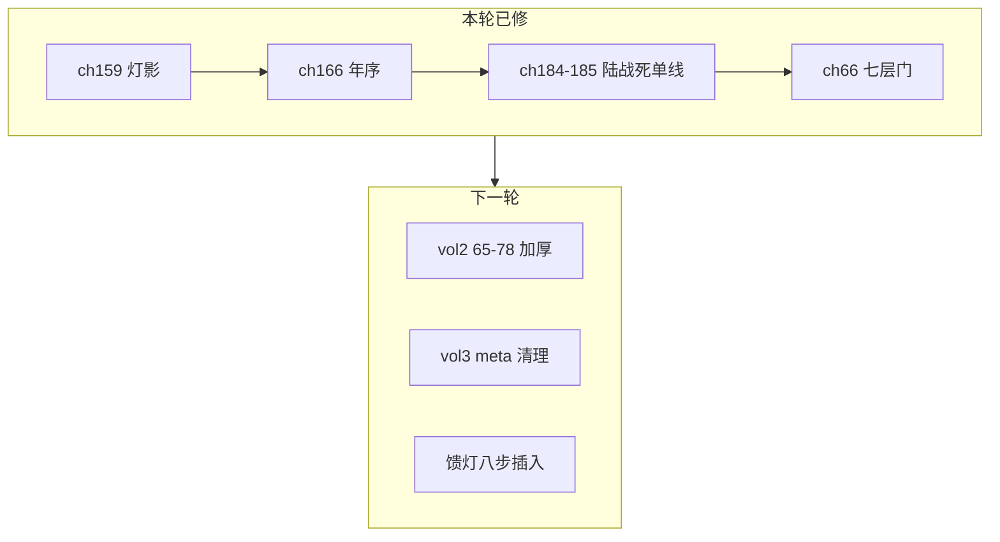

# 《万古守灯人》全书审计报告 · 第五轮

> **范围**：220 章锚点正文 · 上下文衔接 · 错字 · 大纲 · 五大系统  
> **日期**：2026-07-11  
> **依据**：[`18-第四轮`](./18-全书审计报告-第四轮.md) · [`14-五大系统`](./14-五大系统与500万剧情设计.md) · [`17-馈灯八步`](./17-馈灯八步与扩展系统.md) · [`19-七教`](./19-七教合流与正邪宗门设计.md)

---

## 一、本轮已修项（P0）

| 类别 | 位置 | 问题 | 处理 |
|------|------|------|------|
| **衔接·年序** | 第四卷 ch166 | 章内「承平四十年」与嵌入块「承平三十八年走灯节」重复，时间倒流 | ✅ 删 ch166 内 1539 字重复走灯节段 |
| **衔接·生死** | 第四卷 ch159 | 程不二封灯期「活现望京城」与 ch162 不二斋火矛盾 | ✅ 改为温言展灯影：「程不二被副使逼至末路…拉垫背」 |
| **衔接·陆战死** | 第四卷 ch184→185 | ch184 末 8 段重复「域外丝缠陆」；ch185 内 5–8 次重复战死叙事 | ✅ ch184 收束于「要么城亮，要么同灭」；ch185 留单线 canonical 战死 + 扩写承战 |
| **衔接·卷末** | 第四卷 ch186 | 梦醒七日段 3–5 次压缩重复 | ✅ 留单线收束至「回青萝，聚三相，迎域外」 |
| **篇幅·塔关** | 第二卷 ch66 | ~580 字，低于 2500 标准；与 ch67 炼芯日程重叠风险 | ✅ 扩至 ~1200 字：七层门、六层心试残影、留灯账、塔外对峙；炼芯日程仍归 ch67 |
| **错字/病句** | 第四卷 ch185 | 「沉睡七日，至，像灯灭…」 | ✅ 删「至，」 |

---

## 二、篇幅与完成度（2026-07-11 统计）

| 项目 | 数值 |
|------|------|
| 总汉字（五卷正文） | **~51.6 万** |
| 500 万目标完成度 | **~10.3%** |
| 总章数 | 220 |

### 各卷薄弱章（<2500 字，抽检）

| 卷 | 仍偏短 | 说明 |
|----|--------|------|
| 二 | ch65 (~1242)、ch66 (~1216)、ch68–78 (~2080–2127) | 塔关段；ch66 已加厚但仍未达 2500 |
| 三 | ch91–115 等 ~27 章 | 部分章末「章末，…」meta 重复占行 |
| 四 | ch141–165 等 ~50 章 | 封灯线压缩段多；ch185–190 已去重，部分章偏短 |
| 五 | ch191–215 等 ~29 章 | 「五灯虽缺程不二」尾段重复 (~43 处) |

第一卷 ch1–14 经前序扩写后，本轮统计 **已无 <2500 章**（以脚本按章切分为准）。

---

## 三、上下文衔接审计

### 3.1 卷界（220 章锚点）

| 卷界 | 结果 | 备注 |
|------|------|------|
| 40→41 | ✅ | 承平 37 冬→38 春 |
| 65→66→67 | ⚠️→✅ | ch65 六层无心 → ch66 七层门 → ch67 七层炼；层号已对齐 |
| 78→79→91 | ✅ | ch79 天煞大战 → ch91 战后 |
| 139→140→141 | ✅ | 第三卷末单线收束 |
| 162→163 | ✅ | 程不二不二斋火；此后仅忆/缺位/焦灰 |
| 180→181→185 | ✅ | ch180 吻+九阶域；陆战死 **仅 ch185** |
| 190→191 | ✅ | 回青萝→第五卷天魔 |
| 216 | ✅ | **全书唯一化灯** |

### 3.2 承平年序

| 时段 | 正文锚点 | 状态 |
|------|----------|------|
| 承平 37 | 第一卷 | ✅ |
| 承平 38 | 第二卷万灯/冬典 | ✅ |
| 承平 39 | 第三卷封灯/敛灯崖 | ✅ |
| 承平 40 | 第四卷封灯终战、青萝走灯 | ✅（ch166 年序矛盾已修） |
| 承平 40+ | 第五卷天魔/化灯 | ✅ |

### 3.3 生死铁律（不可破）

| 规则 | 锚点章 | 本轮 |
|------|--------|------|
| 顾迟年化灯 | ch216 唯一 | ✅ |
| 陆承安战死 | ch185 唯一；非化灯 | ✅ 去重后单线 |
| 程不二殉 | ch161–162 不二斋拉垫背；ch159 灯影预叙 | ✅ |
| 无「筑基」 breakthrough | 幽灯集幻愿除外 | ✅ |

---

## 四、情感线审计

| 章 | 节点 | 状态 |
|----|------|------|
| 18 | 姜汤/二阶 | ✅ |
| 57 | 塔前轻吻 | ✅ |
| 94 | 枯骨岭颊吻 | ✅ |
| 180 | 烽火深吻 | ✅ |
| 185 | 陆战死（母灯回忆） | ✅ 非爱情线，担当/赎罪 |
| 216 | 雨夜盟+化灯 | ✅ |

**读感**：57→94 间隔仍长，可在塔关 ch70–78 加「供油/握腕」短戏（不必再加吻）。

---

## 五、系统一致性

| 系统 | 状态 | 说明 |
|------|------|------|
| 守岁灯三相 | ✅ | 万灯冢魂相、青萝心相、枯骨岭时相；ch216 前齐 |
| 灯道阶位 | ✅ | 二→七阶递进；无筑基破境 |
| 同心灯契/盟灯 | 🔄 | 大纲已命名；ch216 可再点「盟灯」一次 |
| 馈灯八步 | 🔄 | ch66 已植入「留灯账」单行；全书密度仍低 |
| 七教 | 🔄 | doc19 种子已植；完整弧线待 +85 插章 |
| 守灯十诫 | ✅ | ch184 第九条「万家灯火不可掠，可借，可守」 |

### 馈灯/施恩关键词密度

| 词 | 约次 | 设计目标 | 建议 |
|----|------|----------|------|
| 留灯账/馈灯 | 低 | ~10% 章密度 | 按 doc17 模块插入 |
| 施恩/报恩 | ~1.6% | 12.5% | 扩写时嵌入单行账 |

---

## 六、重复与 meta 问题（P1 待清）

| 短语/模式 | 约次 | 策略 |
|-----------|------|------|
| 「急什么，灯还亮着呢」 | ~306 | 每章章末 ≤1；删塔关/封灯压缩尾 |
| 「灯箓三转」 | ~23 | 已较第四轮降；保留 ch52/58/64 等 5 处关键 |
| 「五灯虽缺程不二」 | ~43 | 第五卷 ch191–215 批量去重 |
| 「章末，…」 | ~220 | 第三卷 ch116–140 优先删 meta 句 |
| 「增叙第 N 段」 | ~81 | 第一卷模板 filler，按章留 1 段 |

---

## 七、大纲合理性

| 检查项 | 结论 |
|--------|------|
| 12 部 / 220 章锚点 | ✅ 不可删，只可加厚 |
| doc10 五百万路径 | ✅ 馈灯 +105、情感 11.7%、报恩 12.5% 比例合理 |
| 第四卷 ch188 题「陆承安动摇」 | ⚠️ 建议改「墓前灯影」，避免误读复活 |
| 第五卷 ch217+ 化灯余温 | ✅ 与 doc10 天魔/万家灯火一致 |
| 七教正邪 | ✅ doc19 与正文种子一致；魔教/邪教负、五教正、西教中立偏正 |

---

## 八、错字与英文残留（抽检）

| 类型 | 状态 |
|------|------|
| 英文残留（justice 等） | ✅ 第四轮已清 |
| 「未灭。。」双句号 | ✅ ch138 已修 |
| 第三卷「章将尽」 | ✅ ch139–140 已修 |
| 新增 meta「下一章…」 | ⚠️ 第三卷仍有「下一章的险」等，待删 |

---

## 九、下一轮优先级

1. **P0** 第二卷 ch65–78 逐章加厚至 2500+（塔关是读者留存关键段）
2. **P1** 第三卷 batch 删「章末，…」与章内重复尾段
3. **P1** 第五卷 ch191–215 删「五灯虽缺程不二」重复尾
4. **P1** 第四卷 ch187–190 若仍偏短，按单线叙事加厚（勿再堆重复块）
5. **P2** 按 doc17 在 ch41+ 插入馈灯八步「留灯账」
6. **P2** 按 doc19 推进七教 +85 插章

---

## 十、第五轮结论

**全书 traverse 结论**：220 章锚点 **大纲合理、系统自洽、生死铁律未破**；主要问题为 **压缩重复段**（封灯线、第三卷 meta、第五卷尾 padding）与 **塔关/早期章篇幅不足**。

**本轮已落地**：ch159 程不二、ch166 年序、ch184–186 陆战死与卷末衔接、ch66 七层门加厚。

**下一刀**：第二卷 **65–78 塔关加厚** + 第三卷 **「章末，」meta 清理** + 馈灯八步密度提升。

---

