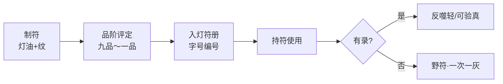

# 《万古守灯人》灯符册系统 · 品阶与上下文设计

> **定位**：灯道世界「符/阵/契」之**登记与品阶**体系，隶属灯资四部之 **灯籍**  
> **原则**：无数值面板；符有价（灯油/记忆/灵石）；**有录可验，无录有险**  
> **关联**：[`14-五大系统`](./14-五大系统与500万剧情设计.md) · [`17-馈灯八步`](./17-馈灯八步与扩展系统.md) · [`20-第五轮审计`](./20-全书审计报告-第五轮.md) · [`31-灯阵`](./31-灯阵体系与合阵设计.md)（五灯阵盘/契阵）

---

## 一、灯符册是什么

| 项 | 内容 |
|----|------|
| **名称** | 灯符册（民间亦称「符册」「灯籍」） |
| **本质** | 符箓制作、交易、使用的**登记制度** + **品阶标准** |
| **谁管** | 云岚宗符堂（宗门）→ 玄京灯符司（朝）→ **照刑司灯符册**（开灯令后） |
| **野符** | 幽灯集、不二斋流通之**无录符**；可用，但用一次灰一次，三次未登则命灯暗一线 |
| **与灯道** | 符以**灯油为墨、记忆为骨**；阶位越高，需灯阶越高才能持符不反噬 |

---

## 二、品阶总表（与灯器九品对齐）

| 品阶 | 符纸/纹 | 通称 | 典型符名 | 登记处 | 首现锚点 |
|------|---------|------|----------|--------|----------|
| **野录** | 黄纸、残角 | 野符/无录符 | 保命薄符、半张避时 | 不登记 | vol2 ch47、ch91 |
| **九品** | 纸符 | 凡符 | 引路灯、暖身符、照影符 | 坊市符摊 | vol4 ch153 |
| **八品** | 铜纹符 | 护命符 | 护命符、定神符 | 宗门符堂 | vol2 ch47 |
| **七品** | 灵纹符 | 行路符 | 避时符、疏脉符 | 符堂/幽灯集 | vol3 ch91 |
| **六品** | 影纹符 | 照路符 | 照路符、迷踪符 | 执灯堂备案 | vol2 ch52 |
| **五品** | 盏纹符 | 契盟符 | **拒婚符**、同心符 | 幽灯灯符册（裴无妄） | vol2 ch57 |
| **四品** | 骨纹符 | 承苦符 | 承苦符、替伤符 | 照刑司 | vol3 ch117 |
| **三品** | 古纹符 | 镇灯符 | 封阵符、镇灯符 | 玄京灯符司 | vol4 ch163 |
| **二品** | 命纹符 | 命符 | 触命符、窥因果符 | 旧灯库遗存 | vol4 旧灯库 |
| **一品** | 守岁灯符册 | 守岁契 | 与守岁灯同源纹 | 唯一 | vol1 ch1 隐含 |
| **超品** | 万古符 | 万家火契 | 万家灯火并燃之契 | 216 化灯 | vol5 ch204 |

---

## 三、灯符册五大类

| 类 | 用途 | 代表符 | 写作要点 |
|----|------|--------|----------|
| **身护** | 护命、定神、抗迷障 | 护命符、明魂符 | 一次一灰；野符不续 |
| **行路** | 照路、避时、疏脉 | 避时符、照路符 | 与枯骨岭、秘境绑定 |
| **契盟** | 自主、双盏、盟约 | **拒婚符**、同心符 | 需付根念/灯油；燃符即生效 |
| **刑照** | 回放、证真、照冤 | 证真符、回放符 | 照刑司专用；开灯令后合法 |
| **禁制** | 封灯、灭灯、噬灯 | 封灯符、熄灯符 | **反派/魔教**用；正派不写持禁制符 |

---

## 四、灯符册编号规则（正文可写）

| 登记机构 | 编号格式 | 示例 |
|----------|----------|------|
| 坊市符摊 | 丁字×号 | 九品照影符·丁字三号 |
| 云岚符堂 | 甲/乙/丙字×号 | 八品护命·乙字十二 |
| 幽灯灯符册 | 丙字×号（裴无妄） | **五品拒婚符·丙字七号** |
| 照刑司灯符册 | 刑字×号 | 证真符·刑字一 |
| 玄京灯符司 | 京字×号 | 三品镇灯符·京字三 |

**程不二规矩**（ch22）：「三块灵石的事，别用一滴灯油。」——指**九品以下符**坊市可买；**五品以上契盟符**必付灯油或根念。

---

## 五、锚点章 × 灯符册植入表

| 章 | 符 | 品阶 | 状态 | 正文 |
|----|-----|------|------|------|
| 22 | 幽灯集规矩 | — | 有录贵三倍 | ✅ 植入 |
| 47 | 程不二薄符 | 八品野符 | 无录 | ✅ 植入 |
| 57 | **拒婚符** | 五品盏纹 | 幽灯丙字七号 | ✅ 植入 |
| 91 | 避时符半张 | 七品灵纹 | 野录，符脚「陆」 | ✅ 植入 |
| 117 | 承苦符 | 四品骨纹 | 照刑司前兆 | 🔄 扩写插 |
| 153 | 照影符 | 九品 | 照刑司丁字三号 | ✅ 植入 |
| 163 | 镇灯符 | 三品古纹 | 旧灯库 | 🔄 扩写插 |
| 204 | 万家火契 | 超品 | 百姓共燃 | ✅ 植入 |

---

## 六、与其他系统衔接

| 系统 | 衔接 |
|------|------|
| **灯器九品** | 符阶 ≤ 持符者灯阶 +2；越阶持符，反噬加倍 |
| **馈灯八步** | ①赠礼可赠符；④报恩可还符命 |
| **灯箓账** | 制符所耗记忆计入人间账 |
| **守灯十诫** | 诫五「朔日子时灯语必真」→ 幽灯制符必真价 |
| **七教** | 青莲照心寺擅**证真符**；噬命魔宫擅**噬灯符**（邪） |

---

## 七、写作铁律

1. **出符一句标**：「五品盏纹，拒婚符，丙字七号。」
2. **不堆符名**：一章一事一符
3. **野符必交代代价**：一次一灰 / 命灯暗一线
4. **契盟符燃即尽**：拒婚符、同心符不可重复使用
5. **照刑司符合法**：开灯令后，刑照类符入册，与私修划界

---

## 八、500 万扩写建议

| 方向 | 章量级 | 内容 |
|------|--------|------|
| 符堂线 | +15 | 云岚符堂政治、克扣符材 |
| 照刑司符案 | +20 | 证真符断冤案 × 4 案 |
| 幽灯野符 | +10 | 裴无妄灯符册真相 |
| 魔教噬灯符 | +12 | 七教两暗禁制符 |
| 万家火契 | +5 | 终战灯符册归一 |

---

*灯符册系统 v1.0 · 2026-07-11*
