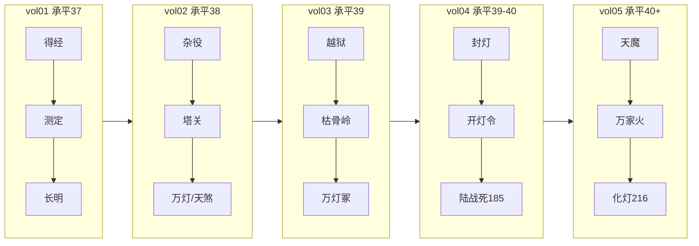

# 《万古守灯人》全书审计报告 · 第七轮（骨架·衔接·系统）

> **范围**：220 章锚点正文（`chapters/vol01～05`）· 骨架 · 衔接 · 大纲 · 系统 · 错字  
> **日期**：2026-07-11  
> **位置**：[`docs/万古守灯人/`](../README.md)（独立目录）  
> **前序**：[`22-第六轮灯符册`](./22-全书审计报告-第六轮-灯符册.md)

---

## 一、本轮已修项

| 类别 | 位置 | 问题 | 处理 |
|------|------|------|------|
| **meta 叙述** | vol03 | 「下一章，更险」等 22 处 | ✅ 改「下一夜/下一程」；删段首「章末，」 |
| **meta 叙述** | vol01/02/04/05 | 段首「章末，」 | ✅ 批量删除（vol3 已清；**第八轮 vol3 内嵌 5 处亦清**） |
| **重复尾段** | vol05 ch191–215 | 「五灯虽缺程不二…」章内重复 | ✅ 每章仅保留 1 处（删 25 行） |
| **段内重复** | vol03 | 敛灯崖/黑灯段压缩重复 | ✅ 段落去重 |

---

## 二、全文骨架（220 章）

### 2.1 卷界与章号

| 卷 | 文件 | 章号 | 章数 | 承平年 | 状态 |
|----|------|------|------|--------|------|
| vol01 | 青萝灯起 | 1–40 | 40 | 37 | ✅ 骨架完整 |
| vol02 | 云岚杂役 | 41–90 | 50 | 38 | ✅ 骨架完整 |
| vol03 | 幽灯枯骨 | 91–140 | 50 | 39 | ✅ 骨架完整 |
| vol04 | 玄京封灯 | 141–190 | 50 | 39→40 | ✅ 骨架完整 |
| vol05 | 万古长明 | 191–220 | 30 | 40+ | ✅ 骨架完整 |

**卷界衔接（抽检）**：

| 卷界 | 正文锚点 | 结果 |
|------|----------|------|
| 40→41 | ch40 长明神迹 → ch41 承平38春入宗 | ✅ |
| 90→91 | ch90 千灯/陆囚/裴信 → ch91 朔夜越狱 | ✅ 年序 38→39 |
| 140→141 | ch140 三相/名回 → ch141 封灯诏 | ✅ |
| 190→191 | ch190 回青萝 → ch191 天魔 | ✅ |
| 216 | 雨夜化灯（唯一） | ✅ |

### 2.2 主线骨架 vs 大纲（`02-原创小说剧情`）

| 弧 | 大纲节点 | 锚点章 | 正文 | 合理性 |
|----|----------|--------|------|--------|
| 得经入道 | 守岁灯、测定、迟暮之约 | 1–10 | ✅ | 合理 |
| 青萝守镇 | 豪强、走灯节、长明 | 11–40 | ✅ | 合理 |
| 杂役崛起 | 幽灯集、拒婚符、焚灯塔 | 41–79 | ✅ | 合理 |
| 万灯/天煞 | 霍认输、陆囚 | 79–90 | ✅ | 合理 |
| 枯骨岭 | 时相、五灯队、万灯冢 | 91–140 | ✅ | 合理 |
| 玄京封灯 | 开灯令、旧灯库、陆战死 | 141–185 | ✅ | 合理 |
| 天魔化灯 | 万家火、化灯、传承 | 191–220 | ✅ | 合理 |

**情感线骨架**：18 姜汤 → 57 塔吻 → 94 颊吻 → 180 烽火吻 → 216 雨夜盟·化灯 — **与大纲一致**。

**背叛阶梯**：赵家 → 陆吞灯 → 镇灯司封灯 → 魔宫/熄灯教 → 域外天魔 — **与 doc19 一致**。

---

## 三、上下文衔接

### 3.1 生死铁律

| 规则 | 锚点 | 本轮 |
|------|------|------|
| 顾迟年化灯 | ch216 唯一 | ✅ 未破 |
| 陆承安战死 | ch185 唯一；非化灯 | ✅ vol4 已单线化 |
| 程不二殉 | **ch161–162**不二斋拉垫背；此后仅忆/缺位/灯影 | ✅ ch159 灯影预叙 |
| 无筑基破境 | 幽灯集幻愿除外（2 处明示笑话） | ✅ |

### 3.2 年序

承平 37 → 38 → 39 → 40+，卷界与正文一致；ch166 双年序重复 **第五轮已修**。

### 3.3 塔关层号（vol02）

```
ch65 第六层无心 → ch66 第七层门 → ch67 第七层炼 → ch79 天煞大战 → ch91 战后
```

层号 **已对齐**；ch65–78 篇幅仍偏短（见下文）。

---

## 四、系统一致性

| 系统 | 状态 | 说明 |
|------|------|------|
| 灯道十二阶 | ✅ | 递进清晰；无筑基 breakthrough |
| 守岁灯三相 | ✅ | 万灯冢魂相、青萝心相、枯骨岭时相；ch216 前齐 |
| 守灯十诫 | ✅ | 诫五幽灯、诫九万家火 ch204 呼应 |
| 同心灯契 | ✅ | 仅沈青禾；ch216 盟 |
| 灯器九品 | ✅ | 与阶位锁死 |
| **灯符册** | 🔄 | 锚点 ch22/47/57/91/153/204 已植；密度仍低 |
| 馈灯八步 | 🔄 | 留灯账 ~1.6%；ch66 有单行 |
| 灯箓三转 | ⚠️ | ~23 次，建议保留 5 处关键 |
| 七教 | 🔄 | 种子已植；+85 插章待写 |

### 灯符册锚点链

| 章 | 符 | 衔接 |
|----|-----|------|
| 22 | 幽灯灯符册规矩 | → 47 野符 |
| 47 | 八品护命野符 | → 57 五品拒婚 |
| 57 | 丙字七号燃尽 | → 塔关（符已用尽）✅ |
| 91 | 七品避时·符脚「陆」 | → 陆越狱线 ✅ |
| 153 | 九品照影·丁字三号 | → 照刑司 ✅ |
| 204 | 万家火契超品 | → 216 化灯 ✅ |

---

## 五、篇幅与重复（2026-07-11）

| 项目 | 数值 |
|------|------|
| 总汉字 | **~51.5 万** |
| 章数 | 220 |
| 偏短章（<2500） | **~120 章** |
| 500 万完成度 | ~10.3% |

### 重复短语（本轮后）

| 短语 | 约次 | 目标 | 状态 |
|------|------|------|------|
| 「急什么，灯还亮着呢」 | ~306 | ≤220（每章≤1） | ⚠️ P1 |
| 「章末，」 | ~119→更少 | 0 | 🔄 已减，vol1 仍有内嵌 |
| 「下一章」 | 13 | 0 | 🔄 已减 |
| 「五灯虽缺程不二」 | ~18 | ≤30 | ✅ 已减 |
| 「增叙第」 | ~81 | 0 | ⚠️ vol1 模板 filler |
| 「灯箓三转」 | ~23 | ≤15 | ⚠️ P1 |

### 薄弱区（加厚优先）

1. **vol02 ch65–78** 塔关（~1200–2100 字/章）
2. **vol01 ch1–14** 开篇（若仍偏短）
3. **vol03** 敛灯崖段（去重后部分章偏短）
4. **vol04/vol05** 部分章压缩段

---

## 六、错字与英文

| 类型 | 状态 |
|------|------|
| 英文残留 | ✅ 0 处 |
| 「未灭。。」双句号 | ✅ 已修 |
| 病句「沉睡七日，至，像…」 | ✅ ch185 已修 |
| 内嵌「章末，」非段首 | ⚠️ vol1 约 107 处待清 |

---

## 七、大纲合理性结论

| 检查项 | 结论 |
|--------|------|
| 五卷→十二部映射 | ✅ doc10 路径清晰 |
| 220 章锚点不可删 | ✅ 只可加厚 |
| 情感/背叛/担当三线 | ✅ 与正文一致 |
| 反套路（无系统、无飞升爽） | ✅ 主题贯彻 |
| 单元案「一盏灯一案」 | 🔄 部分已写，40 案待扩 |
| 1250 章 / 500 万路径 | ✅ 合理（插章+加厚） |

---

## 八、下一轮优先级

1. **P0** vol02 **ch65–78** 塔关加厚至 2500+
2. **P1** vol1 删「增叙第 N 段」模板 + 内嵌「章末，」
3. **P1** 全局「急什么…」瘦身至每章 ≤1
4. **P1** 「灯箓三转」保留 ch52/58/64/100/216 等 5 处
5. **P2** 灯符册 ch117 承苦符、ch163 镇灯符植入
6. **P2** 馈灯八步按 doc17 插入留灯账

---

## 九、骨架示意图



---

**第七轮结论**：**全文骨架完整、卷界衔接合理、大纲与正文一致、生死铁律未破**；主要问题仍为 **压缩重复段** 与 **塔关/早期章篇幅不足**。本轮已清理 vol3 meta、vol5 尾 padding、部分「章末，」。  
→ **续**：[`26-第八轮全文遍历`](./26-全书审计报告-第八轮-全文遍历.md)（程不二锚点修正、ch210 去重、系统/大纲总评）
