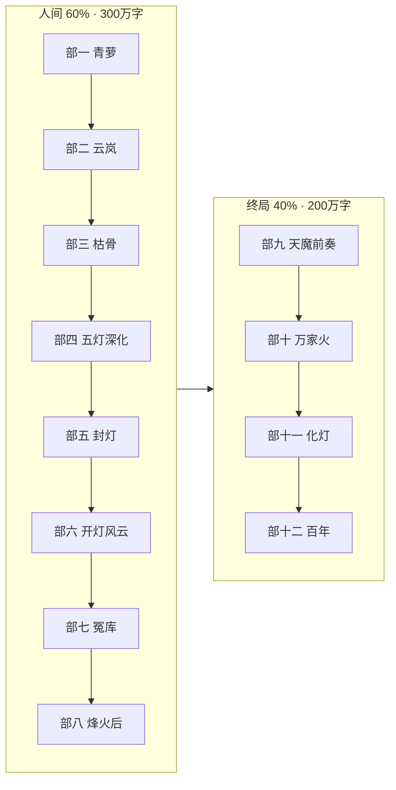

# 《万古守灯人》总纲优化建议 · v1.1

> **依据**：[`10-五百万字全书架构`](./10-五百万字全书架构.md) · [`02-原创小说剧情`](./02-原创小说剧情.md) · [`23-第七轮审计`](./23-全书审计报告-第七轮-骨架衔接.md)  
> **日期**：2026-07-11  
> **结论**：总纲**方向正确**，需做 **锚点/十二部对齐、终局解压、系统入纲、数据同步** 四类优化。

---

## 一、总纲健康度（速览）

| 维度 | 评分 | 说明 |
|------|------|------|
| 主题与反套路 | ⭐⭐⭐⭐⭐ | 「守人间不飞升」贯穿，与正文一致 |
| 五卷锚点骨架 | ⭐⭐⭐⭐ | 220 章弧完整，卷界衔接已验 |
| 十二部扩展路径 | ⭐⭐⭐ | 与锚点**多处重叠**，部九～十二**过压缩** |
| 情感/背叛阶梯 | ⭐⭐⭐⭐ | 节点清晰；57→94 间隔可补桥 |
| 系统入纲 | ⭐⭐⭐ | 灯符册/馈灯八步未写入 `10` 扩充表 |
| 数据同步 | ⭐⭐ | 文档仍写 26～32 万，实际 **~51 万** |

---

## 二、核心问题：十二部 vs 220 章锚点

### 2.1 重叠部（应改为「深化」而非「新弧」）

| 十二部 | 原规划 | 锚点已写 | 优化定位 |
|--------|--------|----------|----------|
| **部四** 五灯同心 361–480 | 战队成型 | ch113–140 五灯队已成 | → **阵法升级、走灯会、七教初遇**（+60 章） |
| **部七** 旧灯库冤 741–860 | 地下夺宝 | ch162–165 旧灯库战 | → **冤案追溯、秦照线、灯符册三品镇灯符**（+40 章） |
| **部八** 青萝烽火 861–980 | 情感城战 | ch180 烽火吻、ch166 走灯 | → **烽火之后、青萝再危、七教并燃**（+50 章） |

**原则**：锚点 = **脊柱**；十二部中与之重叠的部 = **加肉**，不另起炉灶。

### 2.2 过压缩部（必须插章解压）

| 十二部 | 目标章/万字 | 锚点章 | 问题 | 优化 |
|--------|-------------|--------|------|------|
| **部九** 域外天魔 | 120 章 / 48 万 | ch191–205 压缩 | 30 章塞 4 部终局 | **ch190 后插 +70 章**：天魔前奏、七教集结、裴无妄线 |
| **部十** 万家灯火 | 80 章 / 32 万 | ch204 单章高潮 | 群像不足 | **ch200–215 扩为 25 章**：各镇点灯、铁柱线、七照盟 |
| **部十一** 万古长明 | 40 章 / 16 万 | ch216 化灯 | 哲思可加厚 | **ch214–218 扩为 12 章**：灯境之寂、拒飞升、雨夜盟 |
| **部十二** 百年余韵 | 30 章 / 10 万 | ch220 尾声 | 略薄 | **ch221–250 番外**：姜小满、沈青禾、长明闪烁 |

**建议**：在 `10` 增 **「终局插章带」** 专节，明确 ch190→ch250 的章号预算。

---

## 三、五卷锚点 → 十二部（优化映射 v1.1）

```
【脊柱 · 220 章不可删】

部一  1–40      锚点 vol01 全
部二  41–90     锚点 vol02 全（加厚时塔关 65–78 优先）
部三  91–140    锚点 vol03 全
部五  141–190   锚点 vol04 全（陆战死仅 ch185）
部九～十一      锚点 vol05 191–220（化灯 ch216）

【加肉 · 插章带】

部一续  41–100    vol01 加厚 + 走灯节/单元案插章
部二续  101–220   vol02 加厚 + 塔每层 2–3 章 + 万灯 20 章
部四    221–360   五灯深化（非「成军」）+ 枯骨岭余波
部六    421–520   开灯令后派系战、照刑司符案 ×4
部七    521–620   旧灯库冤深描、七教暗线
部八    621–720   青萝烽火后、沈青禾四阶线加厚
部九续  721–900   天魔降临前（域外线、裴无妄）
部十续  901–1050  万家灯火群像战
部十一续 1051–1180 化灯慢孤独
部十二  1181–1250 百年余韵
```

---

## 四、情感线优化（总纲级）

| 现状 | 建议 |
|------|------|
| 57 塔吻 → 94 颊吻 间隔 37 章 | 在 **ch70–78 塔关内** 增 2–3 处「供油/握腕/灯温」短戏（不增吻） |
| 180 烽火吻 → 216 化灯 间隔 36 章 | **ch200–210** 插「青禾赴援、发如雪」情感专章 4–6 章（锚点已有节点，需加厚） |
| 霍照临线 doc10 写「挡剑(185)」 | 修正：**185 陆战死**；霍为 **ch184 挡弩、ch190 护陆堂** |
| 姜小满传承 | 明确 **ch90 拜师 → ch140 候补 → ch216 接经 → ch1250 百年** 四段 |

---

## 五、系统入纲（补入 `10` 第四节）

| 系统 | 500 万落点 | 建议章量 | 锚点 |
|------|------------|----------|------|
| **馈灯八步** | 每 20 章至少 1 步可见 | +105 模块 | ch41 留灯账起 |
| **灯符册** | 身护/行路/契盟/刑照/禁制 | +35 | ch22/57/153 已植 |
| **七教** | 部五起七照盟、终战七柱 | +85 | doc19 |
| **守灯十诫** | 触犯必写反噬现场 | +40 | 单元案绑定 |
| **照路余恩** | 破境章受益者命灯齐亮 | 嵌入 | ch68/100/155/216 |

**比例目标**（doc14）：情感 **11.7%** · 报恩 **12.5%** · 单元案 **15%** · 主线 **60%**。

---

## 六、单元案「一盏灯一案」优化

| 现状 | 优化 |
|------|------|
| `02` 列 20 案 | 保留为 **锚点案** |
| `10` 写 +120 章 / 40 案 | 改为 **20 锚点案 + 20 插章案**（避免重复造案） |
| 分布 | 部一 4 · 部二 4 · 部三 4 · 部五–八 8 · 部九–十 4（各 3–5 章/案） |

**短剧友好**：每案独立 3–5 章，案末一线牵主线（豪强→镇灯司→魔宫）。

---

## 七、执行优先级（优化版）

| 阶 | 任务 | 产出 | 理由 |
|----|------|------|------|
| **P0** | 同步总纲数据（51 万 / 220 章） | 文档一致 | 避免规划失真 |
| **P0** | vol02 **ch65–78** 塔关加厚 | 读者留存关键段 | 审计最薄区 |
| **P0** | 修正 `02`/`10` 陆战死/霍照临节点 | 总纲与正文一致 | 防误导扩写 |
| **P1** | 终局插章带规划（ch190–250） | 部九～十二解压 | 防头重脚轻 |
| **P1** | 部四/七/八 定位改为「深化」 | 十二部不打架 | 结构清晰 |
| **P1** | 57–94 情感桥接章细纲 | 3 章 | 迟暮之恋不断档 |
| **P2** | 灯符册/馈灯写入各卷插章表 | doc08 扩展 | 系统落地 |
| **P2** | 全局去重（急什么/增叙/章末） | 质量基线 | 审计 P1 |

---

## 八、总纲不必改动的部分

1. **核心命题**与 **motto** — 已贯彻全文  
2. **220 章不可删** — 加厚而非重写  
3. **生死铁律**（化灯/陆战死/程不二）— 已验  
4. **禁自害铁律** — 禁止自刎/自尽/服毒；活不成须拉垫背；程不二 ch161–162 已修  
5. **背叛阶梯**四阶半 — 与 doc19 七教衔接合理  
6. **反套路定位**（无系统、无筑基破境、越修越留人间）— 保持  
7. **1250 章 / 500 万** 终极目标 — 路径仍可行，靠插章带达成  

---

## 九、建议修订的文件清单

| 文件 | 修订内容 |
|------|----------|
| **`03-全书大纲总览.md`** | **新建**：220 章全表 · 十二部 v1.1 · 节点链 |
| **`08-细纲-第二～五卷.md`** | **新建**：+160 插章 · 终局插章带 |
| `10-五百万字全书架构.md` | 增 §九 深化表 · 链 `03` |
| `02` / `07` / `00` / `README` | 大纲索引同步 |
| `08-新增章节细纲-第一卷.md` | 部一 +32 章（守夜林专名） |

---

## 十、优化后十二部节奏（示意）



---

**v1.1 结论**：总纲**可继续写至 500 万**。**2026-07-11 已落实**：`03` 全书大纲总览 · 五卷 `08` 插章细纲 · `10` §九 深化表。后续扩写以 `03` 为入口。
