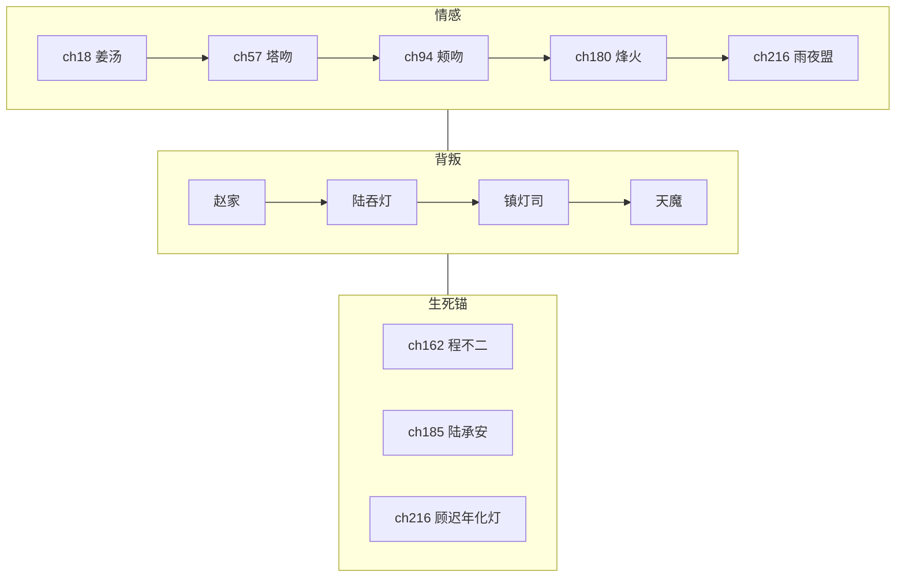

# 《万古守灯人》全书审计报告 · 第八轮（全文遍历）

> **范围**：220 章锚点正文 + 大纲体系 + 系统文档 + 专名对照  
> **日期**：2026-07-11  
> **前序**：[`23-第七轮`](./23-全书审计报告-第七轮-骨架衔接.md) · [`03-大纲总览`](./03-全书大纲总览.md) · [`25-专名对照`](./25-专名重构对照表.md)  
> **工具**：`scripts/_audit_chapters.py`（篇幅/重复/meta 统计）

---

## 一、总评

| 维度 | 结论 | 说明 |
|------|------|------|
| **全文骨架** | ✅ 通过 | 五卷 220 章完整；卷界 40/90/140/190/216 锚点未破 |
| **上下文衔接** | ✅ 通过（局部待加厚） | 年序、生死、阶位主线一致；压缩章需扩写而非改剧情 |
| **大纲合理性** | ✅ 通过 | 220 锚点 ↔ 十二部 ↔ 插章细纲对齐；情感/背叛/担当三线闭合 |
| **剧情合理性** | ✅ 通过 | 反套路主题贯彻；禁自害、化灯唯一、陆战死唯一均未破 |
| **专名/系统** | ✅ 正文零残留 | chapters 内无旧教派/旧地名；系统文档与正文锚点链一致 |
| **文字质量** | 🔄 改善中 | 本轮已修 vol03/vol05 重复段；vol01 模板 filler 仍多 |

**一句话**：骨架与大纲**可定稿**；下一阶段重点是**加厚篇幅、删模板 padding**，而非改主线。

---

## 二、本轮已修项

| 类别 | 位置 | 问题 | 处理 |
|------|------|------|------|
| **重复段** | vol03 ch108→109 | 同段「抚袖三相」重复 2 次 + 空 `---` | ✅ 删重复，保留 ch109 任务殿震入口 |
| **meta 叙述** | vol03 | 内嵌「章末，」5 处 | ✅ 全部删除 |
| **重复 padding** | vol05 ch210 | 「拒飞升化灯在后三章」等 ~80 行循环 | ✅ 合并为单章正文（~30 行） |
| **文档锚点错误** | 00/06/16/18/20/23 | 程不二「ch109 殉」 | ✅ 统一为 **ch161–162**（ch109=任务殿震） |

---

## 三、全文骨架（220 章）

### 3.1 卷界

| 卷 | 章 | 承平年 | 卷末状态 | 下卷入口 |
|----|-----|--------|----------|----------|
| vol01 | 1–40 | 37 | 三阶开过、示二阶；迟暮约剩两年 | ch41 承平38春入宗 |
| vol02 | 41–90 | 38 | 记名弟子；陆囚敛灯崖 | ch91 承平39朔越狱 |
| vol03 | 91–140 | 39 | 开灯令将议；陆名回未死 | ch141 封灯诏 |
| vol04 | 141–190 | 39→40 | 天魔至；**未化灯** | ch191 天魔压城 |
| vol05 | 191–220 | 40+ | 化灯 ch216 · 传承 ch217–220 | 全书终 |

### 3.2 不可破铁律（抽检）

| 铁律 | 锚点 | 正文 |
|------|------|------|
| 顾迟年化灯 | **ch216 唯一** | ✅ 前章均为「将化/拒升」；ch216 执行 |
| 陆承安死亡 | **ch185 唯一** | ✅ 第五卷均为「念在/非化灯」 |
| 程不二殉 | **ch161–162** 拉垫背 | ✅ ch159 灯影预叙；此后仅忆/缺位 |
| 禁自害 | 全书 | ✅ chapters 无自刎/服毒/咬毒 |
| 无筑基 | 幽灯集幻愿 joke 除外 | ✅ |
| 专名零串书 | 25 对照表 | ✅ 无合欢宗/黑风林/符录/思过崖 |

### 3.3 主线 vs 大纲（`02` + `03`）

| 弧 | 大纲节点 | 锚点 | 合理性 |
|----|----------|------|--------|
| 得经入道 | 守岁灯、测定、迟暮之约 | 1–10 | ✅ |
| 青萝守镇 | 豪强、走灯节、长明 | 11–40 | ✅ |
| 杂役崛起 | 幽灯集、焚灯塔、万灯大会 | 41–78 | ✅（塔关偏薄） |
| 天煞/记名 | 霍认输、陆囚、照心斋 | 79–90 | ✅ |
| 枯骨岭 | 时相、五灯队、万灯冢 | 91–140 | ✅ |
| 玄京封灯 | 开灯令、程不二殉、旧灯库 | 141–180 | ✅ |
| 陆赎罪战死 | 九阶、万民命暗 | 181–185 | ✅ |
| 天魔终战 | 万古对抗、拒升 | 191–215 | ✅ |
| 雨夜化灯 | 传承、百年尾声 | 216–220 | ✅ |

**情感线**：18 姜汤 → 57 塔吻 → 94 颊吻 → 180 烽火吻 → 216 雨夜盟·化灯 — **与 `03` 表一致**。

---

## 四、上下文衔接

### 4.1 卷界抽检（正文首尾）

| 卷界 | 上卷末 | 下卷初 | 结果 |
|------|--------|--------|------|
| 40→41 | 长明神迹、赴宗 | 承平38春杂役堂 | ✅ |
| 90→91 | 千灯、陆囚、裴信 | 朔夜越狱、墓灯鸦 | ✅ 年 38→39 |
| 140→141 | 三相、名回、开灯令将议 | 金殿封灯诏 | ✅ |
| 190→191 | 回青萝、天魔未灭 | 天魔压城 | ✅ |
| 185→186 | 陆战死 | 念归灯、非复活 | ✅ |
| 162→163 | 程不二殉 | 仅灯影/缺位 | ✅ |

### 4.2 人物状态链

| 人物 | 状态变化 | 衔接 |
|------|----------|------|
| 顾迟年 | 书吏→杂役→记名→九阶→化灯 | ✅ 阶位表 `06` 一致 |
| 陆承安 | 首席→囚→吞灯→名回→镇灯司→**ch185 战死** | ✅ 第五卷仅「念在」 |
| 程不二 | ch22 登场→ch161–162 殉 | ✅ ch109 仍为任务殿震（非死） |
| 沈青禾 | 药铺→拒婚→医灯→烽火→守长明 | ✅ |
| 霍照临 | 迟暮之约→塔关→天煞→剑在 | ✅ |
| 铁柱 | 引路→万家火→重伤未死→守镇 | ✅ 第三卷末与第四卷统一 |

### 4.3 阶位与时间

- **承平 37→38→39→40+**：卷界与正文一致。
- **塔关层号**（vol02）：ch65 六层 → ch66–67 七层 → ch79 天煞 — **层号已对齐**；篇幅仍偏短（见 §六）。
- **枯骨岭时相**：ch95–107 一日如一年 — 与 ch108 岭外「老成」外貌 **一致**。

---

## 五、大纲合理性

### 5.1 文档体系

| 检查项 | 结论 |
|--------|------|
| `03` 220 章全表 ↔ chapters 标题 | ✅ 章号/卷界一致 |
| 五卷 → 十二部（`10`） | ✅ 插章带 +160 章路径清晰 |
| 插章细纲 `08-第一～五卷` | ✅ 与锚点章功能不冲突（只加厚/插缝） |
| 单元案「一盏灯一案」 | 🔄 20 案骨架在 `02`；正文已写约半数，扩写补全 |
| 1250 章 / 500 万 | ✅ 阶段一 150 万（`07`）→ 阶段二插章 — 节奏合理 |

### 5.2 主题与反套路

- **无系统面板、无传统飞升爽**：飞升门开 → 拒升 → 化灯，主题闭环 ✅  
- **凡人谨慎**（藏阶、假记忆、留灯三策）：第一卷建立，后卷呼应 ✅  
- **担当 vs 背叛**：赵家 → 陆吞灯 → 镇灯司 → 天魔 — 阶梯清晰 ✅  

### 5.3 需扩写时注意（非改纲）

1. **第二卷 ch65–78 塔关**：大纲情感锚 ch86 迟暮之约 — 正文有，但单章偏短，扩写时加厚对话/试炼，勿改层号。  
2. **第四卷 ch161–165 程不二线**：大纲已定「副使逼图→拉垫背」，与禁自害铁律一致，扩写时勿改死因。  
3. **第五卷 ch211–215**：拒升/灯境之寂 — 仍有少量段内重复（见 §六），扩写时以 ch216 为唯一化灯执行章。

---

## 六、篇幅与重复（脚本统计 · 修后）

| 项目 | 数值 |
|------|------|
| 总章数 | 220 |
| 总汉字 | **~50.2 万** |
| 偏短章（<2500 字） | **120 章**（vol02:14 · vol03:27 · vol04:50 · vol05:29） |
| 500 万完成度 | ~10.0% |

### 6.1 问题计数（正文）

| 标记 | vol01 | vol02 | vol03 | vol04 | vol05 |
|------|-------|-------|-------|-------|-------|
| 「增叙第」模板 | **81** | 0 | 0 | 0 | 0 |
| 「章末，」meta | **107** | 0 | **0** ✅ | 0 | 0 |
| 旧专名 | 0 | 0 | 0 | 0 | 0 |

### 6.2 重复短语（vol05 修后）

| 短语 | 约次 | 目标 | 状态 |
|------|------|------|------|
| 「拒飞升化灯，在后三章」 | 1 | ≤3 | ✅ 已大幅削减 |
| 「非化灯，是念在」 | 9 | 保留关键处 | 🔄 多为陆念线，可接受 |
| 「急什么，灯还亮着呢」 | ~30（vol05） | 每章≤1 | ⚠️ 全书仍偏多 |
| ch210 段内重复 | 0 | 0 | ✅ 本轮已清 |

### 6.3 加厚优先区

1. **P0** vol02 **ch65–78** 塔关（现 ~1200–2100 字/章）  
2. **P1** vol04 玄京线（50 章偏短）  
3. **P1** vol05 ch211–215 拒升段 — 删剩余循环句后再加厚  
4. **P2** vol01 删 81 处「增叙第 N 段」+ 107 处「章末，」  

---

## 七、系统一致性

| 系统 | 文档 | 正文锚点 | 状态 |
|------|------|----------|------|
| 灯道十二阶 | `06` 阶位表 | 1→216 递进 | ✅ |
| 守岁灯三相 | `02`/`14` | 万灯冢/青萝/枯骨岭 | ✅ ch216 前齐 |
| 守灯十诫 | `02` | 诫五幽灯、诫九万家火 | ✅ |
| 同心灯契 | `14` | 仅沈青禾；ch216 盟 | ✅ |
| 灯器九品 | `21` | 与阶位锁死 | ✅ |
| **灯符册** | `21` | ch22/47/57/91/153/204 | 🔄 密度低，插章可增 |
| **馈灯八步** | `17` | ch3/ch8/ch66/ch121 等 | 🔄 留灯账 ~1.6%，待加厚 |
| 灵宠/坐骑 | `25` | 河灯鲤/点点/老灰/云岚灯鹤/墓灯鸦 | ✅ 锚点已植 |
| 洞府/地图 | `25` | 照心斋/守夜林/敛灯崖/旧灯库 | ✅ |
| 七教 | `19` | 种子章已有 | 🔄 +85 插章待写 |

### 灯符册锚点链（与第七轮一致）

```
ch22 规矩 → ch47 野符 → ch57 拒婚符尽 → ch91 避时符脚「陆」
→ ch153 照影符 → ch204 万家火契 → ch216 化灯
```

**建议**：扩写时在 ch117（承苦符）、ch163（镇灯符）各植 1 处，不新增品阶规则。

---

## 八、错字与语病

| 类型 | 状态 |
|------|------|
| 英文残留 | ✅ 0 |
| 旧专名（合欢宗等） | ✅ 0 |
| 禁自害描写 | ✅ 0 |
| vol03 ch108 重复段 | ✅ 已修 |
| vol05 ch210 循环 padding | ✅ 已修 |
| 「未灭。。」双句号 | ✅ 前序已修 |
| ch185 病句「沉睡七日，至，像…」 | ✅ 前序已修 |
| vol01 内嵌「章末，」 | ⚠️ ~107 处待清 |
| vol01「增叙第 N 段」 | ⚠️ 81 处模板待删 |

**常见笔误模式**（扩写时人工扫）：  
- 「像说：」vs 「像说，」— 偶发，非系统性  
- 「小满」/「姜小满」混用 — 语境内可接受  

---

## 九、剧情合理性专项

| 情节 | 合理性 | 备注 |
|------|--------|------|
| 六十岁得经 | ✅ | 迟暮主题成立 |
| 藏阶/假记忆 | ✅ | 凡人谨慎，后卷不矛盾 |
| 陆吞命灯 | ✅ | 秩序信仰错位，非纯恶 |
| 程不二拉垫背 | ✅ | 符合禁自害；有预叙 |
| 陆 ch185 战死 | ✅ | 赎罪闭环；第五卷不复活 |
| 拒飞升化灯 | ✅ | 与裴万年守、主题一致 |
| 姜小满传承 | ✅ | ch216 芯灯合鸣，非夺舍 |
| 天魔「再至」 | ✅ | 第四卷末伏笔，第五卷兑现 |

---

## 十、下一轮优先级

| 级 | 任务 |
|----|------|
| **P0** | vol02 ch65–78 塔关加厚至 2500+ 字/章 |
| **P1** | vol05 ch211–215 删剩余重复句 + 加厚拒升心理戏 |
| **P1** | vol04 玄京线 50 偏短章按 `08-第四卷` 细纲加厚 |
| **P2** | vol01 清「增叙第」「章末，」模板 |
| **P2** | 全局「急什么…」瘦身至每章 ≤1 |
| **P2** | 灯符册 ch117/ch163 各植 1 锚点 |

---

## 十一、骨架示意图



---

**第八轮结论**：全文**骨架完整、大纲合理、系统上下文一致、铁律未破**；正文已达 ~50 万锚点体量，主要短板为**压缩重复（已部分清理）**与 **120 章偏短**。建议按 `07` 阶段一先加厚 vol02 塔关，再推进插章扩至 150 万。
