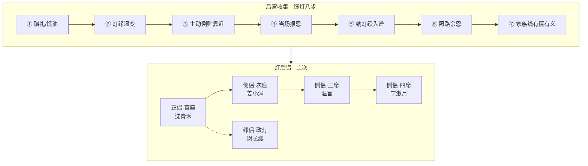

# 《万古守灯人》道侣后宫 · 灯后谱 · 众星拱月体系

> **定位**：「美女倒贴」本作解法——**多位自愿道侣、主次有序、后宫收集、家族有情有义**  
> **原则**：无数值面板、无刷礼物换好感；写被照见真相后的**主动靠近、敬服、迟暮之恋与并肩之盟**  
> **铁律**：霍照临为迟暮命约，**非道侣**；师徒传承（云照）**非道侣**；禁自害、死亡锚点不变  
> **主文档**：[`14-五大系统与500万剧情设计`](./14-五大系统与500万剧情设计.md) · [`17-馈灯八步与扩展系统`](./17-馈灯八步与扩展系统.md)

---

## 一、设计总纲

| 维度 | 写法 | 不写法 |
|------|------|--------|
| **收集** | 一位一位纳，每位有独立五拍+家族线 | 一章收齐、无铺垫 |
| **主次** | 首座定心，侧侣各守一线，政灯记名不抢席 | 争宠宫斗、雌竞 |
| **倒贴** | 拒内门、雨中送药、烽火赴京、冬典送方 | 砸资源、系统好感 |
| **家族** | 沈氏药铺、姜氏冤、温氏捕门、宁氏丹堂、谢氏朝堂 | 道侣无根无亲 |
| **情义** | 恩义入账、契断失忆、化灯前众侣盟 | 用完即弃 |

---

## 二、灯后谱位阶

> 守岁灯内隐刻**灯后谱**（民间亦称「众星拱月谱」）；每位道侣各有一盏**铜盟灯**，名分入谱，不传油亦记意。

| 位阶 | 席位 | 人物 | 锚点章 | 谱职 |
|------|------|------|--------|------|
| **正侣·首座** | 一 | 沈青禾 | 57 正契 / 94 盟心 / 180 烽火 / 216 尽吻 | 盟灯主芯，药铺长明，传油优先 |
| **侧侣·次座** | 一 | 姜小满 | 90 备位 / 180 侧契 / 216 接灯传承 | 芯灯同频，守岁虚影，第九代传承 |
| **侧侣·三席** | 一 | 温言 | 6/18/26 初缘 / 153 侧契 | 照刑司证契，律法护盟 |
| **侧侣·四席** | 一 | 宁漱月 | 88 敬服 / 113 侧契 | 丹堂续油，战中药位前移 |
| **缘侣·政灯** | 一 | 谢长缨 | 145 汤恩 / 183 缘契 | 玄京不常住，制度记名，政灯护谱 |

**上限**：正侣 1 + 侧侣 ≤4 + 缘侣 ≤2（全书已铺 5 位，可扩 1 缘侣位备卷末）

---

## 三、多盏盟规则

| 项 | 内容 |
|----|------|
| **名称** | 同心灯契（多盏盟）· 灯后谱 |
| **条件** | 双方自愿，各以一滴心头灯油入**各自铜盟灯**，再录名入谱 |
| **能力** | 谱内任侣灯危，守岁灯主感温；可短距传油（**总池 ≤九滴/月**，首座优先 ≤三滴） |
| **限制** | 诫一：传油必为对方活路，非为自己升阶；侧侣传油不得越过首座急危 |
| **代价** | 契断则双方各失一段共渡记忆；谱位空出，须再经馈灯八步方可再纳 |
| **与情感** | 吻/抱/抵额触发「盟灯温变」；首座尽吻在 ch216，侧侣以额触/执手/共照写情义 |
| **与五灯队** | 五灯队 = 战阵名册（锋/盾/芯/医）；灯后谱 = 道侣名分，**两册并存** |

### 与双焰宗互证

双焰宗「合心双焰、两心同照」——本作以**灯后谱众星拱月**友宗互证，**不写采补邪修**；多侣非纵欲，是「人间多盏并亮，各照一路苦」。

---

## 四、后宫收集 · 各侣五拍与家族线

### 4.1 沈青禾 · 正侣·首座 · 沈氏

| 步 | 锚点 | 情节 | 家族线 |
|----|------|------|--------|
| ① 赠礼 | 18 | 姜汤三尺 | 母已故，沈爹交账；药铺长明 |
| ③ 倒贴 | 57 | 拒内门后塔前吻 | 赵家豪强逼婚，霍旁支借刀 |
| ⑤ 纳绶 | 94 | 铜盟灯双油 | 沈氏拒进京强邀，守青萝 |
| ④ 报恩 | 180 | 烽火深吻供油 | 沈氏药铺率灯会赈灾 |
| 终盟 | 216 | 雨夜尽吻 | 以形替顾迟年撑人间 |

**家族扩写**：详见 [`29-道侣家族线·五席全书细纲`](./29-道侣家族线·五席全书细纲.md)。沈母沈秋娘指路灯 → 沈父沈怀慎交账 → 赵姜豪强联盟 → 青禾率镇口长明 → 化灯后药铺永续。

### 4.2 姜小满 · 侧侣·次座 · 姜氏

| 步 | 锚点 | 情节 | 家族线 |
|----|------|------|--------|
| ① 赠礼 | 38 | 半块饼 | 姜大山、周氏，豪强逼地逼命 |
| ⑤ 备位 | 90 | 照心斋备位；姜氏卷宗封存 | 三页并案待昭 |
| ③ 倒贴 | 113 | 五灯芯灯，主动省油护队 | 为姜氏昭雪留证 |
| 昭雪 | 177 | 万灯大会照姜氏冤 | **姜氏名复，卷入照刑司** |
| ⑤ 侧契 | 180 | 烽火侧契，不抢首座之吻 | 冤已昭，自纳次席 |
| 传承 | 216 | 接守岁灯虚影 | 姜氏名入守灯堂碑 |

**年龄线**：ch38 稚 · ch90 及笄备位 · ch180 侧契 · ch216 接灯；不写悖伦，写「顾爷爷→师兄→并肩守灯」弧光。

### 4.3 温言 · 侧侣·三席 · 温氏

| 步 | 锚点 | 情节 | 家族线 |
|----|------|------|--------|
| ① 初缘 | 6/18 | 探案同盟，青禾嘱「找温言」 | 温铁面老捕头，捕门不跪仙 |
| ③ 倒贴 | 153 | 拒符后主动纳侧契 | 温行简夺产案翻，温铁面证契 |
| ④ 报恩 | 153 | 照刑司翻案 | 温氏弟产还、名复 |
| 家族 | 26/153 | 温铁面病榻嘱「合则破」 | 捕门有情有义 |

### 4.4 宁漱月 · 侧侣·四席 · 宁氏

| 步 | 锚点 | 情节 | 家族线 |
|----|------|------|--------|
| ① 敬服 | 88 | 冬典问责试胜，战中药位前移 | 宁守方（宁药翁）、兄宁照川 |
| ③ 倒贴 | 88/89 | 夜送修正方；宁药翁临终嘱 | 父嘱：救一人记一人 |
| ⑤ 侧契 | 113 | 五灯成军后纳四席 | 不夺沈医灯，只续丹油 |
| ④ 报恩 | 天煞线 | 药位前移少死三人 | 兄名在碑，父训有验 |

### 4.5 谢长缨 · 缘侣·政灯 · 谢氏

| 步 | 锚点 | 情节 | 家族线 |
|----|------|------|--------|
| ① 汤恩 | 145 | 微服青萝欠一碗热汤 | 谢氏旁支；叔谢执中查换卷被灭口 |
| ③ 倒贴 | 183 | 「开灯令在，我在。你灭，我继。」 | 程不二旧部，谢氏还汤 |
| ⑤ 缘契 | 183 | 政灯入谱，不驻云岚 | 玄京政灯护谱，幼帝线 |
| ④ 报恩 | 152/183 | 开灯令、护幼帝 | 谢氏满门担制度之灯 |

**缘侣与侧侣区别**：不住照心斋，不共寝；以制代油，以政护谱，ch216 以额触灯柱证盟。

---

## 五、锚点章路线图（500 万扩写）

| 卷 | 章 | 事件 |
|----|-----|------|
| 部一 | 18 | 灯后谱伏笔；沈氏定心 |
| 部二 | 57 | 正侣·首座初温 |
| 部二 | 88 | 宁漱月敬服·倒贴 |
| 部二 | 90 | 照心斋立灯后谱；小满备位 |
| 部三 | 94 | 正侣盟心双油 |
| 部三 | 113 | 宁漱月侧契·四席 |
| 部四 | 145 | 谢长缨汤恩·谢执中线 |
| 部四 | 153 | 温言侧契·三席；温行简案 |
| 部四 | 177 | **姜氏冤万灯昭雪** |
| 部四 | 180 | 姜小满侧契·次座；沈烽火 |
| 部四 | 183 | 谢长缨缘契·政灯 |
| 部十一 | 216 | 众星拱月·雨夜化灯前盟 |

---

## 六、写作禁忌（与旧版对照）

| 旧版（已废止） | 新版 |
|----------------|------|
| 非后宫、道侣仅青禾 | **灯后谱多侣，主次有序** |
| 宗门女修仅敬服不纳 | **敬服后可经八步入谱** |
| 唯一同心灯契 | **多盏盟，首座主芯** |
| 收后宫（禁） | **纳灯绶入谱（允）** |

---

## 七、参照映射

| 参照 | 公共套路 | 本作灯后谱 |
|------|----------|------------|
| 斗破 | 红颜知己多条线 | 每位有家族与报恩，非花瓶 |
| 凡人 | 道侣谨慎共修 | 传油有月限、谱位有先后 |
| 斗罗 | 战队羁绊 | 五灯队战阵 ≠ 灯后谱名分 |

---

**更新**：2026-07-11 · 五席家族线全书细纲见 [`29`](./29-道侣家族线·五席全书细纲.md)
