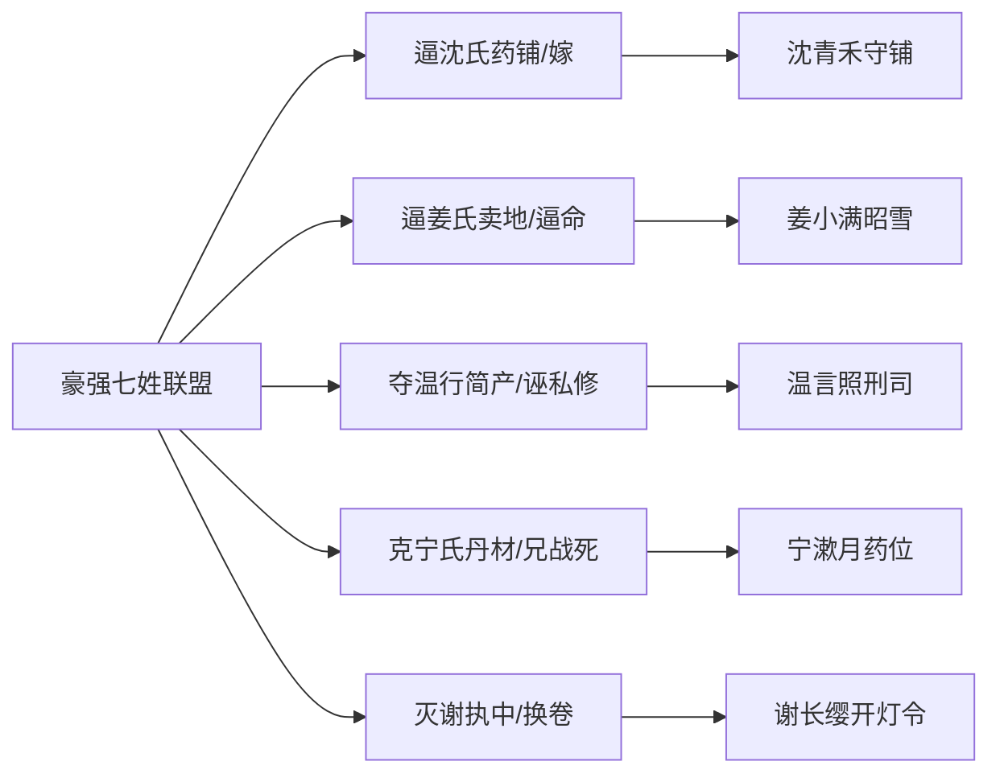

# 《万古守灯人》道侣家族线 · 五席全书细纲

> **定位**：灯后谱五位道侣各有根、有亲、有恩义账；家族线不抢主线，但**有情有义、有因有果**  
> **主文档**：[`28-道侣后宫·灯后谱体系`](./28-道侣后宫·灯后谱体系.md) · [`02-原创小说剧情`](./02-原创小说剧情.md)

---

## 一、五席家族总表

| 位阶 | 道侣 | 家族 | 关键亲人 | 冤/恩核 | 正文锚点章 |
|------|------|------|----------|---------|------------|
| 正侣·首座 | 沈青禾 | **沈氏药铺** | 母沈秋娘（已故）、父沈怀慎（已故） | 母旧恩；赵姜豪强逼婚夺基 | 18/30/57/94/178/180/216 |
| 侧侣·次座 | 姜小满 | **姜氏农户** | 父姜大山、母周氏（豪强逼死） | 与赵案同源；万灯大会昭雪 | 38/90/177/180/216 |
| 侧侣·三席 | 温言 | **温氏捕门** | 父温铁面（老捕头）、弟温行简 | 弟被豪强夺产；程不二旧线 | 6/26/153/216 |
| 侧侣·四席 | 宁漱月 | **宁氏丹堂** | 父宁守方（宁药翁）、兄宁照川（天煞战死） | 兄名在碑；药位前移 | 88/89/113/216 |
| 缘侣·政灯 | 谢长缨 | **谢氏旁支** | 叔谢执中（已故）、程不二（旧部） | 微服青萝汤恩；制度护谱 | 145/151/183/216 |

---

## 二、沈青禾 · 沈氏药铺

### 2.1 家族谱

- **沈秋娘**（母，已故）：早年寡居带女，雨夜书吏顾迟年（十七）迷途，沈氏留热粥、指去县学路——顾迟年一生记为「第一盏路人灯」。
- **沈怀慎**（父，已故）：老实药农，后开铺；临终嘱青禾：「账能骗人，人心不能；铺子长明，比嫁内门暖。」
- **沈青禾**：承母之温、父之账，拒陆承安强邀，守青萝不赴京常住。

### 2.2 家族线五拍

| 章 | 情节 | 情义 |
|----|------|------|
| 18 | 姜汤三尺；顾迟年忆沈秋娘指路灯 | 母恩还于女 |
| 30 | 沈怀慎交账幻影：「账能骗人，人心不能」 | 父训入守灯经 |
| 57 | 拒婚符护沈氏自主 | 豪强借刀，沈氏不屈 |
| 94 | 盟灯双油，拒进京强邀 | 守镇即守族 |
| 178 | 率青萝灯会赈灾，沈氏药铺捐油 | 族产化民油 |
| 180 | 烽火供油，发如雪 | 尽族之油，不独私 |
| 216 | 雨夜尽吻，以形撑人间 | 沈氏永续长明 |

### 2.3 500 万扩写插章（✅ 正文已写）

| 插章 | 标题 | 正文位置 |
|------|------|----------|
| 家族插·壹 | 铜簪照账 | vol01 ch18–19 间 · [`插章-道侣家族线`](./chapters/插章-道侣家族线.md) |
| 家族插·贰 | 西郊纸钱 | vol01 ch38 后 |
| 家族插·叁 | 行简告街 | vol01 ch26 后 |
| 家族插·肆 | 悼碑祭兄 | vol02 ch89 后 |
| 家族插·伍 | 药位前移 | vol03 ch100 前 |
| 家族插·陆 | 微服汤夜 | vol04 ch145 前 |
| 家族插·柒 | 执中旧档 | vol04 ch151 后 |
| 家族插·捌 | 铁面匾下 | vol04 ch153 后 |
| 家族插·玖 | 旁支卖铺 | vol04 ch179 前 |
| 家族插·拾 | 卷宗复核 | vol04 ch176 前 |

> 汇总正文：[`chapters/插章-道侣家族线.md`](./chapters/插章-道侣家族线.md) · 注入脚本：`scripts/_inject_family_chapters.py`

---

## 三、姜小满 · 姜氏冤案

### 3.1 家族谱

- **姜大山**（父）：农户，有薄田二亩，被赵家旁支以「神谕」逼签卖地契。
- **周氏**（母）：护地时被推，染寒疾；赵家散谣「药奴」，周氏含冤病亡。
- **姜小满**（遗孤）：被杂役堂收留；顾迟年匿名送银，小满不知。

### 3.2 家族线五拍

| 章 | 情节 | 情义 |
|----|------|------|
| 38 | 半块饼；姜氏冤与沈案同源 | 恩在幼，记一生 |
| 90 | 灯后谱备位；顾迟年存姜氏卷宗 | 冤未昭，席先留 |
| 177 | 万灯大会照姜氏冤，豪强购地契与逼命 | **姜氏昭雪** |
| 180 | 侧契次座：「冤已昭，我不抢席」 | 主次有序 |
| 216 | 接守岁灯虚影 | 姜氏名入守灯堂碑 |

### 3.3 冤案铁证链

赵家旁支管事口供 → 购地链豪强七姓 → 走灯节废仓神谕 → 万灯大会灯影公审 → 照刑司备案

---

## 四、温言 · 温氏捕门

### 4.1 家族谱

- **温铁面**（父）：青萝老捕头，「捕门不跪仙，只跪法」；走灯节后退职，护照刑司牌匾。
- **温行简**（弟）：小商贩，被豪强以假借据夺产，连累「私修」之名。
- **温言**：女捕快，三十四岁，与顾迟年探案同盟；程不二旧线引她知「三块灵石别用灯油」。

### 4.2 家族线五拍

| 章 | 情节 | 情义 |
|----|------|------|
| 6 | 伪造借据案，温言主审 | 法柄初缘 |
| 26 | 温铁面病榻嘱女：「合则破，别独冲」 | 父训入捕门 |
| 153 | 温行简夺产案翻案；纳侧契三席 | 弟冤即族冤 |
| 153+ | 温铁面退职，牌匾前嘱「柄在你手」 | 捕门有情 |
| 216 | 以律证谱，雨落律文不湿 | 温氏护盟 |

---

## 五、宁漱月 · 宁氏丹堂

### 5.1 家族谱

- **宁守方**（宁药翁，父）：丹堂旁支，擅战伤方；天煞战后伤重，临终嘱女：「救一人，记一人；药位前移，少死一个是一个。」
- **宁照川**（兄）：内门弟子，天煞门战死于北线；名入宗门悼碑，漱月守兄名。
- **宁漱月**：冬典问责试胜，主动送战方，不夺沈医灯。

### 5.2 家族线五拍

| 章 | 情节 | 情义 |
|----|------|------|
| 88 | 问责试「战中药位前移」；夜送修正方 | 兄死她继 |
| 89 | 宁药翁临终传方，漱月跪接 | 父训入丹堂 |
| 113 | 纳侧契四席：「不夺沈医灯，只续丹油」 | 主次有序 |
| 天煞线 | 药位前移，实战少死三人 | 兄名有验 |
| 216 | 执铜盟灯，「少死一人记一人」 | 宁氏永续 |

---

## 六、谢长缨 · 谢氏朝堂

### 6.1 家族谱

- **谢执中**（叔，已故）：玄京小吏，因查贡院换卷被灭口；长缨无灵根，以制度承叔志。
- **程不二**：谢长缨旧部，不二斋掌柜；血书「三块灵石别用灯油」。
- **谢长缨**：女相，微服青萝欠汤；缘侣政灯，不驻云岚，以制护谱。

### 6.2 家族线五拍

| 章 | 情节 | 情义 |
|----|------|------|
| 145 | 微服青萝，顾迟年留热汤；汤恩入册 | 恩不白受 |
| 151 | 奏开灯令；「今日还你，不是茶，是路」 | 谢氏还汤 |
| 183 | 缘契政灯；「你灭，我继」 | 制代油 |
| 152/183 | 护幼帝、开灯令永制 | 谢氏担国灯 |
| 216 | 以制护谱，不抢首座之吻 | 政灯证盟 |

### 6.3 微服青萝夜（回忆锚点 · ch145）

承平三十五年冬，谢长缨被政敌追杀，微服至青萝，身无分文，入药铺讨水。沈秋娘已逝，沈青禾不在，只有还年轻的顾迟年（书吏）在铺前守夜，留她热汤，说：「灯不是为自己亮的。」谢长缨记三年，后以旧玉还恩。

---

## 七、家族线 × 豪强联盟对照

---

## 八、正文锚点完成清单

| 家族 | 锚点章 + 插章 | 内容 |
|------|----------------|------|
| 沈氏 | 18/30 + 插·壹/玖 | 沈秋娘铜簪、沈怀慎交账、旁支卖铺 |
| 姜氏 | 38/90/177 + 插·贰/拾 | 西郊祭、卷宗复核、万灯昭雪 |
| 温氏 | 26/153 + 插·叁/捌 | 行简告街、铁面匾下、夺产翻案 |
| 宁氏 | 88/89/113 + 插·肆/伍 | 悼碑祭兄、北线药位前移 |
| 谢氏 | 145/151/183 + 插·陆/柒 | 微服汤夜、执中旧档、缘契政灯 |

**十篇家族插章已全部写入正文**（见 [`插章-道侣家族线`](./chapters/插章-道侣家族线.md)）。

---

## 九、各席插章细目（姜/温/宁/谢）

| 席 | 插章 | 情节要点 |
|----|------|----------|
| 姜氏 | 贰 西郊纸钱 | 祭姜大山周氏，冤卷续页 |
| 姜氏 | 拾 卷宗复核 | 万灯前四链合拢 |
| 温氏 | 叁 行简告街 | 当街照影，夺产链再证 |
| 温氏 | 捌 铁面匾下 | 温铁面匾下嘱三代 |
| 宁氏 | 肆 悼碑祭兄 | 宁照川悼碑，药方压碑 |
| 宁氏 | 伍 药位前移 | 天煞北线实战少死二人 |
| 谢氏 | 陆 微服汤夜 | 承平三十五年全幅回忆 |
| 谢氏 | 柒 执中旧档 | 谢执中血书，二十年档出 |

---

**更新**：2026-07-11 · 五席家族线 + **10 篇插章正文**完成
