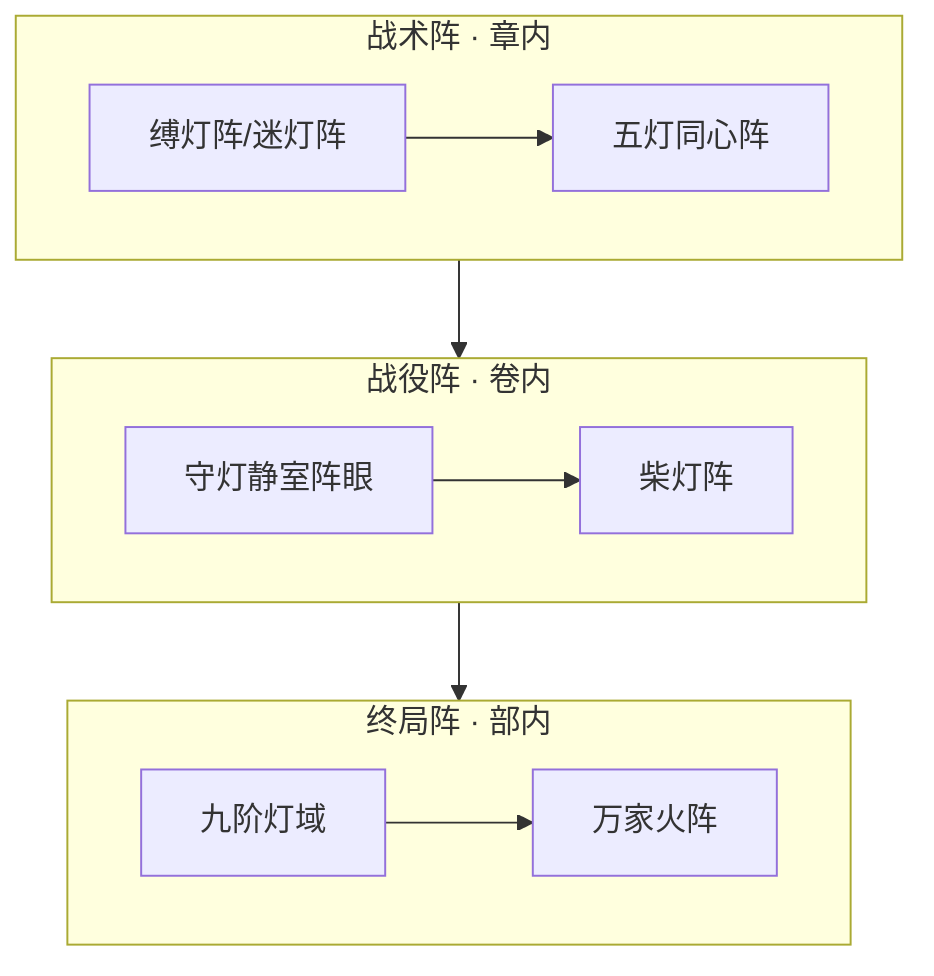

# 《万古守灯人》灯阵体系 · 合阵与域阵设计

> **定位**：本作「阵法」= **以灯为眼、以油为脉、以人心为阵**；不另起杀伐阵盘 UI  
> **原则**：无数值面板；阵成当场写分工；**五灯队（战阵）≠ 灯后谱（名分）**  
> **关联**：[`14-五大系统`](./14-五大系统与500万剧情设计.md) · [`17-馈灯八步`](./17-馈灯八步与扩展系统.md) · [`21-灯符册`](./21-灯符册系统与品阶设计.md) · [`32-丹道`](./32-丹道体系与炼灯术设计.md)

---

## 一、灯阵是什么（与传统「阵法」的映射）

| 传统修仙 | 本作灯阵 | 核心差异 |
|----------|----------|----------|
| 灵石布阵 | **灯油布线** | 油尽阵散；不囤无限灵石 |
| 杀伐大阵 | **照路/承苦/稳命** | 主功能是照见、稳灯、承伤，非清场 |
| 护山大阵 | **长明/柴灯/万家火** | 凡火可入阵；百姓愿念为阵脉 |
| 域/界 | **九阶灯域** | 照一城气运，非个人领域 |
| 阵盘 | **五灯阵盘**（灯籍） | 登记在灯符册，见 [`21`](./21-灯符册系统与品阶设计.md) |

**写作铁律**：
1. 一章一阵一事——不叠三个阵名半页解释  
2. 阵成必写**谁站哪、油从哪来、破了谁补**  
3. 反派阵（封灯阵、熄灯阵、噬灯阵）归 [`19-七教`](./19-七教合流与正邪宗门设计.md)，正派不写持禁制阵

---

## 二、灯阵品阶总表

| 品阶 | 通称 | 典型阵名 | 阵眼需求 | 油耗 | 首现锚点 |
|------|------|----------|----------|------|----------|
| **野阵** | 无录阵 | 杂役自摆引路灯 | 一盏铜灯 | 半滴～一滴 | vol1 ch11 |
| **九品** | 凡阵 | 暖身灯圈、照影小阵 | 九品铜灯×3 | 1 滴 | vol2 ch52 |
| **八品** | 护命阵 | 定神灯环 | 八品灵灯×5 | 2 滴 | vol2 ch65 塔关 |
| **七品** | 行路阵 | 避时灯廊、疏脉灯络 | 七品魂灯×1 + 符 | 3 滴 | vol3 ch91 枯骨岭 |
| **六品** | 影阵 | 照路迷踪、五灯阵眼 | 六品影灯 + 静室 | 5 滴/炷 | vol3 **ch121** 守灯静室 |
| **五品** | 契阵 | **五灯同心阵** | 五盏专精灯 + 阵盘 | 各 1 滴 | vol3 **ch113–114** |
| **四品** | 承苦阵 | 骨灯替伤阵 | 四品骨灯×2 | 承苦者油 | vol3 ch117 |
| **三品** | 古阵 | 万灯冢引魂阵 | 千年灯芯 | 10 滴 | vol3 ch100 |
| **二品** | 命阵 | 触命照因果阵 | 命灯器 | 记忆一段 | vol4 旧灯库 |
| **一品** | 守岁阵 | 三相并燃阵 | 守岁灯三相 | 根念 | vol4 ch190 |
| **九阶** | 域阵 | **九阶灯域** | 守岁灯满油 + 万民愿 | 毕生油 | vol4 **ch186** |
| **超品** | 人间阵 | **万家火阵 / 柴灯阵** | 无阶凡火 + 心灯 | 愿念 | vol5 **ch204** |

---

## 三、青萝五灯队 · 合阵分工

> **五灯队** = 战阵名册；**灯后谱** = 道侣名分。二者可重叠（沈/姜/温/宁），但称谓不可混。

### 3.1 五灯同心阵（核心五人）

| 位 | 成员 | 专精 | 阵中职责 | 阶位锚点 |
|----|------|------|----------|----------|
| **阵主** | 顾迟年 | 灯影/灯魂 | 照路、揭真相、控阵脉 | 四阶→九阶 |
| **医灯** | 沈青禾 | 灯盏 | 疗伤、洒药稳神、护边 | 三阶→五阶 |
| **芯灯** | 姜小满 | 灯芯 | **阵眼稳油**、补给全队 | 二阶→四阶 |
| **锋灯** | 霍照临 | 灯骨 | 攻坚、破缚、承前 | 四阶→六阶 |
| **盾灯** | 铁柱 | 无阶（愿火） | 前排、借万家愿挡阵 | 无阶→愿火 |

**首次合阵**：vol3 ch114「五灯同心」——枯骨岭救被当作命灯容器的杂役；姜小满稳阵眼，霍照临破缚灯阵，沈青禾掩光护伤。

### 3.2 扩展位（非初始五人，可并入大阵）

| 成员 | 专精 | 并入时机 | 阵中职责 |
|------|------|----------|----------|
| **温言** | 照影/刑照 | ch113 后 | 烛火照隐匿、照假印、稳阵脚 |
| **宁漱月** | 丹堂药位 | ch88/113 后 | 战阵送丹、药位前移、减伤亡 |

### 3.3 五灯阵盘（灯籍道具）

| 项 | 内容 |
|----|------|
| **名称** | 五灯阵盘（云岚执灯堂备案） |
| **品阶** | 五品契阵器 |
| **功能** | 预刻五盏位纹；结阵时各滴油入盘，阵脉可验 |
| **登记** | 执灯堂乙字×号；开灯令后转照刑司 |
| **限制** | 缺一人可短阵，缺阵主不可开域 |
| **首现** | vol3 ch113 名册纳绶 |

---

## 四、灯阵五大类

| 类 | 用途 | 代表阵 | 写作要点 |
|----|------|--------|----------|
| **照路** | 迷障、秘境、辨方位 | 避时灯廊、枯骨岭引路阵 | 与 [`32`](./32-丹道体系与炼灯术设计.md) 明魂丹联动 |
| **护命** | 稳神、抗噬灯、定心 | 定神灯环、守灯静室阵 | 六品洞府 ch121 |
| **契盟** | 五人合击、分工破障 | **五灯同心阵** | 写清站位与油线 |
| **承苦** | 替伤、架油、挡阵 | 骨灯替伤阵 | 霍照临 ch117/184 |
| **域照** | 照气运、照命灯、照暗源 | **九阶灯域**、万家火阵 | 须万民愿；非个人炫技 |

---

## 五、锚点章 × 灯阵植入表

| 章 | 阵名 | 品阶 | 事件 | 正文 |
|----|------|------|------|------|
| 52 | 引路小阵 | 九品 | 救十二杂役投路 | ✅ |
| 65–78 | 塔层灯障 | 八品 | 焚灯塔七层 | ✅（待加厚） |
| 84 | 天煞围阵 | 八品 | 铁柱明魂丹挡阵 | ✅ |
| 91 | 枯骨迷阵 | 七品 | 墓灯鸦引路 | ✅ |
| **113** | 五灯同心阵 | 五品 | 名册纳绶 · 宁漱月侧契 | ✅ |
| **114** | 首次合阵 | 五品 | 救命灯容器 | ✅ |
| 117 | 承苦阵 | 四品 | 骨灯替伤 | ✅ |
| **121** | 守灯静室阵眼 | 六品 | 纳府 · 五灯阵眼 | ✅ |
| **116** | 刑堂五灯阵 | 五品 | 陆承安破锁·吞灯反噬 | ✅ |
| **185/186** | **九阶灯域** | 九阶 | 玄京终战照气运 | ✅ |
| **180** | 烽火阵边 | 五品+ | 深吻在阵后 | ✅ |
| **204** | **柴灯阵/万家火** | 超品 | 铁柱无阶借愿 | ✅ |
| 216 | 雨夜证盟阵 | 一品+ | 五席证盟后化灯 | ✅ |

---

## 六、与灯道阶位、灯符册的关系

| 关系 | 说明 |
|------|------|
| **灯阶锁阵** | 四阶灯影方可主持五品阵；七阶灯魂方可触九阶域门槛 |
| **符阵一体** | 契盟符（拒婚符）可单用；**阵盘**为多符并联，见 [`21`](./21-灯符册系统与品阶设计.md) §三「契盟」 |
| **丹阵联动** | 明魂丹抗迷障、疏脉丹稳脉——入阵前备丹，见 [`32`](./32-丹道体系与炼灯术设计.md) |
| **照路余恩** | 七阶破境 ch100 五灯队全员命灯亮一线 → 同心阵成（见 `14` §四） |

---

## 七、500 万扩写 · 阵法线规划

| 部 | 锚点章 | 插章方向 | 章量级 |
|----|--------|----------|--------|
| 部二 | 65–78 | 焚灯塔每层一障一阵 | +21（`08-第二卷`） |
| 部三 | 113–140 | 五灯各专精一层阵 | +20（`08-第三卷` §七） |
| 部四 | 141–190 | 玄京巷战阵、井底冤灯阵 | +25 |
| 部五 | 191–216 | 柴灯阵加厚、域阵终战 | +15（`08-第五卷` §四 C 段） |

**参照映射**：斗罗战队合击 → 五灯同心；斗破大会阵 → 万灯大会预演（vol2 ch70–75）。

---

## 八、写作检查清单

- [ ] 结阵是否写清五人（或扩展位）分工？  
- [ ] 油从哪来、耗尽谁补、阵破谁承？  
- [ ] 是否误把「五灯队」写成「灯后谱五席」？  
- [ ] 九阶灯域是否仅在 ch186 前后开（非 ch216 化灯）？  
- [ ] 反派是否只用封灯/熄灯/噬灯阵（七教两暗）？

---

*灯阵体系 v1.0 · 2026-07-11 · 与 220 章锚点及五灯同心 ch113–114 同步*
