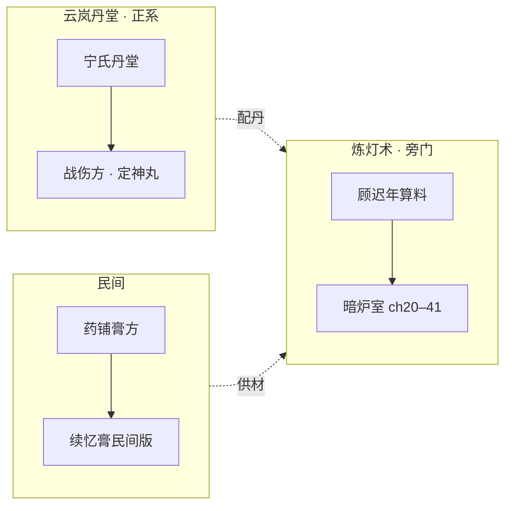

# 《万古守灯人》丹道体系 · 炼灯术与灯丹设计

> **定位**：本作「丹道」= **云岚丹堂正系** + 顾迟年**炼灯术旁门**；统称灯资之 **灯丹**  
> **原则**：以技补根骨（凡人流）；**炼一炉燃一份记忆**；不写杀伐毒丹、不写采补  
> **关联**：[`14-五大系统`](./14-五大系统与500万剧情设计.md) · [`17-馈灯八步`](./17-馈灯八步与扩展系统.md) · [`31-灯阵`](./31-灯阵体系与合阵设计.md) · [`25-专名`](./25-专名重构对照表.md)

---

## 一、丹道三分（正、旁、俗）

| 流派 | 谁 | 场所 | 特点 | 代价 |
|------|-----|------|------|------|
| **丹堂正系** | 宁守方/宁漱月 | 云岚丹堂 | 入册、可验、稳 | 灵材贵、阶位限 |
| **炼灯术** | 顾迟年 | 暗炉室（八品洞府） | 丹渣算料、烛火温炼 | **燃记忆** |
| **药铺俗丹** | 沈青禾 | 青萝药铺 | 凡伤凡药、不入市 | 无修阶 |

**专名铁律**：本作只用 **灯丹** 称谓（微光丹、明魂丹、疏脉丹…），**不用**培元丹、续命丹、筑基丹等还礼仙翁传专名（见 [`25`](./25-专名重构对照表.md)）。

---

## 二、炼灯术 · 三法要诀

顾迟年书吏出身，以**算账**代**控火**：

| 法 | 动作 | 含义 | 正文写法 |
|----|------|------|----------|
| **照** | 二阶烛火照渣 | 照见残余灵材，像账册漏记 | 「渣里青芒，漏处显」 |
| **温** | 豆火温烤 | 不用猛火，省灯油 | ch42 凝露丸 |
| **凝** | 心念定形 | 错半分成毒灰 | 成丹一息 |

**入门锚点**：vol1 ch21 炼灯初成（微光丹）→ vol2 ch42 凝露丸 → vol2 ch47 疏脉丹方（幽灯集购，燃「少年最暖一个清晨」）。

**进阶条件**：《守灯经》续灯诀齐（vol2 ch43–44）；无续灯诀，七品以上成率近零。

---

## 三、灯丹品阶总表

| 品阶 | 名称 | 功效 | 炼制代价/限制 | 首现章 |
|------|------|------|---------------|--------|
| **不入品** | 凝露丸 | 杂役疗伤 | 渣温两时辰，油耗半滴 | vol2 ch42 |
| **九品** | **微光丹** | 稳一阶微光半日 | 燃一份暖忆 | ch20–21 |
| **八品** | **明魂丹** | 抗迷障、定神 | 炼一炉失一段忆 | ch41–61 |
| **七品** | **疏脉丹** | 疏驳杂灵脉 | 需续灯诀 + 骨灵花 | ch47 |
| **六品** | **续忆膏** | 补遗失记忆（不全） | 不可补「初恋/母晨」级 | ch47/116 |
| **五品** | **定神灯丸** | 破幻、稳灯影 | 失明一炷香 | ch61 |
| **四品** | **还阳灯丹** | 续命一线（非买寿） | 诫三：折寿双倍反噬 | ch109 |
| **三品** | **凝芯丹** | 助凝灯芯 | 须发白一缕 | ch68 |
| **二品** | **承苦丹** | 七阶承苦缓冲 | 替人承痛一炷香 | ch117 |
| **一品** | **万古灯油** | 化灯前备油 | 仅 ch215 前可炼 | ch215 |

> 明细与灯资四部对照见 [`17`](./17-馈灯八步与扩展系统.md) §4.2；本文档补**丹道上下文与锚点链**。

---

## 四、炼丹场所 · 洞府线

| 品阶 | 名称 | 功能 | 锚点章 | 谁用 |
|------|------|------|--------|------|
| **八品** | **暗炉室** | 避查炼灯、炼九～七品 | ch20–41 | 顾迟年 |
| **七品** | **照心斋** | 纳绶、静炼、储油 | **ch90** | 姜小满备位 |
| **六品** | **守灯静室** | 五灯阵眼、疗伤、炼六品+ | **ch121** | 五灯队 |
| **正系** | **云岚丹堂** | 入册灯丹、战伤方 | ch88/89 | 宁漱月 |
| **民间** | **沈氏药铺** | 膏方、供油、不私炼修丹 | ch18+ | 沈青禾 |

**升级链**：柴房暗灶 → 暗炉室 → 照心斋 → 守灯静室（与 `17` §六洞府一致）。

---

## 五、宁氏丹堂 · 正系丹道线

| 章 | 情节 | 丹道功能 |
|----|------|----------|
| 88/89 | 宁药翁临终传方 | 战伤方入册 |
| 家族插·肆 | 悼碑祭兄 | 兄名在碑，药位伏笔 |
| 家族插·伍 | 药位前移 | 实战送丹，少死二人 |
| **113** | 侧契纳绶 | 五灯阵中药位定名 |
| 84/89 | 天煞北线 | 八品明魂丹冲入火线 |
| 216 | 证盟 | 丹堂永续，非顾私炉 |

**分工原则**：顾迟年炼**战前备丹**（明魂、疏脉）；宁漱月炼**阵中送丹**（定神、还阳）；沈青禾做**战后膏方**（续忆膏民间版）。

---

## 六、锚点章 × 丹道植入表

| 章 | 丹/术 | 事件 | 正文 |
|----|-------|------|------|
| 20–21 | 微光丹 | 炼灯初成 | ✅ |
| 42 | 凝露丸 | 炼灯术小成 | ✅ |
| 47 | 疏脉丹方 | 幽灯集裴无妄索价 | ✅ |
| 59–60 | 丹堂疑案 | 单元·丹死案 | ✅ 骨架 |
| 61 | 定神灯丸 | 塔关备丹 | ✅ |
| 70 | 明魂丹×30 | 万灯大会备战 | 细纲 |
| 84 | 明魂丹 | 铁柱挡阵 | ✅ |
| 100 | 凝芯/引魂 | 万灯冢 | ✅ |
| 109 | 还阳灯丹 | 任务殿震（**非程不二死**） | ✅ |
| 117 | 承苦丹 | 骨灯替伤 | ✅ |
| 84/89 | 明魂丹 | 宁漱月药位前移（天煞线） | ✅ |
| 180 | 烽火供油 | 沈青禾尽族之油 | ✅ |
| 215 | 万古灯油 | 化灯前备油 | ✅ |

---

## 七、与阵法、馈灯、因果的联动

| 联动 | 说明 |
|------|------|
| **丹阵** | 入阵前服明魂丹抗迷障；阵破服还阳灯丹续命一线（`31` §六） |
| **赠礼链** | 三枚微光丹 → 杂役感恩 → ch65 齐念（`17` §4.5） |
| **施恩报恩** | 明魂丹一袋 → 铁柱 ch84 挡阵（`14` 施恩表） |
| **记忆因果** | 炼炉燃忆 = 人间账代价；续忆膏不可补已燃之忆（与灯箓账一致） |
| **禁则** | 诫三不可买寿 → 还阳灯丹仅「续命一线」，非长生 |

---

## 八、500 万扩写 · 丹道线规划

| 部 | 方向 | 插章 | 章量级 |
|----|------|------|--------|
| 部一 | 暗炉四日、微光丹成 | `08-第一卷` §五 19A–19D | +4 |
| 部二 | 炼灯炉、塔关备丹、万灯备战 | `08-第二卷` §42–70 | +8 |
| 部三 | 宁氏丹堂、承苦丹、墓中引魂 | `08-第三卷` + 家族插·伍 | +6 |
| 部四 | 玄京缺药、烽火尽油 | `08-第四卷` §180 加厚 | +5 |
| 部五 | 万古灯油、化灯前备油 | `08-第五卷` §三 215A | +3 |

**参照映射**：斗破炼药 → 炼灯术；凡人炼丹谨慎 → 算料、藏诀、野市购方。

---

## 九、写作检查清单

- [ ] 是否用「灯丹」而非培元/筑基等禁专名？  
- [ ] 炼炉是否写代价（记忆/油/时间）？  
- [ ] 顾迟年是否以「照、温、凝」写过程，而非天降成丹？  
- [ ] 宁漱月送丹是否与「药位前移」人设一致？  
- [ ] 还阳灯丹是否遵守诫三（非买寿）？

---

*丹道体系 v1.0 · 2026-07-11 · 与灯资四部及 vol02 炼灯术锚点同步*
