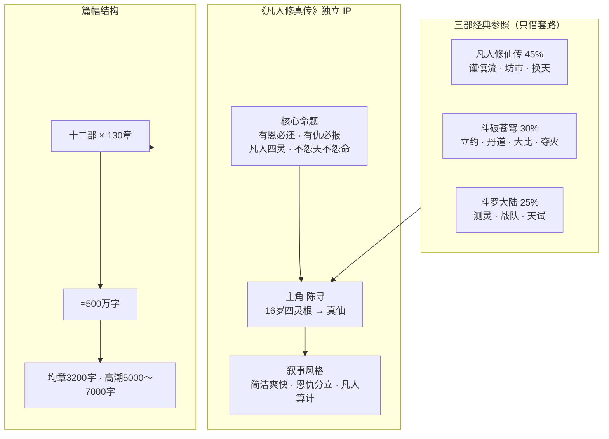
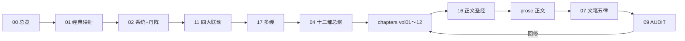
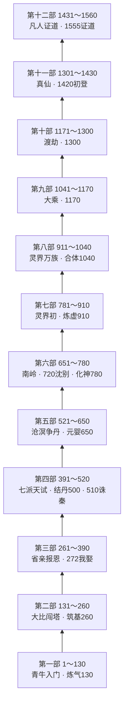
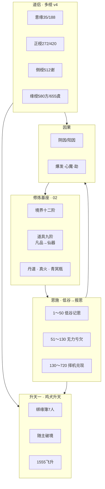
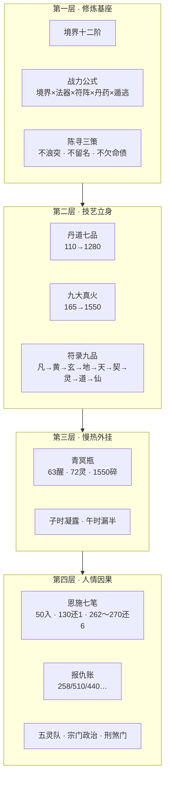
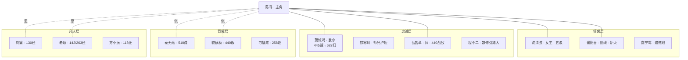
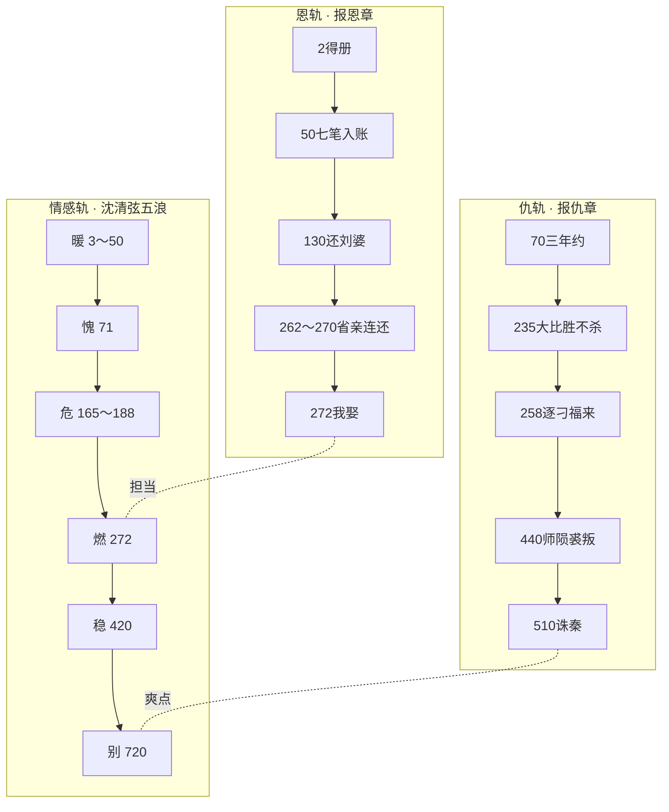
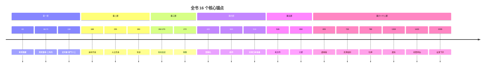
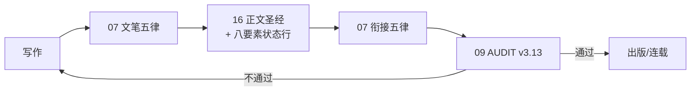

# 整体层次结构图

> **用途**：一图总览全书架构、文档体系、修炼/情感/恩仇各层关系。  
> **标准版本**：500 万字 · 1560 章 · 十二部 · **AUDIT v3.13 · 策划链闭环**  
> **最后修订**：2026-07-11

---

## 一、全书顶层架构



---

## 二、文档体系层次

```mermaid
flowchart TD
    ROOT["docs/凡人修真传/"]

    ROOT --> L0["L0 总控层"]
    ROOT --> L1["L1 设定层"]
    ROOT --> L2["L2 剧情层"]
    ROOT --> L3["L3 执行层"]
    ROOT --> L4["L4 质检层"]
    ROOT --> L5["L5 正文层"]

    L0 --> D00["00-作品总览"]
    L0 --> D10["10-整体层次结构图 ← 本文"]

    L1 --> D01["01-三部经典映射"]
    L1 --> D02["02-修炼道具·九阶"]
    L1 --> D11["11-四大联动系统"]

    L2 --> D03["03-人物情感恩仇"]
    L2 --> D04["04-十二部总纲"]
    L2 --> D05["05-开篇详设"]
    L2 --> D06["06-五百万扩充方案"]
    L2 --> D08["08-情感线规划"]
    L2 --> D17["17-多绶道侣"]
    L2 --> D13["13-馈缘链"]

    L3 --> D07["07-文笔衔接五律"]
    L3 --> D16["16-正文写作圣经"]
    L3 --> D15["15-命名IP区分"]

    L4 --> D09["09-AUDIT校验"]

    L5 --> CH["chapters/vol01～12"]
    L5 --> NZ["纳绶三锚498-655"]
    L5 --> DZ["丹道阵法章锚表"]
    L5 --> PR["prose/正文"]
```



### 文档依赖关系（写作顺序）



---

## 三、剧情十二部金字塔



### 地图换天轴（横向）

```
青牛村 ──→ 碧云宗 ──→ 沧溟海 ──→ 南岭 ──→ 灵界 ──→ 仙界
  1～50      51～520    521～650   651～780   781～1170   1171～1560
```

---

## 四、境界突破阶梯


| 大境 | 达成章 | 所属部 | 突破三要素 |
|------|--------|--------|------------|
| 炼气十三 | 130 | 一 | 培元散 + 青冥露 + 外门复测 |
| 筑基 | 260 | 二 | 筑基丹 + 伏龙塔 + 青木药火 |
| 结丹 | 500 | 四 | 结丹丹 + 玄阴文火 + 天试 |
| 元婴 | 650 | 五 | 育婴丹 + 地肺熔火 + 天劫 |
| 化神 | 780 | 六 | 化神丹 + 守墓三年 + 南岭因果 |
| 炼虚 | 910 | 七 | 灵界立足 + 余烬子化火 |
| 合体 | 1040 | 八 | 混沌元火 + 万族战 |
| 大乘 | 1170 | 九 | 因果清算 |
| 渡劫 | 1300 | 十 | 逆劫丹 + 九重雷 |
| 真仙 | **1420** | 十一 | 仙界立足 + 因果新簿 |
| 证道 | **1555** | 十二 | 寂灭心火 + 瓶碎人升 |

---

## 五、五大联动系统架构



详表见 `11-四大联动系统`。

---

## 六、道具九阶（简表）

| 阶 | 名 | 陈寻线代表 |
|----|-----|------------|
| 0 | 凡品 | 猎刀 |
| 1 | 法器 | 黑铁小炉 |
| 2 | 灵器 | 灰脊杖 |
| 3 | 法宝 | 断浪舟 |
| 4 | 古宝 | 青冥瓶衍 |
| 5 | 灵宝 | 育婴炉 |
| 6 | 玄宝 | 文火器灵 |
| 7 | 通天至宝 | 混沌元火盏 |
| 8 | 仙器 | 青冥仙瓶 |

---

## 七、原系统四层（写作节拍）



### 每境五拍（单部 130 章内循环）


---

## 六、人物关系层次



---

## 七、情感与恩仇双轨



**硬规**：报恩章不杀人 · 报仇章不温存 · 两轨同章间隔 ≥5 章

---

## 八、核心锚点章时间轴



---

## 九、部间衔接栓（换地图未了人事）

| 换部 | 未了人事 | 情感状态 | 修炼状态 |
|------|----------|----------|----------|
| 一→二 | 三年约、恩施余六笔、秦无殇 | 愧，未娶 | 炼气十三 |
| 二→三 | 周家债、省亲、拒双仪 | 燃前夜 | 筑基 |
| 三→四 | 五灵队成军、378托孤 | 已娶 | 筑基后 |
| 四→五 | 秦已诛、沧溟帖、刑煞伏 | 妒火后稳 | 结丹 |
| 五→六 | 刑煞门追杀、仇已清 | 契缘稳 | 元婴 |
| 六→七 | 沈已逝、守墓期满 | 孤 | 化神 |
| 七→十二 | 灵界→仙界因果链 | 故人回响 | 炼虚→真仙 |

---

## 十、500 万字达成结构

```
┌─────────────────────────────────────────────────────────┐
│                    500 万字全书                          │
├──────────────┬──────────────┬──────────────────────────────┤
│  人界篇      │  灵界篇      │  仙界篇                      │
│  1～780章    │  781～1170章 │  1171～1560章                │
│  ≈250万字    │  ≈125万字    │  ≈125万字                    │
├──────────────┴──────────────┴──────────────────────────────┤
│  核心锚点200章(P0) · 第一部130章(P0) · 余部按部扩写(P1/P2)  │
└─────────────────────────────────────────────────────────┘
```

| 优先级 | 范围 | 字数约 | 状态 |
|--------|------|--------|------|
| P0 | 锚点 200 章 + 第一部 130 章 | ≈106 万 | 第一部细纲已完成 |
| P1 | 二～六部 651 章 | ≈208 万 | 总纲已完成 |
| P2 | 七～十二部 780 章 | ≈250 万 | 摘要已完成 |

---

## 十一、质检闭环



### 每章状态行模板

```
【第 X 章】标题
陈寻 · 境界 · 恩施余 X · 因果阳 X/阴 X · 道侣 X 阶 · 绑缘 X/7 · 馈缘【对象·档】 · 符录【品·页】
```

---

## 十二、快速导航

| 想查什么 | 去看 |
|----------|------|
| 全书定位 | `00-作品总览` |
| 经典怎么借 | `01-三部经典映射` |
| 境界/丹/火/瓶 | `02-修炼道具系统` |
| 谁恩谁仇 | `03-人物情感与报恩复仇` |
| 十二部讲什么 | `04-十二部剧情总纲` |
| 1～130 怎么写 | `05-开篇篇` + `chapters/vol01` |
| 怎么扩到 500 万 | `06-五百万字扩充方案` |
| 怎么写才爽快 | `07-文笔规范与衔接五律` |
| 情感高潮在哪 | `08-情感线高潮跌宕规划` |
| 有没有穿帮 | `09-AUDIT` |
| 正文怎么写 | **`16-正文写作参考圣经`** |
| 多绶道侣 | **`17-多绶道侣与家族线`** |
| 馈缘纳绶链 | **`13-馈缘赠礼主线链`** |
| 丹道阵法锚 | **`chapters/丹道阵法章锚表`** |
| 498～655专纲 | **`chapters/纳绶三锚专纲`** |
| 想查九教正魔 | **`14-九教势力与正魔线`** |
| 想查八大系统 | **`11-四大联动系统`** + `02` §十五 |

---

## 附录：ASCII 总览树

```
凡人修真传（500万字 · 1560章）
│
├── 叙事层
│   ├── 命题：有恩必还 · 有仇必报
│   ├── 主角：陈寻（四灵根 · 16→真仙）
│   └── 风格：简洁爽快 · 恩仇分立
│
├── 结构层
│   ├── 十二部 × 130章
│   ├── 人界(1～780) → 灵界(781～1170) → 仙界(1171～1560)
│   └── 锚点：63/70/130/165/188/235/260/272/405/420/440/510/545/655/720/1555
│
├── 系统层
│   ├── 境界十二阶（130→1555）
│   ├── 丹道七品 + 阵道七阶 + 九大真火 + 道具九阶 + 符录九品
│   ├── 恩施+馈缘+因果+道侣+升天
│   ├── 灵宠/坐骑/洞府
│   └── 九教正魔（14）
│
├── 情感层
│   ├── 沈清弦五浪（暖愧危燃别）
│   ├── 多绶四美+家族（17）
│   └── 忠诚/背叛矩阵（445有因/582归）
│
├── 参照层
│   ├── 凡人 45%
│   ├── 斗破 30%
│   └── 斗罗 25%
│
└── 文档层
    ├── 00～17 设定/总纲/规范
    ├── chapters/ vol01～12 + 纳绶 + 丹阵
    ├── 09 AUDIT 质检
    └── prose/ 正文
```
