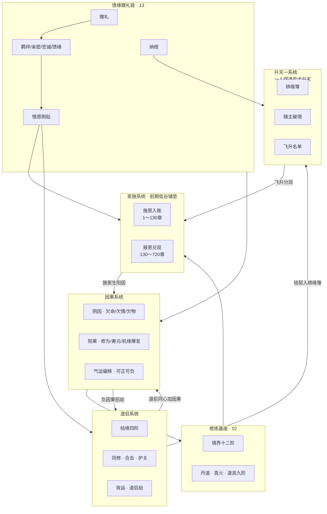

# 四大联动系统：恩施 · 因果 · 道侣 · 升天一 · 馈缘

> **定位**：核心联动层。修炼基座见 `02`；**赠礼→倒贴→纳绶→升天** 主线见 `13`。  
> **主参考**：《凡人修仙传》人情算计 + 《斗破苍穹》护短逆袭 + 《斗罗大陆》战队羁绊  
> **章制标准**：500 万字 · 1560 章 · AUDIT v3.4

---

## 一、系统总联动架构



**写作硬规**：
1. 恩施章不写杀人；报仇章不写温存  
2. 因果爆发须有 **≥3 章**铺垫  
3. 道侣合击不得超过越级上限（见 `02`）  
4. 升天一名单须在 **272 我娶** 或 **420 契缘礼** 后正式录入  

---

## 二、恩施系统（前期低谷 · 后期报恩）

> **参照**：凡人「人情债」+ 斗破「纳兰退婚→三年约→扬名」的**情绪曲线**，本作化为「低谷施恩→记账→择机还」。

### 2.1 三阶段

| 阶段 | 章区 | 主角状态 | 叙事功能 |
|------|------|----------|----------|
| **低谷入账** | 1～50 | 凡人/伪废 | 被辱、被帮、蘸血记账 |
| **无力亏欠** | 51～130 | 杂役/炼气 | 想还还不掉，读者替主角急 |
| **择机兑现** | 130～720 | 筑基→化神 | 连还、娶、安置、养老 |

### 2.2 恩施簿（册名「恩施册」：甲页恩施、乙页因果、丙页馈缘）

| 字段 | 说明 |
|------|------|
| 恩人 | 姓名/称谓 |
| 施恩 | 汤/衣/名/命 |
| 入账章 | 蘸血章号 |
| 为何未还 | 无丹/无势/未筑基 |
| 回报章 | 划账章号 |
| 回报物 | 丹/衣/灵石/名分 |

### 2.3 七笔恩施 + 扩展恩施（500 万版）

| 恩人 | 施恩章（低谷） | 低谷铺垫要点 | 回报章 | 回报方式 |
|------|----------------|--------------|--------|----------|
| 沈清弦 | 3/18/24/35 | 村辱中送汤证白挡石 | 95/188/272/420/720 | 灯/护短/我娶/契缘礼/守墓 |
| 沈振东 | 30/50 | 暗助不公开 | **262** | 筑基丹+药铺升级 |
| 老耿 | 15/28 | 狼口救人 | **142**/**263** | 续命散/助听器类灵药 |
| 陈姑 | 7 | 瞎眼送棉袄 | **264** | 安置+眼药链 |
| 张麻婆 | 12 | 骂着给馒头 | **265** | 灵石养老 |
| 方小沅 | 9 | 送粥被罚 | **118**/**266** | 半石/荐入外门 |
| 刘婆 | 61～75 | 入宗仍补衣 | **130**/**278** | 新衣/养老 |

**扩展恩施**（支撑 500 万字，每部 2～3 笔）：

| 恩人 | 施恩章 | 回报章 | 部 |
|------|--------|--------|-----|
| 程不二 | 22/162 | 163 送丹库地图 | 二 |
| 岳含章 | 235 | 378 托孤 | 二～四 |
| 铁寒川 | 108 | **583** 断臂还恩 · **584** 绶卿录入 | 五 |
| 柯漱玉 | 38/90 | 720 守沈墓 | 一～六 |
| 萧惊鸿 | 8/235 | **582** 绶兄录入（445 唤回） | 一～五 |

### 2.4 低谷扩写密度（第一部 +50 章当量情感）

| 块 | 章 | 低谷类型 | 施恩铺垫 |
|----|-----|----------|----------|
| 村辱 | 20～26 | 泼水/谣言/公审 | 沈证白、张麻婆骂善 |
| 杂役辱 | 56～62 | 克扣/踹 | 刘婆补衣 |
| 测灵辱 | 68～70 | 公开四灵根 | 立约（自施恩于己） |
| 逼嫁 | 165～188 | 周家逼沈嫁 | 陈寻护短不还省亲 |

---

## 三、因果系统

> **参照**：凡人「气运/机缘」+ 流行网文「因果律」公共手法；**无 UI 面板**，仅以簿、梦、劫、爆发呈现。

### 3.1 因果三分

| 类型 | 来源 | 累积 | 爆发 |
|------|------|------|------|
| **情因** | 恩施、道侣、背叛 | 阳因+/阴因− | 机缘/心魔 |
| **杀因** | 报仇、误杀、屠妖 | 阴因+/阳因− | 天劫加重/追杀 |
| **物因** | 捡漏、夺宝、诈取 | 双轨 | 法宝认主/反噬 |

### 3.2 因果簿（陈寻自用，2 章得）

与恩施簿同册，**背页**记因果：

```
阳因：护民、还恩、斩魔、道侣同心
阴因：欠命未还、诈取、见死不救
```

| 数值区间 | 叙事表现 | 不可写 |
|----------|----------|--------|
| 阳因 1～30 | 坊市捡小漏 | 不可天降神器 |
| 阳因 31～80 | 因果小爆发（修为+、情报到） | 不可连破两境 |
| 阳因 81～150 | 大爆发（越级一战、古宝出世） | 需护关人 |
| 阳因 ≥150 | 破境机缘齐 | 仅大境节点 |
| 阴因 ≥20 | 心魔预演 | — |
| 阴因 ≥50 | 追杀/背叛者上门 | — |
| 阴因 ≥80 | 天劫加一重 | — |

### 3.3 因果与章节锚点

| 章 | 因果事件 | 阳/阴 |
|----|----------|-------|
| 118 | 还方小沅 | 阳 +8 |
| 130 | 还刘婆 | 阳 +10 |
| 235 | 大比胜不杀秦 | 阳 +15（留仇阴 +5 挂秦） |
| 258 | 逐刁福来不杀 | 阳 +5 |
| 378 | 岳含章托孤承命 | 阳 +10（承师恩） |
| 440 | 岳战殁·拖裘垫背 | 阴 +20（未护师）→ 720 守墓还 |
| 510 | 诛秦 | 阴 −30（仇清）阳 +20 |
| 582 | 萧绶兄录入（580 还恩块） | 阳 +25 |
| 720 | 沈别 | 情因转 **长线阳因**（守墓） |
| 1300 | 渡劫 | 阴阳对账 |
| 1555 | 证道 | 因果簿焚，余烬入青冥瓶 |

### 3.4 因果爆发写法（简洁爽快）

- **铺垫**：簿上划圈、青冥瓶露异动、梦中旧人  
- **爆发**：一章内给结果，不拖三章  
- **代价**：爆发必失一物（符/露/人情）

---

## 四、道侣系统（多绶 · 后宫收集）

> **参照**：馈缘链 + 家族情义；**正绶 1 + 侧/缘绶 3**，详见 **`17-多绶道侣与家族线`**。  
> 旧「仅一主道侣」废止；沈清弦 **永占正绶主位**，侧缘可纳不可越。

### 4.1 结缘四阶（正绶专用 · 沈清弦）

| 阶 | 名称 | 条件 | 章例 | 能力解锁 |
|----|------|------|------|----------|
| 一 | **意缘** | 双向心动或恩锚 | 35/95 | 传药增效 10% |
| 二 | **名缘** |  publicly 定名分 | **272** 我娶 | 护关可代受轻伤 |
| 三 | **契缘** | 血契+天地见证 | **420** 契缘礼 | 合击「青冥双焰」 |
| 四 | **同缘** | 同境或愿共渡劫 | 650+ | 道侣劫分担 |

侧绶/缘绶：**512/580/655** 各立侧契/缘印/剑契，不重复完整四阶，但享绑缘与合击辅位。

### 4.2 正绶 · 沈清弦

| 项 | 内容 |
|----|------|
| 结缘 | 意缘 35 → 名缘 272 → 契缘 420 |
| 家族 | 沈振东、药铺、青牛沈邻（见 `17` §4.1） |
| 终局 | 720 坐化；**主位魂占位**；侧绶共守墓至 1555 |

### 4.3 侧绶 · 谢挽香

| 项 | 内容 |
|----|------|
| 弧 | 228 妒 → 310 吻 → **498 护家** → **512 侧绶** |
| 家族 | 谢母、谢伯父、丹阁（见 `17` §4.2） |
| 合击 | 512 后「丹剑双护」辅阵 |

### 4.4 缘绶 · 方小沅 · 虞宁鸢

| 人物 | 纳绶章 | 家族 | 弧 |
|------|--------|------|-----|
| **方小沅** | **580** | 方母、周家旧债 | 恩施→266 还→580 病危纳缘 |
| **虞宁鸢** | **655** | 虞仲卿、虞老夫人、虞府 | 235 敬→655 兄陨托府纳缘 |

**硬规**：四位道侣 **均有家族线**；纳绶必经报恩/护家；**正不妒，侧不越**（420 后立规）。

### 4.5 道侣与因果

| 行为 | 因果 |
|------|------|
| 护短不越界（188） | 阳 +12 |
| 当众我娶（272） | 阳 +20，得绑缘簿 |
| 512 纳谢（侧绶） | 阳 +15；谢家并入 |
| 655 纳虞（缘绶） | 阳 +18；虞府祭祀 |
| 背道侣辱正绶 | 阴 +80（不写） |
| 720 沈别 | 长情因；侧绶共担心魔 |

### 4.6 男欢女爱（多绶 · 有节）

| 章 | 对象 | 写法 |
|----|------|------|
| 95/188 | 沈 | 灯影、共伞 |
| 272/420/719 | 沈（正） | 握腕、契缘、帐暖 |
| 310/512 | 谢（侧） | 吻拒→侧契礼 |
| 580 | 方（缘） | 馈药、牵手 |
| 655 | 虞（缘） | 剑穗、并肩 |

---

## 五、升天一系统（一人得道，鸡犬升天）

> **参照**：凡人「飞升带不了多少人」的克制 + 流行「鸡犬升天」爽点；本作**有名单、有上限、有代价**。

### 5.1 绑缘簿

| 项 | 说明 |
|----|------|
| 得簿 | **272** 我娶，碧云宗赐「绑缘簿」 |
| 录入 | 血指按印，限 **7 人**（**4 道侣绶** + 3 伴飞） |
| 升阶 | 随陈寻大境解锁名额 |

### 5.2 随主破境（鸡犬升天）

| 陈寻境界 | 绑定者获益 | 上限 |
|----------|------------|------|
| 筑基 | 炼气亲友寿元 +10 年 | 2 人 |
| 结丹 | 绑定者可重修至炼气圆满 | 3 人 |
| 元婴 | 绑定者筑基机缘 | 4 人 |
| 化神 | 绑定者结丹机缘（沈已逝除外） | 5 人 |
| 大乘 | 绑定者元婴机缘 | 6 人 |
| 真仙 | **飞升名单**开启 | 7 人 |

### 5.3 飞升名单（终卷）

| 顺位 | 默认人物 | 名分 | 条件章 |
|------|----------|------|--------|
| 主位 | 沈清弦（魂/名分） | 正绶 | 272/420/720 |
| 1 | 谢挽香 | 侧绶 | **512** |
| 2 | 方小沅 | 缘绶 | **580** |
| 3 | 虞宁鸢 | 缘绶 | **655** |
| 4 | 萧惊鸿 | 绶兄 | **582** |
| 5 | 柯漱玉 | 绶徒 | 378 |
| 6 | 铁寒川 | 绶卿 | **584** |

**代价**：每带一人飞升，陈寻渡劫加 **一重**；带满 7 人需 **逆劫丹**（1280）。

### 5.4 与恩施联动

- 恩施回报时，可选择「录入绑缘簿」或「一次性还清」  
- 刘婆、陈姑等凡人：**不录入**，以灵石/安置还恩（更合凡人基调）  
- 沈清弦：**必占正绶主位**；720 后魂占位，侧绶同修  
- 四美道侣家族：随纳绶并入剧情（见 `17`）

---

## 六、四系统 × 十二部植入表

| 部 | 恩施 | 因果 | 道侣 | 升天一 |
|----|------|------|------|--------|
| 一 | 七笔入账 | 簿得 | 意缘 | — |
| 二 | 142 还耿 | 235 阳爆 | 188 护短 | — |
| 三 | 262～270 连还 | 272 阳 +20 | **272 名缘** | **272 得簿** |
| 四 | —（378托孤归第三部） | 440阴→720还；**510仇清** | **420 契缘** | 录入 2 人 |
| 五 | 580 铁还 | 沧溟海阴因 | **512谢侧/580方缘** | 录入 6/7 |
| 六 | 720 沈别 | 守墓长因 | 正位魂占·**655虞缘** | 7/7 |
| 七～九 | 故人回响 | 灵界对账 | — | 名额 5～6 |
| 十～十二 | 余恩 | 渡劫对账 | 同缘余烬 | **1555 飞升** |

---

## 七、章状态行（八要素 · 唯一标准）

```
【第 X 章】标题
陈寻 · 境界 · 恩施余 X · 因果阳 X/阴 X · 道侣【正/侧/缘】 · 绑缘 X/7 · 馈缘【对象·档】 · 符录【品·页】
```

---

## 八、系统一致性规则

1. 恩施未还完，不可录入绑缘簿（沈除外，272 同步）  
2. 阴因 ≥50 时，道侣合击失败率 +30%  
3. 升天一名额不可超过当前境界上限  
4. 因果爆发不可跨两个大境  
5. 侧绶/缘绶纳绶见 `17`；**正绶仅沈清弦**  
6. **馈缘赠礼链**见 `13`：每 5～8 章一赠；倒贴必有前置赠或恩施  
7. 纳绶必经报恩/护家；**每位道侣须有家族线**
