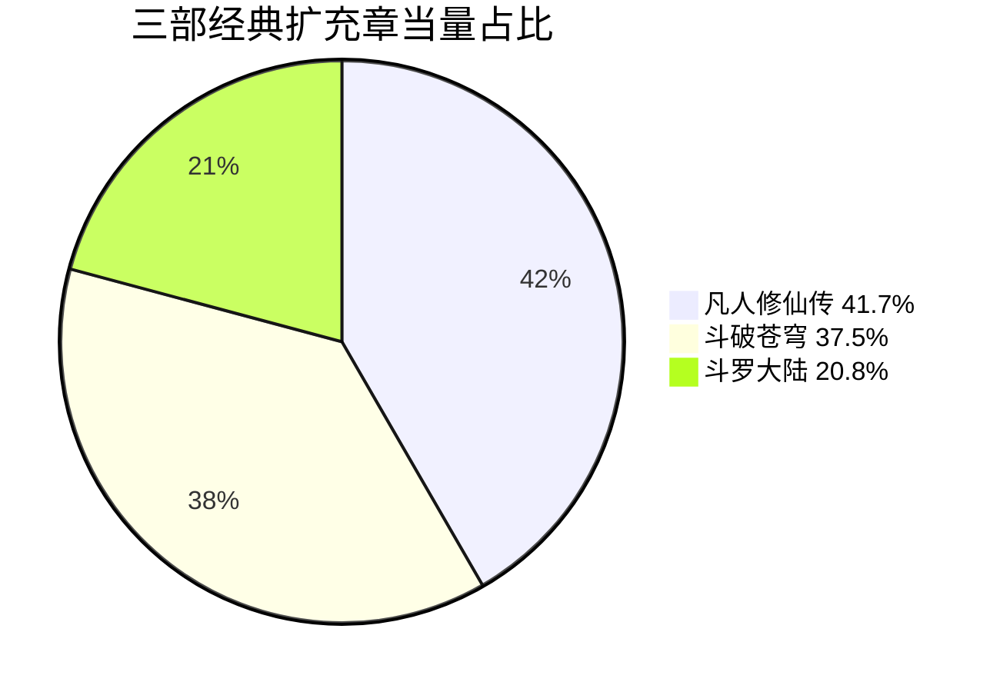
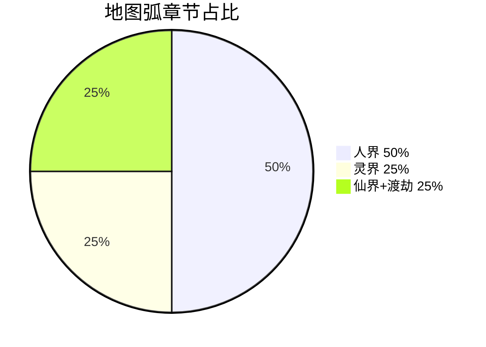
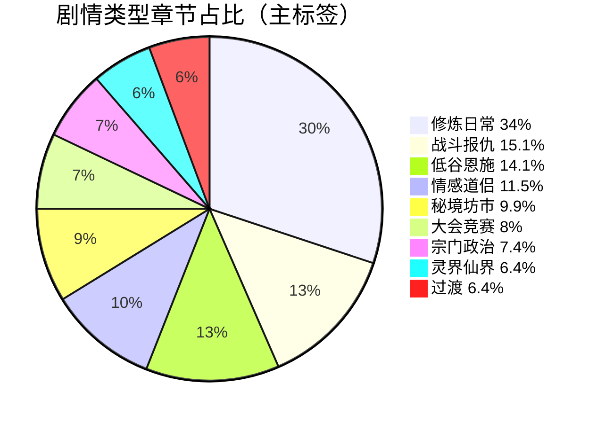
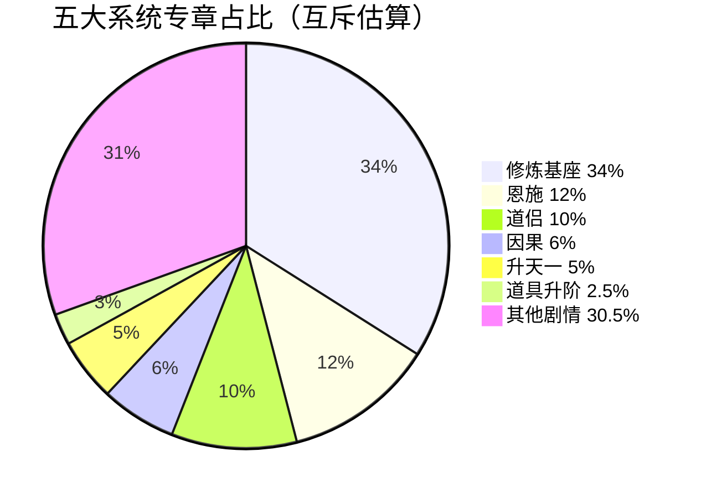
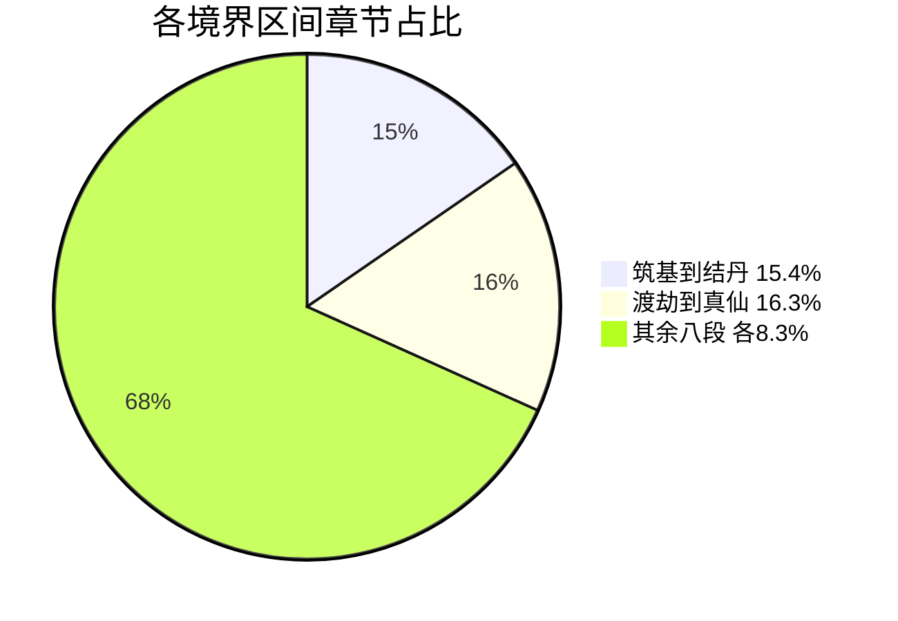

# 剧情与系统统计比例

> **标准**：500 万字 · 1560 章 · 十二部 · AUDIT v3.4  
> **说明**：比例分三类——**设计权重**（策划意图）、**章节占比**（可量化章数）、**字数估算**（含高潮章加权）  
> **最后修订**：2026-07-11

---

## 一、总盘

| 指标 | 数值 |
|------|------|
| 总章数 | **1560** |
| 总字数 | **≈500 万**（518 万草稿，出版删至 500 万） |
| 十二部 | 每部 **130 章 / 42 万字**（各占 **8.33%**） |
| 均章 | 3200 字 |
| 高潮章 | 约 **120 章** × 5000～7000 字（占总字数 **≈12%**） |

---

## 二、三部经典参考比例

### 2.1 设计权重（叙事气质）

| 参考作品 | 设计权重 | 定位 |
|----------|----------|------|
| **凡人修仙传** | **45%** | 主基础：谨慎、坊市、宗门政治、换天 |
| **斗破苍穹** | **30%** | 立约、丹道逆袭、大比闯塔、夺火追杀 |
| **斗罗大陆** | **25%** | 测灵、战队、天试、融合仪式 |
| **2026 趋势** | 叠加 | 凡人流、情感复合、章末强钩、短剧单元 |

### 2.2 扩充章当量（`06` 可量化）

| 参考 | 扩充章当量 | 占当量合计 | 主要章区 |
|------|------------|------------|----------|
| 凡人 | **+200** | **41.7%** | 1～75, 131～440, 521～720, 781～1560 |
| 斗破 | **+180** | **37.5%** | 68～70, 110～260, 450～650 |
| 斗罗 | **+100** | **20.8%** | 68, 300～470, 390 |
| **合计** | **480** | 100% | 与主线章重叠，非互斥 |

---

## 三、地图 / 剧情弧章节占比

| 地图弧 | 章区 | 章数 | 占全书 | 万字约 | 主参考 |
|--------|------|------|--------|--------|--------|
| 青牛村+入门 | 1～130 | 130 | **8.3%** | 42 | 凡人 |
| 碧云宗崛起 | 131～390 | 260 | **16.7%** | 83 | 斗破+斗罗 |
| 七派天试 | 391～520 | 130 | **8.3%** | 42 | 斗罗 |
| 沧溟争丹 | 521～650 | 130 | **8.3%** | 42 | 凡人+斗破 |
| 南岭 | 651～780 | 130 | **8.3%** | 42 | 凡人 |
| **人界小计** | 1～780 | **780** | **50.0%** | **250** | — |
| 灵界 | 781～1170 | 390 | **25.0%** | 125 | 凡人 |
| 仙界+渡劫 | 1171～1560 | 390 | **25.0%** | 125 | 凡人+原创 |
| **合计** | — | 1560 | 100% | 500 | — |

---

## 四、剧情类型占比（估算 · 主标签互斥）

> 每章按**主叙事功能**打一条主标签，合计 100%。

| 剧情类型 | 章数约 | 占全书 | 万字约 | 占字数 | 高峰部 |
|----------|--------|--------|--------|--------|--------|
| **修炼/突破/日常** | 530 | **34.0%** | 170 | 34% | 各部均有 |
| **低谷/恩施/报恩** | 220 | **14.1%** | 62 | 12.4% | 一、三 |
| **情感/道侣** | 180 | **11.5%** | 58 | 11.6% | 一～六 |
| **战斗/报仇/追杀** | 235 | **15.1%** | 78 | 15.6% | 二、四、五 |
| **大会/大比/天试** | 125 | **8.0%** | 42 | 8.4% | 二、四 |
| **秘境/坊市/夺宝** | 155 | **9.9%** | 48 | 9.6% | 每部「五拍」 |
| **宗门政治/背叛** | 115 | **7.4%** | 32 | 6.4% | 二～五 |
| **灵界/仙界/飞升** | 100 | **6.4%** | 35 | 7.0% | 七～十二 |
| **过渡/铺垫** | 100 | **6.4%** | 25 | 5.0% | 部间 |
| **合计** | 1560 | 100% | 500 | 100% | — |

### 4.1 低谷专章（前期施恩铺垫）

| 低谷峰 | 章 | 章数 | 占全书 |
|--------|-----|------|--------|
| 父母之殇 | 1～8 | 8 | 0.5% |
| 村辱高峰 | 20～28 | 9 | 0.6% |
| 离村亏欠 | 49～50 | 2 | 0.1% |
| 杂役辱 | 56～62 | 7 | 0.4% |
| 测灵辱 | 68～70 | 3 | 0.2% |
| 逼嫁危 | 165～188 | 24 | 1.5% |
| **低谷合计** | — | **53** | **3.4%** |

> 低谷章数不多，但字数加权 **+20%**（羞辱/情感章 4000～5000 字），折合字数约 **≈4.2%**。

### 4.2 恩施三阶段章占比

| 阶段 | 章区 | 章数 | 占全书 | 功能 |
|------|------|------|--------|------|
| 低谷记恩 | 1～50 | 50 | **3.2%** | 施恩蘸血 |
| 无力亏欠 | 51～130 | 80 | **5.1%** | 想还不能还 |
| 择机兑现 | 131～720 | 590 | **37.8%** | 穿插还恩 |
| 沈别后 | 721～1560 | 840 | **53.8%** | 长情因/飞升 |

**恩施高潮专章**：262～270（9 章）+ 130/118/142 等 ≈ **25 章**，占全书 **1.6%**，但情感权重 **≈8%**。

### 4.3 恩 vs 仇（分立）

| 类型 | 专章约 | 占全书 | 代表锚点 |
|------|--------|--------|----------|
| **恩施/报恩** | 45 | **2.9%** | 130, 262～270, 272 |
| **报仇/清算** | 35 | **2.2%** | 258, 440, 510 |
| **背叛线** | 28 | **1.8%** | 445, 440, 318 |
| **忠诚还恩** | 22 | **1.4%** | 580, 378 |

---

## 五、五大系统占比

### 5.1 系统叙事权重（可重叠 · 策划值）

| 系统 | 叙事权重 | 说明 |
|------|----------|------|
| **修炼基座**（境界/丹/火/瓶） | **100%** | 每章底色 |
| **恩施** | **18%** | 1～720 核心 |
| **因果** | **12%** | 每部 5～8 章 + 爆发 |
| **道侣** | **14%** | 35→720 |
| **升天一** | **9%** | 272→1555 |
| **符录** | **8%** | 63→1555；辅修不占升天名额 |
| **道具九阶** | **6%** | 升阶节点 |

> 权重可叠加，总和 >100% 属正常（一章可同时推进道侣+恩施）。

### 5.2 系统专章估算（互斥主功能）

| 系统 | 专章约 | 占全书 | 扩写章当量（`06`） |
|------|--------|--------|-------------------|
| 修炼/突破 | 530 | 34.0% | 底色 |
| 恩施 | 187 | 12.0% | +60 |
| 因果 | 94 | 6.0% | 含在四大系统 +100 |
| 道侣 | 156 | 10.0% | 含在情感 +80 |
| 升天一 | 78 | 5.0% | 含在四大系统 |
| 符录 | 62 | 4.0% | 辅修专章 |
| 道具升阶 | 39 | 2.5% | 含在四大系统 |
| **四大系统扩写合计** | — | — | **+100 章当量（6.4%）** |

### 5.3 四大系统扩写当量

| 系统 | 章当量 | 占扩写 100 章 |
|------|--------|---------------|
| 恩施 | 35 | 35% |
| 因果 | 25 | 25% |
| 道侣 | 25 | 25% |
| 升天一 | 10 | 10% |
| 道具九阶 | 5 | 5% |

---

## 六、每境「五拍」比例（每部 130 章内）

| 节拍 | 章数 | 占一部 | 全书折算 |
|------|------|--------|----------|
| 攒资源 | 28～40（均 34） | **26.2%** | 全书约 **26%** |
| 秘境 | 18～30（均 24） | **18.5%** | 全书约 **18%** |
| 大会 | 15～22（均 18.5） | **14.2%** | 全书约 **14%** |
| 追杀 | 18～28（均 23） | **17.7%** | 全书约 **18%** |
| 破境 | 10～12（均 11） | **8.5%** | 全书约 **8%** |
| 过渡/情感/恩施 | 余约 19.5 | **15.0%** | 全书约 **15%** |

---

## 七、境界篇章占比（修练进度）

| 境界区间 | 章区 | 章数 | 占全书 | 升级难度感 |
|----------|------|------|--------|------------|
| 凡人→炼气十三 | 1～130 | 130 | **8.3%** | 慢热 |
| 炼气→筑基 | 131～260 | 130 | **8.3%** | 中 |
| 筑基→结丹 | 261～500 | 240 | **15.4%** | 长（含天试） |
| 结丹→元婴 | 501～650 | 150 | **9.6%** | 中 |
| 元婴→化神 | 651～780 | 130 | **8.3%** | 中（含沈别） |
| 化神→炼虚 | 781～910 | 130 | **8.3%** | 换天 |
| 炼虚→合体 | 911～1040 | 130 | **8.3%** | 换天 |
| 合体→大乘 | 1041～1170 | 130 | **8.3%** | 换天 |
| 大乘→渡劫 | 1171～1300 | 130 | **8.3%** | 换天 |
| 渡劫→真仙 | 1301～1555 | 255 | **16.3%** | 终局加长 |

---

## 八、道具九阶出现比例

| 阶 | 名称 | 首现章 | 占全书修练期 |
|----|------|--------|--------------|
| 0 | 凡品 | 1 | 1～62（4%） |
| 1 | 法器 | 110 | 63～164（6.5%） |
| 2 | 灵器 | 118 | 165～235（4.6%） |
| 3 | 法宝 | 236 | 236～449（13.7%） |
| 4 | 古宝 | 520 | 450～649（12.8%） |
| 5 | 灵宝 | 620 | 650～779（8.3%） |
| 6 | 玄宝 | 780 | 780～909（8.3%） |
| 7 | 通天至宝 | 1080 | 910～1299（24.9%） |
| 8 | 仙器 | 1555 | 1300～1560（16.7%） |

**专章升阶描写**：约 **39 章（2.5%）**；其余章节道具作为背景。

---

## 九、情感线占比

| 情感线 | 活跃章区 | 章数约 | 占全书 | 字数权重 |
|--------|----------|--------|--------|----------|
| **沈清弦**（主浪+道侣） | 3～720 | 180 专章 | **11.5%** | **≈14%** |
| **谢挽香**（侧绶） | 228/310/498/512 | 24 | **1.5%** | **≈2%** |
| **方小沅**（缘绶） | 266/580 | 10 | **0.6%** | **≈1%** |
| **虞宁鸢**（缘绶） | 235/365/655 | 18 | **1.2%** | **≈1.5%** |
| **忠诚线**（萧/铁/岳） | 散布 | 45 | **2.9%** | **≈3%** |
| **背叛线**（秦/裘/萧暂叛） | 散布 | 38 | **2.4%** | **≈3%** |
| 男欢女爱高潮 | 95/188/272/420/512/580/655/719 | 12 | **0.8%** | **≈3%**（加权） |

### 沈清弦五浪章分布

| 浪 | 章 | 章数 | 占情感线 |
|----|-----|------|----------|
| 暖 | 3～50 | 15 专章 | 8.3% |
| 愧 | 71 | 3 | 1.7% |
| 危 | 165～188 | 24 | 13.3% |
| 燃 | 272 | 5 | 2.8% |
| 稳 | 420 | 8 | 4.4% |
| 别 | 719～720 | 6 | 3.3% |

### 道侣四阶章占比

| 阶 | 章 | 占全书 |
|----|-----|--------|
| 意缘 | 35～188 | 0.8% 专章 |
| 名缘 | 272 | 0.3% |
| 契缘 | 420 | 0.5% |
| 同缘 | 650～718 | 0.4% |

---

## 十、升天一（鸡犬升天）占比

| 节点 | 章 | 绑缘名额 | 占全书 |
|------|-----|----------|--------|
| 得绑缘簿 | 272 | 0→簿 | 0.1% |
| 录入 2 人 | 390 | 2/7 | 0.5% |
| 录入 4 人 | 580 | 4/7 | 0.8% |
| 录入 6 人 | 584 | 6/7 | 0.5% |
| 录入满员 | 655 | 7/7 | 0.5% |
| 飞升 1555 | 1555 | 7/7 | 0.4% |
| **升天一专章合计** | — | — | **≈5%（78 章）** |

---

## 十一、因果系统占比

| 类型 | 专章约 | 占全书 | 爆发锚点 |
|------|--------|--------|----------|
| 阳因累积 | 60 | 3.8% | 118, 130, 272 |
| 阴因累积 | 34 | 2.2% | 440, 445 |
| 因果爆发 | 12 | 0.8% | 235, 510, 1300 |
| 对账/清算 | 8 | 0.5% | 1300, 1555 |
| **合计** | **94** | **6.0%** | — |

---

## 十二、十二部功能占比（均分 vs 加权）

| 部 | 章 | 均分 | 字数加权 | 功能侧重 |
|----|-----|------|----------|----------|
| 一 | 1～130 | 8.3% | **9.5%** | 低谷+恩施+慢热 |
| 二 | 131～260 | 8.3% | **9.0%** | 立约兑现+大比 |
| 三 | 261～390 | 8.3% | **9.5%** | 恩施高潮+名缘 |
| 四 | 391～520 | 8.3% | **8.5%** | 天试+契缘 |
| 五 | 521～650 | 8.3% | **9.0%** | 沧溟海+报仇 |
| 六 | 651～780 | 8.3% | **9.5%** | 沈别+化神 |
| 七～十二 | 各 130 | 各 8.3% | 各 **7.5%** | 换天+终局 |

> 人界六部（1～780）占章 **50%**，占加权字数 **≈55%**。

---

## 十三、扩写资源分配总表

| 扩写来源 | 章当量 | 占 1560 | 字数约 |
|----------|--------|---------|--------|
| 凡人参照 | +200 | 12.8% | 64 万 |
| 斗破参照 | +180 | 11.5% | 58 万 |
| 斗罗参照 | +100 | 6.4% | 32 万 |
| 低谷专扩 | +60 | 3.8% | 19 万 |
| 四大系统 | +100 | 6.4% | 32 万 |
| 情感深描 | +80 | 5.1% | 26 万 |
| **扩写当量合计** | **+720** | **46.2%** | **≈231 万** |

> 扩写当量与主线重叠，表示「若纯按参照扩写可新增约 720 章当量内容」，实际并入 1560 章结构。

**纯原创（无直接参照映射）**：约 **≈54%** 章区（含灵界后半、恩施独创、升天一、陈寻人设）。

---

## 十五、馈缘赠礼主线链占比（`13`）

| 阶段 | 章约 | 占全书 |
|------|------|--------|
| ① 赠礼 | 280 | **18.0%** |
| ③ 情感倒贴 | 125 | **8.0%** |
| ⑤ 纳绶 | 47 | **3.0%** |
| ⑥ 鸡犬升天 | 78 | **5.0%** |
| 与恩施/报恩重叠 | — | 计入 14.1% 恩施类 |

**辅修系统专章**：

| 系统 | 章约 | 占全书 |
|------|------|--------|
| 灵宠 | 45 | **2.9%** |
| 坐骑/遁行 | 35 | **2.2%** |
| 洞府 | 52 | **3.3%** |

---

## 十六、九教势力章节占比（`14`）

| 类型 | 专章约 | 占全书 |
|------|--------|--------|
| 双仪宗线 | 35 | **2.2%** |
| 道门（含碧云） | 80 | **5.1%** |
| 佛+密+西教 | 45 | **2.9%** |
| 魔教 | 55 | **3.5%** |
| 邪教 | 40 | **2.6%** |
| **正魔大战合计** | — | **≈8%** |

---

## 十七、快速查表（更新）

| 想查 | 比例 |
|------|------|
| 凡人/斗破/斗罗气质 | **45% / 30% / 25%** |
| 人界/灵界/仙界 | **50% / 25% / 25%** |
| 低谷专章 | **3.4%**（字 **≈4.2%**） |
| 恩施全流程 | 入账 **3.2%** + 兑现穿插 **37.8%** |
| 情感+道侣 | **≈11.5%** 章 / **≈14%** 字 |
| 战斗+报仇 | **≈15%** |
| 升天一 | **≈5%** |
| 馈缘赠礼链 | **≈18%** 章 |
| 倒贴情感 | **≈8%** |
| 纳绶 | **≈3%** |
| 灵宠/坐骑/洞府 | **≈8%** 合计 |
| 修炼日常底色 | **≈34%** |

---

## 十五、统计口径说明

1. **设计权重**：策划意图，不等于章数独占。  
2. **章占比**：按主标签互斥估算，供篇幅平衡用。  
3. **字数权重**：高潮章、低谷章 ×1.2～1.4 加权。  
4. **扩写当量**：与主线重叠，不可与章占比直接相加。  
5. 修订系统时同步更新本文与 `09-AUDIT`。
