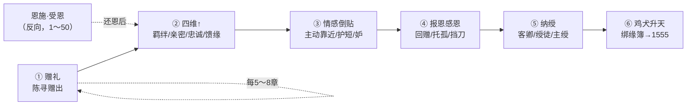

# 馈缘赠礼主线链 · 纳绶 · 辅修系统

> **定位**：贯穿 1560 章的**赠出—回馈—绑定—升天**主线，与恩施（受恩）、道侣、升天一联动。  
> **主参考**：《凡人修仙传》人情算计 + 流行「赠礼爆回」爽感。  
> **硬规**：**多绶道侣**（正 1 + 侧/缘 3）；倒贴→报恩→纳绶→**家族线**；详见 **`17`**。  
> 有情有义才收录；**正不妒，侧不越**。

---

## 一、主线链总览（穿插各卷）



| 阶段 | 叙事功能 | 章密度 | 占全书约 |
|------|----------|--------|----------|
| ① 赠礼 | 陈寻弱时先送，立馈缘 | 每 **5～8 章** 1 次 | **18%** |
| ② 四维↑ | 簿上记数，不写面板 | 随赠礼 | — |
| ③ 倒贴 | 美女/挚友主动（有因） | 每部 **2～4 峰** | **8%** |
| ④ 报恩 | 双向或对方还 | 与恩施汇合 | **14%** |
| ⑤ 纳绶 | 道侣+伴飞名分 | 272/512/580/655 | **5%** |
| ⑥ 升天 | 绑缘簿飞升 | 272→1555 | **5%** |

---

## 二、馈缘簿（赠出专用 · 与绑缘簿同匣丙页）

> 2 章得册：甲页恩施（受恩），乙页因果，**丙页馈缘（赠出）**。

### 2.1 赠礼四维

| 维度 | 含义 | 升法 | 叙事表现 |
|------|------|------|----------|
| **羁绊** | 命运纠缠 | 赠物/赠丹/赠命 | 对方记你一生 |
| **亲密** | 情感距离 | 私下赠、体恤赠 | 倒贴/妒火/共伞 |
| **忠诚** | 立场选择 | 危时赠、公开护短 | 挡刀/不叛/回归 |
| **馈缘** | 回赠气运 | 首赠/赠其所急 | 大回赠/机缘到 |

**记法**（不写阿拉伯数字给读者）：薄上划「正」「半」「满」三档。

| 档 | 羁绊 | 亲密 | 忠诚 | 馈缘 |
|----|------|------|------|------|
| 初 | 一划 | — | — | — |
| 中 | 二划 | 一划 | 一划 | 半 |
| 满 | 三划 | 二划 | 二划 | 满 |

### 2.2 赠礼 → 四维规则

| 赠礼类型 | 示例 | 主要升维 | 馈缘 |
|----------|------|----------|------|
| 凡物暖赠 | 汤、衣、半石 | 羁绊 | 低 |
| 丹药急赠 | 培元散、筑基丹 | 羁绊+馈缘 | 高 |
| 灵器赠 | 灰脊杖、匿形符匣 | 忠诚 | 中 |
| 符录页/成品符 | 435 清微符、188 护心符 | 馈缘 | 中～高 |
| 危时赠 | 188 雨夜送符 | 亲密+忠诚 | 满 |
| 秘赠 | 丹方、地图 | 馈缘 | 爆发 |

**硬规**：
- 转手倒卖陈寻所赠 → 四维清零，阴因 +15  
- 假赠（无诚意）→ 不记馈缘  
- 恩施（对方先帮）还恩后，可 **并记** 馈缘（双向满）

---

## 三、主线链 × 人物表

| 人物 | ①赠礼章 | ②四维峰 | ③倒贴章 | ④报恩章 | ⑤纳绶 | ⑥升天 |
|------|---------|---------|---------|---------|-------|-------|
| **沈清弦** | 95 留灯* | 35 恩锚 | 188 护短 | 262～272 | **正绶 272/420** | 主位 |
| **谢挽香** | 175 丹方 | 228 妒 | 310 吻 | **498 护家** | **侧绶 512** | **3/7** |
| **虞宁鸢** | 235 剑诀 | 365 剑穗 | — | 655 兄陨托府 | **缘绶 655** | **7/7** |
| **方小沅** | 118 半石 | 266 荐帖 | 266 还石 | 580 方母病危 | **缘绶 580** | 4/7 |
| **柯漱玉** | 118 半石 | 90 指点 | — | 720 守墓 | **绶徒 378** | 录入 720 |
| **萧惊鸿** | 580 杖 | 235 挡刀 | — | 582 回归 | **绶兄 582** | **5/7** |
| **铁寒川** | 108 伤药 | 235 护短 | — | 584 断臂 | **绶卿 584** | **6/7** |
| **岳含章** | — | 235 收徒 | — | 378 托孤 | **绶师**（440战殁） | — |
| **程不二** | 163 地图 | 22 引路 | — | 163 | 绶散修（可选） | 不入 7/7 默认名单 |

\* 沈线：**先恩施后馈缘**，95 为陈寻首次「赠还式」赠灯油。

---

## 四、③ 美女倒贴 → 纳绶（后宫收集 · 有因有节）

> **写法**：倒贴写**选择**；纳绶写**礼+家族**；每位道侣 **≥2 章家族戏**（见 `17`）。

| 章 | 人物 | 触发 | 写法 |
|----|------|------|------|
| 95 | 沈 | 陈寻赠灯油 | 门缝留灯，不露面 |
| 188 | 沈 | 陈寻雨夜护短 | 她送姜汤，他拒入屋 |
| 228 | 谢 | 175 赠丹方后扬名 | 妒火，丹房冷脸 |
| 310 | 谢 | 馈缘满+酒 | 醉酒吻，陈寻拒 |
| 365 | 虞 | 陈寻赠剑诀 | 系剑穗，不言语 |
| 498 | 谢 | 护陈寻一家 | 对谢家反目；**512 侧绶**铺垫 |
| 580 | 方 | 方母病危 | 馈药；**580 缘绶礼** |
| 655 | 虞 | 兄陨托府 | 剑契；**655 缘绶** |

**硬规**：
- 倒贴章 **不** 与报仇章同章  
- 272 前仅 **沈** 可写意缘亲密；侧/缘纳绶后各有礼章  
- **正绶仅沈**；侧缘纳绶须沈正绶见证（420 后）  
- 每位道侣纳绶前 **≥2 章家族戏**（`17`）

---

## 五、⑤ 纳绶体系（多绶道侣）

> **道侣绶** 正 1 + 侧/缘 3；**伴飞** 萧/铁/柯。详见 `17`。

| 绶级 | 含义 | 条件 | 章例 | 绑缘 |
|------|------|------|------|------|
| **正绶** | 主道侣 | 名缘+契缘 | **272/420** 沈 | 主位 |
| **侧绶** | 侧室道侣 | 护家/报恩+家族 | **512** 谢 | 3/7 |
| **缘绶** | 缘定道侣 | 恩施/恩后+家族 | **580** 方、**655** 虞 | 4/7、**7/7** |
| **绶卿/兄/徒** | 非道侣伴飞 | 忠诚/托孤 | **378/580** | 5/7、7/7 |

**纳绶仪式**：正绶 420 顶格；侧绶 512 合宴；缘绶 580/655 缘印/剑契；**沈正绶须在场**。

---

## 六、⑥ 与鸡犬升天衔接

见 `11` 升天一系统。馈缘链终点：

```
赠礼积馈缘 → 纳绶入绑缘簿 → 随主破境 → 1555 飞升名单
```

| 章 | 事件 |
|----|------|
| 272 | 沈正绶 → 得绑缘簿 |
| 378 | 纳柯绶徒 → 2/7 |
| 515 | **纳谢侧绶** → 3/7 |
| 580 | **纳方缘绶** → 4/7 |
| 582～584 | 萧5/7 · 铁6/7 |
| 655 | **纳虞缘绶** → **7/7** 满 |
| 720 | 沈逝主位魂占；侧缘同修 |
| 1555 | 7/7 飞升 |

---

## 七、十二部植入密度

| 部 | 赠礼密度 | 倒贴峰 | 纳绶 | 升天 |
|----|----------|--------|------|------|
| 一 | 118 半石 | 95 灯 | — | — |
| 二 | 175 丹方 | 188 | — | — |
| 三 | 262 还恩 | 310 | **272 主绶 · 378 绶徒** | 得簿→2/7 |
| 四 | 406 赠丹 | 405后 | **420 契缘** | 2/7 |
| 五 | 580 杖 | — | **580 方缘 · 582～584 萧铁**（512 第四部末已纳） | 6/7 |
| 六 | — | 719 | **655 虞缘** | **7/7**→720魂占不增 |
| 七～十二 | 故人赠 | 回响 | — | 5→7/7 |

**全书赠礼锚点**：约 **280 章（18%）** 含明确赠礼或回赠戏。

---

## 八、章状态行（八要素 · 唯一标准）

```
【第 X 章】标题
陈寻 · 境界 · 恩施余 X · 因果阳/阴 · 道侣阶 · 绑缘 X/7 · 馈缘【对象·档位】 · 符录【品·页】
```

---

## 九、与恩施双轨

| 轨道 | 方向 | 章区 | 情绪 |
|------|------|------|------|
| **恩施** | 他人→陈寻 | 1～50 入账，130+ 还 | 低谷、愧、还 |
| **馈缘** | 陈寻→他人 | 95+ 赠出 | 谋、恩、报、绑 |

**汇合章**：272（我还你恩施，你入我绶）、580（我还铁恩，铁还我忠）

---

## 十、写作硬规

1. 每 **5～8 章**至少一次赠礼或回赠（L 类喜剧章可豁免，但 5 章内须补）  
2. 倒贴必有 **前置赠礼或恩施**  
3. 纳绶必经 **报恩章** 之后  
4. **正绶仅沈**；侧/缘最多 3，见 `17`  
5. 赠礼章不杀人，报仇章不赠吻  

---

## 关联文档

- 道具/丹药/灵器/法宝：`02`  
- 灵宠/坐骑/洞府：`02` 第十～十二节  
- 道侣/升天/因果：`11`  
- 统计比例：`12`  
