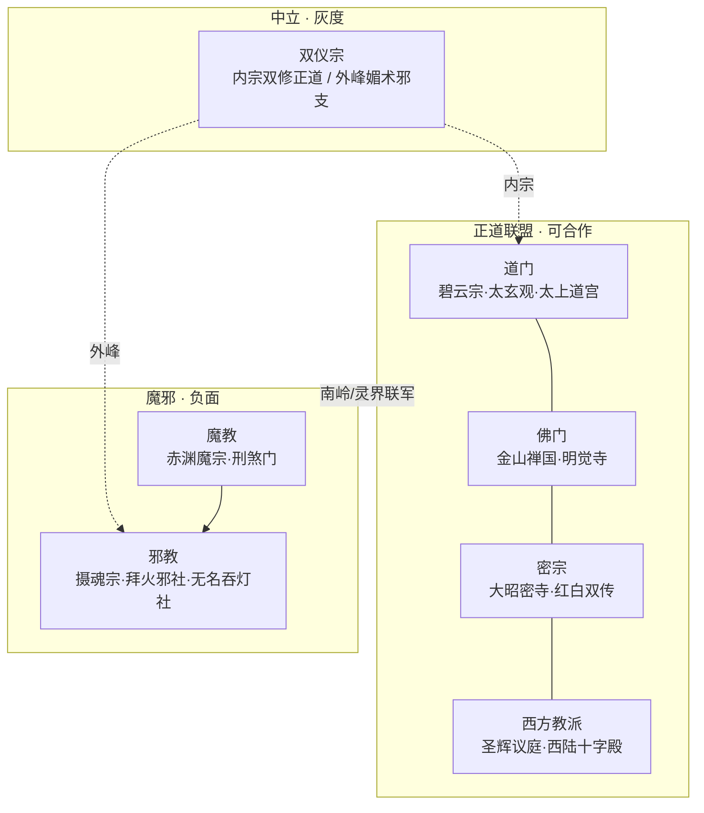

# 九教势力与正魔线

> **定位**：人界～仙界 **1560 章** 势力地图；双仪宗、道/佛/密/西教为 **可合作正面或中立**，魔教/邪教为 **负面**。  
> **硬规**：双仪宗不写低俗直写；陈寻 **不修媚术**、不纳双仪女为道侣；正魔边界清晰但 **非脸谱**。

---

## 一、势力总图



---

## 二、势力速查

| 势力 | 性质 | 总部/活动区 | 核心功法 | 与陈寻关系 |
|------|------|-------------|----------|------------|
| **碧云宗** | 道门首宗 | 东陆碧云山 | 青冥诀、丹道 | 本宗 |
| **太玄观** | 道门 | 西脉道观群 | 清微符箓 | 435 符箓交流 |
| **太上道宫** | 道门 | 中州 | 守拙经 | 1170 飞升前盟 |
| **金山禅国** | 佛门 | 南荒 | 金刚禅、渡厄 | 655 联手抗魔 |
| **明觉寺** | 佛门 | 南岭 | 般若心咒 | 680 沈墓旁禅院 |
| **大昭密寺** | 密宗 | 西荒高原 | 真言、护摩 | 820 灵界初 |
| **红白双传** | 密宗支 | 高原外院 | 坛城、明妃（非媚术） | 845 助渡劫 |
| **圣辉议庭** | 西教 | 西陆 | 圣光术、誓约 | 920 灵界 |
| **西陆十字殿** | 西教 | 西陆圣城 | 十字封印 | 950 封邪 |
| **双仪宗** | 中立灰 | 南疆花雨谷 | 阴阳和合经 | 165～188/405/528 |
| **赤渊魔宗** | 魔教 | 沧溟海血岛 | 血炼、噬灵 | 440 裘投、510 秦 |
| **刑煞门** | 魔教 | 沧溟海·各域 | 煞气、追杀 | 521～650 |
| **摄魂宗** | 邪教 | 地下 | 夺魂、炼魄 | 318 铺垫、545 |
| **拜火邪社** | 邪教 | 西域 | 焚魂祭 | 875 灵界 |
| **无名吞灯社** | 邪教 | 隐秘 | 吞命灯 | 终卷 1440 |

---

## 三、双仪宗剧情线（专章 · 非低俗）

> **参照**：流行修仙「合欢」公共题材，本作分 **内宗正道**（阴阳调和、不害命）与 **外峰邪支**（媚术控心、采补），陈寻只与 **内宗** 有正面对话。

### 3.1 内宗 vs 外峰

| 分支 | 理念 | 立场 | 代表 |
|------|------|------|------|
| **内宗** | 双修需两情，不采补、不控心 | 可合作 | 花雨仙子·路照庭 |
| **外峰** | 媚术夺运、拍卖炉鼎 | **负面**（近邪教） | 外峰长老·费烟萝 |

### 3.2 章节锚点

| 章 | 事件 | 情感/担当 | 衔接 |
|----|------|-----------|------|
| **165** | 周家逼嫁：费烟萝出价买沈清弦「外峰籍」 | 危浪起 | 二部末钩 |
| **188** | 陈寻雨夜护短，拒双仪宗契 | 燃前夜 | 未筑基不还省亲 |
| **405** | 七派天试·丹情双试：路照庭 vs 陈寻理念辩 | 无暧昧 | 陈寻胜在「恩义不交易」 |
| **528** | 沧溟海前：路照庭赠**契符·和合符**（助道侣护关，非媚术） | 馈缘 | 420 契缘后可用 |
| **655** | 南岭魔劫：内宗助战，外峰投**赤渊魔宗** | 正邪分野 | 与金山禅国并列 |

**硬规**：
- 不写陈寻修双仪功  
- 不写沈清弦入外峰  
- 路照庭 **不夺主绶**，与陈寻 **道友** 而已  
- 男欢女爱仍只在沈清弦线（95/188/272/420/719）

### 3.3 双仪宗 × 馈缘

| 赠礼 | 章 | 回赠 |
|------|-----|------|
| 陈寻赠培元丹给路照庭弟子 | 406 | 和合符 528 |
| 拒收费烟萝灵石 | 188 | 阳因+5（不交易人命） |

---

## 四、道门（正面 · 主轴）

> 碧云宗为 **道门首宗**；陈寻一生主战场。

| 阶段 | 章区 | 剧情 |
|------|------|------|
| 入门 | 51～130 | 碧云杂役、药园 |
| 崛起 | 131～260 | 大比、伏龙塔 |
| 天试 | 391～520 | 七派以道门为主办 |
| 叛线 | 440 | 裘横秋投 **赤渊魔宗**（非道门内乱简单化处理：道门清理门户） |
| 飞升 | 1170 | 太上道宫 **开榜盟** |

**道门三策**（陈寻同调）：守拙、不浪、恩仇分明。

---

## 五、佛门（正面）

| 章 | 事件 | 人物 |
|----|------|------|
| **655** | 南岭正魔大战：金山禅国 **金刚阵** 阻赤渊魔宗 | 静岸禅师 |
| **680** | 沈墓旁明觉寺：陈寻守墓三年，僧不劝放下 **只供茶** | 忘机僧 |
| **910** | 灵界初：佛门接引域，免陈寻误闯 | 渡厄菩萨（法相） |
| **1300** | 渡劫：苦渡以 **禅心镜** 助抗心魔（不替劫） | — |

**与陈寻**：敬而不拜，恩在 **不扰守墓**。

---

## 六、密宗（正面）

| 章 | 事件 | 人物 |
|----|------|------|
| **820** | 灵界：大昭密寺 **护摩火** 助融幽泉寒火 | 扎西格桑 |
| **845** | 红白双传 **坛城** 稳陈寻神魂（沈别后心魔） | 卓玛 |
| **1080** | 混沌元火：密教 **火供** 仪式（原创，非邪祭） | — |

**硬规**：密宗明妃线 **不写** 陈寻；仅作护法合作。

---

## 七、西方教派（正面）

| 章 | 事件 | 人物 |
|----|------|------|
| **920** | 灵界西域：圣辉议庭 **圣光誓约** 共抗魔潮 | 艾德里安修士 |
| **950** | 西陆十字殿 **封印拜火邪社** 分支 | 十字军修女·伊莎贝拉 |
| **1170** | 大乘前：四教 **开榜会盟**（道佛密西） | 各派代表 |
| **1420** | 真仙：圣辉 **见证飞升**（不抢功） | — |

**设定**：西教以 **誓约与封印** 见长，与道门 **符箓** 互补；原创名，不抄现实宗教。

---

## 八、魔教（负面）

| 势力 | 章区 | 罪行 | 陈寻应对 |
|------|------|------|----------|
| **赤渊魔宗** | 440/510/655 | 裘横秋、秦无殇投靠；血炼凡人 | 510 诛秦；655 联军方 |
| **刑煞门** | 521～650 | 追杀令、夺宝 | 521～580 逃杀反杀 |

**秦无殇线**：440 投赤渊 → 510 沧溟诛（报仇章）。

**裘横秋线**：440 叛投赤渊杀回，**欲拉岳垫背**；岳力战**拖裘同陨**（裘先死）；**378** 托孤在前（第三部末）。

---

## 九、邪教（负面 · 比魔教更脏）

| 势力 | 章区 | 特征 | 结局 |
|------|------|------|------|
| **摄魂宗** | 318/545 | 夺魂炼魄、控尸 | 545 陈寻破坛 |
| **拜火邪社** | 875 | 焚魂祭、蛊惑凡人 | 950 西教封印 |
| **无名吞灯社** | 1440 | 吞命灯、仿青冥瓶 | 1550 终局破 |

**与魔教区别**：邪教 **害凡人**、 **亵渎信仰**；魔教 **争资源**、 **宗门战争**。

---

## 十、十二部 · 教派植入表

| 部 | 章 | 双仪宗 | 道门 | 佛 | 密 | 西教 | 魔 | 邪 |
|----|-----|--------|------|----|----|------|----|----|
| 一 | 1～130 | — | 碧云入门 | 传闻 | — | — | — | — |
| 二 | 131～260 | **165/188** | 主峰 | — | — | — | — | — |
| 三 | 261～390 | 余波 | 备战 | — | — | — | — | **318摄魂** |
| 四 | 391～520 | **405** | 天试 | 观礼 | — | — | **440/510赤渊** | — |
| 五 | 521～650 | **528** | — | — | — | — | **刑煞** | **545** |
| 六 | 651～780 | — | 道盟 | **655/680** | — | — | **655大战** | — |
| 七 | 781～910 | — | 跨界 | 910 | **820/845** | — | 余孽 | — |
| 八 | 911～1040 | — | — | — | — | **920/950** | — | **875拜火** |
| 九 | 1041～1170 | — | 1170盟 | 1170 | **1080** | **1170** | — | — |
| 十～十二 | 1171～1560 | 故人 | 终 | 终 | 终 | 终 | 终 | **1440吞灯** |

---

## 十一、正魔大战时间轴（扩充 500 万）

```
188 拒双仪外峰
  ↓
440 赤渊魔宗+裘叛
  ↓
510 诛秦（沧溟海）
  ↓
545 破摄魂宗
  ↓
655 南岭四教联军 vs 赤渊（道佛双仪内宗）
  ↓
875 拜火邪社
  ↓
1170 四教开榜
  ↓
1440 吞灯社
  ↓
1555 证道
```

---

## 十二、情感/恩仇与教派

| 原则 | 说明 |
|------|------|
| 恩施章 | 可遇佛门施粥、道观赠符，**不杀人** |
| 报仇章 | 诛魔、破邪坛，**不温存** |
| 双仪 | 188 护短 = 担当，非争风吃醋 |
| 陈寻 | 不转投任何教派，终为 **碧云·青冥一脉** |
| 路照庭 | 道友，不入主绶 |

---

## 十三、新增人物（教派）

| 人物 | 势力 | 章 | 功能 |
|------|------|-----|------|
| 路照庭 | 双仪内宗 | 405/528/655 | 理念对手→战友 |
| 费烟萝 | 双仪外峰 | 165/188 | 反派，后投赤渊 |
| 静岸禅师 | 佛门 | 655/680 | 正面，不啰嗦 |
| 忘机僧 | 明觉寺 | 680 | 守墓邻居 |
| 扎西格桑 | 密宗 | 820 | 融火助 |
| 艾德里安 | 圣辉议庭 | 920 | 灵界盟 |
| 赤渊老祖 | 魔教 | 655/未死 | 后期劫 |
| 摄魂尊者 | 邪教 | 545 | 部内 BOSS |

---

## 十四、扩写密度（+约 90 章当量）

| 块 | 章当量 | 万字约 |
|----|--------|--------|
| 双仪三线 | 25 | 8 |
| 道门深化 | 20 | 6.4 |
| 佛密西 | 25 | 8 |
| 魔教 | 已有 | — |
| 邪教单元 | 20 | 6.4 |

---

## 关联文档

- 总纲植入：`04-十二部剧情总纲`  
- 情感：`08`（188 双仪逼嫁）  
- 报仇：`03`（510/545）  
- AUDIT：`09` **v3.4**  
