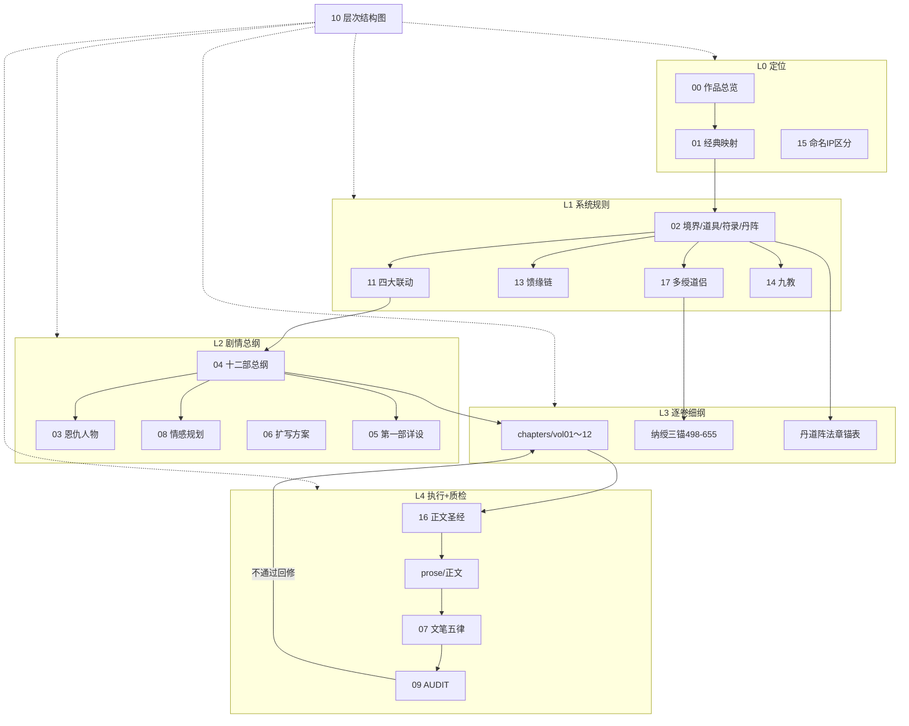

# 《凡人修真传》文档目录

> **独立 IP**：与《还礼仙翁传》《凡骨丑翁逆仙路》《万古守灯人》**无设定、命名关联**。命名标准见 `15-命名与IP区分.md`。  
> **篇幅目标**：约 **500 万字** · **1560 章**（正文硬规 **2000～3000 字/章**，见 `16` §2.2）  
> **最后修订**：2026-07-11（AUDIT **v3.21** · **全维 10.0** · 连载《凡人修真传》）

---

## 文档索引

| 序号 | 文件 | 内容 |
|------|------|------|
| 00 | [作品总览](./00-作品总览.md) | 定位、500 万篇幅公式 |
| 01 | [三部经典参考与剧情映射](./01-三部经典参考与剧情映射.md) | 凡人/斗破/斗罗 + 流行趋势 |
| 02 | [修炼道具系统速查](./02-修炼道具系统速查.md) | 境界、道具九阶、符录九品、丹道§十六、阵法§十七、**恩仇记心里§十八** |
| **27** | [**凡人修仙传修炼体系总纲**](./27-凡人修仙传修炼体系.md) | **三界·境界·灵根·破境·原著与本作对照** |
| 03 | [人物情感与恩施报仇](./03-人物情感与报恩复仇.md) | 低谷恩施、道侣、报仇 |
| 04 | [十二部剧情总纲](./04-十二部剧情总纲.md) | **1560 章**分部 |
| 05 | [开篇篇青牛村与入门](./05-开篇篇青牛村与入门.md) | 第 1～130 章详设 |
| 06 | [五百万字扩充方案](./06-五百万字扩充方案.md) | 三部经典扩充映射 |
| 07 | [文笔规范与衔接五律](./07-文笔规范与衔接五律.md) | 简洁爽快、锚点表 |
| 08 | [情感线高潮跌宕规划](./08-情感线高潮跌宕规划.md) | 主浪/副浪 |
| 09 | [AUDIT衔接与一致性校验](./09-AUDIT衔接与一致性校验.md) | 全文审计 **v3.13** |
| 10 | [整体层次结构图](./10-整体层次结构图.md) | **一图总览** |
| 11 | [四大联动系统](./11-四大联动系统（道侣·因果·升天·恩施）.md) | 恩施·因果·道侣·升天一 |
| 12 | [剧情与系统统计比例](./12-剧情与系统统计比例.md) | **各类占比一览** |
| 13 | [馈缘赠礼主线链](./13-馈缘赠礼主线链（纳绶·辅修）.md) | **赠礼→倒贴→纳绶→升天** |
| 14 | [九教势力与正魔线](./14-九教势力与正魔线.md) | **双仪/道佛密西/魔邪** |
| 15 | [命名与IP区分](./15-命名与IP区分.md) | **与还礼仙翁传零重名** |
| **17** | [**多绶道侣与家族线**](./17-多绶道侣与家族线.md) | **后宫收集·主次·家族** |
| **16** | [**正文写作参考圣经**](./16-正文写作参考圣经.md) | **扩写正文唯一执行手册** |
| **18** | [**起点十分化投稿方案**](./18-起点十分化投稿方案.md) | 书名·简介·黄金三章·10分路线图 |
| **19** | [**策划方案九分六质检**](./19-策划方案九分六质检.md) | **策划 10.0** |
| **26** | [**全维迭代验收清单**](./26-全维迭代验收清单.md) | **v3.21 全维 10.0** |
| **25** | [**正文十分化质检**](./25-正文十分化质检.md) | 正文 10.0 |
| **24** | [**起点连载评分报告**](./24-起点连载评分报告.md) | 综合 10.0 |
| **23** | [**十维起点满分策划白皮书**](./23-十维起点满分策划白皮书.md) | 十维评分 · 投稿一站式包 |
| **20** | [全书悬念回收总表](./20-全书悬念回收总表.md) | 伏笔埋收一览 |
| **21** | [核心人设弧光总表](./21-核心人设弧光总表.md) | 主角/五灵/四绶弧 |
| **22** | [策划风险与对策登记](./22-策划风险与对策登记.md) | R1～R10 风险 |
| — | [chapters/](./chapters/README.md) | 逐卷章纲 |
| — | [丹道阵法章锚表](./chapters/丹道阵法章锚表.md) | **丹道七品 · 阵道七阶** 全书锚点 |
| — | [全书锚章索引](./chapters/全书锚章索引.md) | **1560 章快查** · 三锚 |
| — | [三锚爆点专纲](./chapters/三锚爆点专纲-404-781-1170.md) | **404/781/1170** 防掉追 |
| — | [纳绶三锚专纲](./chapters/纳绶三锚专纲-498-655.md) | 498～655 侧/方/虞扩写 |
| — | [prose/](./prose/README.md) | **正文存放目录** |

## 写作顺序

1. **`16` 正文写作参考圣经**（扩写前必读）  
2. `00` → `01` → `02` → **`11`**  
3. 对照 `chapters/volXX` 章纲 + `15` 命名  
4. 正文写入 **`prose/volXX/`**（用 `_模板-章正文.md`）  
5. `03` + `08` 对照情感 · 每部完成用 `09` 复查  

---

## 正文扩写入口

| 步骤 | 文档 |
|------|------|
| 规则与模板 | [`16-正文写作参考圣经.md`](./16-正文写作参考圣经.md) |
| 章纲 | [`chapters/`](./chapters/README.md) |
| 正文目录 | [`prose/`](./prose/README.md) |
| 单章模板 | [`prose/_模板-章正文.md`](./prose/_模板-章正文.md) |

---

## 版本说明

| 版本 | 章数 | 状态 |
|------|------|------|
| 500 万字版 | **1560** | **策划 10.0 · 正文 10.0 · 综合 10.0** |

---

## 策划链闭环（v3.13）

> **定义**：从 IP 定位 → 系统规则 → 十二部总纲 → 逐卷细纲 → 正文执行 → AUDIT 复查，**每一环有文档、有锚点、有回链**。

### 闭环检查表

| 环 | 文档 | 下游消费 | 状态 |
|----|------|----------|------|
| 定位 | 00/01/15 | 全书命名与风格 | ✅ |
| 系统 | 02/11/13/14/17 | 04/KPI/八要素 | ✅ |
| 总纲 | 04/03/08/06 | vol01～12 块结构 | ✅ |
| 细纲 | vol01～12 + 纳绶 + 丹阵 | 16/prose | ✅ |
| 执行 | 16/07/prose | 连载正文 | ⏳ 正文待写 |
| 质检 | 09 AUDIT | 回修细纲/设定 | ✅ v3.18 · 策划 **9.96** |

**唯一写作入口**：`16` → `chapters/volXX` + `15` → `prose/volXX/` → `09` 复查。
