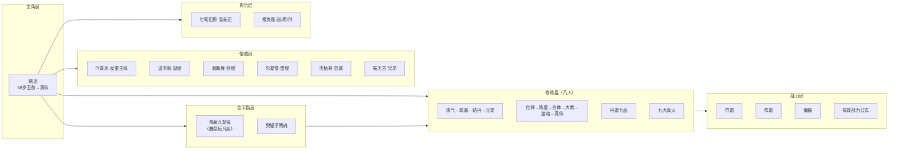
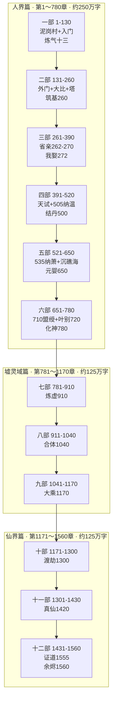
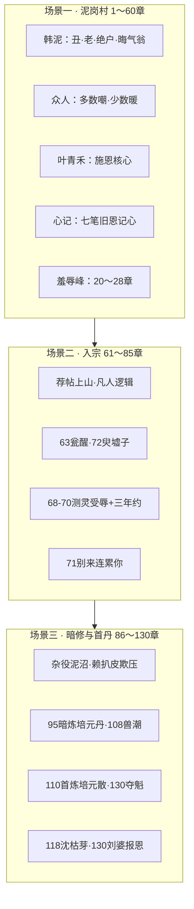
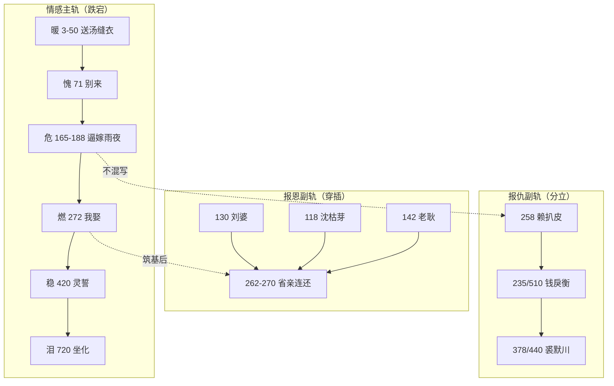
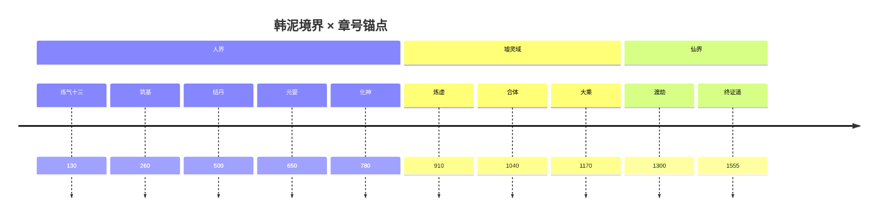
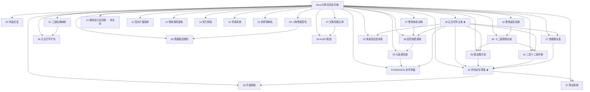
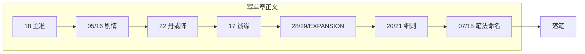

# 《凡骨丑翁逆仙路》整体设计结构层次图

> **版本**：500 万字 · 1560 章 · 十二部（AUDIT **v37**）  
> **用途**：总览 IP 定位、参考来源、子系统、剧情地图、情感恩仇、**策划写作链（四表+辅表）**、文档架构。

---

## 一、总层次结构（自上而下）

```mermaid
flowchart TB
    subgraph L0["L0 · 作品内核"]
        CORE["凡骨丑翁逆仙路<br/>丑骨迟暮 · 有恩必还 · 有仇必报"]
    end

    subgraph L1["L1 · 三部经典参照（只借套路）"]
        FP["斗破苍穹 35%<br/>受辱立约·丹道·大比·闯塔·沉礁海"]
        FR["凡人修仙传 40%<br/>境界·坊市·宗门政治·换地图"]
        DL["斗罗大陆 25%<br/>测灵·战队·天试·真火仪式"]
    end

    subgraph L2["L2 · 九子系统"]
        SYS1["修炼系统<br/>凡人十二境+丹道+真火+符录阵法"]
        SYS2["金手指系统<br/>腌菜坛=鸿蒙九劫瓮+臾墟子"]
        SYS3["战力系统<br/>境界×道具×符录×阵盘"]
        SYS14["符录系统<br/>凡符→道符九阶"]
        SYS20["丹道系统<br/>七品·四脉五诀"]
        SYS21["阵法系统<br/>九阶·丹阵跨章"]
        SYS22["丹阵必写表<br/>互斥分章"]
        SYS27["修炼总纲27<br/>品阶28·名谱29"]
        SYS28["EXPANSION<br/>小境/洞府/破境KPI"]
        SYS4["情感系统<br/>叶青禾五浪+温听雨+萧断雁"]
        SYS5["恩仇系统<br/>心记七笔旧恩+报仇账+分立叙事"]
        SYS6["道侣系统<br/>正绶·副绶·剑绶·盟绶"]
        SYS7["因果系统<br/>恩仇善恶四因+天劫清算"]
        SYS8["眷升系统<br/>鸡犬升天·1555揭晓"]
        SYS9["道具系统<br/>凡品→道品九阶"]
        SYS10["馈缘链<br/>赠礼→四维→纳绶"]
        SYS11["洞府系统<br/>七阶六区"]
        SYS12["灵宠坐骑<br/>宠绶+遁行"]
        SYS13["势力阵营<br/>道佛密西正·魔邪负"]
    end

    subgraph L3["L3 · 叙事引擎"]
        ENG1["简洁爽快笔法<br/>短句·一章一事·章末钩"]
        ENG2["衔接五律<br/>伏笔·状态·因果·地图栓"]
        ENG3["每境五拍<br/>攒资源·秘境·大会·追杀·破境"]
    end

    subgraph L4["L4 · 十二部剧情地图（1560章）"]
        P1["一部 泥岗炼气"]
        P2["二部 大比筑基"]
        P3["三部 省亲娶妻"]
        P4["四部 七宗天试"]
        P5["五部 沉礁海争丹"]
        P6["六部 南荒叶别"]
        P7["七～十二部 墟灵域→仙界→证道"]
    end

    subgraph L5["L5 · 文档工程"]
        DOC["00～29+EXPANSION<br/>AUDIT v37 · 18正文主准"]
    end

    CORE --> L1
    L1 --> L2
    L2 --> L3
    L3 --> L4
    L4 --> L5
```



---

## 二、子系统层次分解



---

## 三、剧情地图层次（十二部 × 人界→仙界）



---

## 四、第一部微观层次（低谷期展开示例）



---

## 五、情感与恩仇双轨层次



---

## 六、境界里程碑层次（与剧情对齐）



---

## 七、文档工程层次



---

## 八、策划写作链层次（四表+系统表 · v37 正文落笔）



| 表 | 文档 | 章范围 | 核心问题 |
|----|------|--------|----------|
| **剧情表** | `05` v2 | 1～130 | 这段发生什么？ |
| **剧情表** | `16` v2 | 131～1560 | 这段发生什么？ |
| **丹阵表** | `22` | 全书 | 本章写丹还是写阵？ |
| **馈缘表** | `17` v2 | 全书 | 有无赠礼/纳绶/心记？ |
| **系统表** | `28`/`29`/EXPANSION | 全书 | 小境/品阶/洞府/破境丹/七品类 KPI？ |

**硬规**：炼丹与布阵 **不同章高潮**；丹阵双绝用 **跨章联动**（`22` §五）。

### 各部丹阵节奏速查

| 部 | 丹阵特征 |
|----|----------|
| 一 | **只丹不阵**（95·108·110·130） |
| 二 | 丹为主；**249** 首次阵试 |
| 三 | 丹阵交错（268阵→269丹→378阵…） |
| 四 | 天试；**497阵/498丹/519阵/520丹** |
| 五～六 | 立府阵+炼丹交替 |
| 七～八 | **丹阵跨章联动**主段（812/820、948/952、995/1000） |
| 九～十二 | 逆劫丹+封阵+渡劫阵 |

---

## 九、三层对照一览表

| 层次 | 是什么 | 关键产出 |
|------|--------|----------|
| **战略层** | 定位+参照+命题 | 丑老头凡人流逆袭 |
| **系统层** | 修炼/金手指/战力/情感/恩仇/丹阵 | `02`、`11`、`20`、`21` |
| **战役层** | 十二部地图+里程碑 | `04` 总纲 |
| **执行层** | 章段+丹阵列+馈缘+道侣 | **`05`/`16` v2 + `17` v2 + `22` + `19`** |
| **正文层** | 写章流程+文档优先 | **`18` 正文写作主准** |
| **质控层** | 衔接+一致性+AUDIT | `07`、`09` v13+ |
| **工程层** | 文档目录 | README + 本层次图 |

---

## 十、核心高潮层次（全书节点金字塔）

```
                    ┌─────────────┐
                    │ 1560 余烬轮回 │
                    └──────┬──────┘
               ┌───────────┴───────────┐
               │ 1555 终证道（丑骨不改）│
          ┌────┴────┐              ┌────┴────┐
          │1420 仙界│              │1300 渡劫 │
     ┌────┴────┐   │         ┌────┴────┐    │
     │ 780化神  │   │         │ 650元婴  │    │
┌────┴────┐ ┌──┴───┴──┐ ┌────┴────┐ ┌──┴──┐
│ 720叶别 │ │510诛戾衡  │ │ 500结丹  │ │272娶│
└────┬────┘ └────┬────┘ └────┬────┘ └──┬──┘
     │           │           │          │
     └───────────┴─────┬─────┴──────────┘
                       │
              ┌────────┴────────┐
              │ 262-270 省亲报恩 │
              └────────┬────────┘
                       │
              ┌────────┴────────┐
              │ 235大比 260筑基  │
              └────────┬────────┘
                       │
              ┌────────┴────────┐
              │ 70三年约 130炼气 │
              └────────┬────────┘
                       │
              ┌────────┴────────┐
              │ 1-50 泥岗旧恩心记 │
              └─────────────────┘
```

---

## 十一、阅读本图建议

1. 先看 **§一总层次**：把握 L0→L5 全貌  
2. 再看 **§三剧情地图**：十二部如何铺 500 万字  
3. **写正文前看 §八策划写作链** + `18`  
4. 写第一部：`05` v2 → `22`（95/108/110/130）→ `17` §二  
5. 写二～十二部：`16` v2 → `22` → `17` → `20`/`21`  
6. 写情感戏：**§五双轨** + `08` + `19`  
7. 查境界道具：**§六** + `02`；查丹阵细则：`20`/`21`
