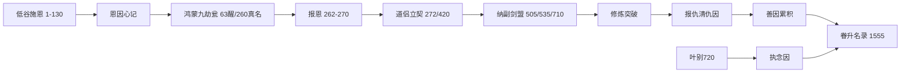

# 四大扩展系统：道侣 · 道具 · 鸡犬升天 · 因果

> 与修炼体系（`02`）、恩仇情感（`03`）联动。章号为 **1560 章 / 500 万字** 唯一标准（一部 130 章内低谷加长，见 `05`）。

---

## 一、因果系统（统领恩仇与突破）

### 1.1 设计定位

**恩仇三层记法**（全书铁规）：

1. **记在心中**——韩泥心里牢记，自称 **记心翁**；读者见眼神/动作/心里盘点。  
2. **记在鸿蒙九劫瓮**——金手指瓮内九劫符纹铭恩仇（青恩/赤仇/白善/黑恶），非外物册簿。  
3. **瓮驻神识**——瓮醒（63）后神识可感瓮；筑基（260）后真名显露，一念即察未清因果。

**废止零出现**：恩簿、袖中簿、泥瓮簿、丑翁账、空白册、恩账册、因果簿——**禁系统面板**。  
**唯一金手指**：腌菜坛（凡相）= **鸿蒙九劫瓮**（真名，仙界争夺至宝）。  
**凡人修仙**式：因果不清，突破有劫；**斗破**式：恩怨到了该还该报的时候，读者爽。

### 1.2 四类因果

| 类型 | 记号 | 来源 | 后果 |
|------|------|------|------|
| **恩因** | ＋青 | 施恩、救人、赠丹 | 不清则心魔；还清可减劫 |
| **仇因** | ＋赤 | 受辱、迫害、背叛 | 不清则道心裂；报清可凝煞助战 |
| **善因** | ＋白 | 救凡人、赈灾、开渠 | 天劫减一分、鸡犬名额＋ |
| **恶因** | ＋黑 | 滥杀、夺恩、背诺 | 天劫加一分、心魔加重 |

### 1.3 鸿蒙九劫瓮反馈规则

1. **低谷心记**：恩因必记心里；仇因只记不立刻报（韩泥报仇三则）；瓮眠期仅坛壁水汽/符影半闪应恩。  
2. **瓮铭示警**：瓮醒后恩仇同步铭于瓮内符纹；神识一荡即察——**不是翻册，是感瓮**。  
3. **突破清算**：每次大境突破前，瓮内光/符纹自发示警「尚有×笔未清」。  
4. **天劫挂钩**：渡劫 **1300** 时，善因抵恶因；未清仇因化心魔劫。  
5. **与七笔旧恩**：七笔旧恩 = 恩因核心；报仇账 = 仇因核心。  
6. **瓮眠铁规**：蒙尘无光/内息尽敛/如凡物——**禁**细缝/底漏/釉裂等「漏」暗示；**禁**主角主动滴血醒瓮。  
7. **血脉认主**：仅 **守瓮血亲**（韩氏末脉）之血被动渗坛沿可醒；外人血无效（`03` §祖传血缘）。

### 1.4 关键章锚

| 章 | 事件 |
|----|------|
| 2 | **瓮眠**（腌菜坛蒙尘如凡物） |
| 35 | 韩泥立「必还」→ 恩因固化（心记） |
| 63 | **瓮醒**（血误触坛沿，**韩氏血脉认主**，被动激活） |
| 130 | 还刘婆，恩因－1 |
| 260 | 筑基，**真名显露**（鸿蒙九劫瓮） |
| 262～270 | 省亲连还，恩因大减 |
| 510 | 诛戾衡，仇因－1 |
| 720 | 叶青禾坐化，恩因「未尽」转 **执念因**（鸡犬系统伏笔） |
| 1300 | 渡劫因果清算 |
| 1555 | 终证道，**鸿蒙九劫瓮证道** |

---

## 二、道侣系统（多侣后宫 · 详见 `19`）

### 2.1 位阶（主次分明）

| 阶 | 名称 | 上限 | 说明 |
|----|------|------|------|
| **正** | **正绶侣** | 1 | 发妻主母 | 叶青禾 |
| **副** | **副绶侣** | 1～2 | 侧室立契 | 温听雨；**杜烟萝**（1285） |
| **剑** | **剑绶侣** | 1 | 剑修护道 | 萧断雁 |
| **盟** | **盟绶侣** | 0～1 | 势力盟约纯契 | 乐凝雪（可选） |
| **遗** | **遗念侣** | — | 已逝执念 | 叶青禾（720后） |

韩泥担当：**纳则不负**；正绶掌家，副绶掌丹阁，剑绶掌外事；家族并进主线（`19` §四）。

### 2.2 道侣契约（礼法立契）

| 阶段 | 章 | 仪式 | 对象 |
|------|-----|------|------|
| 心意 | 188 | 雨夜，未立契 | 叶 |
| 正绶 | **272** | 当众「我娶」 | 叶青禾 |
| 道侣誓 | **420** | 灵誓 | 叶青禾 |
| 副绶① | **505** | 副绶立契（叶点头） | 温听雨 |
| 副绶② | **1285** | 赎纳立契（灭魔后） | 杜烟萝 |
| 剑绶 | **535** | 剑绶立契 | 萧断雁 |
| 盟绶 | **710** | 盟约纯契（可选） | 乐凝雪 |
| 遗念 | **720** | 坐化 | 叶青禾 |

### 2.3 道侣权益

- **合修**：正绶+副绶合炼，成功率＋  
- **合阵**：叶掌丹、温辅丹、萧护剑  
- **合劫**：1300 渡劫，叶执念+温萧魂印各护一重  
- **眷升**：1555 **七名额**含温、萧（`19` §六）
- **身边馈修**：主角每破大境，必给道侣 **全份**修炼资源；婢仆给 **差少一截**（约七～八成）——详见 `19` §五附 · `03` §身边馈修
- **丹道随缘分丹**：丹道每突破一层后，炉成杂丹 **不定期、不定时**按需分给道侣——`03`/`20` §9.1

### 2.4 情感与道侣对照

| 人物 | 道侣位 | 家族 | 情感浪 |
|------|--------|------|--------|
| 叶青禾 | 正绶→遗念侣 | 泥岗叶氏 | 主浪 |
| 温听雨 | 副绶① | 沉丹温氏 | 妒→护→纳 |
| 杜烟萝 | 副绶② | 栖香邪脉→弃邪 | 拒媚→投魔→叛助→赎纳 |
| 萧断雁 | 剑绶 | 锈剑堂萧氏 | 敬→纳→共战 |
| 乐凝雪 | 盟绶（可选） | 栖香乐氏 | 盟约恩义 |

---

## 三、一人得道鸡犬升天系统

### 3.1 设定名：**「眷升名录」**

天道规则：**终证道**（1555）时，可携 **恩因未尽者** 一缕魂入仙界边陲（非全复活，是「眷升」）。

### 3.2 名额规则

```
眷升总名额 = 境界基础名额 + 善因加成 − 恶因扣减
```

| 境界 | 基础名额 | 可携对象 |
|------|----------|----------|
| 元婴 | 0 | — |
| 化神 | 1 | 灵宠/器灵 |
| 合体 | 2 | ＋弟子 |
| 大乘 | 3 | ＋道侣残念 |
| 真仙 | **7** | ＋道侣魂（正遗念+副+剑）+恩人 |

### 3.3 韩泥眷升名单（1555 · 七名额 · 见 `19` §六）

| 序 | 对象 | 类型 |
|----|------|------|
| 1 | 臾墟子残念 | 器灵 |
| 2 | 沈枯芽 | 弟子 |
| 3 | 叶青禾执念因 | 遗念正绶 |
| 4 | 温听雨 | 副绶魂 |
| 5 | 萧断雁 | 剑绶魂 |
| 6 | 铁无言 | 兄弟从绶（生人） |
| 7 | 聋叔老耿 | 恩人魂印 |

乐凝雪盟绶：善因魂印，不占 7 名额。

### 3.4 叙事功能

- 前期施恩 = 后期眷升伏笔（读者二刷爽）。  
- 叶青禾虽坐化，1555 终证道时「一缕温汤气」入仙界——与开篇送汤呼应。

---

## 四、道具品阶体系（原创九阶）

### 4.1 总阶表

| 阶 | 名称 | 别称 | 持有者典型境界 | 例 |
|----|------|------|----------------|-----|
| 0 | **凡品** | 俗物 | 凡人 | 柴刀、破袄 |
| 1 | **灵品** | 蕴灵 | 炼气 | 下品灵石、培元散 |
| 2 | **宝品** | 法宝胚 | 筑基 | 瓮底泥炉 |
| 3 | **玄品** | 通玄器 | 结丹 | 沉礁舟 |
| 4 | **地品** | 镇地宝 | 元婴 | 护体法袍 |
| 5 | **天品** | 通天器 | 化神 | 泥丹阁大阵眼（**519** 玄→**850** 天） |
| 6 | **圣品** | 圣者器 | 炼虚 | 混沌元火容器 |
| 7 | **仙品** | 真仙器 | 合体～大乘 | 逆劫丹炉 |
| 8 | **道品** | 证道器 | 渡劫～真仙 | 寂灭心焰瓮 |

> 口语：「灵宝玄地天，圣仙道」七字诀（韩泥教沈枯芽背）。

### 4.2 特殊类道具

| 类 | 说明 |
|----|------|
| **丹药** | 一至七品，对齐丹道（`02`/`20`） |
| **符录** | 凡符→道符九阶；遁爆封护幻镇驱疗 | 详见 `14` |
| **阵盘** | 聚灵、杀、幻、护洞、丹阵；随境升级 | 详见 `21` |
| **傀儡** | 臾墟子遗赠，筑基傀儡→元婴傀儡 |
| **真火** | 九大真火，视同玄品～道品成长资源 |

### 4.3 韩泥主线道具升阶

| 道具 | 起 | 终 |
|------|-----|-----|
| 鸿蒙九劫瓮（腌菜坛凡相） | 凡品 | 道品（寂灭心火瓮） |
| 瓮底泥炉 | 宝品 | 天品（丹阁镇物） |
| 疤痕剑 | 凡品旧剑 | 地品（融庚金裂焰） |

---

## 五、四大系统 × 剧情衔接



---

## 六、与三部经典映射

| 系统 | 斗破 | 凡人 | 斗罗 |
|------|------|------|------|
| 因果 | 三年约=仇因 | 心魔劫 | — |
| 道侣 | 萧薰儿式坚守 | 南宫婉式凡侣 | 小舞式并肩 |
| 道具 | 异火阶 | 法器法宝 | 魂骨（映射真火） |
| 鸡犬升天 | 携妻飞升 | 墟灵域带人 | 神界传承 |

---

## 七、写法硬规

1. 因果变化 **显性写**（心里清点/瓮内光/符纹示警）。  
2. 道侣后宫：主次分明，纳则不负；家族入戏（`19`）。  
3. 道具升级跟境界，不跳阶。  
4. 眷升名单前期只埋不剧透，**1555** 揭晓。  
5. 馈缘链见 `12`：赠礼对口、倒贴有因、纳绶不滥。
6. **禁自刎**：角色死亡一律战死拖垫背，不写自尽、吞毒、自毁金丹（寿尽坐化除外）。
7. **禁主动滴血醒瓮**；瓮眠禁写细缝/底漏/釉裂。
