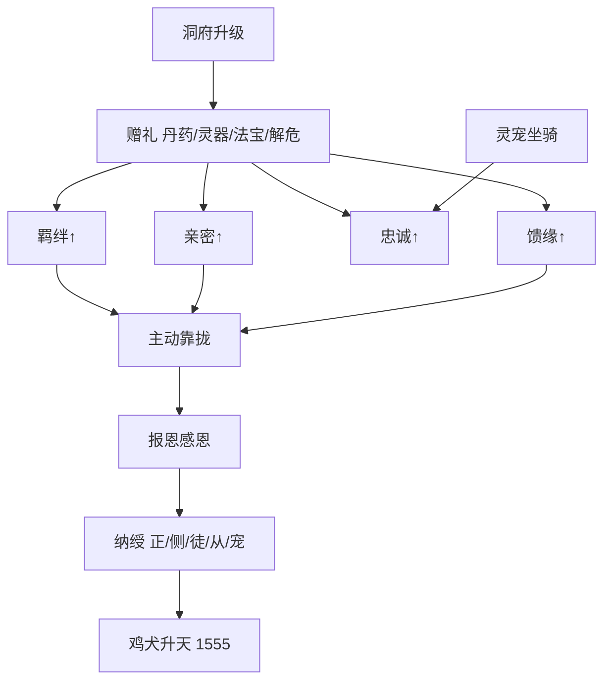

# 馈缘羁绊链 · 道具详表 · 灵宠坐骑 · 洞府系统

> **1560 章 / 500 万字** 标准。与 `11`（因果·道侣·眷升）、`02`（修炼道具）、`03`（恩仇情感）联动。  
> **主线穿插原则**：赠礼不是刷数值，是 **还恩、救急、立威** 的叙事动作；每 15～25 章至少 1 次「赠礼→关系变化」显性描写。

---

## 一、馈缘羁绊链（贯穿全书）

### 1.1 总链路

```
赠礼 → 羁绊↑ / 亲密↑ / 忠诚↑ / 馈缘↑ → 主动靠拢（倒贴） → 报恩感恩 → 纳绶 → 鸡犬升天
```

| 环节 | 叙事含义 | 韩泥特色 |
|------|----------|----------|
| **赠礼** | 丹药、灵器、解危、安置 | 低谷只收不还；筑基后 **能还才送** |
| **四维上升** | 泥瓮簿人物页记账 | 送礼必写簿上一行 |
| **主动靠拢** | 慕名、感恩、托付、追随 | 丑翁靠 **丹名+恩德**，非脸 |
| **报恩感恩** | 对方回礼、誓死、代劳 | 与七笔丑账呼应 |
| **纳绶** | 纳妻/纳徒/纳从/纳宠 | **道侣多绶**（正1+副1+剑1+盟0～1）；见 `19` |
| **鸡犬升天** | 眷升名录 | 1555 揭晓 |

### 1.2 四维指标（泥瓮簿·人物页）

每人独立四栏，**0～100**，读者可见变化（不写游戏 UI，写簿上墨迹深浅）。

| 指标 | 记号 | 涨法 | 叙事功能 |
|------|------|------|----------|
| **羁绊** | 契 | 共患难、长期照拂、救命 | 信任、合作、合阵 |
| **亲密** | 温 | 私密照拂、雨夜、并肩、灵誓 | 情感线、合修 |
| **忠诚** | 忠 | 赠重宝、破境丹、代受辱 | 弟子、兄弟、灵宠 |
| **馈缘** | 缘 | **赠礼对口**（对方最缺之物） | 倒贴契机、眷升权重 |

**馈缘公式（写作参考，不必正文算出）**：

```
馈缘增量 = 礼物品阶系数 × 对口系数 × 境界差系数
对口系数：解当下之急 = 3；锦上添花 = 1
```

**倒贴触发（须同时满足）**：

1. 馈缘 ≥ 40 **或** 羁绊 ≥ 50  
2. 韩泥于对方有 **恩因未清** 或 **单方馈缘已满**  
3. 对方性格允许（叶青禾敢、沈枯芽怯、温听雨傲后软）

> **硬规**：倒贴写 **选择**（跟还是不跟），不写无脑花痴；韩泥 **收纳多道侣、主次分明、纳则不负**；各侣家族入戏（`19`）。

---

### 1.3 纳绶位阶（收纳关系）

| 绶位 | 名称 | 上限 | 立绶方式 | 眷升类型 |
|------|------|------|----------|----------|
| **正绶** | 发妻主母 | 1 | 272 我娶 + 420 灵誓 | 叶青禾 |
| **副绶** | 侧室 | 1 | **505** 立契 | 温听雨 |
| **剑绶** | 剑修道侣 | 1 | **535** 立契 | 萧断雁 |
| **盟绶** | 盟约纯契 | 0～1 | **710** 立契 | 乐凝雪 |
| **徒绶** | 弟子 | 3 | 拜师、传丹经 | 弟子魂 |
| **从绶** | 扈从/兄弟 | 2 | 歃血、还命 | 魂印 |
| **宠绶** | 灵宠 | 2 | 认主契 | 灵宠升 |
| **器绶** | 器灵 | 1 | 臾墟子化火后 | 器灵印记 |

韩泥终局道侣：正绶叶青禾、副绶温听雨、剑绶萧断雁、盟绶乐凝雪（可选）；徒绶沈枯芽、从绶铁无言、器绶臾墟子、宠绶瓮甲龟。

---

### 1.4 主线穿插时间表

| 章 | 赠礼方 | 礼物 | 四维变化 | 链路节点 |
|----|--------|------|----------|----------|
| 3 | 叶青禾→韩泥 | 热汤姜块 | 缘+（韩泥记恩） | 施恩入账 |
| 35 | 叶青禾挡石 | 命 | 契+50 | 羁绊锚 |
| 95 | 韩泥→叶青禾 | 门缝留灯+匿丹 | 缘+30 温+10 | 暗还 |
| 118 | 韩泥→沈枯芽 | 半块灵石 | 缘+20 忠+15 | 报恩 |
| 130 | 韩泥→刘婆 | 新衣+养老钱 | 缘+25 | 报恩 |
| 142 | 韩泥→老耿 | 培元散（经叶家） | 缘+30 | 报恩 |
| 175 | 韩泥→叶青禾 | 筑基丹 | 缘+40 温+20 | 倒贴前奏 |
| 188 | 韩泥雨夜 | 解围不逼娶 | 温+30 契+20 | 心意 |
| 235 | 韩泥扬名 | 大比丹助同门 | 忠+（铁无言） | 兄弟线 |
| 262～270 | 韩泥连赠 | 养脉丹/新屋/去瘿丹… | 七笔恩因清 | 报恩高潮 |
| 272 | 韩泥 | 当众娶 | 纳**正绶** | 道侣 |
| 310 | 温听雨 | 醉酒护丹 | 缘+35 | 倒贴·副绶铺垫 |
| 420 | 韩泥 | 灵誓+宝品戒 | 纳**正绶**·道侣 | 叶青禾 |
| 497 | 温听雨 | 护府阵协防 | 契+30 | 纳副铺垫·阵 |
| 498 | 温听雨 | 守炉靠拢 | 契+40 | 纳副铺垫·丹 |
| **505** | 韩泥 | 纳**温听雨副绶** | 副绶立契 | 后宫② |
| **535** | 韩泥 | 纳**萧断雁剑绶** | 剑绶立契 | 后宫③ |
| **710** | 乐凝雪 | 盟绶纯契 | 盟绶（可选） | 后宫④ |
| 580 | 韩泥→铁无言 | 断臂再生丹 | 纳**从绶** | 忠满 |
| 649 | 沈枯芽 | 拜师礼 | 纳**徒绶** | 弟子 |
| 720 | 叶青禾 | 拒延寿 | 遗念侣 | 别 |
| 1555 | 天道 | 眷升 | **鸡犬升天** | 终局 |

**穿插密度**：一部 1～130 以 **收恩+记账** 为主（8～10 次）；二部起每部 **赠礼还恩 4～6 次** + **慕名靠拢 1～2 次**。  
**分部详表**：见 **`17-馈缘逐章赠礼表`**（一～四部逐章，五～十二部锚点/部块）。  
**正文执行**：见 **`18-正文写作主准`**（文档优先、按部对照、单章流程）。

---

### 1.5 情感线 × 馈缘链

| 人物 | 倒贴方式 | 纳绶 | 结局 |
|------|----------|------|------|
| **叶青禾** | 施恩→还→托付 | 正绶 | 遗念眷升 |
| **温听雨** | 妒后护家 | **副绶** | 1555 同升 |
| **沈枯芽** | 怯随、入宗 | 徒绶 | 叛而不逐 |
| **萧断雁** | 敬剑→纳剑绶 | **剑绶** | 1555 同升 |
| **乐凝雪** | 照拂叶氏 | 盟绶（可选） | 守谷盟约 |
| **刘婆** | 补衣不求回报 | 不纳绶 | 养老终老 |
| **铁无言** | 兄弟义 | 从绶 | 魂印眷升 |

---

## 二、道具体系详表

### 2.1 大类与九阶对应

| 大类 | 子类 | 典型品阶 | 说明 |
|------|------|----------|------|
| **丹药** | 培元、破境、疗伤、祛邪、延寿 | 灵品～圣品 | 韩泥主业 |
| **灵器** | 剑、刀、针、印、链、幡 | 灵品～地品 | 有灵未通灵，炼气～元婴主用 |
| **法宝** | 炉、舟、镜、塔、伞、钟 | 宝品～道品 | 通灵认主，可成长 |
| **符录** | 遁、爆、封、护、幻、镇、驱、疗 | 凡符～道符九阶 | 韩泥保命辅业（`14`） |
| **阵盘** | 聚灵、杀、幻、护洞、丹阵 | 灵品～天品 | 洞府核心（`21`） |
| **灵材** | 药草、矿、皮骨、妖丹 | 凡品～圣品 | 坊市与炼丹 |
| **杂物** | 灵石、玉简、储物袋 | — | 资源 |

**灵器 vs 法宝**：

- **灵器**：单功能，如 **疤痕剑**（杀伐）、**摄魂针**（暗手）。  
- **法宝**：多禁制可祭炼，如 **漏底聚元壶**、**沉礁舟**、**瓮心塔令**。

---

### 2.2 丹药详表（七品 + 常用名）

> 丹道体系、四脉五诀、升阶锚见 **`20-丹道系统`**。

| 品 | 代表丹 | 功效 | 主角首炼/得章 |
|----|--------|------|---------------|
| 一品 | 培元散 | 补气血、略健经脉 | 110 |
| 一品 | 清瘴丸 | 祛山村瘴 | 108 |
| 二品 | 筑基丹 | 破境筑基 | 175 |
| 二品 | 祛瘿丹 | 去颈瘤（张麻婆） | 265 |
| 三品 | 破障丹 | 碎瓶颈 | 310 |
| 三品 | 养脉丹 | 温养凡人经脉 | 262 |
| 四品 | 结丹丹 | 凝金丹 | 480 |
| 四品 | 定魂丹 | 稳神魂 | 445 |
| 五品 | 育婴丹 | 助凝婴 | 620 |
| 五品 | 断臂再生丹 | 接肢 | 580 |
| 六品 | 化神丹 | 化神破境 | 760 |
| 七品 | 逆劫丹 | 渡劫 | 1280 |

**赠礼常用**：低谷送 **培元散/清瘴丸**；省亲送 **养脉丹/祛瘿丹**；情感送 **定魂丹/宝品戒**。

---

### 2.3 灵器详表（主线与赠礼）

| 名 | 阶 | 得章 | 赠/用 |
|----|-----|------|-------|
| 柴刀（凡） | 凡品 | 1 | — |
| 疤痕剑 | 灵品→地品 | 28→520 | 韩泥主武 |
| 黑铁药铲 | 灵品 | 86 | 杂役 |
| 摄魂针 | 宝品 | 320 | 暗杀赵党羽 |
| 裂焰戈 | 地品 | 510 | 诛戾衡 |
| 沉丹杖 | 玄品 | 235 | 言伯钧赠，后传沈枯芽 |

---

### 2.4 法宝详表

| 名 | 阶 | 得章 | 功能 |
|----|-----|------|------|
| 漏底聚元壶 | 凡→道 | 63→1555 | 聚元、泥瓮簿、真火容器 |
| 瓮底泥炉 | 宝→天 | 110→780 | 炼丹 |
| 沉礁舟 | 玄品 | 450 | 沉礁海遁逃 |
| 瓮心塔令 | 宝品 | 236 | 闯塔 |
| 守魄镜 | 地品 | 640 | 元婴护神 |
| 逆劫丹炉 | 仙品 | 1280 | 渡劫炼丹 |
| 温汤囊 | 灵品 | 95 | 韩泥赠叶青禾，馈缘道具 |

---

## 三、灵宠与坐骑

### 3.1 灵宠（宠绶）

| 名 | 种类 | 得章 | 契法 | 作用 |
|----|------|------|------|------|
| **瓮甲龟** | 泽龟·水土 | 198 | 血滴壳纹 | 载药、避水、慢但稳 |
| **嗅缆鼠** | 寻灵鼠 | 315 | 饲灵果七日 | 坊市寻药 |
| **泥哨雀** | 传信灵禽 | 380 | 羽翼系线 | 传讯、预警 |
| **瓮中蜈** | 蛊虫 | 72 | 臾墟子遗 | 试毒、守洞（后期化灵） |

**流行参考**：凡人 **噬金虫** 系→本作 **嗅缆鼠**（弱化版寻灵）；斗破 **魔宠**→本作灵宠认主不辱主。

**眷升**：化神后 **瓮甲龟** 占化神名额 1；嗅缆鼠留人间护药铺分号。

---

### 3.2 坐骑

| 名 | 种类 | 得章 | 阶 | 场景 |
|----|------|------|-----|------|
| 瘦驴（凡） | 畜 | 1～60 | 凡 | 泥岗村 |
| **疤鬃驴** | 半妖驴 | 145 | 灵品 | 药山驮药 |
| **沉礁舟** | 小舟法宝 | 450 | 玄 | 沉礁海（=沉礁舟） |
| **沉礁焰驹** | 火麟马 | 535 | 地 | 沉礁海追击 |
| **瓮颈鹤** | 灵鹤 | 680 | 玄 | 南荒 |
| **虚空遁光** | 遁术 | 920 | — | 炼虚后少用坐骑 |

**流行参考**：灵鹤、麟马、飞舟、遁光——与凡人沉礁海、斗破飞行魔兽套路一致；韩泥前期 **驴** 写丑与穷，后期才换。

---

## 四、修炼洞府系统

### 4.1 洞府位阶

| 阶 | 名称 | 聚灵倍率 | 典型境界 | 韩泥进度章 |
|----|------|----------|----------|------------|
| 0 | **漏舍** | ×1 | 凡人/杂役 | 1～85 |
| 1 | **瓮穴** | ×1.5 | 炼气 | 86～130 |
| 2 | **泥庵** | ×2 | 筑基 | 260 后 |
| 3 | **疤台** | ×3 | 结丹 | 500 后 |
| 4 | **沉礁府** | ×4 | 元婴 | 650 后 |
| 5 | **瓮天府** | ×5 | 化神 | 780 后 |
| 6 | **墟灵天** | ×6 | 炼虚～大乘 | 910 后 |
| 7 | **丑仙府** | ×8 | 真仙 | 1420 后 |

---

### 4.2 洞府六区（可扩建）

| 区 | 功能 | 解锁境 | 叙事 |
|----|------|--------|------|
| **聚灵室** | 闭关修炼 | 瓮穴 | 子时瓮满受益 |
| **丹室** | 炼丹炼器 | 泥庵 | 瓮底泥炉位 |
| **药田** | 种灵药 | 泥庵 | 青木药火加成 |
| **符室** | 制符 | 疤台 | 保命符量产 |
| **藏宝阁** | 储物阵 | 疤台 | 坊市捡漏存放 |
| **迎客堂** | 会客、护阵 | 沉礁府 | 五丹队议事的 |

---

### 4.3 韩泥洞府主线

| 洞府名 | 阶 | 得章 | 事件 |
|--------|-----|------|------|
| 泥屋漏雨间 | 漏舍 | 1 | 瓮藏 |
| 兽栏旁石洞 | 瓮穴 | 91 | 暗修 |
| 药山废窑 | 瓮穴 | 110 | 首丹 |
| **漏壶崖** | 泥庵 | 268 | 省亲后叶家赠地；**268** 聚灵阵 · **269** 丹室 |
| **泥丹阁** | 疤台 | **519～520** | **519** 大阵眼 · **520** 符室解锁 |
| **沉礁岛** | 沉礁府 | 600 | 夺岛立府 |
| **南荒隐瓮谷** | 瓮天府 | 720 后 | 守墓旁 |
| **瓮中天** | 墟灵天 | 850 | 臾墟子化火后 |
| **丑仙瓮天** | 丑仙府 | 1555 | 终局 |

**赠礼与洞府**：262 叶振东赠地 → 268 韩泥布阵 → **馈缘+洞府** 双收（叶家报恩）。

---

## 五、主线穿插写法

### 5.1 每部 KPI

| 部 | 赠礼/还恩 | 倒贴/靠拢 | 纳绶 | 洞府 | 宠骑 |
|----|-----------|-----------|------|------|------|
| 一 | 收恩 8 次 | 叶青禾暖 | — | 漏舍→瓮穴 | 瘦驴 |
| 二 | 还恩 4 次 | 175 叶、235 铁 | — | 瓮穴 | 疤鬃驴 |
| 三 | 省亲 7 笔 | 310 温听雨 | **272 正绶** | **漏壶崖** | 瓮甲龟 |
| 四 | 战队赠丹 | 420誓+**505纳温** | 副绶 | 丹阁 | 嗅缆鼠 |
| 五 | 580 铁 | **535纳萧** | 剑绶 | 沉礁岛 | 沉礁焰驹 |
| 六 | 720 别 | — | 遗念 | 南荒隐瓮谷 | 瓮颈鹤 |
| 七～十二 | 故人赠礼 | 墟灵域慕名 | 徒绶 **649** | 墟灵天→丑仙府 | 眷升 |

### 5.2 与因果/眷升衔接

- 赠礼 **对口** → 馈缘↑ → 善因/恩因↑ → 眷升权重↑  
- 纳绶对象优先占 **眷升名额**  
- 洞府 **迎客堂** 会客 = 馈缘链社交场景  

---

## 六、写法硬规

1. **赠礼必对口**：写清对方缺什么、韩泥送什么。  
2. **倒贴必有因**：恩、名、救命、丹惠，四选一。  
3. **道侣后宫**：正1副1剑1盟0～1；纳则不负；家族入戏（`19`）。  
4. **灵器法宝不跳阶**：跟 `02` 境界表。  
5. **洞府随境迁**：换地图可换府，旧府留徒/**副绶掌丹阁**。  
6. **宠骑有性格**：瓮甲龟慢、嗅缆鼠贪、沉礁焰驹躁——写活。

---

## 七、链路总图


