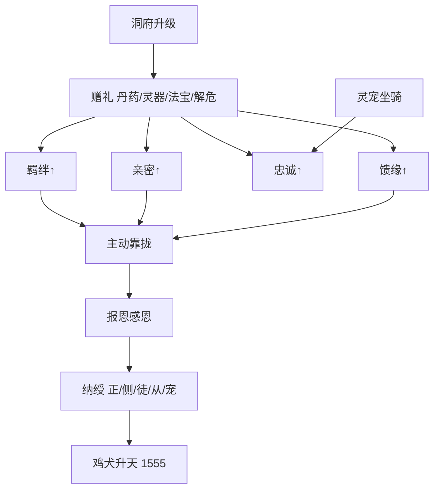

# 馈缘羁绊链 · 道具详表 · 灵宠坐骑 · 洞府系统

> **1560 章 / 500 万字** 标准。与 `11`（因果·道侣·眷升）、`02`（修炼道具）、`27`（修炼体系总纲）、`03`（恩仇情感）联动。  
> **主线穿插原则**：赠礼不是刷数值，是 **还恩、救急、立威** 的叙事动作；每 15～25 章至少 1 次「赠礼→关系变化」显性描写。

---

## 一、馈缘羁绊链（贯穿全书）

### 1.1 总链路

```
赠礼 → 羁绊↑ / 亲密↑ / 忠诚↑ / 馈缘↑ → 主动靠拢（倒贴） → 报恩感恩 → 纳绶 → 鸡犬升天
```

| 环节 | 叙事含义 | 韩泥特色 |
|------|----------|----------|
| **赠礼** | 丹药、灵器、解危、安置 | 低谷只收不还；筑基后 **能还才送** |
| **四维上升** | 韩泥心里记恩/馈缘四维 | 送礼必写关系变化 |
| **主动靠拢** | 慕名、感恩、托付、追随 | 丑翁靠 **丹名+恩德**，非脸 |
| **报恩感恩** | 对方回礼、誓死、代劳 | 与七笔旧恩呼应 |
| **纳绶** | 纳妻/纳徒/纳从/纳宠 | **道侣多绶**（正1+副1+剑1+盟0～1）；见 `19` |
| **鸡犬升天** | 眷升名录 | 1555 揭晓 |

### 1.2 四维指标（馈缘·人物心记）

每人独立四栏，**0～100**，读者可见变化（不写游戏 UI，写韩泥心里清点或关系动作）。

| 指标 | 记号 | 涨法 | 叙事功能 |
|------|------|------|----------|
| **羁绊** | 契 | 共患难、长期照拂、救命 | 信任、合作、合阵 |
| **亲密** | 温 | 私密照拂、雨夜、并肩、灵誓 | 情感线、合修 |
| **忠诚** | 忠 | 赠重宝、破境丹、代受辱 | 弟子、兄弟、灵宠 |
| **馈缘** | 缘 | **赠礼对口**（对方最缺之物） | 倒贴契机、眷升权重 |

**馈缘公式（写作参考，不必正文算出）**：

```
馈缘增量 = 礼物品阶系数 × 对口系数 × 境界差系数
对口系数：解当下之急 = 3；锦上添花 = 1
```

**倒贴触发（须同时满足）**：

1. 馈缘 ≥ 40 **或** 羁绊 ≥ 50  
2. 韩泥于对方有 **恩因未清** 或 **单方馈缘已满**  
3. 对方性格允许（叶青禾敢、沈枯芽怯、温听雨傲后软）

> **硬规**：倒贴写 **选择**（跟还是不跟），不写无脑花痴；韩泥 **收纳多道侣、主次分明、纳则不负**；各侣家族入戏（`19`）。

---

### 1.3 纳绶位阶（收纳关系）

| 绶位 | 名称 | 上限 | 立绶方式 | 眷升类型 |
|------|------|------|----------|----------|
| **正绶** | 发妻主母 | 1 | 272 我娶 + 420 灵誓 | 叶青禾 |
| **副绶** | 侧室 | 1 | **505** 立契 | 温听雨 |
| **剑绶** | 剑修道侣 | 1 | **535** 立契 | 萧断雁 |
| **盟绶** | 盟约纯契 | 0～1 | **710** 立契 | 乐凝雪 |
| **徒绶** | 弟子 | 3 | 拜师、传丹经 | 弟子魂 |
| **从绶** | 扈从/兄弟 | 2 | 歃血、还命 | 魂印 |
| **宠绶** | 灵宠 | 2 | 认主契 | 灵宠升 |
| **器绶** | 器灵 | 1 | 臾墟子化火后 | 器灵印记 |

韩泥终局道侣：正绶叶青禾、副绶温听雨、剑绶萧断雁、盟绶乐凝雪（可选）；徒绶沈枯芽、从绶铁无言、器绶臾墟子、宠绶瓮甲龟。

---

### 1.4 主线穿插时间表

| 章 | 赠礼方 | 礼物 | 四维变化 | 链路节点 |
|----|--------|------|----------|----------|
| 3 | 叶青禾→韩泥 | 热汤姜块 | 缘+（韩泥记恩） | 施恩记心 |
| 35 | 叶青禾挡石 | 命 | 契+50 | 羁绊锚 |
| 95 | 韩泥→叶青禾 | 门缝留灯+匿丹 | 缘+30 温+10 | 暗还 |
| 118 | 韩泥→沈枯芽 | 半块灵石 | 缘+20 忠+15 | 报恩 |
| 130 | 韩泥→刘婆 | 新衣+养老钱 | 缘+25 | 报恩 |
| 142 | 韩泥→老耿 | 培元散（经叶家） | 缘+30 | 报恩 |
| 175 | 韩泥→叶青禾 | 筑基丹 | 缘+40 温+20 | 倒贴前奏 |
| 188 | 韩泥雨夜 | 解围不逼娶 | 温+30 契+20 | 心意 |
| 235 | 韩泥扬名 | 大比丹助同门 | 忠+（铁无言） | 兄弟线 |
| 262～270 | 韩泥连赠 | 养脉丹/新屋/去瘿丹… | 七笔恩因清 | 报恩高潮 |
| 272 | 韩泥 | 当众娶 | 纳**正绶** | 道侣 |
| 310 | 温听雨 | 醉酒护丹 | 缘+35 | 倒贴·副绶铺垫 |
| 420 | 韩泥 | 灵誓+宝品戒 | 纳**正绶**·道侣 | 叶青禾 |
| 497 | 温听雨 | 护府阵协防 | 契+30 | 纳副铺垫·阵 |
| 498 | 温听雨 | 守炉靠拢 | 契+40 | 纳副铺垫·丹 |
| **505** | 韩泥 | 纳**温听雨副绶** | 副绶立契 | 后宫② |
| **535** | 韩泥 | 纳**萧断雁剑绶** | 剑绶立契 | 后宫③ |
| **710** | 乐凝雪 | 盟绶纯契 | 盟绶（可选） | 后宫④ |
| 580 | 韩泥→铁无言 | 断臂再生丹 | 纳**从绶** | 忠满 |
| 649 | 沈枯芽 | 拜师礼 | 纳**徒绶** | 弟子 |
| 720 | 叶青禾 | 拒延寿 | 遗念侣 | 别 |
| 1555 | 天道 | 眷升 | **鸡犬升天** | 终局 |

**穿插密度**：一部 1～130 以 **收恩+记心** 为主（8～10 次）；二部起每部 **赠礼还恩 4～6 次** + **慕名靠拢 1～2 次**。  
**分部详表**：见 **`17-馈缘逐章赠礼表`**（一～四部逐章，五～十二部锚点/部块）。  
**正文执行**：见 **`18-正文写作主准`**（文档优先、按部对照、单章流程）。

---

### 1.5 情感线 × 馈缘链

| 人物 | 倒贴方式 | 纳绶 | 结局 |
|------|----------|------|------|
| **叶青禾** | 施恩→还→托付 | 正绶 | 遗念眷升 |
| **温听雨** | 妒后护家 | **副绶** | 1555 同升 |
| **沈枯芽** | 怯随、入宗 | 徒绶 | 叛而不逐 |
| **萧断雁** | 敬剑→纳剑绶 | **剑绶** | 1555 同升 |
| **乐凝雪** | 照拂叶氏 | 盟绶（可选） | 守谷盟约 |
| **刘婆** | 补衣不求回报 | 不纳绶 | 养老终老 |
| **铁无言** | 兄弟义 | 从绶 | 魂印眷升 |

---

## 二、道具体系详表

### 2.1 大类与九阶对应

| 大类 | 子类 | 典型品阶 | 说明 |
|------|------|----------|------|
| **丹药** | 培元、**破境·核心**、**破境·辅**、疗伤、祛邪、延寿 | 灵品～圣品 | 韩泥主业 |
| **灵器** | 剑、刀、针、印、链、幡 | 灵品～地品 | 有灵未通灵；**攻/防子类**见 §2.0.1 |
| **法宝** | 炉、舟、镜、塔、伞、钟 | 宝品～道品 | 通灵认主；**攻/防子类**见 §2.0.1 |
| **符录** | 遁、爆、封、护、幻、镇、驱、疗 | 凡符～道符九阶 | 韩泥保命辅业；**攻/防子类**见 §2.0.1 |
| **阵盘** | 聚灵、杀、幻、护洞、丹阵 | 灵品～天品 | 洞府核心；**攻/防子类**见 §2.0.1 |
| **灵材** | 药草、矿、皮骨、妖丹 | 凡品～圣品 | 坊市与炼丹 |
| **杂物** | 灵石、玉简、储物袋 | — | 资源 |

**灵器 vs 法宝**：

- **灵器**：单功能，如 **疤痕剑**（杀伐）、**摄魂针**（暗手）。  
- **法宝**：多禁制可祭炼，如 **鸿蒙九劫瓮**、**沉礁舟**、**瓮心塔令**。

---

### 2.0 境界×道具总则（参考凡人修仙传）

> 世界观与境界阶梯见 **`27-凡骨丑翁修炼体系.md`** §七；凡人原著对照见 **`参考/27-凡人修仙传修炼体系.md`**。  
> 本作九阶口诀 **凡灵宝玄，地天圣仙道**；下列名可与其他修仙小说重名，**粗体**为主线锚点。

| 界域 | 境界 | 本作品阶 | 凡人原著叫法 | 丹药 | 灵器/法器 | 法宝/古宝 | 符箓 | 阵法 | 宠/骑 |
|------|------|----------|--------------|------|-----------|-----------|------|------|-------|
| **人界** | 炼气 | 灵品 | **法器** | 一品丹 | 下品飞剑、药铲 | 储物袋 | 灵符 | 灵阵 | 寻灵鼠、驴 |
| **人界** | 筑基 | 宝品 | **法器→法宝** | 二品丹 | 青锋剑、摄魂针 | 泥炉、塔令 | 宝符 | 宝阵 | 瓮甲龟、灵驹 |
| **人界** | 结丹 | 玄品 | **法宝→古宝** | 三品丹 | 赤焰刀、沉丹杖 | 沉礁舟、法袍 | 玄符 | 玄阵 | 嗅缆鼠、风雷兽 |
| **人界** | 元婴 | 地品 | **古宝→灵宝** | 四品丹·**大还丹**、**还魂丹** | 裂焰戈、镇魂幡 | 守魄镜、**天蚕宝衣** | 地符 | 地阵 | 泥哨雀、焰驹 |
| **人界** | 化神 | 天品 | **灵宝→玄天之宝** | 五品丹·**悟道丹** | 斩神剑、灭魂幡 | 大阵眼、**九天神凤钗**、护山钟 | 天符 | 天阵 | 灵鹤、火蟒 |
| **灵界** | 炼虚 | 圣品 | **玄天之宝** | 六品丹 | 虚空刃、灭世戟 | 虚空舟、元火容器 | 圣符 | 圣阵 | 虚空兽 |
| **灵界** | 合体 | 仙品 | **通天灵宝** | 七品丹 | 诛仙剑胚、破天枪 | 逆劫丹炉 | 仙符 | 仙阵 | 仙灵鹤 |
| **灵界** | 大乘 | 仙品 | **通天灵宝** | 七品丹·**九转金丹** | 破天戟、斩仙刃 | 护劫塔 | 仙符 | 仙阵 | 星舟 |
| **灵界** | 渡劫 | 道品 | **通天灵宝+** | 七品丹 | 九劫剑、斩道刃 | 鸿蒙九劫瓮 | 道符 | 道阵 | — |
| **仙界** | 真仙 | 道品 | **仙器** | 道品丹胚 | 斩道刃、仙兵 | 丑仙瓮天 | 证道符 | 道阵 | 遁光 |

**硬规**：道具不跳两阶；丹药不跳两品；符阵不越两阶（`02` §九、`20` §十二）。

---

### 2.0.1 攻防子类总则（灵器·法宝·符箓·阵法·灵宠·坐骑）

> **丹药**按功能八类（培元/**破境·核心**/**破境·辅**/疗伤…），不拆攻防。下列 **六类** 统一增 **攻击 / 防守** 子类。

#### 六类攻:防基准比

| 大类 | 攻:防 | 归类说明 | 韩泥倾向 |
|------|-------|----------|----------|
| **灵器** | **6:4** | 剑刀戈幡→攻；盾镜甲伞→防 | 杀伐主武，辅护体 |
| **法宝** | **4:6** | 舟炉戟→攻；镜袍塔钟→防 | 护洞守魄多 |
| **符箓** | **4:6** | 爆雷杀→攻；遁护封→防 | 保命遁逃多（`14`） |
| **阵法** | **5:5** | 杀伐剑阵→攻；聚灵护洞→防 | 洞府靠阵 |
| **灵宠** | **5:5** | 噬金火蟒→攻；龟蟹预警→防 | 认主不辱主 |
| **坐骑** | **3:7** | 焰驹风雷→攻；驴鹤舟遁→防 | 前期驴、后期遁 |

#### 境界占比（十境均衡）

| 界域 | 境界 | 每境名数占比 | 攻防微调 |
|------|------|--------------|----------|
| **人界** | 炼气、筑基、结丹、元婴、化神 | 各 **10%**（五境共 50%） | 炼气/筑基 **防+5%**（低谷谨慎） |
| **灵界** | 炼虚、合体、大乘、渡劫 | 各 **10%**（四境共 40%） | 炼虚起 **攻+5%**（扬名后） |
| **仙界** | 真仙 | **10%** | 50:50 |

#### 写作硬规

1. **每境攻≥4名、防≥2名**（灵器/阵/宠）；法宝/符 **攻≥3、防≥3**；坐骑 **攻≥1、防≥2**。  
2. 单章同类道具描写，攻或防单侧不超过 **70%**。  
3. 一部低谷（炼气～筑基）正文，符/阵/骑 **防侧≥60%**。  
4. 聚灵阵、遁符、驮畜归 **防**；杀阵、爆符、冲锋骑归 **攻**。  
5. 攻方名可与其他修仙小说重名（凡人/诛仙/斗破常见器名），**粗体**仍为本作主线锚点。

---

### 2.0.2 品阶定性总纲（丹药 · 资质 · 六类道具）

> **落地执行表**见 **`28-品阶与资质落地表.md`**（八系品阶、境界对齐、韩泥章锚、正文标注）。总纲详论见 `27` §四、§六。本节仅列道具写作要点。

| 要点 | 内容 |
|------|------|
| 口诀 | **凡灵宝玄，地天圣仙道** |
| 丹药 | 七品 + 道品胚；功能八类见 `20` §二；**不跳两品** |
| 资质 | 天/异/真/伪/废五级；韩泥末席伪灵根 + 丑骨（1555 不改骨） |
| 攻防比 | 灵器 6:4 · 法宝 4:6 · 符 4:6 · 阵 5:5 · 宠 5:5 · 骑 3:7 |
| 正文标注 | **名称 + 品阶 + 境界 + 攻/防子类**（六类道具） |

详名分表：§2.3～§2.6（灵器/法宝/符/阵）· §3.1～§3.2（宠/骑）。

---

### 2.2 丹药详表（按境界 · 参考凡人丹道）

> **破境核心丹**（各境→下一境最核心命名与章锚）见 **§2.2.0**、`20` §1.1、`29` **§四·4.0**。  
> **丹道体系**见 **`20`**；完整矩阵见 **`27-凡骨丑翁修炼体系.md`** §6.1、§7.1。**品阶落地**见 **`28-品阶与资质落地表.md`** §三。

### 2.2.0 破境核心丹速查（境界跃迁）

> 四维总表（大类×境界×跃迁×子类×名）：`29` **§四·4.0**

| 跃迁 | 核心破境丹 | 丹品 | 韩泥炼/服章 | 辅丹 |
|------|------------|------|-------------|------|
| 凡人→炼气 | 培元散（稳道基，非破境专丹） | 一品 | 110 / **130** | 清瘴丸 |
| 炼气→筑基 | **筑基丹** | 二品 | 175 / **260** | 青凝丹 |
| 筑基→结丹 | **结金丹** | 四品 | 480 / **500** | 破障丹(310)、降尘丹 |
| 结丹→元婴 | **化婴丹** | 五品 | **620** / **650** | 凝婴丹 |
| 元婴→化神 | **化神丹** | 五品 | **760** / **780** | 悟道丹 |
| 化神→炼虚 | **炼虚丹** | 六品 | — / **910** | 虚灵丹 |
| 炼虚→合体 | **合体丹** | 七品 | — / **1040** | 真灵丹 |
| 合体→大乘 | **大乘丹** | 七品 | — / **1170** | 飞升丹 |
| 大乘→渡劫 | **渡劫丹** + **逆劫丹** | 七品 | 1280 / **1295·1300** | 护劫丹 |
| 渡劫→真仙 | （天劫过即升仙） | — | — / **1420** | 仙灵丹 |
| 真仙证道 | **证道丹** / **九劫丹** | 道品胚 | — / **1520·1555** | 道源丹 |

---

#### 凡人期（乡野土方 · 无丹品）

| 跃迁 | 子类 | 丹名 | 功效 | 章锚 |
|------|------|------|------|------|
| →炼气 | 培元·稳道 | **培元散** | 补气血、健经脉（稳道基） | **110** |
| — | 食疗 | 姜汤块 | 驱寒（叶青禾赠） | **3** |
| — | 土方 | 草药糊 | 外敷止血 | — |
| — | 祛寒 | 艾草丸 | 村医常用 | — |

#### 炼气期（一品丹 · 灵品 · 人界）

| 跃迁 | 子类 | 丹名 | 功效 | 章锚 |
|------|------|------|------|------|
| →筑基 | **破境·核心** | **筑基丹** | 破境筑基 | **175** |
| — | 培元 | **培元散** | 补气血、健经脉 | **110** |
| — | 祛邪 | **清瘴丸** | 祛山村瘴 | 108/248 |
| — | 培元 | 辟谷丹 | 辟谷省粮、稳炼气 | — |
| — | 稳神 | 清灵丹 | 宁心、抗杂念 | — |
| — | 培元 | 回气丹 | 补灵气、快回气 | — |
| — | 解毒 | 解毒丹 | 化低阶毒 | — |
| — | 培元 | 增气丹 | 增炼气层进度 | — |
| — | 培元 | 黄龙丹 | 补气养血（低阶常用） | — |
| — | 培元 | 养精丸 | 养精蓄锐 | — |
| — | 培元 | 聚灵丸 | 聚灵气于丹田 | — |

#### 筑基期（二品丹 · 宝品 · 人界）

| 跃迁 | 子类 | 丹名 | 功效 | 章锚 |
|------|------|------|------|------|
| →结丹 | **破境·核心** | **结金丹** | 凝金丹 | **480** |
| →结丹 | **破境·辅** | **破障丹** | 碎瓶颈 | **310** |
| — | 疗伤 | **祛瘿丹** | 去颈瘤 | **265** |
| — | 培元 | 固本培元丹 | 筑基后稳根基 | — |
| — | 培元 | 聚灵丹 | 聚真元、助凝液 | — |
| — | 疗伤 | 护脉丹 | 护经脉不裂 | — |
| — | 稳神 | 凝神丹 | 凝神识、抗心魔 | — |
| — | 培元 | 真元丹 | 补真元储量 | — |
| — | 解毒 | 解毒丹 | 化丹毒 | — |
| — | 培元 | 增元丹 | 增筑基真元 | — |
| — | 破境·辅 | 青凝丹 | 助凝液成基 | — |
| — | 破境·辅 | 降尘丹 | 降丹尘、稳丹形 | — |
| — | 破境·辅 | 凝丹丹 | 助凝金丹（辅炼） | — |

#### 结丹期（三品丹 · 玄品 · 人界）

| 跃迁 | 子类 | 丹名 | 功效 | 章锚 |
|------|------|------|------|------|
| →元婴 | **破境·核心** | **化婴丹** | 助凝元婴 | **620** |
| →元婴 | **破境·辅** | 凝婴丹 | 助凝元婴 | — |
| — | 培元 | **养脉丹** | 温养凡人经脉 | **262** |
| — | 破境·辅 | 青凝丹 | 凝丹成形 | — |
| — | 破境·辅 | 降尘丹 | 降丹尘、稳丹形 | — |
| — | 培元 | 培元丹 | 补金丹真元 | — |
| — | 培元 | 回元丹 | 大战后回元 | — |
| — | 疗伤 | 明目丹 | 明目、疗目伤 | — |
| — | 延寿 | 定颜丹 | 驻颜（馈缘常用） | — |
| — | 稳神 | 紫府丹 | 稳紫府神识 | — |
| — | 培元 | 地灵丹 | 借地脉凝丹 | — |

#### 元婴期（四品丹 · 地品 · 人界）

| 跃迁 | 子类 | 丹名 | 功效 | 章锚 |
|------|------|------|------|------|
| →化神 | **破境·核心** | **化神丹** | 化神破境 | **760** |
| →化神 | **破境·辅** | **悟道丹** | 助悟法则、破化神意境 | — |
| — | 稳神 | **定魂丹** | 稳神魂 | **445** |
| — | 疗伤 | **还魂丹** | 濒死还魂、稳残魂（凡人名药） | — |
| — | 疗伤 | **大还丹** | 重伤复元、续修为（化神前罕用） | — |
| — | 破境·辅 | 增婴丹 | 元婴增灵 | — |
| — | 培元 | 育元丹 | 育元婴灵力 | — |
| — | 疗伤 | 回春丹 | 续命疗伤 | — |
| — | 稳神 | 养神丹 | 养婴神 | — |
| — | 培元 | 风灵丸 | 增风灵属性真元 | — |
| — | 疗伤 | 复灵紫霜丹 | 重伤复灵 | — |
| — | 延寿 | 延命丸 | 续寿（叶拒用） | — |
| — | 破境·辅 | 婴变丹 | 元婴蜕变 | — |

#### 化神期（五品丹 · 天品 · 人界封顶）

| 跃迁 | 子类 | 丹名 | 功效 | 章锚 |
|------|------|------|------|------|
| →炼虚 | **破境·核心** | **炼虚丹** | 炼化虚空、破炼虚 | **910** |
| →炼虚 | **破境·辅** | 虚灵丹 | 助炼虚 | — |
| — | 疗伤 | **断臂再生丹** | 接肢再生 | **580** |
| — | 稳神 | 炼神丹 | 炼神识、抗心魔 | — |
| — | 稳神 | 蕴神丹 | 蕴神念 | — |
| — | 延寿 | 长生丹 | 续寿千年级 | — |
| — | 祛邪 | 清灵丹 | 清灵台杂念 | — |
| — | 培元 | 造化丹 | 化神后培元 | — |
| — | 疗伤 | 回天丹 | 濒死回天 | — |
| — | 辅炼 | 灭仙丹 | 克魔道高阶（毁媚丹先例） | 228 |
| — | 破境·辅 | 凝虚丹 | 凝虚境道基 | — |

#### 炼虚期（六品丹 · 圣品 · 灵界）

| 跃迁 | 子类 | 丹名 | 功效 | 章锚 |
|------|------|------|------|------|
| →合体 | **破境·核心** | **合体丹** | 助合体 | **1040** |
| — | 培元 | **泥翁丹** | 丑丹挂牌扬名 | **790** |
| — | 破境·辅 | 虚灵丹 | 助炼虚 | — |
| — | 稳神 | 魂婴丹 | 魂婴合一 | — |
| — | 稳神 | 定虚丹 | 定虚境神识 | — |
| — | 培元 | 培婴丹 | 培虚境灵婴 | — |
| — | 培元 | 混元丹 | 混元一气 | — |
| — | 培元 | 虚元丹 | 补炼虚真元 | — |
| — | 破境·辅 | 凝虚丹 | 凝虚境道基 | — |

#### 合体期（七品丹 · 仙品 · 灵界）

| 跃迁 | 子类 | 丹名 | 功效 | 章锚 |
|------|------|------|------|------|
| →大乘 | **破境·核心** | **大乘丹** | 助大乘 | **1170** |
| — | 破境·辅 | 合体丹 | 助合体（辅炼） | — |
| — | 培元 | 真灵丹 | 凝真灵 | — |
| — | 培元 | 混天丹 | 混天灵力 | — |
| — | 辅炼 | 星移丹 | 助融虚空星火 | 940～995 |
| — | 疗伤 | 炼体丹 | 肉身合体 | — |
| — | 稳神 | 神魂丹 | 神魂肉身合一 | — |

#### 大乘期（七品丹 · 仙品 · 灵界）

| 跃迁 | 子类 | 丹名 | 功效 | 章锚 |
|------|------|------|------|------|
| →渡劫 | **破境·核心** | **渡劫丹** | 引劫、稳劫 | **1300** |
| →渡劫 | **破境·核心** | **逆劫丹** | 渡劫辅炼 | **1280** |
| →渡劫 | **破境·辅** | 护劫丹 | 护肉身抗劫前 | — |
| — | 破境·辅 | 飞升丹 | 备渡劫 | 1170 |
| — | 培元 | **九转金丹** | 九转培元、大乘续修（凡人名药） | — |
| — | 疗伤 | 涅槃丹 | 重伤涅槃复 | — |
| — | 稳神 | 菩提丹 | 镇心魔、稳道心 | — |

#### 渡劫期（七品丹 · 仙品→道品 · 灵界）

| 跃迁 | 子类 | 丹名 | 功效 | 章锚 |
|------|------|------|------|------|
| →真仙 | 培元·入仙 | 仙灵丹 | 仙界培元 | **1420** |
| 抗劫 | **破境·核心** | **逆劫丹** | 渡劫辅炼 | **1280** |
| 抗劫 | **破境·核心** | 渡劫丹 | 引劫、稳劫 | **1300** |
| — | 辅炼 | 雷劫丹 | 化雷劫为药力 | — |
| — | 疗伤 | 护劫丹 | 护肉身抗雷 | — |
| — | 疗伤 | 九转还魂丹 | 劫后复魂（≠元婴**还魂丹**） | — |
| — | 辅炼 | 天劫丹 | 分流天劫 | — |

#### 真仙期（道品丹胚 · 仙界）

| 跃迁 | 子类 | 丹名 | 功效 | 章锚 |
|------|------|------|------|------|
| 证道 | **破境·核心** | **证道丹** | 证道前凝练 | — |
| 证道 | **破境·核心** | **九劫丹** | 融寂灭心火 | **1520** |
| 证道 | **破境·辅** | 道源丹 | 道源凝练 | — |
| — | 培元 | 仙灵丹 | 仙界培元 | **1420** |
| — | 培元 | 太乙丹 | 仙界高阶培元 | — |

**赠礼常用**：低谷 **培元散/清瘴丸**；省亲 **养脉丹/祛瘿丹**；情感 **定魂丹/定颜丹**；重伤 **大还丹/还魂丹**；化神悟境 **悟道丹**；高阶馈缘 **天蚕宝衣**（护体）、**九天神凤钗**（道侣首饰）；大乘 **九转金丹**。

> **还魂丹 vs 九转还魂丹**：元婴**还魂丹**救魂未散；渡劫**九转还魂丹**劫后复魂——品阶与场景不同，不可混写。

---

### 2.3 灵器详表（攻:防 = 6:4）

> 单功能杀伐器；凡人 **法器**→**古宝**→**灵宝**。每境 **攻5～7名、防2～3名**。攻方参考凡人（青竹剑、金雷竹、辟邪神雷）、诛仙（诛邪、斩龙）、斗破（离火、风雷）等常见器名，可重名。

| 境界 | 品阶 | 攻:防 | 攻击类 | 防守类 | 章锚 |
|------|------|-------|--------|--------|------|
| 凡人 | 凡品 | 6:4 | 柴刀、锈铁剑、破斧、朴刀、猎弓 | 藤盾、木甲片 | 1 |
| 炼气 | 灵品 | 6:4 | 下品飞剑、青钢针、**疤痕剑**、铁鞭、青竹剑、泣血刀、离火锥 | 铁盾胚、护心铜镜、铁锏（格挡） | **28**/86 |
| 筑基 | 宝品 | 6:4 | 青锋剑、**摄魂针**、流星锤、青竹剑、玄铁剑、毒蛟针、落星环 | 玄铁印（封挡）、缚灵链（困守）、青凝镜（仿） | **320** |
| 结丹 | 玄品 | 6:4 | 赤焰刀、**沉丹杖**、乌龙幡、碧磷刀、诛邪剑、火龙枪、千重针 | 镇岳印（镇场）、摄灵幡（摄守）、青凝镜 | **235** |
| 元婴 | 地品 | 6:4 | **裂焰戈**、噬魂链、辟邪神雷珠（仿）、天罡剑、灭魂铃、冰焰珠 | 镇魂幡（镇魂）、护体灵甲片、青凝镜（高阶） | **545** |
| 化神 | 天品 | 6:4 | 斩神剑、金雷竹剑、灭魂幡、青元剑、修罗剑、落魂幡 | **九天神凤钗**（守神饰）、护心镜、灵纹甲 | — |
| 炼虚 | 圣品 | 6:4 | 虚空刃、灭世戟、斩仙飞刀（仿）、裂界矛、灭界珠、七璇飞刀 | 虚空盾、护界幡 | — |
| 合体 | 仙品 | 6:4 | 诛仙剑胚、破天枪、玄天斩灵剑（仿）、先天灵剑胚、裂空戟 | 护体仙甲胚、镇灵珠 | — |
| 大乘 | 仙品 | 6:4 | 破天戟、斩仙刃、灭世珠、斩界刃、灭世雷珠 | 护劫灵甲、镇岳盾 | — |
| 渡劫 | 道品 | 6:4 | **九劫剑**、斩道刃、九霄雷剑 | 护劫神盾、镇道幡 | — |
| 真仙 | 道品 | 6:4 | 斩道刃、仙兵残片、开天斧胚 | 仙界护心镜 | **1555** |

---

### 2.4 法宝详表（攻:防 = 4:6）

> 多禁制认主成长。每境 **攻3名、防3名**。攻方含震雷珠、业火珠、炼妖壶（仿）等市面常见杀伐法宝。

| 境界 | 品阶 | 攻:防 | 攻击类 | 防守类 | 章锚 |
|------|------|-------|--------|--------|------|
| 凡人 | 凡品 | 4:6 | 腌菜坛（凡相，未醒） | 破碗、陶罐（藏物） | 2 |
| 炼气 | 灵品 | 4:6 | 锦帕（低阶仿，掷击）、离火环、乙木毒针筒 | 储物袋、**温汤囊** | **95** |
| 筑基 | 宝品 | 4:6 | **瓮心塔令**（闯塔）、青蛟幡、震雷珠 | **瓮底泥炉**、青玉瓶、乾坤袋 | **110**/**236** |
| 结丹 | 玄品 | 4:6 | **沉礁舟**（遁杀）、碧磷珠（雷击）、业火珠、飞剑匣（仿） | 护体法袍、青凝镜 | **450** |
| 元婴 | 地品 | 4:6 | 镇岳塔（压敌）、炼妖壶（仿）、天罡印 | **守魄镜**·638、**天蚕宝衣**·639、青凝镜（完） | **638/639** |
| 化神 | 天品 | 4:6 | 虚天鼎（仿，炼敌）、玄天葫芦、斩龙剑（仿） | 泥丹阁大阵眼、**九天神凤钗**、护山钟 | **519** |
| 炼虚 | 圣品 | 4:6 | 山河图（仿，困敌）、万灵幡、噬魂钟 | 混沌元火容器、虚空舟 | 910 |
| 合体 | 仙品 | 4:6 | 玄天斩灵剑鞘（辅攻）、五行环（仿）、裂星珠 | **逆劫丹炉**、护劫塔胚 | **1280** |
| 大乘 | 仙品 | 4:6 | 镇界碑（界压）、诛仙阵图胚、灭劫钟 | 护劫塔、护府仙钟 | 1170 |
| 渡劫 | 道品 | 4:6 | **鸿蒙九劫瓮**（劫火反噬）、劫火珠 | 瓮护体禁制、护劫光罩 | **1300** |
| 真仙 | 道品 | 4:6 | 寂灭心火瓮（攻劫）、开天铲 | **丑仙瓮天**、仙府镇物 | **1555** |

---

### 2.5 符箓详表（攻:防 = 4:6 · 详见 `14`）

> 韩泥保命靠符。每境 **攻3～5名、防3名**；遁符归 **防**。

| 境界 | 符阶 | 攻:防 | 攻击类 | 防守类 | 章锚 |
|------|------|-------|--------|--------|------|
| 凡人 | 凡符 | 4:6 | 爆竹符、驱兽符、烧狼符 | **祛寒符**、祛病符 | **55** |
| 炼气 | 灵符 | 4:6 | 火球符、土牢符、雷符、冰针符、千斤符 | **保命灵符**、轻身符、护身符 | **228** |
| 筑基 | 宝符 | 4:6 | **锁魔符眼**（封杀）、爆焰符、缚妖符、寒冰符 | **遁形宝符**、土遁符、隐身符 | **269**/**378** |
| 结丹 | 玄符 | 4:6 | 辟邪神雷符、困敌符、火龙符、冰锥符、困魔符 | **驱媚驱符**、**遁天符** | **418**/**520** |
| 元婴 | 地符 | 4:6 | 沉礁海杀爆符、天雷符、五雷符、灭魂符、业火符 | **镇魂地符**、金刚符 | **535**/**640** |
| 化神 | 天符 | 4:6 | 封邪天符（封杀）、诛邪符、裂空斩符 | 护神天符、大挪移符（仿） | 680 |
| 炼虚 | 圣符 | 4:6 | 界域裂空符、灭界符、虚空裂符 | **圣传送符**、界域传送符 | **920** |
| 合体 | 仙符 | 4:6 | 灭仙符、劫雷分流符、斩仙符、劫火符 | 万族护仙符 | 1073 |
| 大乘 | 仙符 | 4:6 | 封天符、诛天符、灭仙雷符 | 护劫仙符 | 1170 |
| 渡劫 | 道符 | 4:6 | 五雷劫符、紫霄雷符 | **劫引道符** | **1300** |
| 真仙 | 道符 | 4:6 | 九劫符、道杀符 | **证道符** | **1555** |

---

### 2.6 阵法详表（攻:防 = 5:5 · 详见 `21`）

> 阵盘占地持续。聚灵/护洞归 **防**，杀伐剑阵归 **攻**。每境 **攻3～4名、防2～3名**。

| 境界 | 阵阶 | 攻:防 | 攻击类 | 防守类 | 章锚 |
|------|------|-------|--------|--------|------|
| 凡人 | 凡阵 | 5:5 | 简易困兽阵、捕兽陷阵 | 篱笆阵、拒兽阵 | — |
| 炼气 | 灵阵 | 5:5 | 困兽阵、小杀阵、剑芒小阵、地刺阵 | 聚气小阵、迷踪阵、引灵阵 | — |
| 筑基 | 宝阵 | 5:5 | **四象杀阵**、困敌阵、七星杀阵、火牢阵 | **漏壶聚灵阵**、八卦阵（守） | **268**/**378** |
| 结丹 | 玄阵 | 5:5 | 杀伐小阵、天罡剑阵、流沙杀阵 | **疤台符室阵**、沉礁岛阵盘、护山大阵（仿） | **519**/**600** |
| 元婴 | 地阵 | 5:5 | 杀伐剑阵、九幽杀阵、五行杀阵 | **镇魂地阵**、丹阵护阁 | **638**/**812** |
| 化神 | 天阵 | 5:5 | 大挪移阵（仿，迁杀）、诛魔剑阵、天罡杀阵 | 瓮中天阵脉 | **850** |
| 炼虚 | 圣阵 | 5:5 | 万族丹阵（杀伐部）、界域斩阵、虚空绞杀阵 | **黄泉丹阵**、界域传送阵 | **865**/**948** |
| 合体 | 仙阵 | 5:5 | 万族合击阵、万仙戮阵 | **逆劫封阵** | **1181** |
| 大乘 | 仙阵 | 5:5 | 封天阵、灭世剑阵 | 护劫大阵 | 1170 |
| 渡劫 | 道阵 | 5:5 | 九九重劫阵（引劫）、引劫杀阵 | **五脉合护阵** | **1300** |
| 真仙 | 道阵 | 5:5 | 法则杀阵、道灭阵 | **丑仙府阵脉** | **1420** |

---

## 三、灵宠与坐骑

### 3.1 灵宠详表（攻:防 = 5:5）

> 认主契、不辱主。每境 **攻3～4名、防2～3名**；预警/守洞归 **防**。攻方含啼魂兽胚、噬金虫、雷角兽等凡人/遮天常见灵兽名。

| 境界 | 品阶 | 攻:防 | 攻击类 | 防守类 | 章锚 |
|------|------|-------|--------|--------|------|
| 炼气 | 灵品 | 5:5 | 草蛇（噬咬）、赤纹蝎 | 寻灵鼠、赤瞳雀（预警） | — |
| 筑基 | 宝品 | 5:5 | 灵蛇、赤焰蝎、碧眼蟾、黑水蛇 | **瓮甲龟**、铁甲蟹、水獭灵 | **198** |
| 结丹 | 玄品 | 5:5 | **嗅缆鼠**（噬金）、噬金虫胚、啼魂兽胚、青羽鹰 | 铁甲蟹（壳守） | **315** |
| 元婴 | 地品 | 5:5 | **火蜒兽**（探火袭）、青羽雀（啄袭）、灵貂（袭） | **泥哨雀**（传讯预警） | **561** |
| 化神 | 天品 | 5:5 | 火蟒、青翅大鹏（仿）、墨鳞蟒、雷角兽 | **瓮颈鹤**、灵鹤幼 | — |
| 炼虚 | 圣品 | 5:5 | 噬金虫王、魂兽、界域妖鹘 | 虚空兽（侦察守界） | — |
| 合体 | 仙品 | 5:5 | 真灵兽、仙域雷鹏 | 仙灵鹤、镇府灵龟 | — |
| 大乘 | 仙品 | 5:5 | 星界灵禽（战）、吞天鲲幼 | 护劫灵龟 | — |
| 渡劫 | 道品 | 5:5 | 九劫灵宠、劫雷麒麟胚 | 护劫灵龟、镇劫灵蟹 | — |

**主线灵宠详表**：

| 名 | 子类 | 种类 | 得章 | 作用 |
|----|------|------|------|------|
| **瓮甲龟** | 防 | 泽龟 | 198 | 载药、避水、壳守 |
| **嗅缆鼠** | 攻 | 寻灵鼠 | 315 | 寻药、噬金 |
| **泥哨雀** | 防 | 传信灵禽 | 380 | 传讯、预警 |
| **火蜒兽** | 攻 | 炎虫 | 561 | 探火、袭敌、融火辅感；全书线见 **附录F** |
| **瓮中蜈** | 防 | 蛊虫 | 72 | 试毒、守洞 |

**眷升**：化神后 **瓮甲龟** 占化神名额 1。

---

### 3.2 坐骑详表（攻:防 = 3:7）

> 驮行遁逃归 **防**，冲锋追击归 **攻**。每境 **攻2～3名、防2～3名**（坐骑整体仍偏防）。

| 境界 | 品阶 | 攻:防 | 攻击类 | 防守类 | 章锚 |
|------|------|-------|--------|--------|------|
| 凡人 | 凡品 | 3:7 | 獾撵兽（冲撞） | 瘦驴、黄牛、骡子 | 1～60 |
| 炼气 | 灵品 | 3:7 | 灵驹（短冲）、追风狼 | **疤鬃驴**、矮脚马 | **145** |
| 筑基 | 宝品 | 3:7 | 赤焰马（冲锋）、雷鸣豹 | 云行驹、青鳞马 | — |
| 结丹 | 玄品 | 3:7 | 风雷兽、墨鳞蛟、墨玉狮 | 灵鹤、云鹤 | — |
| 元婴 | 地品 | 3:7 | **沉礁焰驹**、裂风兽、惊雷驹 | 墨鳞蛟（遁海） | **535** |
| 化神 | 天品 | 3:7 | 青翅大鹏（仿，战骑）、裂风鹏 | **瓮颈鹤**、穿云鹤 | **680** |
| 炼虚 | 圣品 | 3:7 | 遁光兽（战）、虚空战蛟 | 界域飞舟、**虚空遁光** | **920** |
| 合体 | 仙品 | 3:7 | 破界梭（冲）、星裂驹 | 星舟、仙界灵鹤 | — |
| 大乘 | 仙品 | 3:7 | 星域战隼、裂界驹、灭劫雷麟 | 破界飞梭 | 1170 |
| 渡劫 | — | 3:7 | 劫雷踏云兽 | 护劫云辇、瓮舟合一（遁） | — |

**主线坐骑详表**：

| 名 | 子类 | 种类 | 得章 | 场景 |
|----|------|------|------|------|
| 瘦驴/**疤鬃驴** | 防 | 畜/半妖驴 | 1～**145** | 泥岗驮药 |
| **沉礁舟** | 防 | 法宝舟 | 450 | 沉礁海遁逃 |
| **沉礁焰驹** | 攻 | 火麟马 | 535 | 沉礁海追击 |
| **瓮颈鹤** | 防 | 灵鹤 | 680 | 南荒遁空 |
| **虚空遁光** | 防 | 遁术 | 920 | 炼虚后代骑 |

**流行参考**：凡人 **碧浪梭/神风舟**→**沉礁舟**；斗破飞行魔兽→灵鹤/焰驹。

---

## 四、修炼洞府系统

> **品阶落地**见 **`28-品阶与资质落地表.md`** §十（境界分级）、§十三；阵法衔接见 **`21`** §九。  
> 洞府口诀 **漏瓮泥疤沉瓮墟丑**（0～7 阶）；对标道具 **凡灵宝玄，地天圣仙道**（数值对齐、命名独立）。

### 4.0 洞府品阶与境界对齐总则

| 洞府阶 | 位阶名 | 洞府品阶 | 对标道具阶 | 核心阵品阶 | 界域·境界 | 聚灵倍率 |
|--------|--------|----------|------------|------------|-----------|----------|
| 0 | **漏舍** | 凡舍 | 凡品 | — | 人界·凡人 | ×1 |
| 1 | **瓮穴** | 灵穴 | 灵品 | 灵阵 | 人界·炼气 | ×1.5 |
| 2 | **泥庵** | 宝庵 | 宝品 | 宝阵 | 人界·筑基 | ×2 |
| 3 | **疤台** | 玄台 | 玄品 | 玄阵 | 人界·结丹 | ×3 |
| 4 | **沉礁府** | **地台** | 地品 | 地阵 | 人界·元婴 | ×4 |
| 5 | **瓮天府** | 天府 | 天品 | 天阵 | 人界·化神 | ×5 |
| 6 | **墟灵天** | 圣天→仙天 | 圣品～仙品 | 圣阵～仙阵 | 灵界·炼虚～大乘 | ×6～×7 |
| 7 | **丑仙府** | 道府 | 道品 | 道阵 | 仙界·渡劫～真仙 | ×8 |

**硬规**：洞府位阶 **不跳两阶**；核心阵品阶 ≤ 洞府品阶；换府可留旧府给徒/副绶掌事（`12` §六·7）。

#### 洞府四大种类（写作归类）

| 大类 | 说明 | 例 |
|------|------|-----|
| **地貌巢穴** | 依山川海岛天然成府 | 石洞、崖洞、海岛、隐谷、洞天 |
| **宗门厢舍** | 宗门分配或租用的建制洞府 | 杂役房、外门舍、丹阁分楼、符室阁 |
| **灵脉福地** | 占灵脉、灵泉、地火、药圃 | 聚灵崖、灵泉窟、地火丹窟、古修遗府 |
| **瓮系特府** | 鸿蒙九劫瓮衍生或阵眼成府 | 瓮穴衍生、阵眼成府、瓮中天、丑仙瓮天 |

---

### 4.1 洞府位阶（七阶总表）

| 阶 | 名称 | 洞府品阶 | 聚灵倍率 | 典型境界 | 韩泥进度章 |
|----|------|----------|----------|----------|------------|
| 0 | **漏舍** | 凡舍 | ×1 | 凡人/杂役 | 1～85 |
| 1 | **瓮穴** | 灵穴 | ×1.5 | 炼气 | 86～130 |
| 2 | **泥庵** | 宝庵 | ×2 | 筑基 | 260 后 |
| 3 | **疤台** | 玄台 | ×3 | 结丹 | 500 后 |
| 4 | **沉礁府** | **地台** | ×4 | 元婴 | 650 后 |
| 5 | **瓮天府** | 天府 | ×5 | 化神 | 780 后 |
| 6 | **墟灵天** | 圣天→仙天 | ×6～×7 | 炼虚～大乘 | 910 后 |
| 7 | **丑仙府** | 道府 | ×8 | 渡劫～真仙 | 1420 后 |

---

### 4.1.1 境界 × 洞府品阶 × 种类详表

> 每境 **≥4 种**洞府类型；**粗体**为韩泥主线或常见叙事场景。参考凡人（灵脉洞府、古修遗府）、诛仙（青云峰洞府）、斗破（药圃谷）等市面设定，可重名。

| 境界 | 洞府阶 | 品阶 | 地貌巢穴 | 宗门厢舍 | 灵脉福地 | 瓮系特府 |
|------|--------|------|----------|----------|----------|----------|
| **凡人** | 漏舍 | 凡舍 | 山洞窝棚、柴屋、漏雨泥屋 | 村舍偏房、杂役通铺 | — | **泥屋漏雨间**（瓮藏） |
| **炼气** | 瓮穴 | 灵穴 | **兽栏旁石洞**、山脚裂洞、废矿浅穴 | 杂役柴房、外门石室、坊市租间 | **药山废窑**、灵脉浅穴 | 瓮息浅穴（瓮醒·63） |
| **筑基** | 泥庵 | 宝庵 | 崖洞府、土庵、废丹房 | 外门独舍、坊市租院、药铺后仓 | 药山侧洞、灵泉浅窟、山脚药圃洞 | **漏壶崖**（268） |
| **结丹** | 疤台 | 玄台 | 灵峰侧洞、废观后殿、岸线崖府 | 内门洞府、**泥丹阁**、符室阁楼 | 聚灵崖台、药田谷府、古修残窟 | 疤台符室阵眼府（519） |
| **元婴** | 沉礁府 | **地台** | **沉礁岛**、湖心岛府、岸线崖府 | 分舵驻府、迎客堂府 | 灵脉山谷、地火窟府、古修遗府 | 沉礁舟定府（450） |
| **化神** | 瓮天府 | 天府 | **南荒隐瓮谷**、隐谷洞天、灵峰顶府 | 护山大阵内府、悬空药阁 | 灵泉洞天、万年药圃谷 | 瓮中天雏形（850前） |
| **炼虚** | 墟灵天 | 圣天 | 虚空洞天、界域灵域、星隙洞窟 | 万族驻府、灵界分舵 | 古修洞天、灵界仙山 | **瓮中天**（850）、黄泉丹阵护府（948） |
| **合体** | 墟灵天 | 圣天→仙天 | 星域洞府、通天灵府 | 万族合击驻地 | 灵界主峰、仙脉支脉 | 逆劫封府（1181） |
| **大乘** | 墟灵天 | 仙天 | 界外浮府、护劫洞天 | 护劫大阵内府 | 仙脉主峰、星舟泊府 | 五脉合护洞天（1300） |
| **渡劫** | 墟灵天→丑仙府胚 | 仙天→道府胚 | 护劫云宫、劫域浮岛 | — | 瓮舟合一府 | 鸿蒙九劫瓮护府（1300） |
| **真仙** | 丑仙府 | 道府 | 仙界天域、法则洞天 | 仙府迎客殿 | 仙脉天域、证道台旁府 | **丑仙瓮天**（1555） |

**叙事提示**：低谷（炼气～筑基）多用 **宗门厢舍 + 灵脉浅穴**；扬名后（结丹起）转 **灵脉福地 + 瓮系特府**；灵界起强调 **地貌洞天 + 阵眼成府**。

---

### 4.2 洞府六区（可扩建）

| 区 | 功能 | 解锁洞府阶 | 对标品阶 | 叙事 |
|----|------|------------|----------|------|
| **聚灵室** | 闭关修炼 | 瓮穴（灵穴） | 灵阵起 | 子时瓮满受益 |
| **丹室** | 炼丹炼器 | 泥庵（宝庵） | 宝阵起 | 瓮底泥炉位 |
| **药田** | 种灵药 | 泥庵（宝庵） | 宝品药圃 | 青木药火加成 |
| **符室** | 制符 | 疤台（玄台） | 玄阵起 | 保命符量产 |
| **藏宝阁** | 储物阵 | 疤台（玄台） | 玄品储物阵 | 坊市捡漏存放 |
| **迎客堂** | 会客、护阵 | 沉礁府（**地台**） | 地阵护洞 | 五丹队议事 |

**扩建硬规**：六区品阶 ≤ 洞府位阶；丹室可随丹师档升阶，不越洞府两阶。

---

### 4.2.1 洞府六区 × 境界解锁锚

| 境界 | 洞府阶 | 可全开区 | 韩泥锚章 |
|------|--------|----------|----------|
| 炼气 | 瓮穴 | 聚灵室 | 91～130 |
| 筑基 | 泥庵 | +丹室、药田 | **268**～269 |
| 结丹 | 疤台 | +符室、藏宝阁 | **519**～520 |
| 元婴 | 沉礁府 | +迎客堂 | **600** |
| 化神 | 瓮天府 | 六区天品阵加持 | 720～850 |
| 炼虚～大乘 | 墟灵天 | 圣/仙阵升级各区 | 910～1300 |
| 真仙 | 丑仙府 | 道阵统摄全府 | **1420**～1555 |

---

### 4.3 韩泥洞府主线

| 洞府名 | 阶 | 品阶 | 种类 | 得章 | 事件 |
|--------|-----|------|------|------|------|
| 泥屋漏雨间 | 漏舍 | 凡舍 | 瓮系特府 | 1 | 瓮藏 |
| 兽栏旁石洞 | 瓮穴 | 灵穴 | 地貌巢穴 | 91 | 暗修 |
| 药山废窑 | 瓮穴 | 灵穴 | 灵脉福地 | 110 | 首丹 |
| **漏壶崖** | 泥庵 | 宝庵 | 灵脉福地 | 268 | 省亲后叶家赠地；**268** 聚灵阵 · **269** 丹室 |
| **泥丹阁** | 疤台 | 玄台 | 宗门厢舍 | **519～520** | **519** 大阵眼 · **520** 符室解锁 |
| **沉礁岛** | 沉礁府 | **地台** | 地貌巢穴 | 600 | 夺岛立府 |
| **南荒隐瓮谷** | 瓮天府 | 天府 | 地貌巢穴 | 720 后 | 守墓旁 |
| **瓮中天** | 墟灵天 | 圣天 | 瓮系特府 | 850 | 臾墟子化火后 |
| **丑仙瓮天** | 丑仙府 | 道府 | 瓮系特府 | 1555 | 终局 |

**赠礼与洞府**：262 叶振东赠地 → 268 韩泥布阵 → **馈缘+洞府** 双收（叶家报恩）。

---

## 五、主线穿插写法

### 5.1 每部 KPI

| 部 | 赠礼/还恩 | 倒贴/靠拢 | 纳绶 | 洞府 | 宠骑 |
|----|-----------|-----------|------|------|------|
| 一 | 收恩 8 次 | 叶青禾暖 | — | 漏舍→瓮穴 | 瘦驴 |
| 二 | 还恩 4 次 | 175 叶、235 铁 | — | 瓮穴 | 疤鬃驴 |
| 三 | 省亲 7 笔 | 310 温听雨 | **272 正绶** | **漏壶崖** | 瓮甲龟 |
| 四 | 战队赠丹 | 420誓+**505纳温** | 副绶 | 丹阁 | 嗅缆鼠 |
| 五 | 580 铁 | **535纳萧** | 剑绶 | 沉礁岛 | 焰驹·**火蜒兽561** |
| 六 | 720 别 | — | 遗念 | 南荒隐瓮谷 | 瓮颈鹤 |
| 七～十二 | 故人赠礼 | 墟灵域慕名 | 徒绶 **649** | 墟灵天→丑仙府 | 眷升 |

### 5.2 与因果/眷升衔接

- 赠礼 **对口** → 馈缘↑ → 善因/恩因↑ → 眷升权重↑  
- 纳绶对象优先占 **眷升名额**  
- 洞府 **迎客堂** 会客 = 馈缘链社交场景  

---

## 六、写法硬规

1. **赠礼必对口**：写清对方缺什么、韩泥送什么。  
2. **倒贴必有因**：恩、名、救命、丹惠，四选一。  
3. **道侣后宫**：正1副1剑1盟0～1；纳则不负；家族入戏（`19`）。  
4. **灵器法宝不跳阶**：跟 `02` 境界表；攻防子类见 `12` §2.0.1～§3.2。  
5. **攻防比例**：六类按 §2.0.1 基准比；每境攻防各≥2名；低谷章防侧≥60%。  
6. **禁恩簿**：全书零出现恩簿/袖中簿；恩仇记在心中→铭于瓮→瓮驻神识。  
7. **洞府随境迁**：换地图可换府，旧府留徒/**副绶掌丹阁**。  
8. **宠骑有性格**：瓮甲龟慢、嗅缆鼠贪、**火蜒兽躁而畏水**、沉礁焰驹躁——写活。

---

## 七、链路总图


