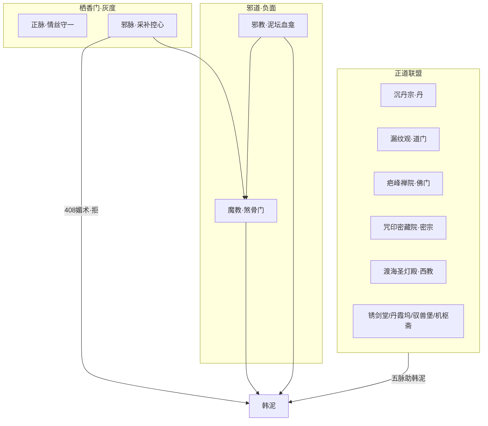

# 势力阵营：栖香门 · 道门 · 佛门 · 密宗 · 西教 · 魔教 · 邪教

> **1560 章 / 500 万字** 标准。与 `04` 十二部、`03` 恩仇、`08` 道侣担当联动。  
> **总原则**：道·佛·密·西教为 **正面助缘**（各有专长，韩泥 **不皈依、只并肩**）；魔教邪教 **负面**；栖香门 **灰度试炼**（邪脉祸乱、正脉式微）。

---

## 一、势力总览



| 阵营 | 定性 | 地域 | 特长 | 主要部 |
|------|------|------|------|--------|
| **沉丹宗** | 正道核心 | 东州 | 丹道 | 一～四 |
| **道门·漏纹观** | 正面 | 东州漏纹峰 | 符箓、阵法 | 二～十二 |
| **佛门·疤峰禅院** | 正面 | 南州疤峰 | 疗伤、超度、镇心魔 | 四～十二 |
| **密宗·咒印密藏院** | 正面 | 西州雪岭 | 真言、手印、坛城封邪 | 三～十二 |
| **西教·渡海圣灯殿** | 正面 | 西极海港 | 圣光、圣疗、驱邪 | 二～十二 |
| **栖香门** | 灰度 | 南疆栖香谷 | 双修；正少邪多 | 二～六 |
| **魔教·煞骨门** | 负面 | 西北戈壁 | 煞气、魔丹、控心 | 二～十二 |
| **邪教·泥坛血龛** | 负面 | 地下血社 | 血祭、人炉、尸傀 | 四～十 |

**韩泥立场**：敬而不拜；「我是还账的俗人，符也好、佛印也好、真言也好、圣光也好，能护人就用。」

---

## 二、道门（正面）

### 漏纹观

| 项 | 设定 |
|----|------|
| 代表 | **玄谷子**（长老）、**墨鹤子**（天才） |
| 立场 | 顺天利人；妖邪必诛 |

| 章 | 事件 |
|----|------|
| **228** | 丑丹换保命符 |
| **378** | 四象锁魔阵助抗魔教夜袭 |
| **395** | 天试符试裁判 |
| **520** | 赠遁天符赴沉礁海 |
| **680** | 南荒遗迹破阵 |
| **900** | 墟灵域传送阵阁 |
| **1300** | 渡劫引雷分流 |

---

## 三、佛门（正面）

### 疤峰禅院

| 项 | 设定 |
|----|------|
| 代表 | **空澄禅师**、**戒苦师太** |
| 立场 | 慈悲不软弱；度不了则斩 |

| 章 | 事件 |
|----|------|
| **402** | 天试施药棚；韩泥赠丹积善因 |
| **430** | 安宁咒（言伯钧战前） |
| **545** | 与韩泥拒邪教人炉拍 |
| **680** | 佛窟得镇心舍利 |
| **710/720** | 叶青禾无常偈、坐化超度 |
| **1300** | 佛印护心魔劫 |

---

## 四、密宗（正面）

### 4.1 咒印密藏院

| 项 | 设定 |
|----|------|
| 山门 | 西州 **雪岭·金刚坛城** |
| 特长 | 真言咒、手印封邪、坛城结界、破魔障；不重丹道 |
| 代表 | **持珠法王**（长老）、**索南坚**（年轻行者） |
| 与佛门 | 同源异脉；佛主度化、密主降魔，常联手 |
| 立场 | 护世伏魔；不涉红尘恩怨采补 |

### 4.2 剧情锚点

| 章 | 事件 | 衔接 |
|----|------|------|
| **55** | 泥岗过路藏僧赠 **祛寒真言符**（老耿转交韩泥） | 一部伏笔 |
| **352** | 备战七派，索南坚以真言助韩泥化丹毒 | 三部末 |
| **398** | 天试开幕，密院布 **坛城护场** 封地脉血痕 | 防邪教渗入 |
| **415** | 心魔试：**大手印** 定神，韩泥过关 | 四部 |
| **418** | 与西教圣光 **合击驱散** 栖香媚雾（408 后善后） | 五脉对照 |
| **560** | 沉礁海尸傀袭，真言 **镇魂印** 封尸 | 五部 |
| **690** | 南荒密窟，密僧与空澄 **双印封邪瓮** | 六部 |
| **920** | 墟灵域建 **密转法坛** 稳传送（**八部开篇 911～920**） | 七部末铺垫→八部 |
| **1290** | 渡劫 **六字大明咒印** 护体一重 | 十部 |

### 4.3 与韩泥

- 索南赞韩泥「丑相里丹心正」，赠真言不改信仰。  
- 韩泥以 **破魔丹** 换真言护符，符密丹互补。

---

## 五、西方教派（正面）

### 5.1 渡海圣灯殿

| 项 | 设定 |
|----|------|
| 起源 | **西极大陆** 经海港传教东来 |
| 山门 | 东陆 **磴港·圣灯堂**（分会），总坛在西极 |
| 特长 | 圣光疗伤、驱邪、祝福结界；擅克 **尸傀、血煞、媚术余毒** |
| 代表 | **艾德里安神父**（分殿长）、**塞拉修女**（圣疗） |
| 立场 | 护弱抗魔；不干涉东土宗门内政；与魔教邪教誓敌 |

### 5.2 剧情锚点

| 章 | 事件 | 衔接 |
|----|------|------|
| **55** | 洋商队经泥岗，村民议「洋和尚治病」 | 与密宗 55 同章不同人 |
| **248** | 坊市圣疗换韩泥 **清瘴丸**；塞拉谢「愿光护苦人」 | 二部 |
| **385** | 七宗天试前，十字殿 **旁听使团** 抵沉丹 | 四部前奏 |
| **418** | 圣光 **驱媚雾**；艾德里安不言爱欲只斥邪脉 | 408 后 |
| **548** | 沉礁海圣堂拒收邪教邪器拍卖 | 五部 |
| **705** | 南荒瘟疫，塞拉与韩泥 **圣疗+丹药** 并救村 | 善因＋白 |
| **950** | 墟灵域西陲圣城，光明抗魔教先锋 | 七～八部 |
| **1310** | 渡劫圣光柱分流（道·佛·密·光 **四重护**） | 十部 |

### 5.3 与韩泥

- 艾德里安敬其丑账逻辑：「还债近于忏悔，近于光。」  
- 韩泥不领洗、不拜十字：「你们的光收着，我的账自己还。」  
- 塞拉修女 **无情感线**；照拂伤员与叶青禾病中（纯善）。

---

## 六、栖香门（灰度 · 情感试炼）

| 脉 | 代表 | 章锚 |
|----|------|------|
| 正脉 | **乐凝雪** | 420 赠叶情丝符；**710 盟绶纯契**（可选） |
| 邪脉 | **杜烟萝** | 228/310/**408**/498 → 850 投魔 |

**408** 韩泥：「我妻在泥岗。」→ **418** 道佛密西四脉合力清媚雾余毒。

**硬规**：栖香 **邪脉非后宫**；正脉 **盟绶为纯契无性修**（见 `19` §2.4）。

---

## 七、魔教（负面）

### 煞骨门

| 代表 | 章锚 |
|------|------|
| **屠千煞**（门主） | 535～**1280** 灭 |
| **钱戾衡**（少主） | 70→318→**510** 诛 |

裘默川 **318** 引魔 → **378/440** 夜袭战死线（**禁自刎**；言伯钧、裘默川均战死拖魔教垫背）。

---

## 八、邪教（负面）

### 泥坛血龛

| 代表 | 章锚 |
|------|------|
| **血袍祭司** | 545/620/1170 灭 |
| **无面教主** | **1050** 现身→1170 灭 |

**26** 旱灾谣传 → **395** 地脉血痕 → **545** 人炉拍卖。

---

## 九、天试与五脉会诊（四部 391～520）

### 9.1 七派参赛 + 五脉特邀

| 序 | 势力 | 角色 |
|----|------|------|
| 1 | 沉丹宗 | 丹试主场 |
| 2 | 漏纹观 | 符试裁判 |
| 3 | 疤峰禅院 | 心魔/疗伤试 |
| 4 | 锈剑堂 | 剑试 |
| 5 | 丹霞坞 | 丹毒试 |
| 6 | 驭兽堡 | 驭兽试 |
| 7 | 机枢斋 | 机关试 |
| 特邀 | **咒印密藏院** | 坛城护场 **398**、大手印 **415** |
| 特邀 | **渡海圣灯殿** | 旁听 **385**、圣光驱邪 **418** |

栖香邪脉、魔教、邪教 **不参赛**。

### 9.2 四部正邪高潮链

```
395血痕 → 402佛棚 → 408媚术(韩泥拒) → 418四脉驱雾 → 420灵誓
→ 440魔教屠宗（言伯钧战死拖垫背） → **455**夺魁 → 510诛戾衡
```

---

## 十、十二部穿插密度

| 部 | 道门 | 佛门 | 密宗 | 西教 | 栖香 | 魔教 | 邪教 |
|----|------|------|------|------|------|------|------|
| 一 | — | — | **55** | **55** | 48 | 72 | 26 |
| 二 | 228 | — | — | **248** | 228 | — | — |
| 三 | **378** | — | **352/353** | **385** | 310/420 | 318/378 | — |
| 四 | 520 | 402/430 | **398/415/418** | **418** | 408/420 | 440/**455**/510 | 395 |
| 五 | — | 545 | **560** | **548** | — | 535/650 | 545/620 |
| 六 | 680 | 710/720 | **690** | **705** | 710 | 780 | 700 |
| 七～九 | 900 | 900 | 920 | **948/988** | 850 | 1280 | 1050/1170 |
| 十～十二 | 1300 | 1300 | **1290** | **1310** | — | 1300 | — |

---

## 十一、五脉渡劫合护（十部 1300 前后）

| 序 | 势力 | 护劫方式 |
|----|------|----------|
| 1 | 道门 | 四象引雷分流 |
| 2 | 佛门 | 佛印镇心魔 |
| 3 | 密宗 | 大明咒印封煞 |
| 4 | 西教 | 圣光柱净化血煞 |
| — | 叶青禾执念因 | 护心魔一瞬（情感） |

魔教屠千煞 **1280** 已灭，**1300** 天劫主要为心魔+因果清算。

---

## 十二、与情感/担当衔接

| 章 | 事件 | 担当 |
|----|------|------|
| 408 | 栖香媚术 | 「我妻在泥岗」 |
| 418 | 五脉驱雾 | 拒媚后不杀，清场 |
| 420 | 灵誓 | 正绶立约 |
| 705 | 塞拉圣疗+韩泥丹 | 救村不纳人 |
| 720 | 空澄超度 | 叶别 |

---

## 十三、写法硬规

1. 道·佛·密·西教 **各擅其职**，不写成一家；韩泥 **不皈依任何一派**。  
2. 西教、密宗 **不抢道侣线**；无塞拉/索南/乐凝雪男女欲。  
3. 魔教邪教 **不洗白**。  
4. 栖香邪脉 **非后宫**。  
5. 正面势力写 **行动**：符、药棚、手印、圣光、坛城——少空洞说教。  
6. 恩仇分立：诛魔章不温存，报恩章不血祭。

---

## 十四、关键人物速查

| 人物 | 势力 | 章 | 结局 |
|------|------|-----|------|
| 玄谷子/墨鹤 | 道门 | 228～1300 | 道友 |
| 空澄/戒苦师太 | 佛门 | 402～1300 | 善因 |
| **持珠法王/索南坚** | 密宗 | 55～1290 | 破魔盟友 |
| **艾德里安/塞拉** | 西教 | 55～1310 | 圣疗盟友 |
| 乐凝雪 | 栖香正脉 | 420～850 | **710盟绶**；守谷分行 |
| 杜烟萝 | 栖香邪脉 | 408～850 | 投魔 |
| 屠千煞/钱戾衡 | 魔教 | 70～1280 | 灭/诛 |
| 血袍祭司/无面教主 | 邪教 | 545～1170 | 灭 |
