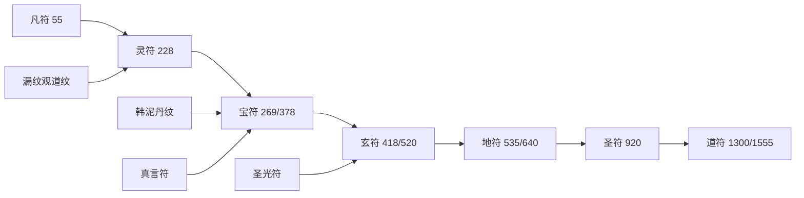

# 符录系统（符箓品质 · 绘符 · 章锚）

> **1560 章 / 500 万字** 标准。与 `02` 战力公式、`11` 道具九阶、`13` 道门漏纹观联动。  
> **定位**：韩泥 **主业丹、辅业符**；保命靠符，强攻靠丹与炉；阵法见 `21`；符录不跳阶。

---

## 一、符录 vs 道具九阶

符录品阶与法器九阶 **数值对齐、命名独立**（符修口语）。

| 符阶 | 符录品 | 对标道具阶 | 典型境界 | 符力倍率 |
|------|--------|------------|----------|----------|
| 0 | **凡符** | 凡品 | 凡人 | ×1 |
| 1 | **灵符** | 灵品 | 炼气 | ×1.5 |
| 2 | **宝符** | 宝品 | 筑基 | ×2 |
| 3 | **玄符** | 玄品 | 结丹 | ×3 |
| 4 | **地符** | 地品 | 元婴 | ×4 |
| 5 | **天符** | 天品 | 化神 | ×5 |
| 6 | **圣符** | 圣品 | 炼虚 | ×6 |
| 7 | **仙符** | 仙品 | 合体～大乘 | ×8 |
| 8 | **道符** | 道品 | 渡劫～真仙 | ×10 |

口诀：**凡灵宝玄，地天圣仙道**（沈枯芽背符时与丹诀连诵）。

**战力公式补项**：

```
有效战力 = 境界基础 × 法器阶 × 符录加成 × 阵盘加成 × 丹药状态 × 遁逃准备
符录加成 = 当前持符最高阶品 × 激活符数量系数（最多计 3 符）
```

---

## 二、符录八类（功能）

| 类 | 记号 | 用途 | 韩泥常用 |
|----|------|------|----------|
| **遁符** | 遁 | 逃命、瞬移 | ★★★★★ |
| **爆符** | 爆 | 一次性杀伤 | ★★★ |
| **封符** | 封 | 困敌、封脉 | ★★★ |
| **护符** | 护 | 护盾、护体 | ★★★★ |
| **幻符** | 幻 | 隐匿、易容 | ★★★★ |
| **镇符** | 镇 | 镇魂、镇尸、镇煞 | ★★★ |
| **驱符** | 驱 | 驱邪、破媚、克魔 | ★★★ |
| **疗符** | 疗 | 疗伤、稳神 | ★★ |

---

## 三、绘符三脉（来源）

| 脉 | 来源 | 特长 | 与韩泥 |
|----|------|------|--------|
| **道纹符** | 漏纹观 | 遁、封、阵眼 | 墨鹤换符、玄谷赠符 |
| **丹纹符** | 韩泥自悟 | 疗、护（丹气入符） | 260 后丹师绘符 |
| **真言符** | 密宗 | 镇、驱 | 55 祛寒；560 镇尸 |
| **圣光符** | 西教 | 驱、护（克邪媚） | 418 驱媚雾 |

密宗真言符、西教圣光符 **视同同阶符录**，不另开品阶。

---

## 四、韩泥符录主线升阶

| 符名 | 类 | 阶 | 得/绘章 | 事件 |
|------|-----|-----|---------|------|
| 祛寒符 | 护 | 凡符 | **55** | 索南转交（经老耿） |
| 保命灵符×3 | 遁/护 | 灵符 | **228** | 丑丹换墨鹤 |
| 绘符残页 | — | — | **95** | 墟翁丹经附页 |
| 遁形宝符 | 遁 | 宝符 | **269** | 丹室落成后首绘 |
| 锁魔符眼 | 封 | 宝符 | **378** | 四象阵辅阵眼 |
| 驱媚驱符 | 驱 | 玄符 | **418** | 五脉合绘克媚术 |
| 遁天符 | 遁 | 玄符 | **520** | 玄谷赠赴沉礁海 |
| 镇魂地符 | 镇 | 地符 | **640** | 元婴护神 |
| 沉礁海杀爆符 | 爆 | 地符 | **535** | 沉礁海备符 |
| 圣传送符 | 遁 | 圣符 | **920** | 墟灵域传送 |
| 劫引道符 | 封/护 | 道符 | **1300** | 渡劫引雷分流 |

**符室**（洞府疤台 **520** 解锁）：量产灵符～宝符；玄符以上需道门换材或自研。

---

## 五、符录 × 十二部穿插

| 部 | 章 | 符录事件 |
|----|-----|----------|
| 一 | 55 | 凡符祛寒入账 |
| 二 | 228 | 灵符保命；248 西教圣疗（非符，对照） |
| 二 | 260 | 筑基后可绘 **宝符** 胚 |
| 三 | **269** | 首绘遁形宝符；378 阵眼符 |
| 四 | 395/415 | 符试、心魔试；418 驱符；**520** 遁天玄符 |
| 五 | 535/640 | 爆符、镇魂地符 |
| 六 | 680 | 墨鹤合绘封邪符 |
| 七 | 920 | 圣传送符 |
| 十 | 1300 | 道符劫引+五脉合护 |
| 十二 | 1555 | 泥瓮簿化道符入天道 |

每部 **≥1** 次符录显性描写（持符、绘符、碎符、换符）。

---

## 六、符录 × 恩仇情感

| 章 | 符录 | 叙事 |
|----|------|------|
| 228 | 灵符 | 丹换符，韩泥「丹给人，符给自己」 |
| 269 | 宝符 | 丹室落成后绘遁形宝符，叶青禾守门 |
| 408 | — | 拒媚术；**418** 驱符善后 |
| 420 | 情丝符 | 乐凝雪赠叶（栖香正脉，非韩泥符道） |
| 535 | 爆符 | 沉礁海追杀，铁无言持韩泥符 |

报恩可赠 **疗符、护符**；报仇章可用 **爆符、封符**，恩仇分立不变。

---

## 七、符录 × 势力

| 势力 | 符录贡献 |
|------|----------|
| 漏纹观 | 道纹符主脉；228/378/520/1300 |
| 密宗 | 真言镇驱符；55/560/1290 |
| 西教 | 圣光驱护符；418/1310 |
| 佛门 | 不绘符，佛印视同 **天符** 级镇心（1300） |
| 沉丹宗 | 韩泥丹纹符自创 |
| 魔教邪教 | 邪符（媚符、尸符）——负面，韩泥毁之 |

---

## 八、与道具/洞府衔接

| 系统 | 衔接 |
|------|------|
| 道具九阶 | 符阶≤当前大境对应阶，不跳 |
| 洞府符室 | 疤台（520）解锁；天符需瓮天府 |
| 馈缘链 | 赠疗符、护符 = 对口赠礼 |
| 泥瓮簿 | 邪符害人记恶因；绘符救人记善因 |

---

## 九、写法硬规

1. 符必 **有名有阶**：「一张玄符遁天符，燃尽。」  
2. 韩泥 **不能越阶绘符**；高阶来自道门赠、密宗助、战后缴获。  
3. 一次性符 **燃尽即没**，不无限刷。  
4. 符试（395）与丹试（455）**分立**，不同章。  
5. 真言符、圣光符写明来源脉，不混为丹纹符。

---

## 十、符录总图


