# 《还礼仙翁传》整体层次结构图

> **用途**：一图总览全书设计——作品内核、经典参照、五大子系统、文档体系、剧情架构。  
> **英文名**：The Returning Gift Sage · **核心**：鸿蒙万缘塔驱动一切成长  
> **更新**：2026-07-12 · 衔接校验第十二版 · **七品类贯穿 v1** · [`EXPANSION-七品类贯穿全书章锚表`](./chapters/EXPANSION-七品类贯穿全书章锚表.md)

---

## 〇、作品总体架构图（核心三层）

> 全书设计的**顶层骨架**：内核定魂 → 经典借骨 → 五系落地。与下文各章细节图互补。

### 纵览（对照设计稿）

```
┌─────────────────────────────────────────────────────────┐
│  L0 · 作品内核                                          │
│  《还礼仙翁传》The Returning Gift Sage                  │
│  六步穿插：赠礼→四维→倒贴→感恩→纳绶→鸡犬升天        │
└──────────────────────────┬──────────────────────────────┘
                           ▼
┌─────────────────────────────────────────────────────────┐
│  L1 · 六步穿插链（骨）+ 三支撑系统（肉）               │
│  ①赠礼 ②四维 ③倒贴 ④感恩 ⑤纳绶 ⑥E14                   │
│  **七品类**（丹/器/宝/符/阵/宠/骑）· **品阶**（凡→神）· **十一境小境**（凡人通则） │
│  道具 · 符录 · 灵宠坐骑 · 修炼洞府 · 阵法丹道           │
└──────────────────────────┬──────────────────────────────┘
                           ▼
┌─────────────────────────────────────────────────────────┐
│  L2 · 三部经典参照                                      │
│  斗罗 25%  ·  斗破 35%  ·  凡人 40%                     │
└──────────────────────────┬──────────────────────────────┘
                           ▼
┌─────────────────────────────────────────────────────────┐
│  L3 · 五大子系统                                        │
│  送礼情感 │ 倒贴俘获 │ 修仙飞升 │ 报恩感恩 │ 战力爽点   │
│  + **七品类品阶贯穿**（见章锚表）· 灵宠坐骑 · 洞府阵丹   │
└──────────────────────────┬──────────────────────────────┘
                           ▼
┌─────────────────────────────────────────────────────────┐
│  L4 · 落地层（本作专有）                                │
│  十二部1250章 · 200章锚点 · 鸿蒙万缘塔体系 · 文档+游戏      │
└─────────────────────────────────────────────────────────┘
```

### Mermaid 渲染版

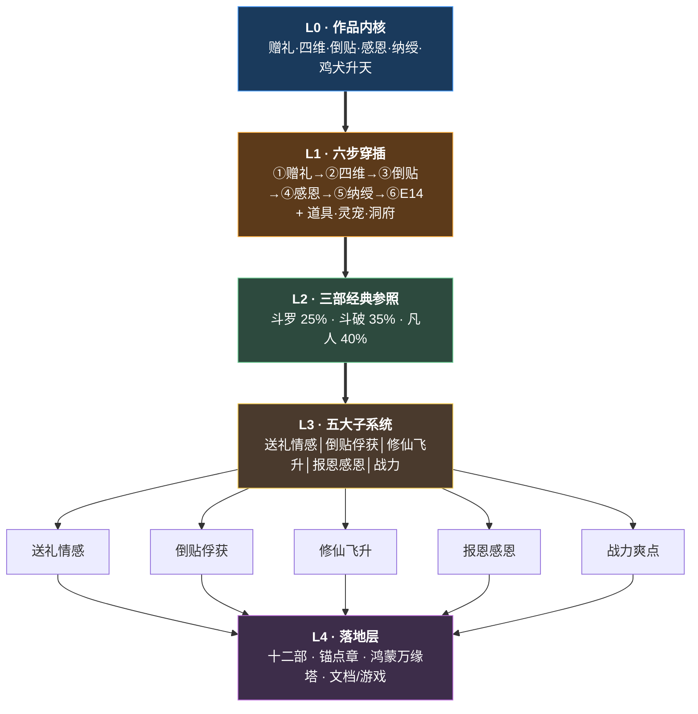

---

### L0 · 作品内核

| 项 | 内容 |
|----|------|
| 书名 | **还礼仙翁传**（The Returning Gift Sage） |
| 主角 | 莫长春——貌七十二，修龄二百八十年，渡劫失败寿元倒计时 |
| 叙事骨 | **①赠礼 → ②四维↑ → ③倒贴 → ④报恩感恩 → ⑤纳绶 → ⑥鸡犬升天** |
| 支撑系统 | **道具** · **符录** · **阵法·丹道** · **灵宠坐骑** · **修炼洞府** |
| 叙事壳 | 副本/大赛/秘境/盟会/拍卖/终战/闪回（承载场面） |
| 外道势力 | 合欢宗·道门·佛门·密宗·西方教派（正）·魔教·邪教（邪）— [`09-外道魔邪势力图.md`](./09-外道魔邪势力图.md) |
| 穿插模型 | [`chapters/EXPANSION-穿插主线模型.md`](./chapters/EXPANSION-穿插主线模型.md) |
| 五系文档 | [`08`](./08-道具灵宠洞府系统.md) · [`10`](./10-符录系统.md) · [`11`](./11-阵法丹道系统.md) · [`后宫`](./chapters/EXPANSION-后宫收集与道侣家族线.md) |
| 篇幅 | 500 万字 · 1250 章 · 200 章锚点不可删 |

---

### L1 · 三部经典参照（只借结构，不抄设定）

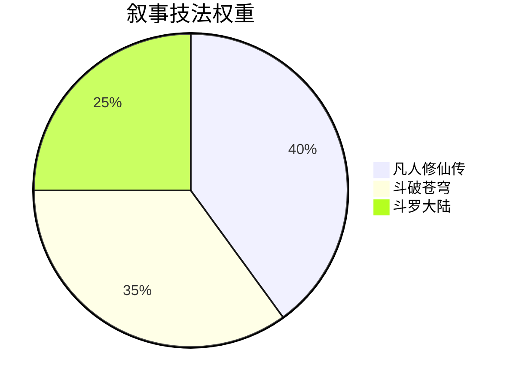

| 来源 | 权重 | 借什么 | 本作落点 |
|------|------|--------|----------|
| **凡人修仙传** | 40% | 谨慎生存、坊市捡漏、秘境层进、宗门政治、闪回慢揭 | 装穷三策、青岚坊市、赠缘古冢七层、周德海分裂、枯荣旧事 |
| **斗破苍穹** | 35% | 受辱立约、围观震场、章末留钩、炼药大会、拍卖夺宝、闯塔 | **迟暮之约**、玉佩一击、天试丹武、赠缘塔、天机秋拍 |
| **斗罗大陆** | 25% | 觉醒测定、战队编制、大赛三周、猎兽契灵、师徒传承 | 气运测定、**气运七队**、天试三周、缘契灵宠、沈→莫→顾传承 |

**红线**：不出现唐三、萧炎、韩立、魂环、异火、纳戒等专有名词。

---

### L1 · 六步穿插链


| 步 | 密度 | 三系统落点 |
|----|------|------------|
| ① | 每 5 章 | 丹药/灵器/法宝/灵宠卵 |
| ② | 随① | 品类→四维倾向 |
| ③ | 每 8 章 | 同乘坐骑、灵宠喜剧、会客亭 |
| ④ | 每 25 章 | 回赠丹器、洞府感恩 |
| ⑤ | 向 100 章递进 | 合契丹、D5别院、信物 |
| ⑥ | 1105～1150 | 灵宠舱、虚空舟 |

> [`EXPANSION-穿插主线模型.md`](./chapters/EXPANSION-穿插主线模型.md) · [`08-道具灵宠洞府系统.md`](./08-道具灵宠洞府系统.md)

---

### L3 · 五大子系统（扩写 checklist）

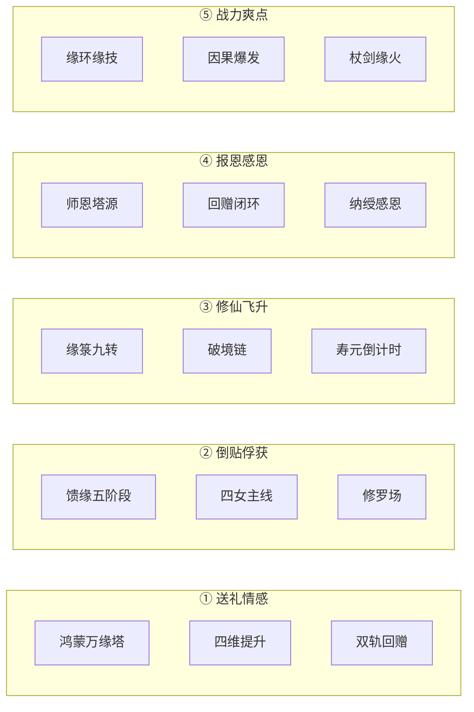

| 子系统 | 权重 | 本作载体 | 扩写文档 |
|--------|------|----------|----------|
| **① 送礼情感** | **45%** | 赠礼→四维；每 5 章 1 赠礼 | `EXPANSION-送礼情感主线加重` |
| **② 倒贴俘获** | （含①） | 馈缘→纳绶；每 8 章 1 倒贴 | `EXPANSION-情感线深描规划` |
| **③ 修仙飞升** | 25% | 缘箓九转→E14 | `06` · `vol09～10` |
| **④ 报恩感恩** | **15%** | 赠礼闭环；每 25 章 1 名场面 | `EXPANSION-送礼情感主线加重` §四 |
| **⑤ 战力爽点** | 10% | 缘环、玉佩、杖龙 | `05` 缘环表 |

**扩写铁律**：每一章优先 **赠礼+四维变动**；政治/战斗章末须接倒贴或感恩回收。

---

### L4 · 落地层（L3 向下展开）

| 落地模块 | 说明 | 文档 |
|----------|------|------|
| 十二部主线 | 人间 1～900 → 余韵 901～1000 → 上界 1001～1250 | `06-五百万字全书架构.md` |
| 200 章锚点 | 不可删事件，周围 ×5 加厚 | `03` + `chapters/vol01～09` |
| 分部加厚 | 第一部 1～100、第三部 221～360 等 | `chapters/EXPANSION-*.md` |
| 校验闭环 | 衔接 47 项 + 系统一致性 | `chapters/AUDIT-*.md` |
| 正文扩写 | 优先锚章 prose | `prose/README.md` |

---

## 一、项目总览（顶层）

```
还礼仙翁传（LegendOfTheElderCultivator）
│
├── 📚 文档层 docs/还礼仙翁传/     ← 策划·章纲·校验·正文（本文档所在）
└── 📦 备份层 docs/backup/         ← 《万古守灯人》旧档
```

> 程序实现附录见 `02` 第十九章；**正文扩写以 `04`/`08`/`10`/`11`/`12` 与各部 EXPANSION 为准**。

| 维度 | 目标 |
|------|------|
| 篇幅 | **500 万字** · 约 **1250 章** · 均章 3800～4200 字 |
| 骨架 | **200 章锚点不可删**（50 万核心） |
| 类型 | 东方仙侠 · 老年逆袭 · 喜剧爽文 · 多线深情 |
| 主角 | 莫长春（貌七十二，修龄二百八十年） |
| 命题 | 赠人一礼，天道还你十倍；有恩报恩，有仇报仇 |

---

## 二、文档层次结构

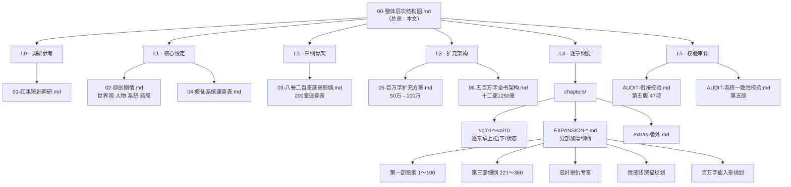

### 文档阅读顺序（建议）

```
新人入门：00（本文）→ 02 作品信息+第二章 → 04 速查 → 03 二百章表
扩写写作：06 十二部 → EXPANSION 分部细纲 → chapters/volXX 锚点章 → prose/
校验修订：AUDIT 衔接 + 系统 → 回写 volXX / 03
```

---

## 三、篇幅演进层次（50 万 → 500 万）

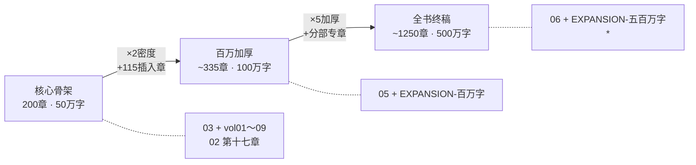

| 层级 | 章数 | 万字 | 主文档 | 写作策略 |
|------|------|------|--------|----------|
| L0 骨架 | 200 | 50 | `03` / `vol01～09` | **锚点事件不可删** |
| L1 百万 | ~335 | 100 | `05` | 字母插入章（如 68A） |
| L2 全书 | ~1250 | 500 | `06` | 锚点周围 ×5 加厚 |
| 穿插 | ~150 | 60 | 情感专章 | 绑定赠礼，防注水 |
| 番外 | ~80 | 20 | `extras` | IF / 列传 / 补完 |

---

## 四、剧情十二部层次（500 万字主线）

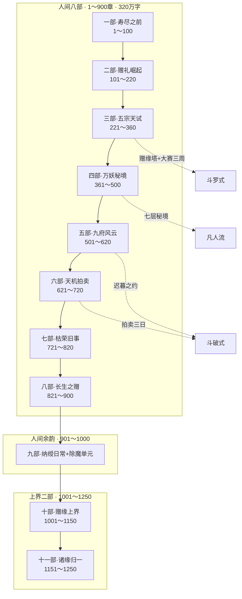

### 十二部速查表

| 部 | 章号 | 万字 | 卷名 | 原八卷对应 | 缘箓锚点 | 细纲 |
|----|------|------|------|------------|----------|------|
| 一 | 1～100 | 40 | 寿尽之前 | 卷一 1～30 | 二转 **100** | [第一部](./chapters/EXPANSION-五百万字第一部细纲.md) |
| 二 | 101～220 | 48 | 赠礼崛起 | 卷二 31～60 | 三转 **220** | [第二部](./chapters/EXPANSION-五百万字第二部细纲.md) |
| 三 | 221～360 | 56 | 五宗天试 | 卷三 61～90 | 四转 **360** | [第三部](./chapters/EXPANSION-五百万字第三部细纲.md) |
| 四 | 361～500 | 56 | 万妖秘境 | 卷四 91～120 | 五转 **500** | [第四部](./chapters/EXPANSION-五百万字第四部细纲.md) |
| 五 | 501～620 | 48 | 九府风云 | 卷五 121～145 | 六转 **620** | [第五部](./chapters/EXPANSION-五百万字第五部细纲.md) |
| 六 | 621～720 | 40 | 天机拍卖 | 卷六 146～165 | 七转 **720** | [第六部](./chapters/EXPANSION-五百万字第六部细纲.md) |
| 七 | 721～820 | 40 | 枯荣旧事 | 卷七 166～185 | 八转 **820** | [第七部](./chapters/EXPANSION-五百万字第七部细纲.md) |
| 八 | 821～900 | 32 | 长生之赠 | 卷八 186～200 | 九转 **900** | [第八部](./chapters/EXPANSION-五百万字第八部细纲.md) |
| 九 | 901～1000 | 40 | 人间余韵 | 新增 | — | [第九部](./chapters/EXPANSION-五百万字第九部细纲.md) |
| 十 | 1001～1150 | 60 | 赠缘上界 | 卷九 211～220 | E14 **1150** | [第十部](./chapters/EXPANSION-五百万字第十部细纲.md) |
| 十一 | 1151～1250 | 40 | 诸缘归一 | 新增 | 簿揭秘 | [第十一部](./chapters/EXPANSION-五百万字第十一部细纲.md) |
| 穿插 | — | 60 | 情感深描 | — | — |
| 番外 | — | 20 | 列传/IF | 201～210 | — |

---

## 五、200 章锚点映射层（不可删）

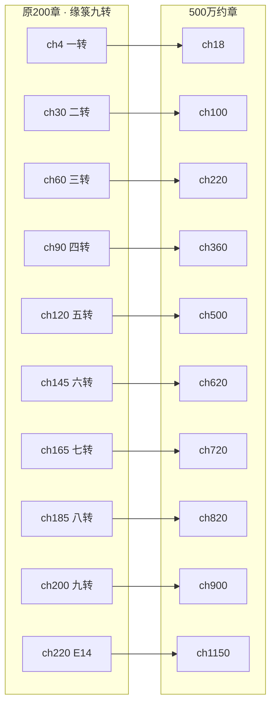

| 缘箓 | 原章 | 500万章 | 标志事件 | 修为节点 |
|------|------|---------|----------|----------|
| 一转 | 4 | 18 | 首赠师尊→青竹杖 | 筑基中 |
| 二转 | 30 | 100 | 善赠三人，天试风声 | 筑基后 |
| 三转 | 60 | 220 | 夜袭后，天试帖至 | 筑基后 |
| 四转 | 90 | 360 | 天试夺魁 | 筑基后 |
| 五转 | 120 | 500 | 秘境通关 | 金丹初 |
| 六转 | 145 | 620 | 玉佩一击 | 金丹中 |
| 七转 | 165 | 720 | 缘火入杖 | 金丹后 |
| 八转 | 185 | 820 | 枯荣圆满 | 元婴初 |
| 九转 | 200 | 900 | 簿满长生 | **化神巅峰**·D18胚 |
| E14 | 220 | 1150 | 鸡犬升天 | 飞升 |

---

## 六、鸿蒙万缘塔系统层次（唯一核心）

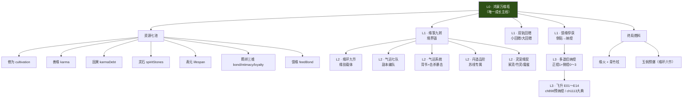

### 系统铁律（禁止项）

```
❌ 第二条独立成长主线（纯打坐升级、换系统）
❌ 缘箓与修为脱节（每转必有破境或战力节点）
❌ 馈缘与纳绶脱节（馈缘≥80 方可纳绶）
❌ 情感章脱离赠礼/回赠（视为注水）
❌ 上界新增平级系统（仅「缘品」「天赐章」扩展）
```

### 上界扩展（十～十一部）

| 系统 | 人间 | 上界 |
|------|------|------|
| 鸿蒙万缘塔 | 九转满 | 天赐章 |
| 缘箓 | 九转 | 缘品（非第十转） |
| 道侣 | 纳绶 | 复核，主携不变 |
| 地图 | 东南灵域 | 赠缘司·三天界·散修天 |

---

## 七、人物与情感层次

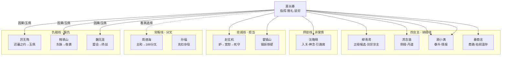

### 情感阶段 × 系统绑定

| 阶段 | 馈缘 | 亲密 | 剧情表现 |
|------|------|------|----------|
| 嫌弃 | 0～19 | <30 | 谣言、躲 |
| 在意 | 20～39 | 30～49 | 偷看、专属回赠 |
| 心动 | 40～59 | 50～69 | 药渣定情、半石 |
| 倒贴 | 60～79 | 70～84 | 扑怀、夜访、争座 |
| 纳绶候选 | 80～100 | 85+ | 大典、正绶/侧绶 |

### 六大修罗场公演（须加厚）

| 场次 | 500万约章 | 名场面 |
|------|-----------|--------|
| 丹堂夜访 | 52～55 | 「你缺心意」 |
| 体统 | 165～170 | 柳冷脸路过 |
| 献花风波 | 310～325 | 木青萝献花 |
| 座次修罗 | 555～570 | **老夫坐门口** |
| 纳绶嫉妒 | 885～900 | 正绶/侧绶顺序 |
| 飞升问心 | 1105～1115 | 愿共升否 |

---

## 八、忠奸恩仇层次

```
忠奸恩仇（绑定鸿蒙万缘塔，不脱离系统）
│
├── 报恩
│   ├── 沈晚晴入关前赠丹 → 青竹杖（ch4/18）
│   ├── 药渣三十年 → 苏丹心（ch11/38）
│   └── 赵宽恕 → 护心镜回赠（ch46/585）
│
├── 报仇
│   ├── 厉讽「将死之人」→ 迟暮之约 → 玉佩一击（ch19→587→589）
│   ├── 韩索东脉 → 夜袭斩妖帅（ch17～56）
│   └── 魏盟会撤 → 终战（ch145→188～197）
│
├── 忠诚（担当）
│   ├── 柳压谣言（ch16/64）
│   ├── 赵守丹堂（ch54～59/200～210）
│   ├── 莫坐门口（ch580～581）
│   └── 霍铁壁 / 顾情报网
│
└── 背叛（分叉·有代价）
    ├── 周德海：主和→勾结→188 开门/战死（ch860～870）
    ├── 孙福：克扣→除名
    └── 赵前期：陷害→宽恕线（非洗白害人）
```

**迟暮之约扩写链**：580 践行宴 → 581 坐门口 → 584 战前夜炼胚 → **587 够活到后悔** → **589 玉佩一击** → 590 缘箓六转

---

## 九、卷末状态链（莫长春 · 校验用）

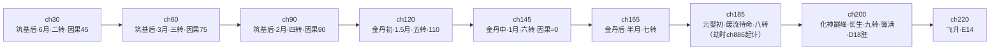

---

## 十、附录 · 程序映射（非正文写作必读）

> 以下为早期规划字段，**正文状态行与细纲校验不依赖本节**。

| 文档概念 | 代码字段（规划） |
|----------|------------------|
| 资源七池 | `cultivation` / `karma` / `lifespan` / `bond`… |
| 缘箓九转 | `yuanJuanTurn` 1～9 |
| 馈缘五阶段 | `feedBond` 0～100 |
| 赠礼编号 | `giftRecords[]` #1～#12 |
| 纳绶 | `partnerSlots` 正绶+侧绶 |
| 结局 | `endingId` E01～E14 |

---

## 十一、写作实施路线图

```mermaid
gantt
    title 500万字分期实施
    dateFormat X
    axisFormat %s

    section 人间前期
    第一部 1～100           :p1, 0, 40
    第二三部 101～360        :p2, 40, 104

    section 人间中后期
    第四五部 361～620        :p3, 144, 104
    第六七八部 621～900      :p4, 248, 112

    section 上界收束
    第九十部 901～1150       :p5, 360, 100
    第十一部+番外 1151+      :p6, 460, 40
    全书校验删冗余           :p7, 500, 20
```

| 期 | 章号 | 万字 | 优先文档 |
|----|------|------|----------|
| 1 | 1～100 | 40 | `EXPANSION-五百万字第一部细纲` |
| 2 | 101～360 | 104 | [第二部细纲](./chapters/EXPANSION-五百万字第二部细纲.md) + [第三部细纲](./chapters/EXPANSION-五百万字第三部细纲.md) |
| 3 | 361～620 | 104 | [第四部](./chapters/EXPANSION-五百万字第四部细纲.md) + [第五部](./chapters/EXPANSION-五百万字第五部细纲.md) + `忠奸恩仇专章` |
| 4 | 621～900 | 112 | vol06～08 锚点加厚 |
| 5 | 901～1150 | 100 | [`EXPANSION-五百万字第九部细纲`](./chapters/EXPANSION-五百万字第九部细纲.md) + `vol10-赠缘上界` |
| 6 | 1151～1250+ | 40 | 簿揭秘 + 番外 |
| 7 | 全书 | — | AUDIT 同步更新 |

---

## 十二、快速导航索引

| 我想… | 去看… |
|-------|-------|
| 看总体架构三层图 | **本文 §〇**（L0 内核 → L1 主轴 → L2 经典 → L3 五系） |
| **查送礼倒贴加重** | **`chapters/EXPANSION-送礼情感主线加重.md`** |
| 查剧情分类与比例 | `07-剧情分类与比例统计.md` |
| 查主线是否偏离 | `chapters/AUDIT-主线校验.md` |
| 总览全貌 | **本文 `00-整体层次结构图.md`** |
| 查设定/人物 | `02-原创剧情.md` |
| 查系统数值 | `04-修仙系统速查表.md` |
| 查200章事件 | `03-八卷二百章逐章细纲.md` |
| 查单章承上启下 | `chapters/vol01～vol10` |
| 查500万怎么扩 | `06-五百万字全书架构.md` |
| 查情感/修罗场 | `EXPANSION-情感线深描规划.md` |
| 查迟暮之约/周分叉 | `EXPANSION-忠奸恩仇专章.md` |
| 查衔接是否自洽 | `AUDIT-衔接校验.md` |
| **查全书六维总评** | **`chapters/AUDIT-全文校验第十二版.md`** |
| **查气运背书/暴击** | **`12-气运系统.md`** |
| **查正文扩写进度** | **`prose/README.md`** |
| **查起点上架优化** | **`chapters/EXPANSION-起点商业优化.md`** |
| 查系统是否自洽 | `AUDIT-系统一致性校验.md` |

> 程序实现见 `02` 第十九章附录。

---

*层次结构图 v1 · 与 `06-五百万字全书架构.md` 同步 · 扩写时更新锚点映射表*
