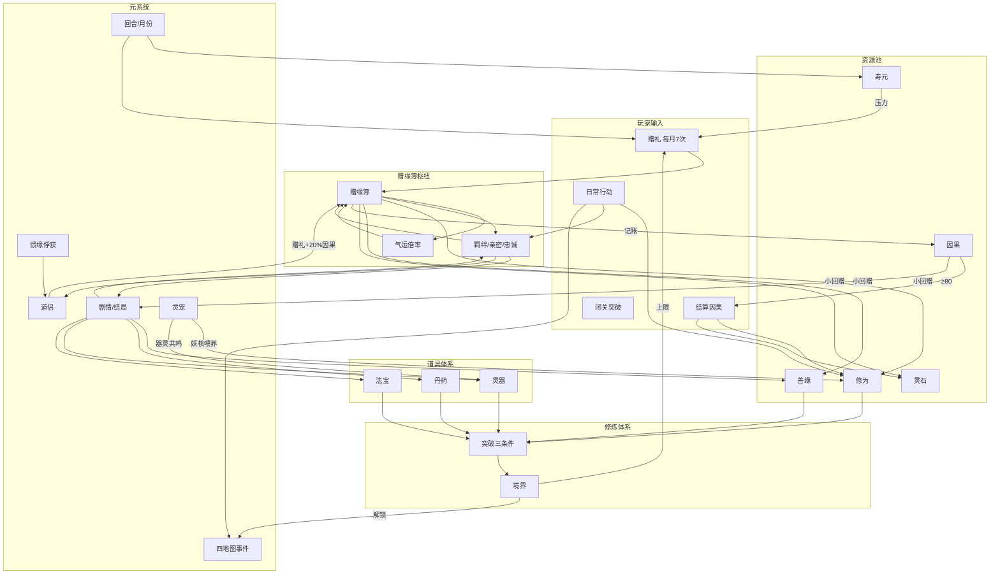
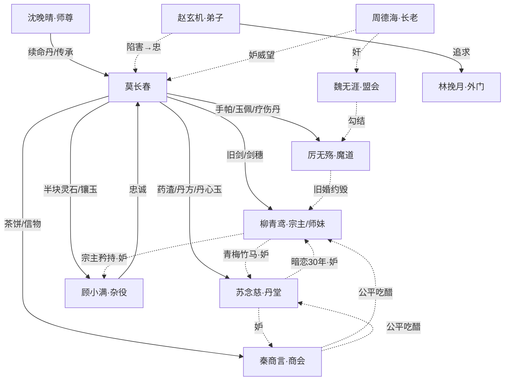
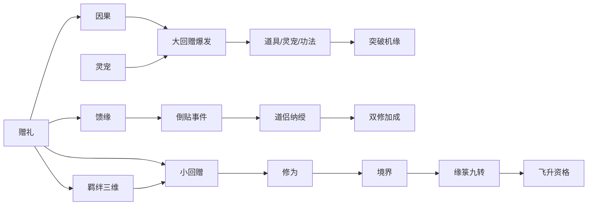

# 《还礼仙翁传》原创剧情设计

> **版权声明**：本作为完全原创虚构作品，借鉴"老年修仙""赠礼逆袭""喜剧反差"等公共题材，  
> 全部人物、地名、系统、情节均为独立创作。  
> 《万古守灯人》剧情已备份至 `../backup/`，本项目主剧情切换为《还礼仙翁传》。

---

## 作品信息

| 项目 | 内容 |
|------|------|
| 中文名 | 还礼仙翁传 |
| 英文名 | The Returning Gift Sage |
| 类型 | 东方仙侠 · 老年逆袭 · 喜剧爽文 |
| 主角 | 莫长春，暮年修士（外表七十二岁，实际修龄二百八十年） |
| 核心命题 | 赠人一礼，天道还你十倍；老了，反而看得更清 |
| 长篇目标 | **500 万字** · 约 1250 章 · 十二部（核心锚点 200 章，见 **第二十二章**） |

### 文档索引

| 章节 | 内容 |
|------|------|
| **→ 总览** | [`00-整体层次结构图.md`](./00-整体层次结构图.md) |
| 一、世界观 | 势力、修炼、丹药、灵器、法宝 |
| **二之一、系统联动** | **修炼↔赠送↔羁绊↔道具↔寿元 总架构** |
| 二、赠缘簿 | 赠送系统、羁绊度、道侣、双轨回赠、日常行动 |
| 三、人物 | 气运之人三维情感、反派忠奸灰度 |
| 四、主线 | 八卷剧情（核心110章→扩展200章） |
| 五、支线 | 角色专属线 + 人心浮世绘 |
| 六~八 | 分集、台词、差异化声明 |
| 九 | 游戏映射蓝图（待开发） |
| 十 | 道具总表、场景事件、时间线 |
| 十一 | 投怀送抱分镜、道侣纳绶、忠奸分叉 |
| 十二 | 结局目录 |
| 十三 | 四卷逐章细纲 |
| 十四 | 序章与支线全剧本 |
| 十五 | 势力暗线年表 |
| 十六 | 降妖除魔剧情线与卷章植入 |
| **十七** | **五十万字扩展：八卷二百章（凡人/斗破/斗罗参照）** |
| **十八** | **→ 完整逐章表见 `03-八卷二百章逐章细纲.md`** |
| **十九** | **市面范式系统深化（修炼·成长·赠返·道具·飞升·灵宠·道侣·馈缘俘获）** |
| **二十** | **第九卷天门飞升（211-220章 · 鸡犬升天）** |
| **二十一** | **百万字扩展：115 插入章 + 扩写密度（见 `05-百万字扩充方案.md`）** |
| **二十二** | **五百万字全书架构（十二部 1250 章 · 见 `06-五百万字全书架构.md`）** |
| **→ 速查** | [`04-修仙系统速查表.md`](./04-修仙系统速查表.md) |

---

## 一、世界观

### 时代与势力

**大周历·灵息复苏第三十七年**，修仙界灵气回升，宗门重新争夺资源。

| 势力 | 说明 |
|------|------|
| **青岚门** | 东南正道大宗，主角所在宗门 |
| **赤焰谷** | 魔教联盟盟主，与青岚门世代对立 |
| **魔教联盟** | 赤焰谷、玄魔宗、血魔殿等六宗联军（负面） |
| **九府盟会** | 各方势力谈判平台，决定资源分配 |
| **百宝阁** | 跨宗门商会，情报与资源中转 |
| **万妖岭** | 东脉外妖兽盘踞之地，灵息复苏后妖潮频发 |
| **镇妖司** | 青岚门内设，巡妖、封妖、猎妖 |
| **道门** | 清虚观、无为观等符箓阵法外道（**正面**） |
| **佛门** | 净慈寺、梵音宗等超度仲裁外道（**正面**） |
| **密宗** | 真言宗、莲华密脉等真言破邪外道（**正面**） |
| **西方教派** | 圣辉教廷、誓约骑士团等经商路入东南（**正面**） |
| **合欢宗** | 落花洲情修大宗，情证外道（**中性偏正**，情感对照线） |
| **邪教** | 夺缘宗、血莲教等窃缘血祭势力（**极恶**，悖赠缘簿） |

> 详表：[`09-外道魔邪势力图.md`](./09-外道魔邪势力图.md)

**灵息复苏副作用**：灵气涨，妖亦醒。东脉灵田既要防赤焰谷，也要防万妖岭。

### 生死铁规（全书硬规）

> **活着最重要**。任何角色、任何绝境，**禁止**自刎、自尽、吞毒、自毁金丹、主动求死等「自行了断」收场（正派、反派、配角皆然）。

| 规则 | 写法 |
|------|------|
| **能活必活** | 绝境先找生路、赠礼破局、拖时间等援；莫长春台词基调：「急什么，还没死透。」 |
| **宁战死** | 实在无法生还，**战到最后一息**，不得拔剑自刎、不得服毒解脱 |
| **必拖垫背** | 临死前至少带走一名敌手（同归于尽或重创敌首），正文写明「谁与谁同陨」 |
| **莫亲手逼死** | 报仇走因果/玉佩/战场；不逼对手羞愤自裁（周德海线见分叉战死） |

**例外（非自刎）**：

| 类型 | 范例 | 说明 |
|------|------|------|
| 寿尽坐化 | 长生后「再活五百年」 | 天寿圆满，非绝望自尽 |
| 渡劫身陨 | 他人渡劫失败 | 天雷/心魔劫，非自行了断 |
| 敌手被反噬 | 夺缘道人簿反噬形灭 | 善缘杀，非自杀 |
| 出家/隐退 | 林挽月等 | 在世，非求死 |

**剧情范式**：

- **周德海·分叉B**：侧门反正，**战死并拖一名魔修长老垫背**（禁写自刎洗白）。  
- **韩铁山**：终战东脉**战至死**，拖赤焰长老同陨（禁写败逃后自尽）。  
- **厉无殇**：玉佩重伤**退走**→反戈线，**活着**才是 E06 馈缘前提。

### 修炼体系

#### 境界阶梯

| 境界 | 层级 | 寿元基准 | 说明 |
|------|------|----------|------|
| 炼气 | 一至九层 | 百年 | 引气入体，杂役弟子止步于此 |
| 筑基 | 初/中/后期 | 二百年 | 凝气成基，内门弟子门槛 |
| 金丹 | 初/中/后期 | 五百年 | 结丹成道，长老候选 |
| 元婴 | 初/中/后期 | 千年 | 元婴出窍，一峰之主 |
| 化神 | 初/中/后期 | 三千年 | 神识化形，太上长老 |
| 渡劫 | 一至九重 | — | 引天雷淬体，成功者飞升或更进一步 |

#### 修为积累

修为不靠打坐硬磨，而靠**机缘、丹药、法宝、人情回赠**四条线叠加：

| 来源 | 说明 | 本作权重 |
|------|------|----------|
| 闭关修炼 | 稳定但慢，适合填缝 | 低 |
| 丹药服炼 | 破境、续命、洗髓 | 高 |
| 灵器共鸣 | 剑意、杖灵反哺修为 | 中 |
| 赠缘回赠 | 小回赠即时、大回赠爆发 | **核心** |

#### 突破条件

每次大境界突破需同时满足：

1. **修为值满**（如筑基中期→后期需 300 修为）
2. **善缘达标**（人情积累，代表天道认可）
3. **关键机缘**（丹药/法宝/护关人，缺一易败）

#### 渡劫与跌境

莫长春开局即「渡劫失败跌境」的典型：

- 化神劫第九重雷落下时，心魔显化为「孤独终老」
- 修为跌至筑基中期，寿元从三千年缩至九月
- 赠缘簿在跌境瞬间激活——天道以「还你人情」换「再给你一次机会」

#### 灵根与资质

| 类型 | 说明 | 主角 |
|------|------|------|
| 天灵根 | 修炼极快，易招嫉 | 柳青鸢（木） |
| 双灵根 | 中庸之选 | 苏念慈（木火） |
| 杂灵根 | 修炼慢，气运可补 | 顾小满（隐藏） |
| 枯荣灵根 | 暮年专修，越老越明 | 莫长春（特殊） |

#### 缘箓九转（长篇扩写锚点）

> 五十万字版的境界细化系统，对标斗罗魂环/斗破异火；详见 **第十七章**。

每突破一转需完成一次「赠缘契机」大事件（首赠、天试、秘境、拍卖等），写作时可插入突破描写 **2,000～3,000 字/转**。

---

### 降妖除魔体系

> 参考短剧「暮年长老斩魔道先锋」的爽感，本作化为**赠礼驱动的除妖**——  
> 不是少年天骄下山打怪，是**老头赠符、杖剑斩妖、人情换妖丹**。

#### 妖兽品阶

| 品阶 | 战力对标 | 掉落 | 典型种 |
|------|----------|------|--------|
| 小妖 | 炼气 | 妖皮、低阶妖核 | 青狼妖、草魅 |
| 妖将 | 筑基 | 妖核、妖筋 | 铁背熊妖、雾蛇 |
| 妖帅 | 金丹 | 宝妖核、妖丹材 | 青鳞妖君（卷二BOSS） |
| 妖王 | 元婴 | 妖王丹主材 | 赤焰谷驭使的「焚天妖蟒」 |
| 天妖 | 化神 | 天妖残魂 | 终卷护关伴生劫 |

#### 除魔手段（与赠缘簿联动）

| 手段 | 来源 | 与赠送关系 | 修炼收益 |
|------|------|------------|----------|
| 除魔符 | 赠缘回赠 / 丹堂炼制 | 赠弟子符 → 弟子除妖 → 因果回赠 | 善缘+，修为微增 |
| 青竹杖 / 青霜剑 | 赠礼链 | 杖斩小妖、剑斩妖帅 | 因果爆发时可越级 |
| 妖核炼丹 | 猎妖战利品赠苏念慈 | 赠妖材 → 回赠破障丹 | 修为+，破境机缘 |
| 镇妖阵 | 东脉灵阵盘子阵 | 法宝级，非赠不可驱动 | 守脉、护宗 |
| 人情援军 | 柳青鸢率执法堂 / 赵玄机后期 | 忠诚线触发 | 剧情战 |

#### 除魔与善缘

斩妖本身不涨修为，但簿记**「护民除害」**：

- 亲自除妖：善缘 +5~15，羁绊（在场角色）+3
- 赠物让他人除妖：善缘 +3，因果按对象气运积累
- 误伤平民：善缘 -20，伪善标记

#### 原著对照 → 本作映射

| 参考短剧 | 本作原创 |
|----------|----------|
| 斩杀玄魔宗火旗先锋 | 青竹杖点杀「赤焰驱妖将」韩铁山麾下妖骑 |
| 南明离火剑斩元婴 | 青霜剑斩青鳞妖君（筑基修为借因果） |
| 万妖仙宗 | 万妖岭 + 镇妖司（非独立宗门，是地理+职能） |
| 魔道上门 | 赤焰谷驱妖潮围城 + 魔修混编 |

#### 突破数值表（莫长春主线）

| 阶段 | 修为需求 | 善缘需求 | 关键机缘 | 对应卷 |
|------|----------|----------|----------|--------|
| 筑基中期→后期 | 200 | 10 | 培元丹 | 一 |
| 筑基后期→金丹 | 500 | 30 | 破境丹或因果结算 | 二 |
| 金丹初→中 | 800 | 50 | 青霜剑共鸣 | 二末 |
| 金丹中→后 | 1200 | 70 | 盟会密录情报 | 三 |
| 金丹后→元婴 | 2000 | 100 | 沈晚晴关中神念指点（非肉身出关） | 三末 |
| 元婴→化神（临时） | 3000 | 150 | 善缘连环结算 | 四 |

#### 与其他系统的接口（速查）

| 修炼需求 | 供给系统 | 说明 |
|----------|----------|------|
| 修为值 | 赠礼小回赠、因果结算、日常闭关、丹药 | 赠缘为主，闭关为辅 |
| 善缘 | 赠礼附带、剧情事件、公开护短 | **突破硬门槛**，非赠送也可得但慢 |
| 关键机缘 | 赠礼大回赠、丹药链、灵器共鸣、剧情 | 多数机缘来自「送对人」 |
| 寿元 | 续命丹链、终卷簿满 | 九月倒计时逼赠礼节奏 |
| 战力 | 灵器成长、法宝、道侣合击、**除妖越级** | 修为低也可靠因果爆发越级 |

> 完整联动见 **第二章之一 · 系统联动架构**。

---

### 丹药体系

> 丹药是「赠礼」最常出现的载体，也是嫉妒与争夺的焦点。

#### 品阶

| 品阶 | 适用境界 | 获取难度 | 典型用途 |
|------|----------|----------|----------|
| 凡丹 | 炼气 | 坊市可买 | 止血、回气 |
| 灵丹 | 筑基 | 丹堂量产 | 培元、洗髓 |
| 宝丹 | 金丹 | 首座亲炼 | 破境、续命 |
| 仙丹 | 元婴+ | 千年一遇 | 增寿、改命 |

#### 本作核心丹药

| 丹药 | 品阶 | 来源/赠礼链 | 剧情作用 |
|------|------|-------------|----------|
| **续命丹** | 宝丹 | 沈晚晴赠莫长春 | 首赠链起点；转赠师父触发青竹杖 |
| **回春丹** | 灵丹 | 苏念慈回赠 | 师姐暗恋线；赵玄机嫉妒「为何给他」 |
| **破境丹** | 宝丹 | 赠丹方残页回赠 | 苏念慈破金丹，丹堂话语权上升 |
| **洗髓丹** | 灵丹 | 顾小满日后回赠 | 杂役觉醒气运，体质蜕变 |
| **驻颜丹** | 宝丹 | 秦商言商会渠道 | 女修圈子暗中攀比 |
| **离火丹** | 宝丹 | 厉无殇曾求而不得 | 莫长春「随手赠」引爆魔道羞辱线 |
| **五气朝元丹** | 仙丹 | 终卷善缘结算 | 临时化神护关 |

#### 丹药与人心

- **可赠不可卖**：赠缘簿规则——真心赠出的丹药不计价，但若被转手倒卖，羁绊下降、因果归零
- **抢丹风波**：赵玄机曾私扣分配给莫长春的培元丹，被顾小满撞见，成为忠奸分叉点
- **丹毒暗算**：魏无涯在盟会丹宴上下「慢毒」，苏念慈以回春丹解法，反赚厉无殇人情

---

### 灵器体系

> 灵器有「主」，有「认」，有「怨」。赠出去的不是铁，是脸面。

#### 品阶

| 品阶 | 说明 | 认主条件 |
|------|------|----------|
| 凡器 | 无灵，杂役佩剑 | 无 |
| 法器 | 低阶灵纹 | 滴血或长期使用 |
| 灵器 | 孕育器灵 | 心意相通 |
| 宝器 | 可成长 | 羁绊或气运共鸣 |
| 仙器 | 镇宗级 | 天劫淬炼或传承 |

#### 本作核心灵器

| 灵器 | 品阶 | 归属链 | 剧情作用 |
|------|------|--------|----------|
| **青竹杖** | 宝器（可成长） | 赠续命丹回赠→莫长春 | 拄杖形象标志；终卷化龙 |
| **青霜剑** | 灵器→宝器 | 莫长春赠旧剑→柳青鸢回赠 | 师妹护师兄；夜袭斩金丹 |
| **定身符帕** | 法器 | 赠厉无殇手帕回赠 | 当众出丑名场面 |
| **隐匿符** | 灵器 | 顾小满气运觉醒回赠 | 破局陷害、情报潜入 |
| **药王鼎** | 宝器 | 苏念慈本命 | 丹堂权柄象征；嫉妒者觊觎 |

#### 灵器成长

宝器可通过「赠缘羁绊」成长：

| 阶段 | 条件 | 表现 |
|------|------|------|
| 初认 | 首赠绑定 | 微光、基础加成 |
| 共鸣 | 羁绊 ≥ 40 | 器灵低语、战斗协奏 |
| 觉醒 | 羁绊 ≥ 70 + 因果爆发 | 形态变化（杖生竹节、剑吐霜华） |
| 传承 | 道侣/继任 | 可转赠下一任气运之人 |

---

### 法宝体系

> 法宝高于灵器，往往关系宗门气运与盟会筹码，也是尔虞我诈的核心。

#### 与灵器区别

| 维度 | 灵器 | 法宝 |
|------|------|------|
| 定位 | 个人武装 | 镇山、镇脉、镇运 |
| 驱动 | 灵力 + 心意 | 灵力 + 阵法 + 气运 |
| 获取 | 炼制、回赠 | 传承、盟约、劫夺 |
| 本作爽点 | 剑杖打脸 | 密录曝光、灵脉重定 |

#### 本作核心法宝

| 法宝 | 等级 | 持有者/流向 | 剧情作用 |
|------|------|-------------|----------|
| **东脉灵阵盘** | 镇脉法宝 | 青岚门 | 赤焰谷必夺；柳青鸢死守 |
| **盟会密录** | 情报法宝 | 魏无涯→回赠副本曝光 | 九府风云智谋反转 |
| **因果玉佩** | 一次性法宝 | 莫长春炼入善缘 | 化神一击打厉无殇 |
| **护关金钟** | 防御法宝 | 沈晚晴渡劫 | 终卷众人赠礼连环加固 |
| **赤焰谷叛令** | 信物法宝 | 厉无殇反戈回赠 | 魔道内乱 |

#### 法宝争夺的人心戏

- 长老会有人主张「交灵阵盘换和平」——**忠奸分歧**
- 赵玄机一度想把青霜剑「借」给宗门换功劳——**嫉妒冒功**
- 秦商言表面中立，实则两边抬价——**商道即人道**

---

### 青岚门四地图（场景与事件）

> 游戏四张主场景，各绑赠礼池、日常行动、随机人心事件。

| 地图 | 解锁 | 常驻 NPC | 赠礼侧重 | 人心戏 |
|------|------|----------|----------|--------|
| **执法堂** gate | 开局 | 柳青鸢、赵玄机、周德海 | 灵器、宗门令 | 谣言、陷害、长老忠奸 |
| **杂役丹堂** hall | 开局 | 苏念慈、顾小满 | 丹药、药草 | 暗恋、抢丹、妒火 |
| **百宝阁** outside | 筑基后期 | 秦商言 | 茶礼、灵石换情报 | 商道算计、吃醋试探 |
| **九府盟会** alliance | 金丹 | 魏无涯、厉无殇 | 糕点、玉佩、信物 | 盟会智斗、生死战 |
| **万妖岭** demon | 筑基中期 | 猎妖队、青鳞妖君 | 除魔符、妖核 | 妖潮、斩妖爽点 |

#### 万妖岭 · 随机事件池

| 事件 | 触发 | 分支 | 人心 |
|------|------|------|------|
| 小妖袭村 | 第一卷 | 赠除魔符 / 亲自拄杖除妖 | 忠、慕 |
| 妖核赠丹堂 | 猎妖后 | 赠苏念慈妖核 / 自用 | 亲密+ |
| 青鳞妖君现世 | 第二卷末 | 杖剑合击 / 退守等援 | 爽点 |
| 魔驱妖潮 | 第四卷 | 揭赤焰秘法 / 硬扛妖潮 | 恨、忠 |

#### 执法堂 · 随机事件池

| 事件 | 触发 | 分支 | 人心 |
|------|------|------|------|
| 弟子嚼舌 | 赠礼≥3 次 | 一笑置之 / 请宗主澄清 | 慕、妒 |
| 赵玄机抢功 | 羁绊<0 | 追究 / 宽恕 | 奸→忠 |
| 周德海主和 | 第二卷 | 支持宗主 / 默许妥协 | 奸 |
| 浴房陷害 | 苏念慈亲密≥40 | 追查真凶 / 装糊涂 | 奸、妒 |

#### 杂役丹堂 · 随机事件池

| 事件 | 触发 | 分支 | 人心 |
|------|------|------|------|
| 丹炉炸炉 | 赠苏念慈礼后 | 赠药渣安抚 / 袖手 | 忠、亲密 |
| 杂役被欺 | 顾小满忠诚≥70 | 赠灵石解围 / 请执法堂 | 忠 |
| 培元丹被扣 | 第一卷 | 揭发赵玄机 / 让小满隐忍 | 忠奸分叉 |
| 师姐夜访 | 苏念慈亲密≥55 | 解释 / 沉默 / 厚脸皮 | 妒 |

#### 百宝阁 · 随机事件池

| 事件 | 触发 | 分支 | 人心 |
|------|------|------|------|
| 假灵石案 | 秦商言羁绊≥30 | 相信商会 / 自行查证 | 奸中有忠 |
| 抬价两边 | 盟会前 | 站青岚 / 站赤焰 / 谁也不站 | 奸 |
| 包厢斟茶 | 亲密≥65 | 接杯 / 推辞「茶烫」 | 妒、暧昧 |

#### 九府盟会 · 随机事件池

| 事件 | 触发 | 分支 | 人心 |
|------|------|------|------|
| 丹宴慢毒 | 第三卷 | 苏念慈解法 / 硬扛 | 奸 |
| 割脉投票 | 魏无涯设局 | 柳青鸢硬抗 / 莫长春赠糕 | 忠奸 |
| 玉佩一击 | 厉无殇因果满 | 赠玉佩 / 避战（坏结局） | 恨→忠 |
| 座次修罗场 | 两女主亲密≥50 | 选柳 / 选苏 / 「老夫坐门口」 | 妒 |

---

### 道具总表（丹药 · 灵器 · 法宝）

> **废止说明（第十版审计）**：本节 §4.1 早期全表为 **v0 草案**，与正文 vol 及 canonical [`08-道具灵宠洞府系统.md`](./08-道具灵宠洞府系统.md) **多处 ID 冲突**（如 D05/D12/W05/F03/F04）。**写作与校验以 `08` + `10-符录系统.md` 为准**；后部 §4.3 材料 RM 表已对齐。下表仅作历史存档，勿直接引用 ID。

#### 丹药全表（32 种）【已废止 · 见 08】

| ID | 名称 | 品阶 | 获取 | 赠礼对象 | 剧情备注 |
|----|------|------|------|----------|----------|
| D01 | 止血散 | 凡丹 | 丹堂 | 杂役、弟子 | 开局常见 |
| D02 | 回气丹 | 凡丹 | 坊市 | 任意 | 日常消耗 |
| D03 | 培元丹 | 灵丹 | 月供 | 莫长春（被扣） | 抢丹风波 |
| D04 | 洗髓丹 | 灵丹 | 顾小满回赠 | 顾小满 | 气运觉醒 |
| D05 | 回春丹 | 灵丹 | 苏念慈回赠 | 苏念慈 | 暗恋线 |
| D06 | 驻颜丹 | 宝丹 | 百宝阁 | 女修 | 攀比嫉妒 |
| D07 | 破境丹 | 宝丹 | 赠丹方回赠 | 苏念慈 | 金丹突破 |
| D08 | 续命丹 | 宝丹 | 沈晚晴赠 | 沈晚晴 | 首赠链核心 |
| D09 | 离火丹 | 宝丹 | 丹堂秘炼 | 厉无殇 | 羞辱线 |
| D10 | 疗伤丹 | 灵丹 | 丹堂 | 厉无殇 | 反戈契机 |
| D11 | 解毒丹 | 灵丹 | 苏念慈 | 盟会 | 破慢毒 |
| D12 | 聚灵丹 | 灵丹 | 杂役酬劳 | 顾小满 | 忠诚+ |
| D13 | 定神丹 | 灵丹 | 自用 | — | 闭关填缝 |
| D14 | 筑基丹 | 宝丹 | 稀有 | 赵玄机（后期） | 衣钵传承 |
| D15 | 金丹砂 | 宝丹 | 丹堂 | 苏念慈 | 炼丹材料礼 |
| D16 | 元婴露 | 仙丹 | 终卷 | 沈晚晴护关 | 临时化神辅 |
| D17 | 五气朝元丹 | 仙丹 | 善缘结算 | 自用 | 终卷爆发 |
| D18 | 枯荣丹 | 宝丹 | 莫长春独有 | 自用 | 枯荣灵根专 |
| D19 | 忘忧丹 | 灵丹 | 坊市 | 林挽月 | 洗冤后赠 |
| D20 | 冰心丹 | 灵丹 | 丹堂 | 柳青鸢 | 压妒火（喜剧） |
| D21 | 茶引丹 | 凡丹 | 百宝阁 | 秦商言 | 赠茶配套 |
| D22 | 传音丹 | 灵丹 | 商会 | 秦商言 | 情报链 |
| D23 | 隐息丹 | 灵丹 | 顾小满链 | 顾小满 | 潜入辅 |
| D24 | 破障丹 | 宝丹 | 因果爆发 | 自用 | 突破辅 |
| D25 | 合契丹 | 宝丹 | 道侣仪式 | 道侣 | 纳绶必须 |
| D26 | 师恩丹 | 仙丹 | 师父链 | 沈晚晴 | 传承结局 |
| D27 | 叛心丹 | 邪丹 | 魔道 | — | 魏无涯阴谋（废） |
| D28 | 妒火丹 | 邪丹 | 谣言事件 | — | 误服喜剧 |
| D29 | 培元大丹 | 宝丹 | 赵玄机回报 | 赵玄机 | 忠诚95 |
| D30 | 杂役灵丹 | 凡丹 | 莫长春赠 | 顾小满 | 首赠半石配套 |
| D31 | 魏无涯慢毒 | 邪丹 | 盟会 | — | 反派道具 |
| D32 | 长生残丸 | 仙丹碎片 | 簿满 | 自用 | 揭秘后可用 |

#### 灵器全表（24 种）

| ID | 名称 | 品阶 | 归属 | 成长 | 剧情 |
|----|------|------|------|------|------|
| W01 | 青竹杖 | 宝器 | 莫长春 | 可成长 | 标志武器 |
| W02 | 青霜剑 | 灵器→宝器 | 柳青鸢 | 羁绊≥70觉醒 | 夜袭斩金丹 |
| W03 | 旧法剑 | 法器 | 莫长春→赠出 | 一次性 | 赠师妹触发链 |
| W04 | 定身符帕 | 法器 | 厉无殇回赠 | 一次性 | 当众出丑 |
| W05 | 隐匿符 | 灵器 | 顾小满回赠 | — | 破局陷害 |
| W06 | 药王鼎 | 宝器 | 苏念慈本命 | — | 丹堂权柄 |
| W07 | 青霜剑穗 | 法器 | 莫长春→柳青鸢 | — | 定情之礼 |
| W08 | 丹心玉 | 灵器 | 莫长春→苏念慈 | — | 定情之礼 |
| W09 | 镶玉灵石 | 法器 | 莫长春→顾小满 | — | 定情之礼 |
| W10 | 商会信物 | 法器 | 秦商言 | — | 定情之礼 |
| W11 | 赵玄机护心镜 | 灵器 | 赵玄机回赠 | — | 救命法宝 |
| W12 | 杂役扫帚 | 凡器 | 顾小满 | 气运觉醒变灵器 | 喜剧象征 |
| W13 | 执法堂铁尺 | 法器 | 周德海 | — | 奸角道具 |
| W14 | 赤焰谷叛令 | 法器 | 厉无殇 | — | 反戈信物 |
| W15 | 传音玉简 | 法器 | 秦商言 | — | 情报网 |
| W16 | 定情竹笛 | 法器 | 莫长春青年物 | 隐藏 | 未送出 |
| W17 | 沈晚晴拂尘 | 宝器 | 沈晚晴 | — | 护关 |
| W18 | 魏无涯算盘 | 法器 | 魏无涯 | — | 奸商象征 |
| W19 | 林挽月绣帕 | 凡器 | 林挽月 | — | 谣言物证 |
| W20 | 培元丹匣 | 法器 | 丹堂 | — | 抢丹风波 |
| W21 | 因果玉佩胚 | 灵器 | 莫长春炼制 | 一次性 | 化神一击 |
| W22 | 青岚门宗主印 | 宝器 | 柳青鸢 | — | 宗门权柄 |
| W23 | 厉无殇魔刀 | 灵器 | 厉无殇 | — | 反派武装 |
| W24 | 赠缘心得书 | 宝器 | 莫长春→顾小满 | 传承 | 尾声 |

#### 法宝全表（16 种）

> **canonical ID** 以 [`08-道具灵宠洞府系统.md`](./08-道具灵宠洞府系统.md) §2.4 / [`11-阵法丹道系统.md`](./11-阵法丹道系统.md) 为准。护山大阵叙事名 = **Z02**（非 F 系）；**F06 = 赤焰谷叛令**（信物）。下表保留早期叙事别名，写作时勿与 Z/F  canonical 混用。

| ID | 名称 | 类型 | 持有者 | 剧情节点 |
|----|------|------|--------|----------|
| F01 | 东脉灵阵盘 | 镇脉 | 青岚门 | 赤焰谷必夺（=Z01） |
| F02 | 盟会密录 | 情报 | 魏无涯→曝光 | 第三卷反转 |
| F03 | 因果玉佩 | 一次性仙宝 | 莫长春 | 玉佩一击（ch876链） |
| F04 | 护关金钟 | 防御法宝 | 沈晚晴 | 终卷渡劫（联动Z06） |
| F05 | 天机镜残片 | 情报 | 顾小满觉醒 | 隐藏身份 |
| F06 | **赤焰谷叛令** | 信物 | 厉无殇 | 魔道内乱（E06） |
| — | 青岚护山大阵 | 宝阵 | 青岚门 | 终卷守宗（**Z02**，非F06） |
| F07 | 百宝阁账本 | 情报 | 秦商言 | 商道线 |
| F08 | 九府盟旗 | 信物 | 魏无涯 | 盟会主持 |
| F09 | 沈晚晴入关阵 | 防御 | 沈晚晴 | 入关期间 |
| F10 | 赤焰谷灵火盏 | 镇脉 | 赤焰谷 | 反派目标 |
| F11 | 赠缘簿 | 特殊 | 莫长春 | 金手指本体 |
| F12 | 后山赠缘碑 | 传承 | 青岚门 | 纳绶/尾声 |
| F13 | 丹堂地火阵 | 辅助 | 苏念慈 | 破境扑怀场景 |
| F14 | 执法堂刑台 | 场景法宝 | 青岚门 | 赵玄机审判 |
| F15 | 天机镜残片 | 情报 | 顾小满觉醒 | 隐藏身份 |
| F16 | 合契同心阵 | 仪式 | 道侣 | 纳绶必须 |

---

## 二、核心系统：「赠缘簿」

> 非"万倍返还"，而是"结缘回赠"——强调人情与气运，而非纯数值暴击。

### 赠送系统（总纲）

#### 赠礼三原则

| 原则 | 说明 | 违反后果 |
|------|------|----------|
| **真心** | 出于关怀，非交易 | 羁绊不涨，因果无效 |
| **无偿** | 不可标价、不可索回 | 簿上记「伪善」，气运反噬 |
| **对症** | 赠其所需，非炫其富 | 回赠倍率低；被讽「老头子装阔」 |

#### 赠礼品类与权重

| 品类 | 羁绊加成 | 因果积累 | 典型场景 |
|------|----------|----------|----------|
| 灵石 | 低 | 中 | 杂役、底层雪中送炭 |
| 丹药 | 中 | 高 | 续命、破境、疗伤 |
| 灵器 | 高 | 高 | 旧剑、手帕、玉佩 |
| 功法/丹方 | 极高 | 极高 | 残页、心得——最易引嫉妒 |
| 寿元类 | 禁忌级 | 爆发级 | 仅师父链可闭环 |

#### 双轨回赠（机制详述）

```
赠礼 ─┬─→ 即时小回赠（修为/灵石/善缘，当场到账）
      └─→ 因果大回赠（记入 karmaDebt，待结算或满 80 爆发）
```

| 环节 | 规则 |
|------|------|
| 小回赠 | 气运倍率 × 首赠加成 ÷ 5，保底 1 点 |
| 因果积累 | `karmaDebtGain` × 倍率 ÷ 5，随羁绊上升有额外系数 |
| 手动结算 | 因果 ≥ 20，消耗换修为+灵石（每次最多 50） |
| 自动爆发 | 因果 ≥ 80，触发 `karma_burst` 剧情，因果减半 |
| 首赠加成 | 对某人气运之人第一次赠礼，倍率 × `firstGiftBonus/3` |

**与修炼的衔接**：

| 回赠类型 | 进入修炼体系的方式 |
|----------|-------------------|
| 小回赠·修为 | 直接 +`cultivation` |
| 小回赠·善缘 | 直接 +`karma`，用于突破检定 |
| 小回赠·灵石 | 作赠礼成本，间接喂循环 |
| 小回赠·寿元 | +`lifespan`，缓解倒计时 |
| 因果积累 | 不即时加修为；结算或爆发时大额注入 |
| 剧情大回赠 | 常奖丹药/灵器/法宝 → 走「机缘流」破境 |

#### 赠礼 → 角色四维变动（正文必写）

> 加重版数值见 [`04-修仙系统速查表.md`](./04-修仙系统速查表.md) · [`chapters/EXPANSION-送礼情感主线加重.md`](./chapters/EXPANSION-送礼情感主线加重.md)

每次赠礼须驱动 **羁绊 / 亲密 / 忠诚 / 馈缘** 至少一项变动，并尽量触发回赠或倒贴铺垫。命定赠礼（旧剑、药渣、半石、茶饼）一次性 **馈缘+30**，解锁专属倒贴事件。

| 气运 | 倍率 | 特征 |
|------|------|------|
| 丁 | ×2 | 隐藏黑马，后期逆袭 |
| 丙 | ×3 | 对手/反派也可入账 |
| 乙 | ×5 | 资源、情报枢纽 |
| 甲 | ×8 | 宗门支柱 |
| 天 | ×10 | 师尊级，一条命换一场劫 |

#### 赠礼限制

1. **每月 7 次**（每 15 回合重置）——逼玩家取舍，制造「先送谁」的修罗场
2. **境界上限**：筑基期单次赠礼价值不得超自身灵石储备 50%
3. **冷却**：高价值赠礼有 2-15 回合 CD
4. **一次性赠礼**：部分剧情赠礼仅可触发一次

#### 日常行动（非赠礼回合）

> 每月 7 次赠礼用尽或冷却期间，用日常填缝、推羁绊、攒修为。

| 行动 | 地图 | 消耗 | 收益 | 人心触发 |
|------|------|------|------|----------|
| 拄杖巡视 | 执法堂 | 1 回合 | 修为+5，随机谣言 | 慕、妒 |
| 丹堂帮工 | 丹堂 | 1 回合 | 修为+8，苏亲密+2 | 忠 |
| 杂役慰问 | 丹堂 | 1 回合 | 顾小满忠诚+3 | 忠 |
| 坊市闲逛 | 百宝阁 | 灵石-5 | 情报碎片 | 慕 |
| 商会洽谈 | 百宝阁 | 1 回合 | 秦商言羁绊+2 | 奸中有忠 |
| 闭关修炼 | 任意 | 2 回合 | 修为+15 | — |
| 拜访宗主 | 执法堂 | 1 回合 | 柳青鸢亲密+2 | 妒风险 |
| 思过崖探视 | 执法堂 | 赵玄机线中 | 赵忠诚+5 | 忠 |
| 万妖岭猎妖 | 万妖岭 | 1 回合，筑基中期+ | 修为+12，妖核×1，善缘+5 | 慕 |
| 镇妖司点卯 | 万妖岭 | 柳青鸢线 | 柳亲密+2，解锁除魔事件 | 忠 |

#### 赠送与世间人心

赠礼从不是单方面施舍，在修仙界会立刻被解读为：

| 旁观者视角 | 典型台词 | 剧情后果 |
|------------|----------|----------|
| 嫉妒者 | 「凭什么给他？」 | 陷害、谣言、抢功 |
| 羡慕者 | 「莫长老手真松……」 | 跟风送礼，假善缘 |
| 忠仆 | 「长老记得我！」 | 忠诚度飙升，愿赴死 |
| 奸佞 | 「且看他送什么，咱们照着截。」 | 截胡、调包、栽赃 |
| 八卦弟子 | 「老不正经！」 | 喜剧误会，羁绊反而更深 |

---

### 羁绊度系统

> 赠缘簿不只记「送了什么」，更记「谁把心交给你」。

#### 三维情感

每位气运之人独立维护三条数值（0-100）：

| 维度 | 含义 | 主要增长 | 剧情表现 |
|------|------|----------|----------|
| **羁绊度** | 命运纠缠，影响回赠倍率 | 赠礼、共患难、护短 | 是否触发专属剧情 |
| **亲密度** | 私人情感，暧昧/信赖 | 贴心赠礼、解围、深夜长谈 | 脸红、吃醋、投怀送抱 |
| **忠诚度** | 立场选择，危机站队 | 多次回赠、公开维护、拒绝利诱 | 忠奸分叉、反戈、赴死 |

#### 增长规则

| 行为 | 羁绊 | 亲密 | 忠诚 |
|------|------|------|------|
| 普通赠礼 | +3~8 | +1~3 | +1~2 |
| 首赠 | +15 | +5 | +5 |
| 危机解围 | +10 | +8 | +15 |
| 公开护短 | +5 | +10 | +20 |
| 听信谣言疏远 | -10 | -15 | -20 |
| 被陷害后不追究 | +5 | +15 | +25 |
| 赠礼被截胡 | +0 | -5 | 忠诚考验事件 |

#### 数值公式（设计参考）

```
回赠倍率 = 气运倍率 × (首赠 ? firstGiftBonus/3 : 1) × (1 + 羁绊/200) × (1 + 背书加成) × (1 + 气运之敌暴击叠层)

> **气运系统详表**：[`12-气运系统.md`](./12-气运系统.md)（气运之女·返还背书 / 气运之敌·击杀暴击）

小回赠某项 = max(1, floor(基础值 × 回赠倍率 / 5))
因果积累 = floor(karmaDebtGain × 回赠倍率 / 5 × (1 + 羁绊/100))
善缘附带 = floor(karmaGain × 回赠倍率 / 5)
```

| 羁绊区间 | 回赠加成 | 可触发 |
|----------|----------|--------|
| 0-19 | +0% | 相识对话 |
| 20-39 | +10% | 支线 |
| 40-59 | +20% | 援护请求 |
| 60-79 | +35% | 亲密/嫉妒 |
| 80-100 | +50% | 道侣/终极回赠 |

**忠诚危机判定**：忠诚 < 30 时，该角色 30% 概率在危机事件站对面；忠诚 ≥ 85 必定站主角。

**嫉妒判定**：A、B 亲密均 ≥ 50，且 A 亲密度 > B 时，赠礼 B 后 40% 触发 A 的嫉妒对话。

#### 阶段阈值与剧情解锁

| 羁绊阶段 | 阈值 | 解锁内容 |
|----------|------|----------|
| 相识 | 0-19 | 基础赠礼、路人对话 |
| 熟络 | 20-39 | 支线任务、小回赠加成 +10% |
| 信赖 | 40-59 | 专属回赠链、可请求援护 |
| 深情 | 60-79 | 亲密事件、嫉妒线、同行历练 |
| 羁绊满 | 80-100 | 道侣候选、终极回赠、生死与共 |

#### 嫉妒与修罗场

当多位角色亲密度 ≥ 50 时，触发**嫉妒链**：

| 事件 | 触发 | 表现 |
|------|------|------|
| 丹堂夜访 | 苏念慈亲密 ≥ 55，又赠柳青鸢礼 | 苏念慈：「师兄，你给她剑，给我药渣？」 |
| 宗主吃味 | 柳青鸢亲密 ≥ 50，顾小满羁绊飙升 | 柳青鸢：「师兄，杂役堂少去。不是管你，是……算了。」 |
| 商会试探 | 秦商言亲密 ≥ 45 | 「莫长老，商言做买卖公平。公平到……有点不快。」 |
| 反派利用 | 厉无殇得知 | 故意当众赠厉无殇礼，引爆正派内部猜疑 |

**设计原则**：嫉妒不黑化女主，而是推动喜剧误会与真心表白；玩家选择「解释/沉默/厚脸皮」分支。

#### 投怀送抱剧情（含蓄喜剧向）

> 本作感情**含蓄**，「投怀送抱」以喜剧、误会、真心为主，非低俗撩拨。

| 角色 | 触发条件 | 名场面 |
|------|----------|--------|
| **苏念慈** | 亲密 ≥ 70，第二卷表白后 | 破境成功扑入怀中：「师兄，我等了三十年，就等这一刻……丹炉还开着呢。」 |
| **柳青鸢** | 羁绊 ≥ 85，夜袭战后 | 宗主身份卸甲，扶伤时额头抵肩：「师兄，青岚门可以没宗主，不能没你。」（随即恢复冷脸） |
| **顾小满** | 气运觉醒 + 忠诚 ≥ 80 | 雨夜送情报，浑身湿透攥袖：「长老……小满只有您了。」莫长春递伞：「别贫，去换衣裳。」 |
| **秦商言** | 亲密 ≥ 65，盟会后 | 商务包厢「谢礼」近身斟茶，低声：「这笔买卖，商言亏了。」莫长春：「茶不错。」 |
| **沈晚晴** | 终卷护关后 | 师尊抚其白发：「傻徒弟，赠出去的，终于还回来了。」无暧昧，母师温情 |

---

### 道侣系统 · 后宫收集

> **术语**：全书正文统一 **「纳绶」**（正绶/侧绶仪式）。合欢宗门规「不纳绶」见 [`09-外道魔邪势力图.md`](./09-外道魔邪势力图.md) §2.1。  
> **后宫向**：本作**鼓励收满多位道侣**（正绶1+侧绶3），**不收一位**走 E13 次结局；**主次分明**，**道侣家族**入戏有情有义。详表 [`chapters/EXPANSION-后宫收集与道侣家族线.md`](./chapters/EXPANSION-后宫收集与道侣家族线.md)。  
> 道侣是「善缘圆满」的结局形态之一。  
> 本作允许男主**结多位道侣**（正绶 + 侧绶），并以**羁绊最高者**为飞升主携；  
> 内核仍是赠缘簿喜剧——「她们自己倒贴纳绶，老头装糊涂」。  
> 飞升卷与鸡犬升天规则见 **第二十章**、[`vol09-天门飞升.md`](./chapters/vol09-天门飞升.md)。

#### 后宫收集铁律

| 项 | 规则 |
|----|------|
| **收集目标** | **正绶1 + 侧绶3**（最多4名）；E14 真结局优先**满编**登舟 |
| **不收一位** | 仅纳正绶 → E13 单携；仅暧昧 → E07/E01～E04 单人线 |
| **主次** | **正绶=主位**；侧绶按综合羁绊分**副位一/二/三**（ch214 公示） |
| **有情有义** | 赠礼须惠及道侣**本人+家族**；家族援军/资源回赠入主线 |
| **家族观礼** | ch935族老敬茶；部九 **942～945** 纳绶夜；200章锚 ch199/213 | 部九 D5 别院接待各族老 |

#### 多道侣位阶（正绶 · 侧绶）

| 位阶 | 人数 | 说明 | 游戏标记 |
|------|------|------|----------|
| 善缘之交 | 不限 | 羁绊高但未纳绶 | 可并肩、可眷升候选 |
| 心意相通 | 不限 | 亲密≥80，已表白 | 纳绶候选 |
| **正绶道侣** | **1** | 羁绊**综合最高**且已纳绶；**主位**；飞升**主携** | `partner_primary` |
| **侧绶道侣** | **0～3** | 已纳绶，馈缘≥80；**副位一/二/三**按羁绊排序 | `partner_secondary[]` |
| 师徒缘 | 1 | 沈晚晴专用，**非道侣**，可**引路飞升** | `master_line` |
| 衣钵 | 1 | 赵玄机等，非道侣，可**眷升** | `heir_line` |

**综合羁绊公式（定正绶 / 飞升排序）**：

```
综合羁绊 = (羁绊 + 亲密 + 忠诚 + 馈缘) ÷ 4
```

纳绶后若有人馈缘反超，可在 **第212～214章** 飞升前重排正绶（需剧情对话，非静默换）。

#### 纳绶条件 · 单人

1. 羁绊 ≥ 90，亲密 ≥ 80，忠诚 ≥ 85，馈缘 ≥ 80  
2. 完成该角色「真心支线」  
3. 赠出「定情之礼」（剑穗 / 丹心玉 / 镶玉灵石 / 商会信物 / 叛令链等）  
4. 消耗 **合契丹×1**（苏念慈可炼，多绶则多炉，喜剧：「丹堂排期到明年」）  
5. 该角色嫉妒修罗场已化解（见下「共侍规则」）

#### 多道侣 · 共侍规则（流行小说融合）

| 规则 | 参照来源 | 本作处理 |
|------|----------|----------|
| 纳绶上限 | 女频多夫君 | 正绶1 + 侧绶3，**最多4名道侣**；**鼓励收满**，E14 真结局 |
| 纳绶窗口 | 斗破婚后收红颜 | **第199章**起可**连续纳绶**（非只纳一位），至第213章飞升前截止 |
| 嫉妒不黑化 | 本作喜剧 | 每纳一位侧绶触发**修罗场喜剧**，化解后全员+馈缘 |
| 正宫默认 | 青梅竹马 | **柳青鸢**常为正绶，但羁绊被超可让位（ch214 对话） |
| 家族入戏 | 家族伦理爽文 | 纳绶须**家族观礼/认可**；赠礼惠及家族见后宫专章 |
| 魔道侧绶 | 殊途同归 | **厉无殇**隐藏侧绶，需 E06 线满 |
| 师徒不同席 | 凡人师徒 | **沈晚晴不纳道侣**，飞升走**引路席**（赠缘司） |

**共侍喜剧名场面**（第199～213章可触发）：

```
苏念慈：师兄，第三位侧绶了。丹堂要备三份合契丹。
柳青鸢：（拔剑未出鞘）我不是吃醋。我是问……正绶席谁坐中间。
莫长春：老夫坐门口。你们坐里面。
秦商言：商言亏本买卖做多了，多一个道侣多一份亏损，乐意。
顾小满：长老……小满排第几？
莫长春：按入簿顺序，别比了，天机要开了。
```

#### 道侣加成（多绶叠加）

| 加成 | 正绶 | 侧绶 | 叠加规则 |
|------|------|------|----------|
| 赠礼因果 | +25% | +15% | 线性叠加，上限 +60% |
| 闭关修为 | +20% | +10% | 上限 +40% |
| 合击技 | 专属 | 专属 | 各绶独立一招 |
| 护关必至 | ✓ | ✓ | 终卷全员到场 |
| 飞升主携 | ✓ | — | 仅正绶 |
| 飞升副携 | — | ✓ | 侧绶占副舱位 |

#### 可纳绶角色全表

| 角色 | 定情之礼 | 纳绶名场面 | 默认位阶 | 家族/势力 | 飞升舱位 |
|------|----------|------------|----------|-----------|----------|
| **柳青鸢** | 青霜剑穗 | 月下剑为媒 | 常为正绶 | 青岚柳氏 | 主携 |
| **苏念慈** | 丹心玉 | 丹堂丹香里 | 侧绶/可升正绶 | 苏氏丹道旁支 | 副携① |
| **顾小满** | 镶玉灵石 | 赠缘碑前 | 侧绶 | 顾家没落支 | 副携②/眷升 |
| **秦商言** | 商会信物 | 百宝阁顶楼 | 侧绶 | 秦氏百宝阁 | 副携③ |
| **厉无殇** | 叛令+疗伤丹链 | 殊途碑前 | 隐藏侧绶 | 赤焰厉氏残部 | 副携可选 |
| **沈晚晴** | — | — | 师徒引路 | **引路席**（非道侣） |
| **赵玄机** | 护心镜传承 | 执法堂衣钵 | 非道侣 | **眷升席** |

#### 未纳绶亦圆满

- 仅结正绶、余者暧昧 → E01～E04 单人结局或 E07  
- 结满多绶并飞升 → **E14 鸡犬升天**（真结局，见第十二章）

#### 馈缘俘获（倒贴道侣机制）

> 市面女频/爽文常见「投喂养成」「还礼倒追」；本作化为**馈缘俘获**——  
> 不是舔狗，是**老头真心赠礼 → 对方误会/心动 → 主动倒贴**的喜剧反差。  
> 详细数值与阶段见 **第十九章 · 馈缘俘获系统**。

| 阶段 | 馈缘值 | 表现 | 典型台词 |
|------|--------|------|----------|
| 嫌弃 | 0-19 | 以为老头子装阔、老不正经 | 「谁要你的药渣！」 |
| 好奇 | 20-39 | 开始留意赠礼对症 | 「他……记得我喜欢什么？」 |
| 心动 | 40-59 | 主动回赠、吃醋 | 「师兄，这丹只给你炼。」 |
| 倒贴 | 60-79 | 投怀送抱、主动纳绶暗示 | 「我等了三十年……丹炉还开着呢。」 |
| 纳绶 | 80-100 | 道侣候选满，可仪式 | 见第十一章分镜 |

**俘获关键**：每位可纳绶角色有 **1 件命定赠礼**（旧剑、药渣、半石、茶饼等），赠出后馈缘 +30，并解锁专属倒贴事件。  
**喜剧原则**：倒贴来自「被真心打动」，非数值碾压；莫长春常装糊涂，反而加深误会。

---

### 规则（简表）

1. **赠礼对象**：身负「气运」之人（簿上自动显示气运等级：丁→丙→乙→甲→天）
2. **赠礼方式**：真心赠予，不可交易、不可索要回报
3. **回赠机制**：赠礼后即时小回赠，同时记录「因果」待大回赠爆发
4. **首赠加成**：对某位气运之人首次赠礼，回赠倍率最高
5. **限制**：每月最多赠礼 7 次；赠礼物品价值不得超过自身境界对应上限

### 与原著差异

| 原著（万倍返还） | 本作（赠缘簿） |
|------------------|----------------|
| 即时暴击返还 | 即时小回赠 + 因果大回赠（延迟爆发） |
| 气运之女 | 气运之人（女性为主；**羁绊→返还背书**，见 `12`） |
| 气运之敌 | 击杀叠 **暴击倍率**，加成全局回赠（见 `12`） |
| 万倍数值 | 首赠 3-10 倍，因果回赠可叠加 |
| 舔狗喜剧 | 厚道老头喜剧（被误会为老不正经） |

### 经典回赠案例（原创）

| 赠送 | 对象 | 即时小回赠 | 因果大回赠（延迟） |
|------|------|------------|-------------------|
| 半块灵石 | 杂役少女 | 灵石×3 | 日后情报爆发 |
| 旧法剑 | 师妹 | 剑意微增 | 宗门大比力挺 |
| 止血散 | 师姐 | 回春丹×2 | 引荐丹师爆发 |
| 师父所赐寿丹 | 师父 | 增寿+青竹杖 | 护关时大爆发 |
| 茶饼一盒 | 商会女修 | 灵石少量 | 商会消息爆发 |

---

## 二之一、系统联动架构

> 本作不是「修炼模拟器 + 赠送 minigame」两块拼图，而是**以赠缘簿为枢纽**、各系统互相喂料的单机循环。  
> 以下用策划/程序均可参照的结构，说明**修炼体系、赠送系统、其余系统**如何咬合。

### 设计总纲

| 命题 | 处理方式 |
|------|----------|
| 修炼怎么涨？ | 主要靠赠礼回赠，打坐只是填缝 |
| 赠送图什么？ | 即时资源 + 延迟因果 + 羁绊剧情 + 突破机缘 |
| 人情算什么？ | **善缘**是天道门票，**因果**是延迟银行，**羁绊**是倍率与剧情钥匙 |
| 时间压迫？ | 寿元九月 + 每月 7 赠礼 → 强制取舍 |
| 战斗凭什么？ | 筑基亦可斩金丹：因果爆发 + 灵器链 + 剧情杀 |

**一句话**：赠人是投入，修炼是产出，羁绊是杠杆，寿元是倒计时。

---

### 六大资源池

| 资源 | 变量名（游戏） | 本质 | 主要来源 | 主要去向 |
|------|----------------|------|----------|----------|
| **修为** | `cultivation` | 破境硬指标 | 小回赠、因果结算、闭关、丹药 | 突破、战力表现 |
| **善缘** | `karma` | 天道认可度 | 赠礼附带、护短事件、剧情 | **突破门槛**、随机事件 |
| **因果** | `karmaDebt` | 未爆发的人情债 | 赠礼积累 | 手动结算、满 80 爆发、终卷兑换 |
| **灵石** | `spiritStones` | 赠礼成本/货币 | 小回赠、结算、商会 | 赠礼消耗、购买 |
| **寿元** | `lifespan` | 	meta 倒计时（月） | 续命丹链、终卷 | 每月 -1，归零 Bad End |
| **羁绊三维** | `bond/intimacy/loyalty` | 人情质量 | 赠礼、日常、危机 | 回赠倍率、剧情、道侣、站队 |
| **馈缘** | `feedBond` | 倒贴意愿 | 对症赠礼、命定赠礼、解围 | 俘获阶段、纳绶速度（见**十九**） |

#### 善缘 vs 因果：最易混淆

| 维度 | 善缘 `karma` | 因果 `karmaDebt` |
|------|--------------|------------------|
| 隐喻 | 面子、天道记分 | 里子、欠账待还 |
| 增长节奏 | 赠礼时顺带涨，偏稳 | 赠礼时专项积，偏爆发 |
| 核心用途 | 突破境界、触发善缘事件 | 结算换资源、剧情爆发、终卷兑换 |
| 剧情表现 | 「善缘深厚，可破境」 | 「因果已满，该爆了」 |
| 与赠送关系 | 赠了就有（即时） | 赠了记账（延迟） |

二者**同源（赠礼）异用**：善缘管「门槛」，因果管「爆发」。

---

### 系统关系总图



---

### 系统影响矩阵

「行 = 影响方，列 = 被影响方」· **●** 强关联 · **○** 弱关联 · **—** 无直接

|  | 修为 | 善缘 | 因果 | 灵石 | 寿元 | 羁绊 | 境界 | 丹药 | 灵器 | 法宝 | 剧情 |
|--|:---:|:---:|:---:|:---:|:---:|:---:|:---:|:---:|:---:|:---:|:---:|
| **赠送系统** | ● | ● | ● | ● | ○ | ● | ○ | ○ | ○ | ○ | ● |
| **修炼/突破** | — | ○ | ○ | ○ | — | ○ | ● | ● | ● | ● | ○ |
| **羁绊系统** | ○ | ○ | ● | — | — | — | — | ○ | ● | ○ | ● |
| **丹药** | ● | ○ | ○ | ○ | ● | ○ | — | ○ | — | — | ● |
| **灵器** | ● | — | ● | — | — | ● | ○ | — | — | ○ | ● |
| **法宝** | ○ | — | ● | — | — | ○ | ● | — | ○ | — | ● |
| **日常行动** | ● | ○ | — | ○ | — | ● | — | — | — | — | ○ |
| **时间/寿元** | — | — | — | — | ● | — | — | — | — | — | ● |
| **四地图** | ○ | ○ | ○ | ○ | — | ● | ○ | ○ | ○ | ○ | ● |
| **道侣** | ○ | ○ | ● | — | — | ● | — | ● | ● | — | ● |

---

### 单回合决策循环

```
┌─────────────────────────────────────────────────────────┐
│  回合开始 → 寿元/月份检定 → 赠礼次数刷新（每15回合）      │
└───────────────────────────┬─────────────────────────────┘
                            ▼
              ┌─────────────────────────┐
              │ 玩家选地图 + 行动类型    │
              └────────────┬────────────┘
           ┌───────────────┼───────────────┐
           ▼               ▼               ▼
      【赠礼】        【日常】        【结算/突破】
           │               │               │
           ▼               ▼               ▼
    消耗灵石/次数    消耗回合        消耗修为满值
    涨羁绊三维       微涨修为        检善缘+机缘
    即时小回赠       推剧情池        升境界
    积因果                              │
           │               │               │
           └───────────────┴───────────────┘
                            ▼
              剧情/嫉妒/随机事件检定
                            ▼
              因果≥80？→ karma_burst
                            ▼
                      回合结束 · 存档
```

**核心取舍**：同一回合通常只能做一类主行动；赠礼次数是月度稀缺资源，比灵石更贵。

---

### 赠送 → 修炼：完整链路

#### 链路 A · 即时修炼流（稳健）

```
赠礼 → 小回赠(修为↑) + 善缘↑ + 羁绊↑
     → 修为满 + 善缘达标 + 持有破境丹
     → 闭关突破 → 境界↑
     → 解锁地图/赠礼上限/剧情
```

适合：首赠收割、广结善缘、怕因果爆仓。

#### 链路 B · 因果爆发流（激进）

```
连续赠礼 → 因果积满(≥80) 或 手动结算(≥20)
         → 修为/灵石大涨 或 剧情战力爆发
         → 越级战斗 / 快速破境
         → 羁绊满后道侣加成(+20%因果)
```

适合：集中投喂高气运角色、反派养蛊（厉无殇）。

#### 链路 C · 道具机缘流（剧情锁）

```
赠礼 → 大回赠剧情 → 获得丹药/灵器/法宝
     → 丹药服炼涨修为 / 灵器共鸣涨修为
     → 法宝作为「关键机缘」过突破检定
     → 灵器觉醒(羁绊≥70) → 终卷连环回赠
```

适合：跟主线章节走，苏念慈破境丹、青霜剑、密录、玉佩。

#### 三链汇合点 · 突破检定

```
突破成功 = 修为 ≥ 需求
          AND 善缘 ≥ 需求
          AND 关键机缘 ∈ {丹药, 灵器, 法宝, 剧情标志}
          AND 境界 < 上限
```

| 突破 | 修为 | 善缘 | 机缘（赠送链） | 羁绊辅助 |
|------|------|------|----------------|----------|
| 筑基中→后 | 200 | 10 | 培元丹（赵玄机线） | — |
| 筑基→金丹 | 500 | 30 | 破境丹（赠苏念慈）或因果结算≥40 | 苏念慈亲密≥40 更易获丹 |
| 金丹↑ | 800+ | 50+ | 青霜剑共鸣（赠柳青鸢） | 柳羁绊≥40 |
| 元婴↑ | 2000 | 100 | 沈晚晴指点（赠师父链） | 师父忠诚≥90 |
| 临时化神 | 3000 | 150 | 终卷善缘连环结算 | 多角色羁绊满 |

---

### 羁绊系统：全链路杠杆

羁绊不直接等于修为，但**调制**几乎所有赠送产出：

| 羁绊区间 | 对赠送的影响 | 对修炼的影响 | 对剧情的影响 |
|----------|--------------|--------------|--------------|
| 0-19 | 回赠 +0% | 无 | 相识对话 |
| 20-39 | 回赠 +10% | 可请求低阶援护 | 支线、抢丹后仍愿帮 |
| 40-59 | 回赠 +20%，因果 +10% | 援护战斗、丹药支援 | 专属回赠链 |
| 60-79 | 回赠 +35%，亲密事件 | 灵器共鸣前置 | 嫉妒修罗场 |
| 80-100 | 回赠 +50%，道侣候选 | 灵器觉醒、合击 | 终极回赠、结局 |

**亲密**调制情感剧情与嫉妒；**忠诚**调制危机站队（赵玄机、周德海、顾小满）。

---

### 道具体系在双轨中的位置

| 类型 | 在赠送中 | 在修炼中 | 在剧情中 |
|------|----------|----------|----------|
| **丹药** | 最常赠出品；回赠亦多为丹 | 服炼涨修为；破境丹过机缘检定；续命丹延寿元 | 抢丹、慢毒、妒火 |
| **灵器** | 高羁绊赠礼；定情之礼 | 共鸣反哺修为；觉醒后战力 | 青竹杖/青霜剑名场面 |
| **法宝** | 高因果赠礼载体（玉佩） | 一般不直接加修为 | 镇脉、密录、护关；改变世界线 |

**规则**：赠出的丹药/灵器若被倒卖 → 羁绊↓、因果清零（伪善惩罚），防止刷资源。

---

### 时间 / 寿元：元压力如何扭曲策略

| 寿元余量 | 策略倾向 | 修炼侧重 | 赠送侧重 |
|----------|----------|----------|----------|
| 9-6 月 | 广结善缘、首赠 | 修为不急破境 | 丁/丙/乙分散赠 |
| 6-3 月 | 因果爆发、跟主线 | 冲金丹 | 集中苏/柳/顾 |
| 3-1 月 | 保命优先 | 能破则破 | 续命链、结算因果 |
| 续命后 | 终卷筹备 | 冲元婴/化神 | 全员回赠链、道侣 |

每 **15 回合** = 1 月：赠礼 7 次重置 + 寿元 -1。  
即全篇约 **135 回合**、**63 次赠礼机会**（9×7），理论无法对所有人满赠 → 必须取舍。

---

### 四地图在联动中的分工

| 地图 | 修炼贡献 | 赠送贡献 | 羁绊贡献 | 因果贡献 |
|------|----------|----------|----------|----------|
| 执法堂 | 低（巡视+5） | 灵器礼、宗门令 | 柳、赵、周 | 中 |
| 杂役丹堂 | 中（帮工+8） | 丹药、药草、丹方 | 苏、顾 | 高 |
| 百宝阁 | 低 | 茶、灵石换情报 | 秦 | 中 |
| 九府盟会 | 剧情战 | 糕点、玉佩 | 全员修罗场 | **极高** |

地图解锁跟境界走：百宝阁需筑基后期，九府需金丹——**修炼解锁赠送场景，赠送反哺修炼**，形成螺旋。

---

### 道侣 / 剧情 / 结局：终端出口

| 终端系统 | 上游依赖 | 回馈修炼链 |
|----------|----------|------------|
| 道侣纳绶 | 羁绊≥90、亲密≥80、忠诚≥85、定情礼、嫉妒处理 | 赠礼因果+20%；合击破局；合契丹过突破 |
| 剧情事件 | 善缘、羁绊阈值、章节进度 | 直接奖修为/丹器/法宝 |
| 结局判定 | 道侣/忠诚/寿元/盟会胜负 | 终卷临时化神、长生 |

未纳绶亦可通过 **E07 孤身拄杖**、**E08 衣钵**、**E05 师徒** 走出修炼终点，不强制恋爱线。

---

### 三种推荐 Build（赠送策略）

| Build | 首赠顺序 | 因果策略 | 突破节奏 | 适合结局 |
|-------|----------|----------|----------|----------|
| **宗门柱石** | 师父→柳→苏 | 中期结算，稳修为 | 跟卷破境 | E01 柳 / E05 师徒 |
| **杂役逆袭** | 顾→苏→柳 | 囤因果，顾觉醒后爆 | 夜袭后跃升 | E03 顾 / E12 杂役成仙 |
| **商道诡谋** | 秦→厉→魏 | 反派养蛊，满80连爆 | 玉佩越级 | E04 秦 / E06 厉隐藏 |

---

### 统一公式（程序参考）

```text
// 赠礼结算
multiplier = luckMult × (isFirstGift ? firstGiftBonus/3 : 1) × (1 + bond/200)
instant[X]  = max(1, floor(base[X] × multiplier / 5))   // X ∈ cultivation, karma, spiritStones, lifespan
karmaDebt  += floor(karmaDebtGain × multiplier / 5 × (1 + bond/100))
bond       += giftBondGain × (1 + intimacy/200)          // 品类见赠礼品类表

// 因果结算（手动）
settle     = min(karmaDebt, 50)   // 需 karmaDebt ≥ 20
cultivation += floor(settle × 1.5)
spiritStones += floor(settle × 0.8)
karmaDebt  -= settle

// 突破检定
canBreakthrough = cultivation >= reqCult && karma >= reqKarma && hasKeyItem(eventFlag)

// 道侣加成
if (isPartner(target)) karmaDebtGainMult = 1.2
```

---

### 与现有游戏代码的映射（当前实现状态）

| 文档系统 | 代码字段/接口 | 实现度 |
|----------|---------------|--------|
| 修为 | `state.cultivation` | ✅ |
| 善缘 | `state.karma` | ✅ |
| 因果 | `state.karmaDebt` | ✅ |
| 灵石 | `state.spiritStones` | ✅ |
| 寿元 | `state.lifespan` | ✅ |
| 赠礼双轨 | `performGift()` | ✅ |
| 因果结算 | `settleKarma()` | ✅ |
| 因果爆发 | `checkKarmaBurst()` | ✅ |
| 羁绊/亲密/忠诚 | — | 📋 文档已定，待开发 |
| 道侣 | — | 📋 待开发 |
| 丹药背包 | — | 📋 待开发 |
| 灵器成长 | — | 📋 待开发 |
| 突破三条件 | 部分（修为+善缘未分检） | 🔶 待对齐 |

---

## 三、人物设定

### 主角：莫长春

| 维度 | 设定 |
|------|------|
| 外表年龄 | 七十二岁，白发疏朗，拄竹杖 |
| 实际修龄 | 二百八十年 |
| 身份 | 青岚门内门长老，执法堂挂名 |
| 开局 | 渡化神劫失败，修为跌至筑基中期，寿元剩九月 |
| 性格 | 表面温吞寡言，爱念叨「急什么」；内心精明，懂人情世故 |
| 口头禅 | 「老夫活了快三百年，什么没见过？」 |
| 反差 | 众人以为他油尽灯枯，实则赠缘簿暗中积累 |

**弧光**：等死老头 → 赠礼结缘 → 重建威望 → 青岚门定海神针

### 气运之人（核心配角）

每位核心角色标注：**气运 | 初始羁绊/亲密/忠诚 | 赠礼偏好 | 人心定位**

**沈晚晴**（师父）
- 青岚门太上长老，化神中期
- 入关前赠莫长春「续命丹」
- 气运：天 | 羁绊 60 / 亲密 30 / 忠诚 95
- 赠礼偏好：寿元类、功法心得（不可交易）
- 人心定位：**忠**之源头——她给的，徒弟敢再送回去，全宗只有他敢
- 与主角：如母如师，不知徒弟在用她的赠礼刷簿
- 终局：师徒传承，非道侣

**柳青鸢**（师妹 / 宗主）
- 三十六岁，青岚门现任宗主
- 与莫长春青梅竹马（入门时她八岁，他已是长老）
- 气运：甲 | 羁绊 55 / 亲密 40 / 忠诚 80
- 赠礼偏好：灵器、宗门信物、剑道相关
- 人心定位：表面**忠**，内心**妒**（对苏念慈、顾小满亲近师兄）
- 性格：干练果决，对师兄又敬又愁
- 嫉妒线：见师兄赠剑苏念慈会吃醋，但宗主身份压下去
- 投怀送抱：夜袭战后扶伤，「宗主可以没，不能没你」

**苏念慈**（丹堂师姐）
- 四十八岁，丹堂首座
- 莫长春赠她药渣，回赠极品丹方
- 气运：乙 | 羁绊 45 / 亲密 50 / 忠诚 75
- 赠礼偏好：丹方、药草、丹炉配件
- 人心定位：**忠**且**妒**——忠于师兄，妒所有靠近师兄的女修
- 暗中暗恋师兄三十年（喜剧误会来源）
- 名台词：「师兄，药渣也是你的一片心。」
- 投怀送抱：破境成功扑怀，丹炉还开着

**顾小满**（杂役少女）
- 十九岁，扫地杂役，身负隐藏气运
- 莫长春赠半块灵石，日后成为关键情报来源
- 气运：丁→甲（觉醒后）| 羁绊 20 / 亲密 25 / 忠诚 90
- 赠礼偏好：灵石、衣食、护身符
- 人心定位：**忠**——雪中送炭之恩，愿以命报
- 被赵玄机欺负时，莫长春赠礼解围，忠诚暴涨
- 投怀送抱：雨夜送情报，攥袖「只有您了」

**秦商言**（百宝阁女修）
- 三十二岁，商会管事
- 莫长春赠茶饼，换得灵石与消息
- 气运：乙 | 羁绊 30 / 亲密 35 / 忠诚 60
- 赠礼偏好：茶、玉、情报换礼
- 人心定位：**奸中有忠**——商道算计，但关键时刻站莫长春
- 嫉妒线：以「公平」掩饰吃醋，商务场合近身试探
- 可结道侣：商道仙途结局

### 反派 / 对手（含忠奸灰度）

**厉无殇**
- 赤焰谷少谷主，金丹后期
- 气运：丙（反派亦可入账）| 羁绊 5 / 亲密 0 / 忠诚 0→70（反戈后）
- 嚣张跋扈，觊觎青岚门灵脉
- 与柳青鸢有旧日婚约纠葛（已毁）
- 人心定位：先**奸**后**忠**——被玉佩击伤后，疗伤丹换叛变情报

**赵玄机**
- 青岚门天才弟子，筑基大圆满
- 气运：丁 | 羁绊 -10 / 亲密 0 / 忠诚 10→95
- 嫉妒莫长春「靠女人上位」，设计浴房陷害
- 人心定位：**妒**→**忠**——从陷害到被法宝救命，衣钵传承
- 支线：截胡培元丹考验玩家「追究/宽恕」

**魏无涯**
- 九府盟会主持，元婴初期
- 气运：丙 | 羁绊 0 / 忠诚 0
- 中立偏魔，暗中挑拨正魔
- 人心定位：纯**奸**——丹宴下慢毒、密录交易、灵脉抬价

**周德海**（青岚门长老）
- 执法堂副座，元婴初期
- 主张割让东脉换和平
- 人心定位：**奸**——嫉妒莫长春威望恢复，暗中联络魏无涯
- 结局分叉：揭发后逐出 / 宽恕后反水救宗

**林挽月**（外门女弟子）
- 二十二岁，赵玄机追求者
- 人心定位：**妒**——谣言源头之一，后醒悟帮顾小满洗冤

**韩铁山**（赤焰谷使者）
- 金丹初期，第一卷施压东脉
- 人心定位：**恨**——厉无殇鹰犬，手帕定身受害者上司

**孙福**（杂役管事）
- 五十岁，欺上瞒下
- 人心定位：**奸**——克扣杂役灵石，顾小满线反派
- 莫长春赠顾小满灵石后，孙福告黑状，触发执法堂事件

**白漱玉**（百宝阁鉴定师）
- 秦商言下属，中立
- 人心定位：**慕**——羡慕莫长春「随手赠」手笔，提供假灵石案线索

**霍镇山**（镇妖司首座）
- 五十八岁，金丹初期
- 人心定位：**忠**——主战派老将，请莫长春出山除妖
- 第二卷率猎妖队协防东脉；第三卷盟会前退妖潮

**青鳞妖君**（妖帅 · 剧情 BOSS）
- 万妖岭妖帅，金丹级，赤焰谷秘法驱策
- 第二卷末与魔修夹攻；斩后妖核赠苏念慈链

### 人物关系网



### 核心赠礼事件链（15 条）

| 序 | 赠礼 | 对象 | 即时小回赠 | 因果 | 羁绊变化 | 解锁 |
|----|------|------|------------|------|----------|------|
| 1 | 续命丹 | 沈晚晴 | 寿元+青竹杖 | 30 | 羁绊+20 | 首赠链 |
| 2 | 旧法剑 | 柳青鸢 | 剑意微增 | 20 | 亲密+10 | 青霜剑回赠 |
| 3 | 半块灵石 | 顾小满 | 灵石×3 | 25 | 忠诚+15 | 情报线 |
| 4 | 药渣 | 苏念慈 | 回春丹×2 | 15 | 亲密+15 | 丹堂暗恋 |
| 5 | 茶饼 | 秦商言 | 灵石+情报 | 20 | 羁绊+10 | 百宝阁 |
| 6 | 手帕 | 厉无殇 | 定身符效果 | 50 | 羁绊+5 | 羞辱名场面 |
| 7 | 丹方残页 | 苏念慈 | 破境丹 | 40 | 亲密+20 | 投怀送抱 |
| 8 | 隐匿符链 | 顾小满 | 觉醒 | 60 | 气运丁→甲 | 天机镜 |
| 9 | 糕点 | 魏无涯 | 密录副本 | 0 | — | 盟会反转 |
| 10 | 玉佩 | 厉无殇 | 化神一击 | 100 | 忠诚+40 | 第三卷高潮 |
| 11 | 疗伤丹 | 厉无殇 | 叛令情报 | 30 | 忠诚+30 | 反戈线 |
| 12 | 青霜剑穗 | 柳青鸢 | — | — | 道侣候选 | 纳绶 |
| 13 | 丹心玉 | 苏念慈 | — | — | 道侣候选 | 纳绶 |
| 14 | 护心镜 | 赵玄机 | 救命 | — | 忠诚+40 | 衣钵 |
| 15 | 赠缘心得 | 顾小满 | 传承 | — | 结局接续 | 尾声 |

---

## 四、主线剧情（八卷 · 二百章 · 目标50万字）

> 原四卷 110 章为**核心骨架**；扩展版见 **第十七章**（200 章 / 50 万字）。

### 第一卷：寿尽之前（第 1-25 章）

**开篇**
青岚峰，沈晚晴入关前召见柳青鸢与莫长春。  
莫长春上月渡劫失败，修为跌至筑基，寿元不足九月。  
沈晚晴赠续命丹：「再活五十年，找个伴，也不枉此生。」  
莫长春接过丹药，心中暗喜：「终于有东西能送人了。」  
**赠缘簿激活。**

**关键情节**
1. 首次赠礼：将续命丹转赠师父（系统规则：师父所赠可再赠回），触发首赠加成，回赠「青竹杖」（可成长）
2. 赠旧法剑给柳青鸢，回赠青霜剑，师妹又惊又喜——苏念慈**妒**火中烧
3. 杂役堂赠顾小满半块灵石，被赵玄机看见，传言「莫长老老不正经」——**羡慕嫉妒恨**发酵
3b. **青狼妖袭村**：万妖岭小妖扰东脉村落，莫长春拄杖除妖，赠顾小满除魔符——**降妖除魔**首秀
4. 苏念慈送药被莫长春回赠药渣，回赠回春丹，师姐脸红，亲密 +15
5. 赵玄机私扣培元丹，顾小满撞见，忠诚分叉：揭发 / 隐忍
6. 卷末：赤焰谷使者上门，要求青岚门让出东脉灵田；周德海主和，柳青鸢主战

**卷末高潮**
厉无殇当众羞辱莫长春「将死之人」。  
赤焰谷以「青岚无力镇妖」为由施压，韩铁山驱妖骑围观。  
莫长春不怒，赠厉无殇一方手帕（擦汗），回赠触发——手帕中藏「定身符」，厉无殇当众出丑。  
青竹杖顺带点散妖骑，村民跪谢；弟子仍以为运气，不知赠缘簿。

**卷末感悟**：「老了，不争一时。赠人一礼，日后自有回报。」

> 逐章细纲见 **第十三章**。

---

### 第二卷：赠礼崛起（第 26-55 章）

**核心冲突**：赤焰谷逼债，青岚门内部分裂。

**关键情节**
1. 百宝阁秦商言来访，莫长春赠茶饼，换得「赤焰谷动向」情报；秦商言亲密 +10
2. 东脉灵田之争：柳青鸢主张硬抗，周德海主张妥协——**忠奸分裂**
3. 莫长春赠苏念慈丹方残页，回赠「破境丹」，师姐突破金丹；苏念慈投怀，柳青鸢吃味
4. 赵玄机设计「误闯」女弟子浴房，林挽月散布谣言——**尔虞我诈**
5. 莫长春不追究，赵玄机忠诚 +30；顾小满赠隐匿符情报，救场
6. 顾小满觉醒气运，赠缘簿显示其等级跃升至甲，回赠「隐匿符」

**感情线**
苏念慈表白：「师兄，我等了三十年。」  
莫长春：「念慈啊，老夫剩九个月寿元，你想清楚。」  
苏念慈：「那正好，不用等太久。」（喜剧）  
柳青鸢路过，冷淡：「丹堂首座，注意体统。」——**嫉妒**未言明

**卷末高潮**
赤焰谷夜袭东脉，**万妖岭青鳞妖君**受驱策夹攻。  
莫长春拄杖而出，青霜剑（师妹所赠回赠链）出鞘，斩厉无殇麾下金丹修士，**剑气余波斩妖帅**。  
周德海临阵犹豫，顾小满率杂役报信有功，赵玄机带弟子死守丹堂——**忠奸各显**  
实为赠缘簿累积的「因果回赠」——青竹杖、青霜剑、定身符连环触发。  
众人震惊：筑基修为，怎可能斩金丹、斩妖帅？

---

### 第三卷：九府风云（第 56-85 章）

**核心冲突**：九府盟会重定灵脉分配，魏无涯暗中勾结赤焰谷。

**关键情节**
1. 柳青鸢率团赴九府盟会，莫长春以「将死长老」身份随行
2. 魏无涯设局，要求青岚门割让三处灵脉；周德海暗中通气
3. 莫长春赠魏无涯一盒糕点（无毒，纯礼），回赠「盟会密录」副本——揭露其勾结
4. 秦商言「公平」抬价两边卖好，亲密事件：包厢近身斟茶
5. 厉无殇亲自到场，要与莫长春「生死战」
6. 沈晚晴**关中神念**传讯，见徒弟修为恢复至金丹，又惊又慰（**非肉身出关**，肉身出关见 ch198）
7. 苏念慈与柳青鸢盟会修罗场：争谁护莫长春入座次
8. **盟会前夜妖潮**：赤焰谷驱妖试探青岚防线，莫长春赠赵玄机除魔符，赵率队退妖——**除魔立功线**

**名场面**
九府盟会大殿，厉无殇嘲讽：「莫长老，你还能活几天？」  
莫长春：「够活到你后悔今天说的话。」  
赠缘簿显示：对厉无殇「因果善缘」已满，可触发终极回赠。  
莫长春赠其一枚「普通」玉佩（实为因果载体），回赠——玉佩爆发出化神一击，厉无殇重伤退走。

**卷末**
青岚门保住灵脉，莫长春威望骤升。  
弟子仍传：「莫长老靠女人。」  
莫长春笑：「他们说得对，老夫靠的就是这些人。」

---

### 第四卷：长生之赠（第 86-110 章 · 终卷）

**核心冲突**：赤焰谷倾巢来犯，沈晚晴渡劫在即，青岚门存亡一线。

**关键情节**
1. 赤焰谷联合魔道六宗，兵临青岚；周德海临阵倒戈或反正（分叉）
2. 沈晚晴渡化神劫，需人护关
3. 莫长春将赠缘簿中所有「未结算善缘」一次性兑换
4. 柳青鸢、苏念慈、顾小满、秦商言等所有人收到的赠礼，连环回赠至莫长春
5. 青竹杖化龙、青霜剑开天、回春丹成海——莫长春临时突破化神，护师尊渡劫成功
5b. **焚天妖蟒**与**天妖残影**伴劫而至，杖剑合击镇妖——终卷除魔高潮
6. **道侣结局分叉**：柳青鸢 / 苏念慈 / 顾小满 / 秦商言 / 厉无殇（隐藏）/ 孤身传承

**终极揭秘**
赠缘簿真相：非系统，而是莫长春年轻时救过一位「天道残缺」的散修，对方临终赠簿。  
「你赠人，天道记。你活多久，看你能积多少善。」  
莫长春三百年赠礼无数，簿满则长生。

**终章**
赤焰谷退，九府重定。  
沈晚晴渡劫成功，见徒弟白发复黑，修为稳固化神。  
柳青鸢：「师兄，你还能活多久？」  
莫长春：「够活到把你们一个个嫁出去。」  
苏念慈：「师兄，你说过期了。」  
莫长春拄杖大笑：「那就再活五百年，慢慢还。」

**尾声**
青岚门后山，莫长春赠顾小满一本《赠缘心得》。  
顾小满：「长老，这是啥？」  
莫长春：「还礼仙翁传。记着，赠人一礼，天道还你十倍。」

---

### 第五～八卷（扩展概要）

| 卷 | 章 | 一句话 |
|----|-----|--------|
| **第三卷** 五宗天试 | 61-90 | 斗罗式宗门大赛，赵玄机夺魁，莫长春场边赠礼封神 |
| **第四卷** 万妖秘境 | 91-120 | 凡人式六层古冢，小队夺宝，缘箓五转 |
| **第五卷** 九府风云 | 121-145 | 原盟会线扩写，玉佩化神一击 |
| **第六卷** 天机拍卖 | 146-165 | 斗破式秋拍，秦商言主场，夺青焰缘火 |
| **第七卷** 枯荣旧事 | 166-185 | 闪回三百年，揭赠缘簿与枯荣灵根 |
| **第八卷** 长生之赠 | 186-200 | 终战护关，九转长生，多结局收束 |

---

## 五、支线剧情

### 赵玄机线：嫉妒者的醒悟
- 陷害 → 被宽恕 → 赠法宝救命 → 忠诚 95
- 衣钵传承结局，非道侣
- 关键词：**妒**→**忠**

### 顾小满线：杂役到天骄
- 半块灵石 → 气运觉醒 → 情报网核心
- 隐藏身份：陨落仙尊转世
- 关键词：**忠**、投怀送抱（雨夜）

### 厉无殇线：魔道少主的救赎
- 手帕之辱 → 玉佩之伤 → 疗伤丹 → 叛令反戈
- 隐藏道侣/殊途同归结局
- 关键词：先**奸**后**忠**

### 百宝阁线：商道即人道
- 茶饼换情报 → 盟会抬价 → 关键时刻站青岚
- 秦商言嫉妒以「公平」掩饰
- 关键词：**奸中有忠**

### 苏念慈线：丹心暗许
- 药渣定情 → 破境扑怀 → 丹心玉纳绶
- 与柳青鸢修罗场：「你赠她剑，赠我渣？」
- 关键词：**忠**、**妒**、投怀送抱

### 柳青鸢线：宗主不能说的那句
- 青梅竹马 → 赠剑回赠 → 夜袭扶伤
- 纳绶需处理苏念慈/顾小满嫉妒事件
- 关键词：**忠**、隐忍**妒**

### 周德海线：长老会的暗流
- 主和派 → 联络魏无涯 → 揭发/宽恕分叉
- 关键词：纯**奸**

### 林挽月线：谣言与洗冤
- 散布谣言 → 见赵玄机真面目 → 帮顾小满洗冤
- 关键词：**妒**→醒悟

---

## 五之二、人心浮世绘（忠奸妒慕）

> 赠礼是镜，照出修仙界的人心。

| 元素 | 表现 | 代表角色 |
|------|------|----------|
| **忠** | 危难站队、拒绝利诱、以命护短 | 顾小满、赵玄机（后期）、厉无殇（后期） |
| **奸** | 截胡、栽赃、暗通外敌 | 魏无涯、周德海、赵玄机（前期） |
| **妒** | 吃醋、谣言、冒功 | 苏念慈、柳青鸢、林挽月、赵玄机 |
| **慕** | 羡慕跟风、假意巴结 | 外门弟子、长老会附庸 |
| **恨** | 当众羞辱、夺脉灭门 | 厉无殇（前期）、赤焰谷 |

**叙事原则**：不脸谱化——奸可回头，忠或有私，妒因真心，慕带喜剧。

---

## 十、时间线与月度策略

### 游戏时间单位

| 单位 | 换算 | 效果 |
|------|------|------|
| 1 回合 | 约 2 日 | 行动/赠礼/日常 |
| 15 回合 | 1 月 | 赠礼次数重置、寿元 -1 |
| 4 月 | 1 季 | 季节事件（可选） |
| 60 回合 | 1 年 | 大事件节点 |

开局寿元 **9 月** ≈ 135 回合，逼玩家在「送礼扩缘」与「闭关冲境」间取舍。

### 每月 7 次赠礼：策略张力

| 策略 | 做法 | 收益 | 风险 |
|------|------|------|------|
| 集中投喂 | 连赠同一人气运之人 | 快速触发亲密/道侣 | 修罗场、他人忠诚降 |
| 广结善缘 | 7 人各赠一次 | 因果面广、情报多 | 单线剧情慢 |
| 首赠收割 | 优先未首赠者 | 倍率最高 | 错过危机赠礼时机 |
| 反派养蛊 | 赠厉无殇/魏无涯 | 后期大回赠、反戈 | 正派忠诚考验 |

### 四卷时间锚点

| 卷 | 大约回合 | 寿元压力 | 情感高峰 |
|----|----------|----------|----------|
| 第一卷 | 0-35 | 剩 6 月 | 谣言、首赠链 |
| 第二卷 | 36-75 | 剩 3 月 | 表白、夜袭、投怀 |
| 第三卷 | 76-110 | 剩 0-1 月 | 盟会、玉佩一击 |
| 第四卷 | 111-135+ | 续命后 | 护关、纳绶、结局 |

---

## 十一、关键剧情分镜

### 投怀送抱 · 苏念慈（破境丹堂）

**场景**：杂役丹堂，夜，丹炉余温未散  
**触发**：第二卷，赠丹方残页后，苏念慈破金丹成功，亲密 ≥ 70

```
【丹堂】药香浓烈。苏念慈推门而入，发髻微乱，眼里全是压不住的亮。

苏念慈：师兄……成了。金丹成了。
莫长春：（拄杖起立）好。好。丹堂后继有人。
苏念慈：（快步上前，一把攥住他袖角，又扑进怀里）
         我等了三十年……就等这一刻。
莫长春：（僵住，杖敲地）……念慈，丹炉还开着呢。
苏念慈：（闷声）开着。所以只有这一刻。
【门外脚步声】
柳青鸢：（画外，冷淡）丹堂首座，注意体统。
苏念慈：（弹开，整理衣襟，脸红到耳根）……宗主来得真快。
莫长春：（叹气）急什么，礼还没送完呢。
```

**分支**：解释「只当师兄」 / 沉默拍肩 / 厚脸皮「那你关丹炉」

---

### 投怀送抱 · 柳青鸢（夜袭战后）

**场景**：东脉灵田，黎明，硝烟未散  
**触发**：第二卷末，夜袭胜利，羁绊 ≥ 85

```
【灵田】焦土尚热。柳青鸢披甲未卸，扶莫长春坐下包扎。

柳青鸢：师兄，伤在哪？
莫长春：擦破皮。你宗主的剑倒比我的杖快。
柳青鸢：（低头缠绷带，额头抵在他肩侧，声音极轻）
         青岚门……可以没宗主。不能没你。
莫长春：（一愣）
柳青鸢：（倏地直起身，恢复冷脸）……我说给灵田听的。风大，你听见了？
莫长春：听见了。风也大，你脸也红——也是风打的？
柳青鸢：……莫长春，你还是这么欠揍。
```

**分支**：握腕「辛苦了」 / 装傻抬头看天 / 「那宗主嫁……」被打断

---

### 投怀送抱 · 顾小满（雨夜情报）

**场景**：杂役堂后巷，暴雨  
**触发**：气运觉醒后，忠诚 ≥ 80，赵玄机陷害事件后

```
【雨夜】顾小满浑身湿透，怀里紧抱传音玉简，敲莫长春门。

顾小满：长老……赵师兄他们，要把脏水泼给杂役堂……
莫长春：（开门，递伞）进来说。伞拿着。
顾小满：（没接伞，攥住他袖口）长老……小满在青岚门，只有您了。
         半块灵石……我记了三年。不是钱。是命。
莫长春：（把伞塞进她手里，脱外袍搭她肩）
         别贫。去换衣裳。情报明天再说，命今晚得在。
顾小满：（低头，声发颤）……嗯。
```

**分支**：连夜上报宗主 / 私下布局反杀 / 赠隐匿符「以后别一个人淋雨」

---

### 投怀送抱 · 秦商言（盟会包厢）

**场景**：九府盟会驿馆，夜，茶香缭绕  
**触发**：第三卷，亲密 ≥ 65，赠茶饼链完成后

```
秦商言：（斟茶，指节有意无意擦过他手背）
         莫长老，这批情报，商言按市价，该收您三百灵石。
莫长春：你没收。
秦商言：没收。（近身低声）这笔买卖……商言亏了。
莫长春：（端茶）茶不错。
秦商言：（笑）长老装糊涂的本事，比商会还高明。
         公平。商言最讲公平。公平到……看不得您把好礼送别人。
莫长春：秦管事，赠人一礼，不求回收。
秦商言：我求。（顿）求您下回……先赠我。
```

**分支**：「下回一定」 / 「你先还我茶钱」喜剧 / 沉默举杯

---

### 道侣纳绶 · 柳青鸢（月下剑为媒）

**场景**：青岚峰顶，满月，青霜剑横陈石台  
**条件**：羁绊≥90，亲密≥80，忠诚≥85，赠青霜剑穗，嫉妒事件已处理

```
柳青鸢：师兄，今夜不谈宗门。
莫长春：不谈。谈你欠我一场宗门大比的赌注。
柳青鸢：（拔剑，剑穗微晃）青霜剑为媒，青岚月作证。
         柳青鸢，愿与莫长春结为道侣。生同峰，死同陵。
         你若不愿……当我宗主令下错了。
莫长春：（拄杖前一步，按剑脊）愿。
         不过先说清——嫁不出去的，是你不是我。
柳青鸢：（终于笑）……还是你欠揍。
【合契同心阵起，剑穗化光入簿】
```

苏念慈线、顾小满线、秦商言线纳绶——见 **第十四章** 全文。

---

### 忠奸分叉 · 赵玄机（培元丹 → 衣钵）

```
                    【顾小满撞见赵玄机私扣培元丹】
                                    │
                    ┌───────────────┴───────────────┐
                    ▼                               ▼
              【揭发·执法堂】                  【隐忍·莫长春已知】
                    │                               │
         赵玄机忠诚-30，羁绊-20              赵玄机忠诚+10（愧疚）
         周德海借机拱火                      赵玄机暗中补丹
                    │                               │
                    ▼                               ▼
              【浴房陷害】                      【浴房陷害】
                    │                               │
         莫长春：追究 / 宽恕                   莫长春：宽恕（默认）
                    │                               │
              宽恕→忠诚+30                   忠诚+30
              追究→逐出或苦役                 赠护心镜救命
                    │                               │
                    └───────────────┬───────────────┘
                                    ▼
                         【夜袭死守丹堂】
                                    │
                         忠诚 ≥ 80 → 衣钵传承结局
                         忠诚 < 40 → 失踪结局（遗憾）
```

---

### 忠奸分叉 · 周德海（主和 → 临阵）

```
【第一卷】周德海主和 vs 柳青鸢主战
              │
    ┌─────────┴─────────┐
    ▼                   ▼
【揭发联络魏无涯】  【宽恕观望】
    │                   │
周德海逐出          周德海仍留长老会
    │                   │
    ▼                   ▼
第四卷无此人        【第四卷临阵】
                        │
            ┌───────────┴───────────┐
            ▼                       ▼
      【倒戈开门】              【反正救宗】
      坏结局加速                宽恕线专属
      需额外战力破局            周德海战死拖垫背洗白
```

---

## 十二、结局目录

| 结局 ID | 名称 | 条件 | 基调 |
|---------|------|------|------|
| E01 | 月下青霜 | 柳青鸢道侣纳绶 | 并肩守宗，喜剧收 |
| E02 | 丹心双绝 | 苏念慈道侣纳绶 | 丹道仙侣 |
| E03 | 赠缘相续 | 顾小满道侣纳绶 | 传承《赠缘心得》 |
| E04 | 商道仙途 | 秦商言道侣纳绶 | 跨宗门情报王 |
| E05 | 师徒长生 | 沈晚晴传承线满，不结道侣 | 温情揭秘 |
| E06 | 殊途同归 | 厉无殇隐藏线满 | 正魔合一（隐藏） |
| E07 | 孤身拄杖 | 无人纳绶，善缘满 | 老头大笑，暧昧未点破 |
| E08 | 衣钵有继 | 赵玄机忠诚≥95 | 赵玄机接任执法堂 |
| E09 | 寿尽坐化 | 寿元归零未续命 | Bad End |
| E10 | 灵脉沦丧 | 周德海倒戈+盟会失败 | Bad End |
| E11 | 妒火焚缘 | 嫉妒事件全恶化，亲密全<30 | 悲剧喜剧：孤身但簿满 |
| E12 | 杂役成仙 | 顾小满觉醒+气运天+不纳绶 | 顾小满飞升，老头微笑 |
| E13 | 天门双开 | 缘箓九转+至少1名道侣+天门残钥 | 正绶主携飞升（单侣版） |
| E14 | **鸡犬升天** | 缘箓九转+正绶+副携满额+虚空舟 | **羁绊最高道侣主携**，多绶/眷升/灵宠同升（**真结局**） |

### 结局优先级（多条件同时满足）

1. Bad End（寿尽/灵脉沦丧）优先  
2. **E14 鸡犬升天**（多道侣+飞升卷完成）优先于一切 HE  
3. E13 单侣飞升（仅正绶，未走满副携）  
4. 人间结局：已纳绶未飞升 → E01～E04（可多名纳绶但留人间）  
5. 未纳绶但沈晚晴传承满 → E05  
6. 赵玄机忠诚≥95 → E08  
7. 顾小满气运天+未纳绶 → E12  
8. 默认 → E07 孤身拄杖  

---

## 十三、逐章细纲索引

> **完整 200 章逐章表**（含番外 201-210）见独立文档：  
> **[`03-八卷二百章逐章细纲.md`](./03-八卷二百章逐章细纲.md)**（速查表）  
> **[`chapters/`](./chapters/README.md)**（逐章详细纲要：承上/地点/人物/情节/启下/状态）

### 八卷章号速查

| 卷 | 章号 | 章数 | 字数 | 卷名 |
|----|------|------|------|------|
| 一 | 1-30 | 30 | 8.4万 | 寿尽之前 |
| 二 | 31-60 | 30 | 8.4万 | 赠礼崛起 |
| 三 | 61-90 | 30 | 8.4万 | 五宗天试 |
| 四 | 91-120 | 30 | 8.4万 | 万妖秘境 |
| 五 | 121-145 | 25 | 7.0万 | 九府风云 |
| 六 | 146-165 | 20 | 5.6万 | 天机拍卖 |
| 七 | 166-185 | 20 | 5.6万 | 枯荣旧事 |
| 八 | 186-200 | 15 | 4.2万 | 长生之赠 |
| 番外 | 201-210 | 10 | 2.0万 | 可选 |

### 缘箓九转 · 解锁章

| 转 | 章 | 事件 |
|----|-----|------|
| 一转 | 4 | 首赠师父得杖 |
| 二转 | 30 | 首赠三人圆满 |
| 三转 | 60 | 夜袭斩妖帅后天试帖 |
| 四转 | 90 | 五宗天试夺魁 |
| 五转 | 120 | 万妖秘境通关 |
| 六转 | 145 | 玉佩化神一击 |
| 七转 | 165 | 青焰缘火入杖 |
| 八转 | 185 | 枯荣灵根圆满 |
| 九转 | 200 | 簿满长生 |

---

## 十四、序章与支线全剧本

### 序章 · 赠缘簿激活（第 3 章扩写）

**场景**：青岚峰，莫长春独居小院，夜，烛火摇

```
【独白】莫长春对镜，见白发，摸腕脉息。

莫长春：九月。化神劫第九重……败在「孤独」二字。可笑。
【袖中微光】一本薄册浮出，无字，唯「缘」字渐显。

簿（旁白/心音）：赠人以真心，记汝以因果。汝活多久，看汝积多少善。
莫长春：（愣，继而抚须低笑）……终于有东西，能送人了。
【闪回·青年】荒野，救一濒死散修，散修赠薄册：「你赠人，天道记。」
莫长春：（回神）老夫活了快三百年，什么没见过？……没见过簿子比我还急。
【叩门声】
苏念慈（画外）：师兄，丹堂新炼回春丹，给你送一碗。
莫长春：（收簿入怀）急什么。礼……还没送完呢。
```

---

### 道侣纳绶 · 苏念慈（丹堂丹香里）

**场景**：丹堂地火阵，药香如雾，丹心玉悬炉上  
**条件**：羁绊≥90，亲密≥80，忠诚≥85，赠丹心玉，苏念慈真心支线完成

```
苏念慈：师兄，念慈炼了三十年丹，炼不出一颗「敢开口」的丹。
         今日不炼丹。炼心。
莫长春：丹堂地火开着，炼心不怕烤糊？
苏念慈：（捧丹心玉）此玉以我心血温养，非丹非石，是……三十年。
         苏念慈愿与莫长春结为道侣。你若嫌我老——
莫长春：嫌你老？老夫七十二，你四十八。算起来，是你吃亏。
苏念慈：（眼眶红，笑）那……师兄收玉。
莫长春：（按玉于簿上）收。不过先说清——以后丹炸了炉，别往我怀里扑，丹炉还开着呢。
苏念慈：……师兄，这种时候你还贫。
莫长春：不贫，你紧张。一紧张，手抖，我杖都替你慌。
【合契丹化光，丹香满堂】
柳青鸢：（门外未入，只留下剑鞘轻叩声，远去）
```

---

### 道侣纳绶 · 顾小满（赠缘碑前）

**场景**：后山赠缘碑，月白，半块灵石嵌玉悬碑侧

```
顾小满：长老，三年前您赠半块灵石……小满一直带着。今天镶了玉，还您。
莫长春：不是还。是定。
顾小满：（摇头）小满不懂大道理。小满只知道，没有您，杂役堂没有我。
         愿……愿与长老结为道侣。若嫌我年纪小——
莫长春：嫌小？那正好，老夫活得久，等你长大，我也还没送完礼。
顾小满：（攥袖又松）长老总是……把人说得没法接。
莫长春：（将镶玉灵石按入她掌心）接着。碑上记着：赠人一礼，天道还你十倍。
         你赠我忠诚，我还你……一个名分。
顾小满：……名分？
莫长春：道侣。不是主仆。以后别叫长老，叫……随你，仍叫长老也行，我听着顺耳。
【碑上「缘」字亮，合契同心阵起】
```

---

### 道侣纳绶 · 秦商言（百宝阁顶楼）

**场景**：百宝阁顶楼，满城灯火，商会信物与茶并列

```
秦商言：莫长老，商言做了一辈子买卖，从不亏本。
         唯独对您……亏到底了。
莫长春：秦管事，茶又烫了？
秦商言：（推信物）商会顶楼见客权，今日起只给您一人。
         秦商言愿与莫长春结为道侣。生意场上我算得清——
         这笔姻缘，我不还价。
莫长春：你不还价，我可得还价。百宝阁情报网，得有一半给青岚。
秦商言：（笑）一半？莫长老心黑。……成交。七成。
莫长春：六成半。多半成，给你留面子。
秦商言：……公平。商言最讲公平。公平到终于肯嫁给您这老头子。
【信物与茶盏相碰，合契】
```

---

### 支线全剧本 · 孙福（杂役管事）

**三幕结构**

**第一幕 · 克扣（第 8 章前后）**
```
孙福：（踹顾小满）月例灵石？你扫地的也配领？滚去领糠麸！
顾小满：（攥扫帚，不语）
莫长春：（拄杖至）孙管事，杂役月例，宗门册上有数。
孙福：（变脸）莫长老！小的只是管教……
莫长春：（赠半块灵石给顾小满）拿着。买碗热粥。
孙福：（脸色铁青）长老……坏了规矩。
```

**第二幕 · 告状（第 14 章）**
```
孙福：执法堂！莫长老勾引杂役，以灵石买人心！
周德海：（意味深长）哦？可有证据？
孙福：半块灵石就是证据！
柳青鸢：（冷声）半块灵石能买人心，本宗主岂不是穷得可怜？
孙福：（跪）宗主饶命……
莫长春：孙福，克扣清单，小满那里有。你若还嘴硬，杖在我手，道理在宗门。
```

**第三幕 · 结局分叉**
| 分支 | 条件 | 结局 |
|------|------|------|
| 逐出 | 揭发清单 | 孙福逐出，顾小满忠诚+15 |
| 罚役 | 柳青鸢裁断 | 孙福罚苦役三年，后续可悔改 |
| 宽恕 | 莫长春求情 | 孙福感恩，第二卷报信救场（小忠） |

---

### 支线全剧本 · 林挽月（谣言与洗冤）

**第一幕 · 妒火（第 9 章）**
```
林挽月：（与女弟子嚼舌）莫长老给杂役灵石？啧啧，老了反而……
赵玄机：（路过）莫师兄？呵，靠女人上位的老东西。
林挽月：（心动）赵师兄说得对。我去添一句。
```

**第二幕 · 陷害帮凶（第 46-50 章）**
```
赵玄机：挽月，帮个忙。散布莫长老夜闯浴房……
林挽月：（犹豫）这……太过了。
赵玄机：你不是说，他老不正经？
林挽月：（咬牙）……好。
【谣言四起】
```

**第三幕 · 醒悟洗冤（第 52 章）**
```
林挽月：（见顾小满被罚跪雨里）……赵师兄说的，都是假的？
顾小满：（抬头，不辩）
林挽月：（撑伞遮顾）对不起。我去执法堂。
执法堂上：
林挽月：谣言是我传的。赵玄机主谋。顾小满无辜。
莫长春：（拄杖）挽月，知错能改，比赵玄机强。
赵玄机：（震）你……
柳青鸢：赵玄机，执法堂等你。
```

**情感变化**：林挽月忠诚对莫长春 0→40（敬重），对赵玄机 80→0

---

### 师徒传承结局 · 沈晚晴（E05 专属）

**场景**：护关成功后，沈晚晴洞府，晨光

```
沈晚晴：长春，簿子……你当真一直用着？
莫长春：师父所赐，徒儿只是还了回去，又接住回来的。
沈晚晴：（抚其发）傻徒弟。天道记的不是物，是人。
         你三百年赠礼无数，今日簿满，长生路开。
莫长春：弟子不想飞升。想留在青岚，把礼送完。
沈晚晴：（笑）送不完。人间缘，送不完。
         这本《师恩丹诀》，给你。不是道侣之约，是传承之约。
莫长春：（跪接）徒儿……谢师父再造。
沈晚晴：起来吧。老了，别跪。你膝头硬，跪多了我心疼。
【赠缘簿化光入沈晚晴拂尘，师徒印成】
```

---

### 隐藏结局 · 厉无殇殊途同归（E06 梗概）

**条件**：厉无殇忠诚≥70，赠疗伤丹+叛令链完成，柳青鸢道侣未结

```
厉无殇：莫长老，厉某一生嚣张，唯独服你一手「送」。
莫长春：疗伤丹吃了？
厉无殇：吃了。赤焰谷，我吃不下。
莫长春：（拄杖）那便反。反了，再来青岚……喝茶。茶饼秦商言那儿有。
厉无殇：……你这老头，连魔道都敢招？
莫长春：招的不是魔道。是还过礼的人。
【不摆道侣阵，仅立「殊途同盟碑」——隐藏 CG】
```

---

## 十五、势力暗线年表

> 明线写赠礼逆袭，暗线写正魔盟会博弈。以下为大周历灵息复苏三十七年同期暗线。

| 时间 | 明线 | 暗线 | 关键人物 |
|------|------|------|----------|
| 年初 | 莫渡劫失败 | 赤焰谷探子入青岚 | 韩铁山 |
| 春 | 赠缘簿激活 | 魏无涯联络周德海；**万妖岭小妖苏醒** | 周、魏 |
| 夏 | 东脉争端起；**青狼袭村** | 厉无殇谋夺灵阵盘；驱妖秘法布局 | 厉、霍 |
| 秋 | 手帕定身 | 九府盟会提前布局割脉 | 魏 |
| 冬 | 夜袭东脉；**斩青鳞妖君** | 秦商言情报网成型 | 秦 |
| 次年春 | 九府盟会 | 密录交易曝光 | 魏败露 |
| 次年夏 | 玉佩一击 | 厉无殇重伤，赤焰内乱 | 厉反戈契机 |
| 次年秋 | 沈晚晴渡劫 | 魔道六宗联军筹备 | 赤焰 |
| 次年冬 | 终卷大战 | 周德海分叉（倒戈/反正） | 周 |
| 战后 | 长生揭秘 | 九府重定，百宝阁跨宗网络 | 秦、柳 |

### 青岚门内部派系

| 派系 | 代表 | 主张 | 对莫长春 |
|------|------|------|----------|
| 主战派 | 柳青鸢、苏念慈 | 守东脉，硬抗赤焰 | 暗中倚重 |
| 主和派 | 周德海及附庸 | 割地换和平 | 嫉妒/利用 |
| 中立派 | 多数长老 | 观望 | 慕其回赠 |
| 少壮派 | 赵玄机等 | 争功上位 | 妒→忠 |

### 赤焰谷三步战略

1. **逼债**：索东脉灵田，试探青岚底线  
2. **分化**：策反周德海，盟会割脉  
3. **夺盘**：联军攻山，夺灵阵盘与护山大阵  

莫长春赠缘簿以「人情链」逐步瓦解其二、三步。

---

## 十六、降妖除魔剧情线（全卷植入）

> 用户记忆中的「降妖除魔」来自参考短剧**暮年长老斩魔先锋**；本作原创为**妖潮 + 魔驱妖**双线，并与赠缘簿咬合。

### 四卷除魔节奏

| 卷 | 妖祸规模 | 名场面 | 赠礼关联 |
|----|----------|--------|----------|
| 一 | 小妖袭村 | 拄杖点杀青狼妖；手帕定身时杖扫妖骑 | 赠顾小满除魔符；善缘初涨 |
| 二 | 妖帅现世 | 青霜剑斩青鳞妖君 | 赠妖核给苏念慈→破障丹 |
| 三 | 妖潮试探 | 赵玄机率弟子退妖；玉佩一击余波震妖王 | 赠赵玄机除魔符→忠诚跃升 |
| 四 | 天妖伴劫 | 杖化龙、剑开天镇焚天妖蟒 | 终卷善缘结算越级斩妖 |

### 第一卷 · 青狼袭村（第 8 章扩写）

**场景**：东脉村落，黄昏，炊烟未散

```
【村口】青狼妖围民宅，杂役奔逃。顾小满扶老妇，被妖爪扫倒。

霍镇山（远处）：镇妖司来迟一步——
莫长春：（拄杖已至，不急）急什么。妖比人诚实，来了就是来了。
【青竹杖点地，竹影如索，缠住狼妖】
莫长春：小满，符拿着。下次别一个人挡。
顾小满：（发抖接符）长、长老……
莫长春：半块灵石换一条命，值。妖命不值，但除妖的人情值。
【狼妖消散，村民跪谢】
赵玄机（暗处）：……他真是运气？
```

**系统**：善缘 +10；顾小满忠诚 +15；解锁赠礼「除魔符」

---

### 第二卷 · 青鳞妖君（夜袭双BOSS）

赤焰谷夜袭时，厉无殇以**驱妖秘法**唤醒青鳞妖君，意图「魔妖夹击、逼降青岚」。

```
【东脉】火光与妖雾交织。青鳞妖君破林而出，鳞映青光。

柳青鸢：师兄——退后！
莫长春：退后？礼还没送完。（青霜剑出鞘）
【筑基灵压，因果满簿，剑吐霜华】
一剑斩金丹魔修，剑气余波贯妖帅头颅。
霍镇山：（远处失声）筑基……斩妖帅？
苏念慈：师兄的剑，是我回赠的。妖核……我收下了。
```

**系统**：大因果爆发；妖核入背包→赠苏念慈→破障丹回赠

---

### 第三卷 · 盟会前夜妖潮

魏无涯与赤焰谷约定：**妖潮消耗青岚，盟会再割脉**。

莫长春不亲率大军，而**赠赵玄机一叠除魔符**：

```
莫长春：玄机，去。符用完了，回来找我。
赵玄机：（愣）长老……信我？
莫长春：不信你，信符。符是我送的，你得还人情。
【赵率弟子退妖，重伤不退】
赵玄机：（血染衣）长老，妖退了。
莫长春：嗯。培元大丹，赏你的。别死，死了没人还我人情。
```

**系统**：赵玄机忠诚 +20~40；盟会时青岚底气足

---

### 第四卷 · 焚天妖蟒与天妖残影

沈晚晴渡劫第九重，天雷引动万妖岭远古**天妖残影**；赤焰谷献祭**焚天妖蟒**扰阵。

```
【劫云下】妖蟒缠护关金钟，沈晚晴闭目入定。

莫长春：师父护关，徒弟护师父。妖？老夫送了三百年的礼，今天一起还。
【青竹杖化龙，青霜剑开天，杖剑合击】
沈晚晴：（睁眼）长春……你赠出去的，终于都回来了。
【妖蟒溃散，天妖残影退入岭中】
```

---

### 除魔与系统联动（摘要）

| 行为 | 善缘 | 因果 | 修为 | 羁绊 |
|------|------|------|------|------|
| 亲自斩小妖 | +5~10 | +5 | +3 | 在场+3 |
| 赠除魔符 | +3 | 按对象气运 | — | 对象+5 |
| 赠妖核给丹堂 | +5 | +15 | 服丹后+ | 苏+10 |
| 赵玄机退妖立功 | +10 | — | — | 赵忠诚+20 |
| 终卷镇妖 | +30 | 簿满结算 | 临时化神 | 全员+ |

### 新增道具（除魔相关）

| ID | 名称 | 类型 | 获取 | 用途 |
|----|------|------|------|------|
| D33 | 镇妖丹 | 宝丹 | 苏念慈炼 | 镇妖帅（除魔符见 **T01**） |
| D34 | 破障丹 | 宝丹 | 赠妖核回赠 | 突破辅 |
| D35 | 镇妖丹 | 宝丹 | 苏念慈炼 | 镇妖帅 |
| W25 | 猎妖刀 | 法器 | 镇妖司 | 霍镇山 |
| W26 | 妖核（材料） | 材料 | 猎妖战利品 | 赠礼/炼丹 |
| F20 | 万妖封印阵 | 法宝 | 东脉子阵 | 封妖潮 |

### 支线 · 镇妖司线（霍镇山）

- 请莫长春出山 → 青狼妖 → 善缘立威
- 夜袭协防 → 见证斩妖帅
- 第四卷率司众守岭，防妖潮再犯

---

## 六、短剧 / 游戏化分集建议

### 集数 ↔ 章节对照

| 集 | 对应章 | 核心镜头 | 时长建议 |
|----|--------|----------|----------|
| 1 | 1-2 | 渡劫失败、寿元九月 | 3min |
| 2 | 3-4 | 赠缘簿激活、首赠师父、青竹杖 | 4min |
| 3 | 5-6 | 杖认主、赠旧剑 | 3min |
| 4 | 7-8 | 青霜回赠、半块灵石 | 4min |
| 5 | 8-9 | **青狼袭村、赠除魔符** | 4min |
| 6 | 9-10 | 谣言起、药渣回春丹 | 4min |
| 6 | 11-13 | 丹堂夜语、培元丹分叉 | 4min |
| 7 | 14-15 | 孙福告状、宗主裁断 | 3min |
| 8 | 16-18 | 赤焰来使、厉无殇嘲讽 | 4min |
| 9 | 19-20 | 手帕定身、魔少出丑 | 5min 爽点 |
| 10 | 21-25 | 备战、第一卷收 | 4min |
| 11-15 | 26-35 | 茶饼情报、破境扑怀 | 各4min |
| 16-20 | 36-45 | 表白、陷害、洗冤 | 各4min |
| 21-25 | 46-55 | 夜袭、杖剑斩金丹 | 5min 爽点 |

### 喜剧节拍表（每卷 5 拍）

| 卷 | 误会 | 打脸 | 深情 | 修罗场 | 收束金句 |
|----|------|------|------|--------|----------|
| 一 | 老不正经 | 手帕定身 | 药渣心意 | 师姐妒师妹 | 礼还没送完 |
| 二 | 浴房谣言 | 夜袭斩金丹 | 三十年表白 | 丹炉扑怀 | 不用等太久 |
| 三 | 靠女人 | 玉佩一击 | 师尊出关 | 盟会座次 | 靠的就是这些人 |
| 四 | 说过期了 | 化神护关 | 师徒传承 | 嫁不出去 | 再活五百年 |

| 集数 | 剧情节点 | 爽点类型 |
|------|----------|----------|
| 1-3 | 渡劫失败、赠缘簿激活、首赠师父 | 系统觉醒 |
| 4-8 | 赠师妹剑、赠师姐药、**青狼除妖**、谣言四起 | 喜剧+除魔 |
| 9-15 | 赤焰谷逼债、赠手帕定身厉无殇、忠奸初显 | 扮猪吃虎 |
| 16-25 | 东脉夜袭、**斩妖帅**、青霜剑斩金丹、投怀送抱 | 战力+情感 |
| 26-40 | 九府盟会、赠糕点得密录 | 智谋反转 |
| 41-55 | 玉佩化神一击、厉无殇重伤 | 高潮打脸 |
| 56-75 | 赤焰谷倾巢、护师渡劫 | 情感爆发 |
| 76-90 | 善缘连环回赠、临时化神 | 终极爽点 |
| 91-110 | 长生揭秘、结局收束 | 温情喜剧 |

---

## 七、核心台词（原创）

1. 「老夫活了快三百年，什么没见过？」
2. 「急什么，礼还没送完呢。」
3. 「赠人一礼，天道还你十倍。」
4. 「他们说我靠女人？说得对，老夫靠的就是这些人。」
5. 「够活到你后悔今天说的话。」
6. 「老了，反而看得更清。」
7. 「你赠她剑，赠我渣？」——苏念慈
8. 「宗主可以没，不能没你。」——柳青鸢
9. 「长老……小满只有您了。」——顾小满
10. 「这笔买卖，商言亏了。」——秦商言
11. 「丹炉还开着呢。」——莫长春
12. 「公平。商言最讲公平。」——秦商言
13. 「小满在青岚门，只有您了。」——顾小满
14. 「风大，你脸也红——也是风打的？」——莫长春
16. 「除妖？老夫送了三百年的礼，今天一起还。」——莫长春（终卷）
17. 「符是我送的，你得还人情。」——莫长春对赵玄机

### 赠礼话术库（喜剧误会向）

| 场景 | 旁人误解 | 莫长春内心 | 实际效果 |
|------|----------|------------|----------|
| 赠半石给杂役 | 老不正经 | 丁级气运，值得一赌 | 情报网起点 |
| 赠药渣给师姐 | 小气鬼 | 她缺的是心意不是丹 | 回春丹+亲密 |
| 赠手帕给魔头 | 疯了 | 丙级气运，羞辱即结缘 | 定身出丑 |
| 赠糕给盟主 | 讨好魔道 | 纯礼，以毒攻毒 | 密录曝光 |
| 赠玉佩给仇人 | 临终胡来 | 因果已满，该爆了 | 化神一击 |

---

> 逐章细纲见 **[`03-八卷二百章逐章细纲.md`](./03-八卷二百章逐章细纲.md)**（200 章正文 + 10 章番外）。  
> 结构规划见 **第十七章**。

---

## 十七、五十万字扩展规划（八卷 · 二百章）

> **定位**：**核心骨架**（200 章主线不可删）。百万字目标见 **第二十一章** 与 [`05-百万字扩充方案.md`](./05-百万字扩充方案.md)。  
> **目标**：正文 **50 万字**（50 万汉字）骨架。  
> **公式**：200 章 × 2,500 字/章 = 50 万。关键章（大比决赛、秘境 BOSS、玉佩一击、终卷护关）可写到 3,500～4,500 字。  
> **原则**：参照《凡人修仙传》历练密度、《斗破苍穹》大会/拍卖爽点、《斗罗大陆》阶段赛事与队伍成长——**内核仍是赠缘簿 + 老头喜剧**，不变成纯打怪升级。

### 与三部经典的对照（取结构，不取设定）

| 维度 | 凡人修仙传 | 斗破苍穹 | 斗罗大陆 | 本作《还礼仙翁传》 |
|------|------------|----------|----------|-------------------|
| 成长节奏 | 慢、稳、秘境多 | 大会打脸、拍卖夺宝 | 学院赛、升段地图 | 赠礼驱动 + 大会/秘境/拍卖 **三段插叙** |
| 等级细化 | 层数多、战力描写细 | 异火、炼药等级 | 魂环魂技明确 | **缘箓九转**（每转需赠礼契机） |
| 团队 | 独行多 | 小队临时 | 史莱克七怪 | **气运小队**（顾/赵/霍等可组队秘境） |
| 副本 | 上古秘境夺宝 | 塔/战场 | 猎兽获环 | **万妖秘境** + **赠缘古冢** |
| 商业戏 | 坊市、拍卖 | 拍卖会名场面 | 较少 | **天机拍卖**（秦商言主场） |
| 字数来源 | 炼丹炼器过程、赶路、心理 | 比武描写、炼药比试 | 团队战、赛事周 | 赠礼心理、修罗场、除魔、大会 **四轮扩写** |

---

### 八卷总览与字数预算

| 卷 | 章号 | 章数 | 字数预算 | 来源 | 参照 |
|----|------|------|----------|------|------|
| **第一卷** 寿尽之前 | 1-30 | 30 | **8.4 万** | 原 1-25 扩 5 章 | 开局 + 小妖潮 |
| **第二卷** 赠礼崛起 | 31-60 | 30 | **8.4 万** | 原 26-55 扩 5 章 | 感情 + 夜袭加长 |
| **第三卷** 五宗天试 | 61-90 | 30 | **8.4 万** | **全新** | 斗罗/斗破 **宗门大比** |
| **第四卷** 万妖秘境 | 91-120 | 30 | **8.4 万** | **全新** | 凡人 **秘境探险** |
| **第五卷** 九府风云 | 121-145 | 25 | **7.0 万** | 原 56-85 扩 | 盟会智斗 |
| **第六卷** 天机拍卖 | 146-165 | 20 | **5.6 万** | **全新** | 斗破 **拍卖会** |
| **第七卷** 枯荣旧事 | 166-185 | 20 | **5.6 万** | **全新** | 凡人 **闪回揭秘** |
| **第八卷** 长生之赠 | 186-200 | 15 | **4.2 万** | 原 86-110 压缩整合 | 终战 + 多结局 |
| **番外**（可选） | 201-210 | 10 | **2.0 万** | 道侣/IF 线 | 不计入正文 50 万也可 |
| **合计** | 1-200 | **200** | **≈50 万** | — | — |

---

### 新增修炼子系统：缘箓九转

> 对标斗罗「魂环」、斗破「异火」、凡人「层境苦修」——本作用 **赠缘契机** 解锁每一转。

| 缘箓 | 解锁条件 | 战力表现 | 典型章节 |
|------|----------|----------|----------|
| 一转·初缘 | 赠缘簿激活 | 小回赠生效 | 第 4 章 |
| 二转·善赠 | 首赠 3 人 | 倍率 +5% | 第 30 章 |
| 三转·结缘 | 羁绊 40+ 两人 | 灵器初认 | 第 60 章 |
| 四转·试炼 | 五宗天试入八强 | 可越一小境 | 第 90 章 |
| 五转·秘境 | 万妖秘境通关 | 因果 +20% | 第 120 章 |
| 六转·盟誓 | 九府盟会胜 | 法宝共鸣 | 第 145 章 |
| 七转·拍卖 | 天机拍获缘火 | 缘火附杖 | 第 165 章 |
| 八转·枯荣 | 三百年回忆圆满 | 枯荣灵根觉醒 | 第 185 章 |
| 九转·长生 | 簿满善缘结算 | 临时化神 | 第 200 章 |

**缘火**（对标斗破异火）：拍卖压轴「青焰缘火」，入青竹杖，终卷化龙燃料。

---

### 第一卷扩展（1-30 章 · +5 章）

| 章 | 标题 | 扩写要点 | 增字方向 |
|----|------|----------|----------|
| 26 | 坊市闲逛 | 青岚坊市，莫长春「装穷」购杂役用品 | 凡人式坊市描写 |
| 27 | 第二次妖讯 | 霍镇山请援，小妖群再袭 | 除魔铺垫 |
| 28 | 赵之初见 | 赵玄机当众质疑长老 | 妒线加长 |
| 29 | 闪回一瞬 | 百年前莫长春第一次赠礼失败 | 凡人式伏笔 |
| 30 | 卷终夜话 | 柳青鸢与莫长春峰顶对坐，五宗帖将至 | 感情+预告第三卷 |

---

### 第二卷扩展（31-60 章 · +5 章）

| 章 | 标题 | 扩写要点 |
|----|------|----------|
| 56 | 丹堂大炼 | 苏念慈炼破境丹全过程（凡人类炼丹细写） |
| 57 | 夜袭备战 | 各方布防、周德海暗线加长 |
| 58 | 杂役阵 | 顾小满率杂役报信路线（小队戏） |
| 59 | 双BOSS战 | 青鳞妖君战独立成章，3000+ 字打斗 |
| 60 | 天试帖至 | 五宗天试邀请，第二卷终 |

---

### 第三卷：五宗天试（61-90 章 · 全新 · 8.4 万字）

> **参照**：斗罗大陆全大陆高级学院大赛、斗破苍穹炼药师大会/家族大比。

**设定**：东南五宗（青岚、赤焰、百宝阁附属玄木宗、天机阁、散修盟）联合举办 **「天试大会」**，三十年一届，灵息复苏后重启。

**规则**：百岁以下修士可参赛；青岚派赵玄机、顾小满（隐藏实力）、外门天才 + 莫长春任「护法长老」（不能打，能赠）。

| 章段 | 标题群 | 核心 | 赠礼/爽点 |
|------|--------|------|-----------|
| 61-65 | 选拔风波 | 赵妒顾、苏赠丹、柳压阵 | 赠护身符给顾小满 |
| 66-70 | 初赛秘境 | 五宗共用试炼境，赠对手得因果 | 赠茶给裁判，慕线 |
| 71-75 | 复赛丹武 | 丹试苏念慈高光；武试赵玄机连胜 | 莫赠旧甲给赵 |
| 76-80 | 半决赛 | 遇赤焰谷真传「焚天真传」 | 赠手帕梗再现喜剧 |
| 81-85 | 嫉妒修罗 | 女修献花莫长春，三女主公演吃醋 | 感情扩写 1.2 万字 |
| 86-88 | 决赛 | 赵玄机险胜；莫长春杖点擂台边「送」 | 越级助攻 |
| 89-90 | 天试终 | 青岚夺魁；缘箓四转；魏无涯暗中观礼 | 盟会伏笔 |

**新增角色**：
- **炎擎**（赤焰谷真传，焚天真传，丙级气运，后期可赠反戈；旧名萧燃已废）
- **衡鉴子**（天机阁长老，裁判，乙级气运；旧名玄机子已废，避与赵玄机撞字）
- **木青萝**（玄木宗女修，慕莫长春，喜剧误会）

---

### 第四卷：万妖秘境（91-120 章 · 全新 · 8.4 万字）

> **参照**：凡人修仙传各类上古秘境、层层夺宝、妖兽猎杀。

**设定**：万妖岭深处灵息裂隙开启 **「赠缘古冢」**——上古修士试炼场，入冢者须「赠冢灵一物」方可深入。

**队伍**（斗罗小队感）：莫长春（队长）、顾小满（感知）、赵玄机（战力）、霍镇山（镇妖）、苏念慈（丹药后勤，半程）。

| 层数 | 章段 | BOSS/事件 | 赠礼链 |
|------|------|-----------|--------|
| 第一层 | 91-95 | 草魅群、冢灵试心 | 赠冢灵半块灵石（呼应顾线） |
| 第二层 | 96-100 | 铁背熊妖王、幻阵 | 赠赵玄机护心镜预告 |
| 第三层 | 101-105 | 雾蛇渊、上古丹方残壁 | 赠苏念慈残壁拓本 |
| 第四层 | 106-110 | 青鳞妖君巢穴（战前奏） | 妖核主线 |
| 第五层 | 111-115 | 赠缘古冢核心、残念考验 | 「你一生赠几人？」心魔 |
| 第六层 | 116-118 | 远古妖尊残影 prelude | 杖剑合击预演 |
| 119-120 | 出冢 | 缘箓五转；赤焰谷得知冢中宝物 | 接第五卷 |

**字数技巧**：每层 1～2 章环境描写 + 1 章战斗 + 0.5 章赠礼对话（凡人式节奏）。

---

### 第五卷：九府风云（121-145 章）

原第三卷 56-85 扩为 25 章：盟会路程（3 章）、丹宴慢毒（2 章）、座次修罗（2 章）、玉佩一击（3 章独立高潮）、沈晚晴**关中传讯**（2 章加长，非肉身出关）。

---

### 第六卷：天机拍卖（146-165 章 · 全新 · 5.6 万字）

> **参照**：斗破苍穹拍卖会名场面——各方举牌、压轴夺宝、装穷打脸。

**设定**：九府盟会后，百宝阁主办 **「天机秋拍」**，秦商言主持。莫长春以「将死长老」身份入座 VIP。

| 章 | 标题 | 事件 |
|----|------|------|
| 146-148 | 入天机城 | 秦商言接风、坊市铺垫 |
| 149-151 | 拍前赠礼 | 莫赠秦「预热茶礼」，情报换席位 |
| 152-155 | 首日竞拍 | 驻颜丹、妖核、法器残片；各方举牌 |
| 156-158 | 次日竞拍 | 魏无涯抬价、周德海私下通气 |
| 159-161 | 压轴 | **青焰缘火**（缘火）、续命丹残页 |
| 162-163 | 夺火 | 莫长春「装穷」赠秦灵石，秦代拍转赠 | 
| 164-165 | 缘火入杖 | 青竹杖升华；缘箓七转；厉无殇旁观 |

---

### 第七卷：枯荣旧事（166-185 章 · 全新 · 5.6 万字）

> **参照**：凡人修仙传长期伏笔回收、主角往事慢揭。

**双线交织**：偶数章 = **现在**（青岚备战最终大战）；奇数章 = **闪回**（莫长春百年人生）。

| 闪回锚点 | 内容 | 回收 |
|----------|------|------|
| 百年前 | 救「天道残缺散修」，得赠缘簿 | 第八卷揭秘 |
| 八十年前 | 第一次赠礼失败，悟「真心」 | 赠礼三原则 |
| 六十年前 | 与柳青鸢、苏念慈青年纠葛 | 感情线 |
| 四十年前 | 枯荣灵根觉醒，渡劫前夜 | 跌境心魔 |
| 二十年前 | 沈晚晴赠续命丹的伏笔 | 第一卷 |

第 185 章：**枯荣灵根圆满**，缘箓八转；读者明白「越老越强」。

---

### 第八卷：长生之赠（186-200 章）

原第四卷 86-110 精炼为 15 章高密度终战（每章 2800～3500 字）：

| 章 | 合并内容 |
|----|----------|
| 186-188 | 六宗联军 + 周德海分叉 |
| 189-191 | 沈晚晴渡劫 + 护关金钟 |
| 192-194 | 善缘簿满 + 连环回赠 |
| 195-197 | 杖化龙、剑开天、镇焚天妖蟒 |
| 198-199 | 纳绶/结局分叉 |
| 200 | 终章 + 《赠缘心得》 |

---

### 每章扩写规范（保证 50 万不水）

| 章类型 | 目标字数 | 必备场景（参照经典） |
|--------|----------|----------------------|
| 日常/感情 | 2,200～2,800 | 对话 3 轮 + 环境 1 段 + 内心 1 段 |
| 除魔/战斗 | 2,800～4,000 | 凡人式战力描写 + 招式 3 换 + 战后赠礼 |
| 大会/拍卖 | 3,000～4,500 | 斗破式围观反应 + 举牌 5 轮 + 莫长春内心吐槽 |
| 秘境 | 2,500～3,500 | 层进一层 + 宝物描写 + 冢灵对话 |
| 闪回 | 2,500～3,000 | 凡人式细节 + 与现在章尾呼应 |

**禁止纯水**：无赠礼、无人心、无修为推进的章节不得超过连续 2 章。

---

### 新增势力与地图（支撑字数）

| 名称 | 类型 | 作用 |
|------|------|------|
| **天机城** | 地图 | 第六卷拍卖、坊市百万字级描写载体 |
| **赠缘古冢** | 秘境 | 第四卷 30 章副本 |
| **玄木宗** | 五宗之一 | 第三卷对手、木青萝 |
| **天机阁** | 五宗之一 | 衡鉴子、裁判线 |
| **散修盟** | 五宗之一 | 顾小满身世伏笔 |
| **枯荣泽** | 闪回地图 | 第七卷莫长春悟道地 |
| **落花洲** | 合欢宗驻地 | 双生谷、情证线 |
| **南屏山** | 佛门驻地 | 净慈寺、破邪线 |
| **青云嶂** | 道门驻地 | 清虚观、镇妖援场 |
| **西岭金顶** | 密宗驻地 | 真言宗、不动明王印 |
| **圣辉商埠** | 西方教派据点 | 百宝阁商路、誓约见证 |

> 外道/魔邪全图：[`09-外道魔邪势力图.md`](./09-外道魔邪势力图.md)

---

### 番外卷（可选 201-210 · +2 万字）

| 番外 | 内容 |
|------|------|
| 柳青鸢传 | 青梅竹马那些没说完的话 |
| 苏念慈传 | 三十年丹心与药渣 |
| 顾小满传 | 半块灵石之前 |
| 厉无殇传 | 殊途同归 IF |
| 赵玄机传 | 衣钵执法堂 |

---

### 从现有 110 章到 200 章的迁移说明

| 原章号 | 新章号（约） |
|--------|--------------|
| 1-25 | 1-30（+5 扩写） |
| 26-55 | 31-60（+5 扩写） |
| — | **61-90 五宗天试（新）** |
| — | **91-120 万妖秘境（新）** |
| 56-85 | 121-145（扩写） |
| — | **146-165 天机拍卖（新）** |
| — | **166-185 枯荣旧事（新）** |
| 86-110 | 186-200（精炼合并） |

**完整逐章标题与事件**见 **[`03-八卷二百章逐章细纲.md`](./03-八卷二百章逐章细纲.md)**。

---

## 十九、市面范式系统深化

> 参照《凡人修仙传》《斗破苍穹》《斗罗大陆》及女频「投喂养成」范式，  
> 在**赠缘簿内核不变**的前提下，补全修炼、成长、赠返、道具、飞升、灵宠、道侣、馈缘俘获八套可落游戏的子系统。  
> 与 **二之一** 联动；程序实现见 **第九章** P0+～P3 优先级。

### 与热门修仙小说的对照（取结构，不取设定）

| 维度 | 凡人修仙传 | 斗破苍穹 | 斗罗大陆 | 女频爽文 | **本作《还礼仙翁传》** |
|------|------------|----------|----------|----------|------------------------|
| 成长主轴 | 丹器符阵慢修 | 异火+丹药爆发 | 魂环阶段赛 | 系统返还/投喂 | **赠缘簿双轨回赠** |
| 阶段锚点 | 境界+秘境 | 大会+拍卖 | 学院赛+升段 | 好感阶段 | **缘箓九转+八卷地图** |
| 越级战 | 符宝+阵法 | 异火越级 | 武魂融合 | 男主隐藏实力 | **因果爆发+杖剑链** |
| 伙伴 | 灵虫灵兽辅战 | 魔兽伙伴 | 魂兽 | 无 | **灵宠（赠来/器灵）** |
| 感情 | 含蓄单线 | 暧昧多女 | 团队羁绊 | 倒贴投喂 | **馈缘俘获+修罗场喜剧** |
| 终局 | 飞升上界 | 大陆巅峰 | 成神 | HE/BE | **人间长生+可选飞升** |

**差异化铁律**：市面「万倍返还」变即时暴击；本作坚持 **小回赠即时 + 因果大回赠延迟**，感情靠馈缘而非氪金数值。

---

### 一、修炼体系深化

#### 1.1 双轨修炼（凡修 vs 缘修）

| 路线 | 参照 | 本作表现 | 权重 |
|------|------|----------|------|
| **凡修** | 凡人打坐服丹 | 闭关、旁听炼丹、猎妖微增 | 15% |
| **缘修** | 斗破丹药+机缘 | 赠礼小回赠、因果结算、大回赠机缘 | **70%** |
| **战修** | 除魔历练 | 斩妖善缘、器灵共鸣、除魔符链 | 15% |

```
修为增长 = 凡修基础 + 缘修主量 + 战修加成 + 缘箓转数系数
缘箓系数 = 1 + (当前转数 × 0.08)    // 九转满 +72%
```

#### 1.2 功法与心法（新增）

| ID | 名称 | 品阶 | 获取 | 效果 |
|----|------|------|------|------|
| S01 | 枯荣诀 | 天阶 | 莫长春本命 | 暮年修为衰减减半，越老善缘转化越高 |
| S02 | 赠缘心法 | 地阶 | 赠缘簿自带 | 赠礼冷却 -1 回合（满转） |
| S03 | 青岚剑诀 | 玄阶 | 柳青鸢回赠 | 剑意共鸣，战力 +15% |
| S04 | 丹心诀 | 玄阶 | 苏念慈回赠 | 服丹效果 +20% |
| S05 | 商道经 | 玄阶 | 秦商言回赠 | 灵石小回赠 +10% |
| S06 | 隐匿诀 | 黄阶 | 顾小满回赠 | 情报事件成功率 +25% |

**赠功法规则**：功法类赠礼因果倍率 ×1.5，最易引嫉妒（赵玄机、周德海线）。

#### 1.3 小境界与瓶颈

每个大境界分 **初/中/后** 三期；小境界突破只需修为满，**大境界突破**才检善缘+机缘（见第一章突破表）。

| 瓶颈类型 | 参照小说 | 本作解法 |
|----------|----------|----------|
| 丹毒淤积 | 凡人服丹过多 | 苏念慈赠洗髓丹链 |
| 心魔 | 凡人渡劫 | 赠缘闪回、道侣护关 |
| 灵根桎梏 | 斗罗先天魂力 | 顾小满气运觉醒、枯荣灵根 |
| 寿元将尽 | 老头文标配 | 续命丹链、簿满长生 |

#### 1.4 顿悟与机缘突破

| 触发 | 条件 | 效果 |
|------|------|------|
| 冢心一问 | 秘境第五层 | 因果 +30，可选跳过小境界 |
| 枯荣成像 | 第七卷 | 直破元婴初（剧情杀） |
| 连环回赠 | 终卷护关 | 临时化神（非永久，需簿满固化） |
| 馈缘满值 | 某角色馈缘 80+ | 该角色赠 **破境机缘** 道具 |

---

### 二、成长体系

#### 2.1 主角六维面板

| 属性 | 变量 | 成长来源 | 上限/说明 |
|------|------|----------|----------|
| 修为 | `cultivation` | 赠返、闭关、丹药 | 随境界 `maxCultivation` |
| 善缘 | `karma` | 赠礼、护短、除魔 | 突破门槛，无硬顶 |
| 因果 | `karmaDebt` | 赠礼记账 | 爆发前累积，结算消耗 |
| 寿元 | `lifespan` | 续命链、终卷 | 月为单位，归零 BE |
| 缘箓 | `yuanZhuan` | 九转大事件 | 0-9，全局倍率 |
| 馈缘 | `feedBond` | 见下节 | 0-100，倒贴专用 |

#### 2.2 气运之人同步成长

参照斗罗「队友升段」，气运之人可随剧情 **升级气运档** 与 **境界**，反哺主角回赠倍率：

| 角色 | 开局 | 觉醒/升级节点 | 反哺 |
|------|------|---------------|------|
| 顾小满 | 丁·炼气 | 第 47 章气运→甲 | 倍率 ×2→×8，情报网 |
| 苏念慈 | 乙·金丹 | 第 38 章破金丹 | 丹药回赠品质↑ |
| 柳青鸢 | 甲·金丹 | 第三卷稳固宗主 | 剑意合击解锁 |
| 赵玄机 | 丁·筑基圆满 | 第 59 章忠诚 95 | 衣钵传承，非道侣 |
| 厉无殇 | 丙·金丹后 | 第 190 章反戈 | 魔道情报，隐藏道侣线 |

#### 2.3 战力估算（剧情用）

```
有效战力 = 境界基础 × (1 + 器灵阶段×0.1) × (1 + 缘箓×0.08) × 因果爆发系数

因果爆发系数：未爆发 1.0 | 结算 1.5 | 满80爆发 2.0~3.0 | 终卷连环 5.0（限时）
```

筑基中期莫长春在因果爆发时可对标金丹（卷二夜袭），符合斗破式越级爽点。

---

### 三、赠送返回体系深化

#### 3.1 市面「返还」vs 本作双轨

| 类型 | 市面爽文 | 本作 |
|------|----------|------|
| 即时返还 | 万倍灵石/修为 | **小回赠**：气运×羁绊÷5，保底 1 |
| 延迟返还 | 少见 | **因果大回赠**：记账→结算/爆发 |
| 感情返还 | 好感一键满 | **馈缘俘获**：分阶段倒贴 |
| 道具返还 | 神级装备掉落 | **对症回赠**：丹/剑/情报/器灵 |

#### 3.2 小回赠类型全表

| 类型 | 图标 | 进入系统 | 典型数值 |
|------|------|----------|----------|
| 修为 | ✨ | `cultivation` | 5~50 |
| 善缘 | 🪷 | `karma` | 3~20 |
| 灵石 | 💎 | `spiritStones` | 8~40 |
| 寿元 | ⏳ | `lifespan` | +0.5~2 月 |
| 馈缘 | 💕 | `feedBond` | 3~15 |
| 道具 | 🎁 | 背包 | 见道具表 |

#### 3.3 大回赠（因果爆发）形态

| 形态 | 参照 | 触发 | 产出 |
|------|------|------|------|
| 情报爆发 | 凡人密谋 | 顾小满链 | 隐藏剧情、奸细名单 |
| 丹药爆发 | 斗破丹成 | 苏念慈链 | 破境丹、破障丹 |
| 剑意爆发 | 斗破剑诀 | 柳青鸢链 | 青霜剑觉醒、合击技 |
| 商会爆发 | 拍卖夺宝 | 秦商言链 | 代拍资格、VIP 席 |
| 羞辱爆发 | 打脸爽文 | 厉无殇链 | 定身符→玉佩化神一击 |
| 连环回赠 | 终卷高潮 | 护关金钟 | 全员道具反哺，临时化神 |

#### 3.4 返还链（连锁赠礼）

赠 A → A 回赠道具 → 转赠 B → B 大回赠，形成 **返还链**：

```
续命丹→沈→青竹杖→自用斩妖→妖核→苏→破障丹→莫→金丹
半石→顾→情报→揭周德海→柳→站队→执法堂援护
茶饼→秦→情报→拍卖代拍→缘火→杖升→终卷化龙
```

链越长，终卷「**因果总兑**」倍率越高（每条完成链 +10%）。

---

### 四、物品道具体系深化

#### 4.1 全品阶（统一凡丹/灵器/法宝）

| 品阶 | 色标 | 适用境界 | 交易 | 可赠因果 |
|------|------|----------|------|----------|
| 凡品 | 灰 | 炼气 | 可 | 低 |
| 灵品 | 绿 | 筑基 | 可 | 中 |
| 宝品 | 蓝 | 金丹 | 限商 | 高 |
| 仙品 | 紫 | 元婴+ | 不可 | 极高 |
| 神品 | 金 | 化神/飞升 | 不可 | 剧情唯一 |

#### 4.2 背包槽位（游戏规划）

| 槽位 | 容量 | 说明 |
|------|------|------|
| 赠礼池 | 12 | 当前地图可赠物品，每月刷新 |
| 消耗品 | 20 | 丹药、符箓 |
| 装备 | 6 | 杖、剑、饰、镜 |
| 材料 | 30 | 妖核、药草、丹砂 |
| 信物 | 8 | 定情、盟会、不可卖 |

#### 4.3 新增道具（市面范式补全）

**材料类（参照凡人/斗破炼丹炼器）**

> **废止说明**：本节旧 **M01～M05** 与坐骑编码 **M01～M06** 冲突，已废止。Canonical 见 [`08-道具灵宠洞府系统.md`](./08-道具灵宠洞府系统.md) §2.6 **RM01～RM05**；坐骑 **M01～M06** 不变。

| ID | 名称 | 品阶 | 来源 | 用途 |
|----|------|------|------|------|
| RM01 | 妖核 | 灵～宝 | 万妖岭/斩妖 | 赠苏→破障丹、炼符 |
| RM02 | 缘火晶 | 仙品 | 天机拍卖 | 杖升宝器 |
| RM03 | 枯荣草 | 宝品 | 枯荣泽 | 枯荣丹主材 |
| RM04 | 符纸 | 灵品 | 丹堂/清虚授谱 | 炼符辅料 |
| RM05 | 天机砂 | 灵品 | 天机城 | 炼器辅材 |

**饰品类（馈缘俘获常用）**

| ID | 名称 | 品阶 | 赠对象 | 馈缘加成 |
|----|------|------|--------|----------|
| A01 | 剑穗 | 灵品 | 柳青鸢 | +25 |
| A02 | 丹心玉 | 宝品 | 苏念慈 | +25 |
| A03 | 镶玉灵石 | 灵品 | 顾小满 | +30 |
| A04 | 商会信物 | 宝品 | 秦商言 | +20 |
| A05 | 暖手炉 | 凡品 | 任意女修 | +5（喜剧） |

**符箓类（符录 T01～T18 · 见 [`10-符录系统.md`](./10-符录系统.md)）**

| ID | 名称 | 品阶 | 效果 | 获取 |
|----|------|------|------|------|
| T01 | 除魔符 | 灵品 | 对小妖必中 | 丹堂/ch9/ch130 |
| T02 | 定身符 | 灵品 | 定身数息 | 手帕藏符/ch20/78 |
| T03 | 护身符 | 灵品 | 减伤 30% | ch64 赠顾 |
| T04 | 传音符 | 凡品 | 情报传讯 | 秦商言链 |
| T05 | 隐匿符 | 宝品 | 隐匿夺牌 | ch48 顾回赠 |
| T09 | 镇妖符 | 宝品 | 镇妖破邪 | 清虚子 ch67/129 |
| T15 | 符甲镜 | 宝品 | 执法堂甲符 | ch174 赵线 |
| T18 | 玉佩化神符 | 神品 | 一次性化神一击 | ch145/F03 |

#### 4.4 拍卖行规则（第六卷 · 斗破范式）

| 规则 | 说明 |
|------|------|
| 举牌 | 消耗灵石，秦商言可代拍（赠礼#12 后） |
| 恶意抬价 | 魏无涯 NPC，抬价失败扣善缘 |
| 压轴物 | 青焰缘火晶，需缘箓≥七转或因果≥100 |
| 赠拍 | 莫长春赠灵石给秦代拍，馈缘+亲密双涨 |

---

### 五、飞升体系

> 人间主线第 200 章「长生」可闭环；**第九卷飞升（211～220章）** 为可选真结局扩展。  
> 核心爽点：**一人飞升，鸡犬升天**——羁绊最高道侣**主携**，多绶道侣与眷升者同登虚空舟。

#### 5.1 人间境与飞升境

| 阶段 | 境界 | 剧情位置 |
|------|------|----------|
| 人间修行 | 炼气→化神 | 第 1～200 章 |
| 渡劫九重 | 化神→渡劫 | 沈晚晴线；莫长春终卷临时化神 |
| **飞升准备** | 化神稳固 | 第 211～214 章 |
| **鸡犬升天** | 破空入上界 | 第 215～220 章 → **E14** |

#### 5.2 飞升路径（四轨）

| 路径 | 条件 | 结局 | 携带规则 |
|------|------|------|----------|
| **鸡犬升天** | 缘箓九转+虚空舟+纳绶≥1 | **E14** | 正绶主携+侧绶+眷升+灵宠 |
| **正绶单携** | 缘箓九转+仅1名纳绶 | E13 | 仅羁绊最高道侣 |
| **孤身飞升** | 缘箓九转+拒纳绶 | E07扩展 | 仅莫长春+沈引路 |
| **传承留人间** | 拒天门 | E01～E08、E12 | 莫留人间，他人可选升 |

#### 5.3 鸡犬升天 · 登舟名额（核心）

> **一人飞升，鸡犬升天**：赠缘簿满者，可携**与己善缘最深**之人共渡天门。  
> **主携**必须是**综合羁绊最高且已纳绶**之道侣。

| 舱位 | 数量 | 登舟条件 | 剧情角色示例 |
|------|------|----------|--------------|
| **舟主** | 1 | 莫长春 | 莫长春 |
| **主携席** | 1 | 正绶道侣；**综合羁绊全场最高** | 柳/苏/顾/秦（谁高谁上） |
| **副携席** | 0～3 | 侧绶道侣，馈缘≥80 | 其余已纳绶 |
| **眷升席** | 0～2 | 忠诚≥90，非道侣亦可 | 赵玄机、霍镇山；顾小满若未纳绶但羁绊满 |
| **引路席** | 0～1 | 沈晚晴传承满 | 非道侣，入赠缘司 |
| **灵宠舱** | 不限 | 已契约灵宠 | 青焰、小竹叶、霜雀等 |

**名额解锁**：缘箓每转 +1 副携/眷升槽，九转满 → 副携3 + 眷升2 全开。

#### 5.4 羁绊排序与飞升章节（211～220）

| 章 | 事件 | 衔接要点 |
|----|------|----------|
| 211 | 天门残钥揭秘 | 承接第200章簿满 |
| 212 | 赠缘碑问心 | 多绶资格终审 |
| 213 | 纳绶大典 | 正绶/侧绶册封，嫉妒最后一次喜剧 |
| 214 | **羁绊排序** | 簿上公示综合羁绊，**定主携** |
| 215 | 虚空舟启 | 天机城隐藏拍品 F18 现世 |
| 216 | 飞升雷劫 | 鸡犬升天雷，眷升者共扛 |
| 217 | **主携破关** | 正绶与莫长春共对心魔「孤独」 |
| 218 | 天门洞开 | 副携、眷升、灵宠依次登舟 |
| 219 | 灵霄天·赠缘司 | 沈晚晴引路，簿归位 |
| 220 | 鸡犬升天 | E14 收束，「天道还你十倍，还带家属」 |

#### 5.5 飞升道具

| ID | 名称 | 品阶 | 获取 | 作用 |
|----|------|------|------|------|
| F17 | 天门残钥 | 神品 | 第200章簿满揭秘 | 开启飞升卷 |
| F18 | 虚空舟 | 仙品 | 第215章 / 天机隐藏拍品 | 渡飞升雷劫，**七席+灵宠舱** |
| D32 | 长生残丸 | 仙品碎片 | 簿满 | 固化长生或换飞升资格 |
| D09 | 纳绶合契丹 | 宝丹 | 苏念慈炼制 | 每纳绶1人消耗1枚 |
| F19 | 鸡犬升天榜 | 神品 | 第214章生成 | 锁定主携/副携/眷升名单 |

#### 5.6 上界与人间分叉

- **上界**：灵霄天·赠缘司（簿归位、沈晚晴引路、二周目钩子）  
- **人间留驻**：第200章即可收官；不开启211章则走 E01～E08  
- 流行小说对标：凡人「飞升带器灵」、遮天「红颜共赴仙路」、女频「共升诰命」→ 本作 **赠缘共升**

---

### 六、灵宠体系

> 参照斗破魔兽、斗罗魂兽，但本作灵宠核心是 **「赠来的」**——妖核孵化、器灵伴生、冢灵认主，非抓宠氪金。

#### 6.1 灵宠品阶

| 品阶 | 对标妖兽 | 战力角色 | 成长方式 |
|------|----------|----------|----------|
| 灵虫 | 小妖 | 采药、探路 | 喂灵草 |
| 灵兽 | 妖将 | 辅战、驮行 | 喂妖核 |
| 灵宠 | 妖帅级 | 合击、守关 | 羁绊+缘火 |
| 圣宠 | 妖王级 | 终卷化龙级 | 剧情唯一 |

#### 6.2 本作核心灵宠

| ID | 名 | 类型 | 获取链 | 作用 |
|----|-----|------|--------|------|
| P01 | **竹灵「青焰」** | 器灵 | 青竹杖+缘火 | 杖化龙、终卷斩妖 |
| P02 | **冢灵小竹叶** | 灵虫 | 赠冢灵半石 | 秘境指路，喜剧吐槽 |
| P03 | **灵鹤「晚晴」** | 灵兽 | 沈晚晴 | 传讯、护关 |
| P04 | **扫把灵「满满」** | 灵虫 | 顾小满扫帚觉醒 | 喜剧，情报+5% |
| P05 | **霜雀** | 灵兽 | 柳青鸢剑穗 | 剑意共鸣，合击前置 |
| P06 | **商狐「算盘」** | 灵兽 | 秦商言链 | 拍卖抬价识破 |

#### 6.3 灵宠养成（赠送驱动）

| 行为 | 消耗 | 效果 |
|------|------|------|
| 喂妖核 | 材料 | 灵宠经验 +，反哺主人修为 1% |
| 赠灵宠给气运之人 | 赠礼次数 | 对方忠诚↑，灵宠转「信使」形态 |
| 器灵共鸣 | 羁绊≥40 | 青焰入杖，战斗协奏 |
| 灵宠护主 | 危机事件 | 替挡一次致命伤（CD 30 回合） |

**喜剧设定**：莫长春常把灵宠当「会飞的杂役」，小竹叶吐槽：「老头，我是冢灵，不是扫帚！」

---

### 七、道侣体系深化

#### 7.1 感情四维与多绶位阶

| 维度 | 范围 | 用途 |
|------|------|------|
| 羁绊 / 亲密 / 忠诚 / 馈缘 | 0-100 | 见第二章；**综合羁绊定正绶与主携** |
| 正绶 | 1人 | 飞升主携，综合羁绊最高 |
| 侧绶 | 0～3人 | 副携舱位 |

#### 7.2 可纳绶角色 · 俘获与舱位

| 角色 | 命定赠礼 | 默认位阶 | 飞升舱位 |
|------|----------|----------|----------|
| 柳青鸢 | 旧法剑 | 常为正绶 | 主携 |
| 苏念慈 | 药渣 | 侧绶/正绶 | 副携 |
| 顾小满 | 半石 | 侧绶 | 副携/眷升 |
| 秦商言 | 茶饼 | 侧绶 | 副携 |
| 厉无殇 | 疗伤丹 | 隐藏侧绶 | 副携 |
| 沈晚晴 | — | 师徒 | 引路席 |
| 赵玄机 | 护心镜 | 衣钵 | 眷升席 |

#### 7.3 双修与多绶加成

| 加成 | 正绶 | 侧绶 | 上限 |
|------|------|------|------|
| 赠礼因果 | +25% | +15% | +60% |
| 闭关修为 | +20% | +10% | +40% |
| 合击技 | 各绶独立 | — | — |

#### 7.4 修罗场与多绶平衡

| 策略 | 飞升结局倾向 |
|------|--------------|
| 只纳正绶1人 | E13 单携 |
| 纳满正+侧3 | E14 鸡犬升天 |
| 纳绶但不飞升 | E01～E04 人间 |
| 拒纳绶 | E07 |

**沈晚晴**：不设馈缘，走师徒引路席（E05/E14引路）。

---

### 八、馈缘俘获系统（倒贴道侣专章）

> **定义**：角色因主角**真心赠礼**而产生「他对我与众不同」的认知偏差，进而**主动示好、倒追、纳绶**。  
> 内核是喜剧误会，不是油腻撩妹。

#### 8.1 俘获阶段与 UI 表现

| 阶段 | 馈缘 | UI 标签 | 角色行为 |
|------|------|---------|----------|
| I·嫌弃 | 0-19 | 灰 | 躲、骂、误传谣言 |
| II·在意 | 20-39 | 绿 | 偷看、对比别人礼物 |
| III·心动 | 40-59 | 蓝 | 回赠、炼丹/铸剑专属 |
| IV·倒贴 | 60-79 | 紫 | 投怀、夜访、争座次 |
| V·纳绶候选 | 80-100 | 金 | 道侣候选，可仪式 |

#### 8.2 倒贴触发器（事件表）

| 事件 ID | 角色 | 触发 | 倒贴表现 |
|---------|------|------|----------|
| FB01 | 苏念慈 | 赠药渣后亲密≥40 | 「师兄只把渣给我……」 |
| FB02 | 柳青鸢 | 赠剑后见赠苏丹方 | 冷脸：「执法堂少去丹堂。」 |
| FB03 | 顾小满 | 半石+解围孙福 | 雨夜：「长老记得我……」 |
| FB04 | 秦商言 | 茶饼后代拍亏本人 | 「这笔买卖商言亏了。」 |
| FB05 | 苏念慈 | 破境丹成 | 扑怀（第十一章分镜） |
| FB06 | 柳青鸢 | 夜袭后 | 额头抵肩 |
| FB07 | 多女 | 座次修罗场 | 莫长春坐门口全员倒贴+ comedy |

#### 8.3 俘获失败与反噬

| 行为 | 后果 |
|------|------|
| 赠礼被倒卖 | 馈缘 -30，亲密 -20 |
| 伪善赠礼 | 馈缘清零，因果无效 |
| 当众比较「谁更值」 | 嫉妒爆发，馈缘最高者 -15 |
| 长期忽视 | 馈缘≥60 角色 3 月不互动 → 倒贴变怨（喜剧：「老头你是不是忘了」） |

#### 8.4 与市面「投喂流」对照

| 市面套路 | 本作喜剧化 |
|----------|------------|
| 砸钱好感满 | 半块灵石、药渣即可跃迁——**礼轻情意重** |
| 英雄救美 | 老头拄杖解围、赠符除妖——**救而不邀功** |
| 霸总赠礼 | 秦商言才像霸总；莫长春是「装穷老头」 |
| 后宫收服 | 正绶+侧绶最多4，飞升鸡犬升天 | E14 真结局 |

---

## 二十、第九卷 · 天门飞升（第 211-220 章 · 可选 +2.5 万字）

> **定位**：第八卷人间长生（200章）之后的**真结局扩展**；开启条件：缘箓九转 + 天门残钥。  
> **主题**：一人飞升，鸡犬升天——**羁绊最高道侣主携**，多绶/眷升/灵宠同登虚空舟。  
> 详细逐章纲要见 [`chapters/vol09-天门飞升.md`](./chapters/vol09-天门飞升.md)。

### 与主线的衔接

| 人间卷末（200） | 飞升卷入口（211） |
|-----------------|-------------------|
| 簿满、缘箓九转、长生 | 簿背现天门残钥纹路 |
| 第199章可纳多绶 | 第213章纳绶大典补完 |
| 沈晚晴已渡劫化神（ch198肉身出关） | 引路席预定 |

### 卷内章表

| 章 | 标题 | 核心 |
|----|------|------|
| 211 | 残钥现世 | 揭秘赠缘簿来源 |
| 212 | 碑上问心 | 多绶资格 |
| 213 | 纳绶大典 | 正绶+侧绶册封 |
| 214 | 羁绊排序 | **定主携** |
| 215 | 虚空舟启 | 登舟名单锁定 |
| 216 | 升天雷劫 | 鸡犬共扛 |
| 217 | 主携破关 | 正绶共渡心魔 |
| 218 | 天门洞开 | 副携/眷升登舟 |
| 219 | 赠缘司 | 上界初见 |
| 220 | 鸡犬升天 | **E14** |

---

### 九、系统总联动（十九 × 二之一）



---

### 十、程序数据结构（扩展规划）

```typescript
// 建议扩展 GameData.ts / GameManager.ts
interface CharacterBondState {
    bond: number;       // 羁绊 0-100
    intimacy: number;   // 亲密 0-100
    loyalty: number;    // 忠诚 0-100
    feedBond: number;   // 馈缘 0-100（倒贴）
    captureStage: 1|2|3|4|5;  // 俘获阶段 I-V
    destinyGiftGiven: boolean; // 命定赠礼已赠
    compositeBond(): number;   // (bond+intimacy+loyalty+feedBond)/4
}

interface PartnerState {
    primaryId: string | null;      // 正绶，飞升主携
    secondaryIds: string[];        // 侧绶，最多3
    ascentSlots: {
        mainCarry: string;         // 综合羁绊最高道侣
        subCarry: string[];        // 侧绶副携
        retinue: string[];         // 眷升（赵/霍等）
        guide: string | null;      // 引路（沈晚晴）
        pets: string[];            // 灵宠舱
    };
}

interface PetDef {
    id: string;
    name: string;
    tier: '灵虫'|'灵兽'|'灵宠'|'圣宠';
    exp: number;
    ownerId: string;    // 主人或器灵宿主
    skill: string;
}

interface ItemDef {
    id: string;
    tier: '凡品'|'灵品'|'宝品'|'仙品'|'神品';
    slot: '消耗'|'装备'|'材料'|'信物';
    giftable: boolean;
    feedBondBonus?: number;
}
```

| 系统 | 建议优先级 | 依赖 |
|------|------------|------|
| 馈缘+俘获阶段 | P1 | 羁绊三维已有规划 |
| 突破三条件+机缘 | P0+ | 二之一 |
| 道具背包槽 | P2 | 道具总表 |
| 灵宠 P01 竹灵 | P2 | 缘火剧情 |
| 飞升结局 E13 | P3 | 200 章后 |

---

## 八、与参考作品差异化声明

| 参考方向 | 本作处理 |
|----------|----------|
| 徐霄千岁长老 | → 莫长春二百八十年修龄，外表七十二 |
| 万倍返还系统 | → 赠缘簿（善缘回赠，非纯数值） |
| 缥缈宗 | → 青岚门 |
| 姬雪师尊 | → 沈晚晴 |
| 灵儿宗主 | → 柳青鸢 |
| 南明离火剑 | → 青霜剑 + 青竹杖 |
| 舔狗喜剧 | → 厚道老头被误会喜剧 |
| 多女主撩妹 | → 多气运之人结缘 + 羁绊/亲密/道侣系统（含蓄喜剧） |
| 114集快节奏 | → **200章八卷长篇**，目标 **50万字** |
| 凡人修仙传 | → 秘境层探、丹器细写、闪回慢热、除魔历练 |
| 斗破苍穹 | → 大会比武、拍卖会、越级打脸、异火→**缘火** |
| 斗罗大陆 | → 五宗天试、队伍羁绊、阶段地图、魂环→**缘箓** |

**本作品拥有完整独立版权，可自由用于短剧、游戏、出版等衍生开发。**

---

## 九、游戏玩法映射（附录 · 程序实现参考）

> **正文写作者请跳过本节**，以 `04`/`08`/`11`/`12` 及各部 EXPANSION 为准。本节仅为剧情→机制的早期映射蓝图。

| 剧情系统 | 游戏机制（规划） |
|----------|------------------|
| **系统联动** | 六大资源池 + 单回合循环 + 三链路汇合突破 |
| 赠缘簿 | 赠礼界面 + 气运等级 + 双轨回赠 |
| 气运之人 | 角色列表 + 三维情感条 |
| 羁绊度 | 0-100，影响回赠倍率与剧情解锁 |
| 亲密度 | 0-100，触发暧昧/投怀送抱事件 |
| 忠诚度 | 0-100，危机站队、忠奸分叉 |
| 嫉妒修罗场 | 多角色亲密 ≥ 50 触发分支对话 |
| 道侣 | 纳绶仪式 + **正绶/侧绶** + 综合羁绊排序 + 专属结局 |
| **馈缘俘获** | 馈缘 0-100 + 五阶段倒贴 + 命定赠礼 |
| **多道侣** | 正绶1 + 侧绶3 + 综合羁绊排序 |
| **灵宠** | 器灵/冢灵/信使，赠来养成 |
| **飞升** | 第九卷211-220 + E13单携 / **E14鸡犬升天** |
| 丹药 | 消耗品 + 赠礼品类 + 争夺事件 |
| 灵器 | 可成长装备 + 器灵共鸣 |
| 法宝 | 剧情关键道具 + 盟会/灵脉争夺 |
| 修炼 | 修为 + 善缘 + 机缘三条件突破 |
| 即时小回赠 | 赠礼后立即获得少量资源 |
| 因果大回赠 | 延迟积累，手动结算或满 80 爆发 |
| 首赠加成 | 首次赠礼倍率加成 |
| 每月 7 次 | 赠礼次数限制 |
| 四卷剧情 | 关卡章节 + 分支事件 + 结局 CG |

### 优先级建议（文档 → 代码）

0. **P0+**：按 **二之一** 对齐突破三条件（善缘+机缘检定）
1. **P0**：羁绊/亲密/忠诚三值 + 赠礼增长 + 15 条赠礼链
2. **P1**：嫉妒事件、投怀送抱分镜、四地图随机池
3. **P2**：道侣纳绶、道具总表（丹32/器24/宝16）、灵宠、馈缘俘获
4. **P3**：忠奸分叉、**多道侣纳绶**、**E14鸡犬升天**飞升卷

### 文档交叉索引

| 设定 | 见章节 |
|------|--------|
| **系统联动总架构** | **二之一** |
| 道具 ID 对照 | 一 · 道具总表 |
| 场景事件 | 一 · 四地图 |
| 情感公式 | 二 · 羁绊数值公式 |
| 分镜剧本 | 十一 |
| 结局条件 | 十二 |
| 逐章细纲（200章） | [`03-八卷二百章逐章细纲.md`](./03-八卷二百章逐章细纲.md) |
| 逐章详细纲要 | [`chapters/`](./chapters/README.md) |
| 序章/支线剧本 | 十四 |
| 势力暗线 | 十五 |
| 降妖除魔 | 十六 |
| **50万字八卷扩展** | **十七** |
| **百万字扩充方案** | **二十一** + [`05-百万字扩充方案.md`](./05-百万字扩充方案.md) |
| **五百万字全书架构** | **二十二** + [`06-五百万字全书架构.md`](./06-五百万字全书架构.md) |
| **情感线深描** | [`chapters/EXPANSION-情感线深描规划.md`](./chapters/EXPANSION-情感线深描规划.md) |
| **系统一致性校验** | [`chapters/AUDIT-系统一致性校验.md`](./chapters/AUDIT-系统一致性校验.md) |
| **市面范式系统深化** | **十九** |
| **第九卷天门飞升** | **二十** + [`vol09`](./chapters/vol09-天门飞升.md) |
| **插入章规划** | [`chapters/EXPANSION-百万字插入章规划.md`](./chapters/EXPANSION-百万字插入章规划.md) |

---

## 二十一、百万字扩展规划（在五十万字骨架上翻倍）

> **目标**：**100 万字**（±5%）。  
> **完整方案**：[`05-百万字扩充方案.md`](./05-百万字扩充方案.md)  
> **插入章纲要**：[`chapters/EXPANSION-百万字插入章规划.md`](./chapters/EXPANSION-百万字插入章规划.md)

### 策略摘要

| 手段 | 增量 | 说明 |
|------|------|------|
| 核心 200 章扩写 | +20～25 万 | 均章 2500 → 3500～4500 |
| 插入 115 字母章 | +35～40 万 | 赛事/秘境/拍卖/闪回加长 |
| 飞升+番外扩写 | +5～8 万 | 211-220、201-210 加倍 |
| 终稿删冗余 | 压至 100 万 | 高潮章保留 6000 字 |

### 参照经典 · 本作原创映射

只借《凡人》《斗破》《斗罗》的**公共结构**（秘境层进、拍卖三日、大赛三周、战队编制、炼丹细写、闪回揭秘），不引入专有名词。内核不变：**赠缘簿 → 缘箓九转 → 馈缘俘获 → 多道侣纳绶 → E14 鸡犬升天**。

### 新增子系统（从属于赠缘簿）

| 系统 | 对标 | 作用 |
|------|------|------|
| **缘环九节** | 魂环/魂技 | 每缘箓一转解锁一缘技 |
| **气运七队** | 战队 | 天试/秘境编队 |
| **赠缘塔九层** | 闯塔 | 第三卷内试炼副本 |
| **丹道品阶** | 炼药师 | 苏念慈成长线 |
| **阵法系统** | 护山大阵/战阵 | 霍/清虚/守一；Z01～Z12 |
| **灵宠缘契阶** | 魂兽年限 | P01-P06 进阶 |
| **天机秋拍三日** | 拍卖会 | 第六卷节奏 |

缘环九节、气运七队位表见 **07 方案第三章**；程序扩展字段可并入 `GameData.ts` 的 `YuanJuanState` / `SquadState`。

### 优先扩写卷

1. **第三卷** 五宗天试（+18 章，赠缘塔 + 三周大赛）  
2. **第四卷** 万妖秘境（+20 章，七层 + 禁地）  
3. **第六卷** 天机拍卖（+10 章，三日 + 暗拍）  

### 与第十七章关系

第十七章「五十万字 · 二百章」为**不可删的核心骨架**。第二十一章（百万）在其上加倍密度；**第二十二章（五百万）** 再扩展为十二部约 1250 章，不替换缘箓九转锚点章（4/30/60/90/120/145/165/185/200）。

---

## 二十二、五百万字全书架构（摘要）

> **目标**：**500 万字**（±5%）。  
> **完整架构**：[`06-五百万字全书架构.md`](./06-五百万字全书架构.md)  
> **情感深描**：[`chapters/EXPANSION-情感线深描规划.md`](./chapters/EXPANSION-情感线深描规划.md)  
> **分部细纲**：[`chapters/EXPANSION-五百万字第一部细纲.md`](./chapters/EXPANSION-五百万字第一部细纲.md) · [`chapters/EXPANSION-五百万字第三部细纲.md`](./chapters/EXPANSION-五百万字第三部细纲.md) · [`chapters/EXPANSION-忠奸恩仇专章.md`](./chapters/EXPANSION-忠奸恩仇专章.md)  
> **校验**：[`chapters/AUDIT-衔接校验.md`](./chapters/AUDIT-衔接校验.md) 第五版

### 十二部结构（1250 章 · 4000 字/章）

人间八部（1～900）→ 人间余韵（901～1000）→ 赠缘上界（1001～1150）→ 诸缘归一（1151～1250），穿插 **羁绊深描 ~150 章** 与 **番外 ~80 章**。

### 情感线承诺（加重）

四女主（柳/苏/顾/秦）各 **100～150 章**情感专章 + 修罗场 **200 章** + 报恩感恩 **190 章** + E14加厚 **40 章**；  
**送礼必写四维变动**（羁绊/亲密/忠诚/馈缘）；含蓄深情、修罗场爽，纳绶夜与鸡犬升天收束。

### 叙事主轴（六步穿插）

```
① 赠礼 → ② 羁绊/亲密/忠诚/馈缘↑ → ③ 美女倒贴 → ④ 报恩感恩 → ⑤ 纳绶 → ⑥ 鸡犬升天
```

支撑：**道具**（丹药/灵器/法宝）· **符录**（符箓谱）· **阵法·丹道** · **灵宠坐骑** · **修炼洞府** — 见 [`08-道具灵宠洞府系统.md`](./08-道具灵宠洞府系统.md)、[`10-符录系统.md`](./10-符录系统.md)、[`11-阵法丹道系统.md`](./11-阵法丹道系统.md)、[`chapters/EXPANSION-穿插主线模型.md`](./chapters/EXPANSION-穿插主线模型.md)。

### 与百万方案关系

| 阶段 | 章数 | 万字 | 文档 |
|------|------|------|------|
| 骨架 | 200 | 50 | 第十七章 |
| 加厚 | ~335 | 100 | 第二十一章 + `05-百万字扩充方案.md` |
| 全书 | ~1250 | 500 | 第二十二章 + `06-五百万字全书架构.md` |
