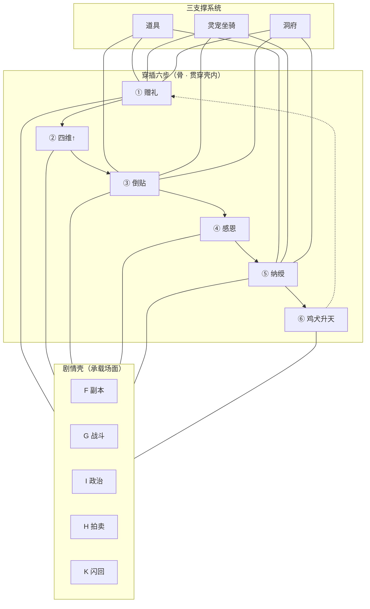
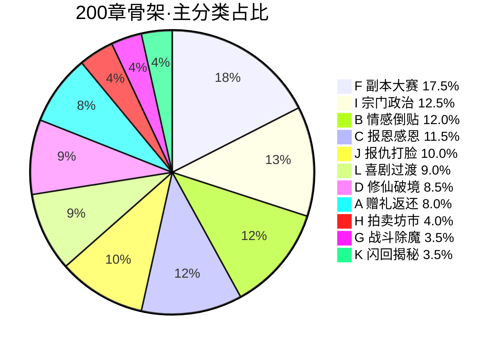
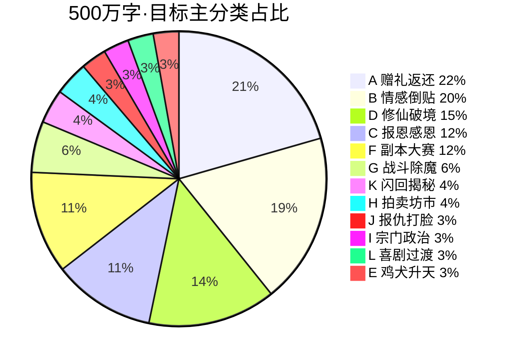

# 剧情分类与比例统计

> **用途**：剧情十二类 + **穿插六步**统计 + 200 章实测 + 500 万目标。  
> **穿插主线**：[`chapters/EXPANSION-穿插主线模型.md`](./chapters/EXPANSION-穿插主线模型.md)  
> **关联**：[`00-整体层次结构图.md`](./00-整体层次结构图.md) · [`EXPANSION-送礼情感主线加重.md`](./chapters/EXPANSION-送礼情感主线加重.md)

---

## 〇、穿插六步主线（优先）

```
① 赠礼 → ② 四维↑ → ③ 倒贴 → ④ 报恩感恩 → ⑤ 纳绶 → ⑥ 鸡犬升天
```

| 步 | 穿插率 | 三系统 |
|----|--------|--------|
| ①② | 每 5 章 | 丹药/灵器/法宝/**符箓**赠礼 |
| ③ | 每 8 章 | 灵宠喜剧、同乘坐骑 |
| ④ | 每 25 章 | 洞府感恩、回赠 |
| ⑤ | 向 100 章递进 | D5别院、合契丹 |
| ⑥ | 1105～1150 | 灵宠舱、虚空舟 |

详表：[`chapters/EXPANSION-穿插主线模型.md`](./chapters/EXPANSION-穿插主线模型.md) · [`08-道具灵宠洞府系统.md`](./08-道具灵宠洞府系统.md)

---

## 一、剧情分类体系（十二大类 · 壳）

> 十二类为**剧情壳**；写作时壳内须嵌 **①②③④⑤⑥** 六步（见 §〇）。

| 编号 | 大类 | 定义 | 典型标签/场景 | 须绑定 |
|------|------|------|---------------|--------|
| **A** | **赠礼返还** | 莫长春赠礼或接收回赠；因果/善缘结算 | 赠礼#1～12、手帕、茶饼、玉佩 | 四维变动 |
| **B** | **情感倒贴** | 馈缘俘获、吃醋、扑怀、修罗场、纳绶 | 妒、投怀、坐门口、纳绶夜 | 赠礼或回赠 |
| **C** | **报恩感恩** | 受恩、回赠、护短、口头/身体感恩 | 忠、温情、护心镜、三十年 | 赠礼链 |
| **D** | **修仙破境** | 缘箓九转、修为突破、寿元/劫时 | 缘箓一转～九转、金丹、化神 | 赠缘契机 |
| **E** | **飞升纳绶** | 问心、大典、排序、登舟、鸡犬升天 | 211～220、E14 | 综合羁绊 |
| **F** | **副本大赛** | 天试、赠缘塔、古冢七层、气运七队 | 61～90、91～120、塔九层 | 层间赠礼 |
| **G** | **战斗除魔** | 夜战、妖潮、终战、BOSS | 54～56、129、186～196 | 赠礼战利 |
| **H** | **拍卖坊市** | 天机秋拍、青岚坊市、捡漏 | 146～165、26、147 | 代拍赠礼 |
| **I** | **宗门政治** | 盟会、周德海、魏无涯、分叉 | 121～136、188 | 章末倒贴回收 |
| **J** | **报仇打脸** | 迟暮之约、玉佩一击、围观震场 | 19→144→145、78 | 因果/玉佩 |
| **K** | **闪回揭秘** | 枯荣旧事、簿来源、百年人生 | 167～179、29 | 偶数章接现线 |
| **L** | **喜剧过渡** | 装糊涂、预告、慕、日常填缝 | 喜剧、风声、—— | 5 章内赠礼 |

### 层级关系（主轴）



---

## 二、200 章骨架 · 主分类统计（互斥）

> 数据来源：`03-八卷二百章逐章细纲.md` 逐章标注 + vol07/08 补全。  
> 规则：每章取**一个主分类**（优先级：E→A→B→C→F→H→G→K→I→J→D→L）。

| 排名 | 主分类 | 章数 | 占比 | 代表章 |
|------|--------|------|------|--------|
| 1 | **F 副本大赛秘境** | 35 | **17.5%** | 61～90 天试、91～120 古冢 |
| 2 | **I 宗门政治** | 25 | **12.5%** | 121～136 盟会、188 周分叉 |
| 3 | **B 情感倒贴** | 24 | **12.0%** | 38扑怀、58抵肩、81～82、140～142 |
| 4 | **C 报恩感恩** | 23 | **11.5%** | 4师恩、46宽恕、59守丹堂、119护心镜 |
| 5 | **J 报仇打脸** | 20 | **10.0%** | 19厉讽、20手帕、144～145玉佩 |
| 6 | **L 喜剧过渡** | 18 | **9.0%** | 63喜剧、141坐门口、150装穷 |
| 7 | **D 修仙破境** | 17 | **8.5%** | 4/30/60…缘箓、38金丹、197化神 |
| 8 | **A 赠礼返还** | 16 | **8.0%** | 赠礼#1～#12 锚点章 |
| 9 | **H 拍卖坊市** | 8 | **4.0%** | 146～165 秋拍 |
| 10 | **G 战斗除魔** | 7 | **3.5%** | 9、54～56、129、189 |
| 11 | **K 闪回揭秘** | 7 | **3.5%** | 29、167～179 |
| 12 | **E 飞升纳绶** | 0* | **0%** | *211～220 在第九卷，不计入 1～200 |

**合计**：200 章 = 100%



### 200 章 · 多标签覆盖（可重叠）

> 一章可同时命中多类；用于看**元素密度**而非互斥比例。

| 大类 | 覆盖章数 | 覆盖率 |
|------|----------|--------|
| F 副本大赛秘境 | 62 | 31.0% |
| L 喜剧过渡 | 36 | 18.0% |
| B 情感倒贴 | 34 | 17.0% |
| C 报恩感恩 | 31 | 15.5% |
| I 宗门政治 | 27 | 13.5% |
| J 报仇打脸 | 23 | 11.5% |
| D 修仙破境 | 21 | 10.5% |
| H 拍卖坊市 | 16 | 8.0% |
| **A 赠礼返还** | **16** | **8.0%** |
| G 战斗除魔 | 11 | 5.5% |
| K 闪回揭秘 | 8 | 4.0% |

**诊断**：骨架中 **A 赠礼锚点仅 16 章（8%）**——**已整改**：`03` 赠礼密度铁律 + 第五～七部「每5章①②节拍表」；500 万目标 A+B+C **55%+** 不变。

---

## 三、分卷主分类分布（200 章）

| 卷 | 章号 | 主导类型 | A赠礼 | B倒贴 | C感恩 | 说明 |
|----|------|----------|-------|-------|-------|------|
| 一·寿尽之前 | 1～30 | C感恩+B倒贴 | 5 | 6 | 7 | 赠礼链启动 |
| 二·赠礼崛起 | 31～60 | B倒贴+J打脸 | 3 | 5 | 6 | 扑怀、夜战 |
| 三·五宗天试 | 61～90 | **F副本** | 2 | 5 | 2 | 大赛+嫉妒 |
| 四·万妖秘境 | 91～120 | **F副本** | 3 | 1 | 4 | 冢七层 |
| 五·九府风云 | 121～145 | **I政治**+J | 2 | 4 | 3 | 盟会+玉佩 |
| 六·天机拍卖 | 146～165 | **H拍卖** | 2 | 2 | 0 | 秋拍夺火 |
| 七·枯荣旧事 | 166～185 | **K闪回** | 0 | 1 | 2 | 闪回占半 |
| 八·长生之赠 | 186～200 | G战斗+D破境 | 2 | 1 | 0 | 终战+纳绶 |
| 九·飞升 | 211～220 | **E飞升** | — | 3 | 1 | E14 |

---

## 四、500 万字 · 目标比例（加重后 · 互斥）

> 总章 **1250** + 番外 **80** ≈ 1330 写作章 → 压至 500 万字。  
> 依据：[`EXPANSION-送礼情感主线加重.md`](./chapters/EXPANSION-送礼情感主线加重.md)

| 排名 | 主分类 | 目标章数 | 目标占比 | 目标万字 | 加重措施 |
|------|--------|----------|----------|----------|----------|
| 1 | **A 赠礼返还** | 275 | **22%** | 88 | 每 5 章 1 赠礼+四维 |
| 2 | **B 情感倒贴** | 250 | **20%** | 80 | 倒贴专章 ~720 去重后 |
| 3 | **D 修仙破境** | 185 | **15%** | 60 | 缘箓九转+破境节点 |
| 4 | **C 报恩感恩** | 150 | **12%** | 48 | 报恩专章 190 去重 |
| 5 | **F 副本大赛** | 150 | **12%** | 48 | 塔九层+冢七层加厚 |
| 6 | **G 战斗除魔** | 75 | **6%** | 24 | 单元剧绑定赠礼 |
| 7 | **K 闪回揭秘** | 50 | **4%** | 16 | 奇数闪回偶数倒贴 |
| 8 | **H 拍卖坊市** | 50 | **4%** | 16 | 三日+暗拍 |
| 9 | **J 报仇打脸** | 38 | **3%** | 12 | 迟暮 11 章 |
| 10 | **I 宗门政治** | 38 | **3%** | 12 | 周线压至 30 章 |
| 11 | **L 喜剧过渡** | 38 | **3%** | 12 | 装糊涂填缝 |
| 12 | **E 飞升鸡犬升天** | 40 | **3%** | 16 | 1105～1150 加厚 |
| — | 番外列传 | 80 | +6%* | 20 | 女主传+IF |
| | **合计** | **1250** | **100%** | **500** | |

*番外并行，不计入 1250 主线百分比。



### 用户主轴聚类

| 主轴簇 | 含类 | 合计占比 | 合计万字 |
|--------|------|----------|----------|
| **送礼→四维→倒贴** | A + B | **42%** | ~168 |
| **报恩感恩** | C | **12%** | ~48 |
| **修仙飞升** | D + E | **18%** | ~76 |
| **鸡犬升天（E子集）** | E | **3%** | ~16 |
| **副本战斗调味** | F + G + H | **22%** | ~88 |
| **政治报仇闪回喜剧** | I + J + K + L | **13%** | ~52 |

**主轴合计（送礼+倒贴+感恩+飞升）**：A+B+C+D+E = **57%** · **~292 万字**

---

## 五、十二部 × 剧情类型矩阵

| 部 | 章号 | 万字 | 主导 | 次要 | 须加强 |
|----|------|------|------|------|--------|
| 一 | 1～100 | 40 | A+B+C | L | 赠礼可视化 |
| 二 | 101～220 | 48 | A+B+G | J | 夜战+抵肩 |
| 三 | 221～360 | 56 | **F+B** | A | 塔+嫉妒公演 |
| 四 | 361～500 | 56 | **F+A** | C | 冢层间赠礼 |
| 五 | 501～620 | 48 | I+J | **B** | 践行宴倒贴 |
| 六 | 621～720 | 40 | **H+B** | A | 秦线代拍 |
| 七 | 721～820 | 40 | K | **B** | 闪回后接倒贴 |
| 八 | 821～900 | 32 | G+D | **B+E** | 纳绶窗口 |
| 九 | 901～1000 | 40 | **B+E** | C | 纳绶日常主部 |
| 十 | 1001～1150 | 60 | **E+D** | A | E14 全家登舟 |
| 十一 | 1151～1250 | 40 | K | A | 簿终极揭秘 |

---

## 六、人心标签统计（200 章 · 辅助）

> `03` 表「人心/类型」列词频（一章可多标签）。

| 标签 | 出现次数 | 折合率 | 归大类 |
|------|----------|--------|--------|
| 忠 | 38 | 19% | C 报恩感恩 |
| 妒 | 18 | 9% | B 情感倒贴 |
| 奸 | 22 | 11% | I 宗门政治 |
| 爽/大爽 | 16 | 8% | J 报仇打脸 |
| 除魔 | 10 | 5% | G 战斗 |
| 慕 | 8 | 4% | L 喜剧 |
| 恨 | 8 | 4% | J 报仇 |
| 感情/暧昧/投怀 | 7 | 3.5% | B 倒贴 |

---

## 七、骨架 vs 目标 对比

| 大类 | 200章实测 | 500万目标 | 差距 | 动作 |
|------|-----------|-----------|------|------|
| A 赠礼返还 | 8.0% | **22%** | **+14%** | 每 5 章强制赠礼 |
| B 情感倒贴 | 12.0% | **20%** | **+8%** | 倒贴专章 720→去重 250 |
| C 报恩感恩 | 11.5% | **12%** | +0.5% | 维持，名场面加厚 |
| E 鸡犬升天 | 0%* | **3%** | **+3%** | 211～220 扩至 40 章 |
| I 宗门政治 | 12.5% | **3%** | **-9.5%** | 压缩周德海线 |
| F 副本大赛 | 17.5% | **12%** | -5.5% | 维持但层间加赠礼 |
| K 闪回揭秘 | 3.5% | **4%** | +0.5% | 偶数章接倒贴 |

---

## 八、校验用法

1. **写章前**：查本文 §一 定主分类，须命中 A/B/C 之一或回收之。  
2. **写卷后**：对照 [`AUDIT-主线校验.md`](./chapters/AUDIT-主线校验.md) 最低密度。  
3. **全书后**：按 §四 目标表统计实际章数，偏离 ±3% 则修订。

---

## 九、文档索引

| 文档 | 用途 |
|------|------|
| 本文 `07-剧情分类与比例统计.md` | 分类+比例总表 |
| `03-八卷二百章逐章细纲.md` | 200 章类型源数据 |
| `EXPANSION-送礼情感主线加重.md` | 500 万加重目标 |
| `AUDIT-主线校验.md` | 分卷密度校验 |

---

*统计 v1 · 200 章实测基于纲要自动分类+人工校正 · 500 万为目标规划值*
