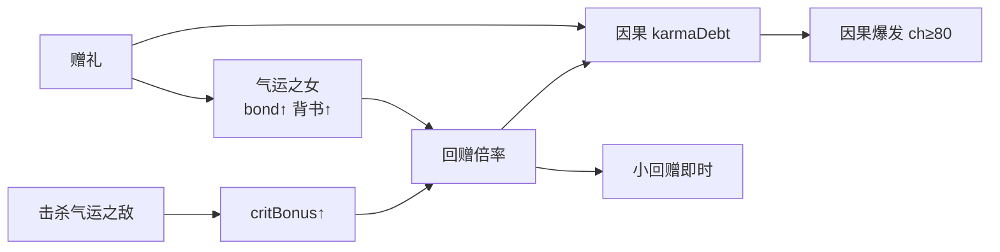

# 气运系统

> **定位**：赠缘簿 **L2 子系统**（与缘环九节、气运七队、丹道阵法并列）  
> **绑定**：[`02-原创剧情.md`](./02-原创剧情.md) §赠缘簿 · [`04-修仙系统速查表.md`](./04-修仙系统速查表.md) · [`08-道具灵宠洞府系统.md`](./08-道具灵宠洞府系统.md)  
> **正文写作**：以下公式与章锚供扩写校验；程序字段见 `02` 第十九章附录。

---

## 一、系统总览

| 分支 | 对象 | 核心机制 | 叙事功能 |
|------|------|----------|----------|
| **气运之女** | 身负气运之女性角色（及天级师尊） | **羁绊度** → **返还背书** | 赠礼回赠倍率、因果爆发加成、倒贴/纳绶 |
| **气运之敌** | 身负气运之反派/妖帅 | **击杀** → **暴击倍率**叠层 | 除魔爽点、终战因果总兑前置 |
| **气运七队** | 副本编队（指挥/锋/眼/盾/后/商/变数） | 全队气运共鸣 | 天试/秘境/终战（见 `06` §卷三） |

**铁律**：本作非「万倍即时暴击」，而是 **小回赠即时 + 因果大回赠延迟**；气运之敌提供的「暴击」作用于**回赠倍率**，不替代人情叙事。

---

## 二、气运等级（共用）

| 等级 | 代码 | 基础倍率 | 特征 |
|------|------|----------|------|
| 丁 | `丁` | ×2 | 隐藏黑马（顾小满） |
| 丙 | `丙` | ×3 | 反派亦可入账/可击杀（厉、赤焰先锋） |
| 乙 | `乙` | ×5 | 资源枢纽（苏、秦） |
| 甲 | `甲` | ×8 | 宗门支柱（柳） |
| 天 | `天` | ×10 | 师尊级（沈晚晴） |

---

## 三、气运之女

> **定义**：簿上标记为 `luckRole: ally` 且可触发 **羁绊·返还背书** 的角色。不限性别，但**女性气运角色**为后宫/情感主线载体；沈晚晴（天）亦走背书链，用语仍称「气运之人」。

### 3.1 羁绊度（0～100）

| 维度 | 变量 | 作用 |
|------|------|------|
| **羁绊度** | `bond` | 回赠倍率、背书档位、专属剧情 |
| 亲密度 | `intimacy` | 倒贴/纳绶（见 `04` 馈缘五阶段） |
| 忠诚度 | `loyalty` | 忠奸分叉、危机站队 |
| 馈缘 | `feedBond` | 俘获阶段（见 `04`） |

**增长**：赠礼、危机解围、公开护短、命定赠礼（+20 羁绊 / +30 馈缘）。

### 3.2 返还背书

> **背书**：气运之女（及高羁绊 ally）以命运为莫长春「作保」，天道认账更狠——**因果爆发与小回赠额外加成**。

| 羁绊档位 | 背书名 | 小回赠加成 | 因果爆发加成 | 剧情表现 |
|----------|--------|------------|--------------|----------|
| 0～39 | — | +0% | +0% | 相识/试探 |
| 40～59 | **初背书** | +10% | +15% | 「他送的，我认」 |
| 60～79 | **深背书** | +20% | +25% | 公开护短、共战 |
| 80～100 | **命背书** | +35% | +40% | 纳绶候选、终极回赠 |

**公式（与代码一致）**：

```
回赠倍率 = 气运基础倍率
         × (首赠 ? firstGiftBonus/3 : 1)
         × (1 + bond/200)
         × (1 + 背书加成)
         × (1 + 气运之敌暴击叠层)

背书加成 = 初背书10% | 深背书20% | 命背书35%（取当前羁绊档位）
```

### 3.3 气运之女名册（canonical）

| ID | 角色 | 气运 | 初始羁绊 | 命定赠礼 | 背书名场面章 |
|----|------|------|----------|----------|--------------|
| `shenwanqing` | 沈晚晴 | 天 | 60 | 续命丹回赠 | ch4 / ch900 |
| `liuqingyuan` | 柳青鸢 | 甲 | 55 | 旧法剑→剑穗 | ch22 / ch944 |
| `sunianCi` | 苏念慈 | 乙 | 45 | 药渣→丹心玉 | ch135 / ch945 |
| `guxiaoman` | 顾小满 | 丁→甲 | 20 | 半石灵石 | ch47 / ch940 |
| `qinshangyan` | 秦商言 | 乙 | 30 | 茶饼 | ch32 / ch942 |

**升档**：顾小满 ch47/ch175 丁→甲，回赠倍率 ×2→×8（见 `vol02` ch47）。

---

## 四、气运之敌

> **定义**：身负气运、击杀后可被簿「收气运」的反派/妖帅。每击杀一名，全局 **暴击倍率叠层** 永久增加（本存档/本章链有效）。

### 4.1 暴击倍率叠层

| 规则 | 说明 |
|------|------|
| 单次击杀 | `critBonus += enemy.critPerKill`（默认 **+0.12**） |
| 叠层上限 | `CRIT_BONUS_CAP = 1.0`（最多 +100% 回赠） |
| 作用范围 | 赠礼小回赠、因果积累、手动结算、因果≥80 爆发 |
| 叙事 | 「除魔收气运，天道赏得更狠」 |

```
最终倍率 = 回赠倍率（含背书）× (1 + critBonus)
```

### 4.2 气运之敌名册

| ID | 名称 | 气运 | 单次暴击 | 剧情锚点（500万章） | 备注 |
|----|------|------|----------|-------------------|------|
| `chiyan_vanguard` | 赤焰先锋队长 | 丙 | +0.10 | 部二 ch190 | 夜袭杂兵头目 |
| `qinglin_demon` | 青鳞妖君 | 乙 | +0.15 | 部二 ch195 | 双BOSS；妖核 RM01 |
| `han_tieshan` | 韩铁山 | 甲 | +0.20 | 部八 ch876 | **禁自刎**；战至死拖垫背 |
| `duoyuan_elder` | 夺缘宗执事 | 丙 | +0.12 | 部八 ch896 | 邪教终灭 |
| `wei_wuya` | 魏无涯 | 乙 | +0.15 | 部五 ch590 | 撤盟会，非必死 |
| `duojie_lord` | 夺缘宗主幻影 | 甲 | +0.18 | 部四 ch435 | 冢心六层 |

**铁律**：韩铁山等禁自刎角色 — 只可战死/拖敌垫背，击杀仍计暴击但剧情须写「同陨」或「坠阵」。

### 4.3 与除魔单元挂钩

| 部 | 除魔章 | 可计暴击敌 |
|----|--------|------------|
| 二 | 186～202 | 赤焰先锋、青鳞妖君 |
| 四 | 435～448 | 夺缘幻影 |
| 五 | 528～548 | 妖潮头目 |
| 八 | 876～896 | 韩铁山、夺缘执事 |

---

## 五、与赠缘簿联动



| 环节 | 气运之女 | 气运之敌 |
|------|----------|----------|
| 赠礼瞬间 | 羁绊↑、背书加成倍率 | — |
| 小回赠 | 倍率放大 | 暴击叠层放大 |
| 因果积累 | 背书额外 +15%～40% on 爆发 | 暴击叠层同步 |
| 剧情 | 倒贴/纳绶/家族观礼 | 除魔爽、终战因果总兑 |

---

## 六、写作 checklist

- [ ] 赠礼对象标气运等级（丁～天）？
- [ ] 女性 ally 章写羁绊变动 + 是否触发背书台词？
- [ ] 击杀反派标 `气运之敌` ID，勿与「赠礼厉无殇」混写？
- [ ] 韩铁山/周德海：**禁自刎**？
- [ ] 顾小满升甲后回赠倍率须同步？
- [ ] 终战 ch892 因果总兑可引用气运之敌击杀叠层作爽点？

---

## 七、正文写作速查

| 项 | 正文用法 |
|------|----------|
| 背书档位 | 羁绊 40/60/80 → 初/深/命背书（§3.2） |
| 气运之敌 | 击杀后簿收气运，因果总兑暴击加重（§四） |
| 状态行 | 可写「暴击叠层+XX%」「×命背书」等，勿写程序变量名 |

### 气运之敌叙事锚点（部二/部八）

| 锚点章 | 敌人 | 暴击叙事 |
|--------|------|----------|
| 部二·东脉夜战 | 赤焰先锋 | 首杀+10% |
| 部二·双BOSS | 青鳞妖君 | +15% |
| 部八·ch896 | 夺缘执事 | +12% |
| 部八·ch876 | 韩铁山 | +20%（禁自刎） |

---

*气运系统 v1 · 2026-07-11*
