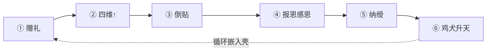

# 穿插主线模型（六步 · v2）

> **定义**：**赠礼 → 四维↑ → 美女倒贴 → 报恩感恩 → 纳绶 → 鸡犬升天** 六步**穿插**于一切剧情壳。  
> **支撑系统**：道具（丹药/灵器/法宝）、**符录**（符箓谱）、灵宠坐骑、修炼洞府 — 见 [`08-道具灵宠洞府系统.md`](../08-道具灵宠洞府系统.md)、[`10-符录系统.md`](../10-符录系统.md)  
> **关联**：[`07-剧情分类与比例统计.md`](../07-剧情分类与比例统计.md) · [`AUDIT-主线校验.md`](./AUDIT-主线校验.md)

---

## 一、六步穿插链（全书唯一叙事骨）

```
┌────────┐   ┌─────────────┐   ┌────────┐   ┌────────┐   ┌────────┐   ┌──────────┐
│① 赠礼  │ → │② 四维 ↑    │ → │③ 倒贴  │ → │④ 报恩  │ → │⑤ 纳绶  │ → │⑥ 鸡犬升天│
│丹药灵器│   │羁绊亲密     │   │馈缘俘获│   │感恩回赠│   │正侧绶  │   │E14 登舟  │
│法宝灵宠│   │忠诚馈缘     │   │吃醋扑怀│   │护短进洞│   │别院仪式│   │灵宠舱   │
└───┬────┘   └──────┬──────┘   └───┬────┘   └───┬────┘   └───┬────┘   └────┬─────┘
    │               │               │             │             │              │
    └───────────────┴───────────────┴─────────────┴─────────────┴──────────────┘
                                    ↓ 嵌入剧情壳
              副本 / 大赛 / 秘境 / 盟会 / 拍卖 / 终战 / 闪回 / 洞府日常
```

| 步 | 系统 | 正文必写 | 道具/洞府/灵宠 |
|----|------|----------|----------------|
| **① 赠礼** | 赠缘簿 | 品类、对症、真心 | **丹药/灵器/法宝**、**阵材/丹方**、灵宠卵、洞府材 |
| **② 四维↑** | bond/intimacy/loyalty/feedBond | 簿上跳动或反应 | 赠礼品类决定四维倾向 |
| **③ 倒贴** | 馈缘五阶段 | 吃醋/扑怀/修罗场；**美人代家族邀茶求援** | 同乘坐骑、灵宠喜剧、会客亭 |
| **④ 报恩感恩** | 回赠链 | 「这恩记下了」、护短；**家族援军/商路回赠** | 回赠丹/器、进洞府炼丹 |
| **⑤ 纳绶** | 正绶+侧绶 | 仪式、信物、**主次排序**；**家族观礼席** | 合契丹、剑穗/丹心玉、**D5别院** |
| **⑥ 鸡犬升天** | E14 | 全员登舟、带家属 | **灵宠舱**、虚空舟、D6洞天 |

**铁律**：
- 每 **5 章** ≥1 次 ①+②；每 **8 章** ≥1 次 ③；每 **25 章** ≥1 次 ④；每 **100 章** 触及 ⑤ 或向⑤递进；**⑥** 收束于 1105～1150。
- 连续 **3 章**纯壳无①② → 偏离。
- **生死铁规**：**禁自刎/自尽/吞毒/自毁金丹**；绝境**宁战死、必拖敌垫背**（见 `02` §生死铁规）。
- 报仇（玉佩/因果）并入 ④ 的「恩仇对偶」：**感恩为主，报仇为辅（恩:仇≈7:3）**，不单列第七步。

---

## 二、六步 × 剧情壳穿插表

| 剧情壳 | ①赠礼 | ②四维 | ③倒贴 | ④感恩 | ⑤纳绶 | ⑥E14 |
|--------|-------|-------|-------|-------|-------|------|
| 副本大赛 | 赠甲茶 | 全队+ | 献花吃醋 | 赵甲恩 | — | — |
| 秘境 | 半石妖核 | 苏顾+ | 冢心 | 护心镜 | — | — |
| 盟会 | 糕饼符 | 柳忠+ | 坐门口包厢 | 密录恩 | — | — |
| 拍卖 | 茶礼灵石 | 秦亲+ | 拍前温存 | 夺火爽 | — | — |
| 终战 | 缓流丹金钟材 | 结算 | 护关并肩 | 连环回赠 | **ch898预纳绶** | — |
| 护关/东脉 | 阵材+缓流丹 | 霍盾+苏丹 | — | Z01/Z06汇入 | 合契丹Z03 | — |
| 洞府日常 | 养阵材 | 闭关+ | 夜访会客亭 | 苏守丹 | **D5@ch898** | — |
| 飞升卷 | 登舟礼 | 排序 | 问心共升 | 沈引路 | **ch1113大典** | **ch1150 E14** |

---

## 三、标准十章穿插节拍（含道具/洞府）

| 章序 | 步 | 模板 | 道具/洞府示例 |
|------|-----|------|---------------|
| 1～2 | 壳+① | 开场+赠礼 | 赠护身符(T03) |
| 3 | ②+③ | 四维+吃醋 | 亲密+；苏见赠符 |
| 4～5 | 壳 | 副本推进 | — |
| 6 | ①+洞府 | 赠药草养阵 | D2丹房升级契机 |
| 7 | ②+③ | 夜访倒贴 | 丹堂侧室 |
| 8 | 壳 | 高潮战 | 灵宠助战(P04) |
| 9 | ④ | 感恩回赠 | 顾赠隐匿符 |
| 10 | 钩 | 缘箓/纳绶预告 | 簿示馈缘80 |



---

## 四、十二部六步要点

| 部 | 章 | ⑥步重心 |
|----|-----|----------|
| 一 | 1～100 | ①②③启动；#1～#5命定礼；D1→D2 |
| 二 | 101～220 | ③扑怀抵肩；④宽恕；P04扫把灵 |
| 三 | 221～360 | ③嫉妒公演；①赠甲；P07墨云雕 |
| 四 | 361～500 | ①妖核拓本；④护心镜；P02冢灵 |
| 五 | 501～620 | ④感恩+玉佩仇；③践行宴；向⑤ |
| 六 | 621～720 | ①代拍；P01竹灵成熟；D3静室 |
| 七 | 721～820 | 闪回④簿恩；偶数章③；D4枯荣泽 |
| 八 | 821～900 | **⑤ch898预纳绶+D5**；连环④；P01化龙 |
| 九 | 901～1000 | **⑤满编收集主部**；D5别院；**家族观礼**；③④密度最高 |
| 十 | 1001～1150 | **⑥E14@1150**；**ch1113大典**；灵宠舱 |
| 十一 | 1151～1250 | ⑥簿天赐；D7上界别府 |

---

## 五、单章写法（4000 字 · 六步穿插）

```
【壳】600 — 副本/盟会/拍卖…
【①】800 — 赠丹/器/法宝（写明品类品阶）
【②】300 — 羁绊/亲密/忠诚/馈缘 变动
【壳】800 — 推进
【③】600 — 倒贴（吃醋/扑怀/同乘/灵宠喜剧）
【④】300 — 感恩一句或回赠铺垫
【钩】200 — 馈缘距80/纳绶预告/寿元
```

**纳绶专章（⑤）**：+合契丹(D09)、信物(W06)、D5别院双修室（含蓄）。  
**E14专章（⑥）**：+虚空舟(M06)、灵宠舱、每人登舟感恩台词。

---

## 六、200 章锚点 · 六步映射

| 章 | ① | ② | ③ | ④ | ⑤ | ⑥ |
|----|---|---|---|---|---|---|
| 4 | 续命丹→杖 | ✓ | — | 师恩 | — | — |
| 6～8 | 剑/半石 | ✓ | 妒 | — | — | — |
| 11～12 | 药渣 | ✓ | 夜语 | — | — | — |
| 38 | 破境丹 | ✓ | 扑怀 | — | — | — |
| 58 | — | ✓ | 抵肩 | — | — | — |
| 81～82 | — | ✓ | 吃醋座次 | — | — | — |
| 130～131 | 除魔符 | ✓ | — | 赵恩 | — | — |
| 145 | 玉佩 | ✓ | — | 仇报 | — | — |
| **898**（200章锚199） | 合契丹连环礼 | ✓ | — | 感恩 | **预纳绶+D5** | — |
| **944～945** | — | ✓ | 纳绶夜 | — | **纳绶** | — |
| **1113**（200章锚215） | 登舟礼 | 排序 | 问心 | 沈恩 | **大典·引路拒纳绶** | — |
| **1150**（200章锚220） | — | — | — | — | — | **E14** |

---

## 七、校验 checklist

- [ ] 本 5 章是否有 ①+②？  
- [ ] 本 8 章是否有 ③？  
- [ ] 本 25 章是否有 ④感恩？  
- [ ] 道具赠礼是否标明品类品阶？  
- [ ] 洞府/灵宠是否服务当前步（非纯设定堆砌）？  
- [ ] 向 ⑤⑥ 递进是否可见（馈缘→80→纳绶→E14）？  
- [ ] 道侣章是否写了**家族**一人？赠礼是否惠及家族？（见后宫专章）

---

## 八、后宫收集 × 家族情义（③⑤ 加厚）

> 详表 [`EXPANSION-后宫收集与道侣家族线.md`](./EXPANSION-后宫收集与道侣家族线.md)

| 要求 | 正文体现 |
|------|----------|
| **不收一位** | 部九 910～945 推动连续纳绶；E14 优先满编4 |
| **主次分明** | ch214 公示；D5 正室/东厢/西厢/南厢 |
| **有情有义** | ①赠家族信物 → ④家族回赠 → ⑤家族观礼席 |
| **各部锚点** | 五部 556 苏氏宴；六部 秦老太君拍场；九部 935 族老敬茶 |

---

*穿插主线模型 v2 · 六步链 · 2026-07-11*
